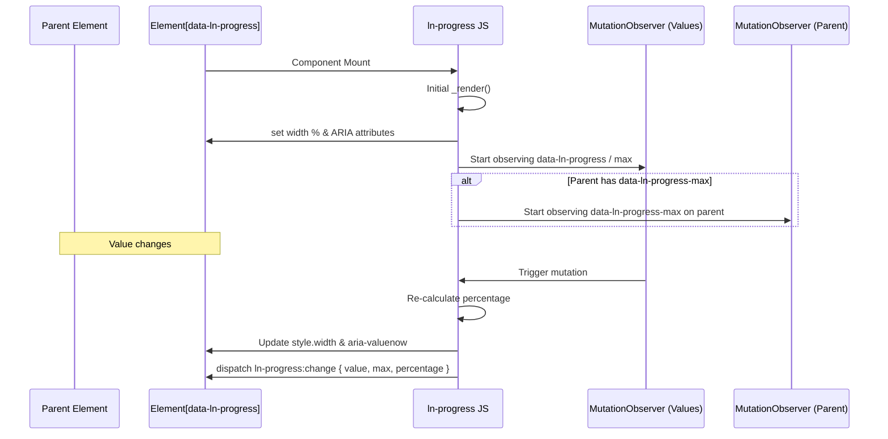

# ➖ ln-progress
> **Класификација:** 🟢 Едноставна компонента (Layer 1 - Data Visualization)

---

## 1. Заднинско дејство и одговорност
`ln-progress` е едноставна визуелна компонента која се користи за приказ на линеарен прогрес (progress bar) на екранот.

*   **Главна Одговорност:** Динамички ја менува ширината (`width` во проценти) на соодветниот прогрес елемент врз основа на моменталниот сооднос на вредноста и нејзиниот максимум.
*   **Декларативно Врзување (Attribute Bridge):** Користи внатрешни `MutationObserver` механизми за да ги следи промените на атрибутите `data-ln-progress` и `data-ln-progress-max`.
*   **Херархиска Координација (Parent-Child Inheritance):** Компонентата поддржува читање на максимум вредноста (`max`) директно од родителскиот контејнер (доколку има поставено `data-ln-progress-max` на него). Во тој случај, соодветно го следи и него со `MutationObserver`.
*   **Автоматска Пристапност (Native ARIA Reflection):** При секое рендерирање, компонентата нативно ги додава и ажурира ARIA својствата на елементот (`role="progressbar"`, `aria-valuenow`, `aria-valuemin`, `aria-valuemax`) со што ги олеснува најавите на екранските читачи без потреба од рачна интервенција на развивачот.
*   **Само-иницијализација:** Наместо традиционалното регистрирање, компонентата користи глобален `MutationObserver` кој го набљудува `document.body` и автоматски ги иницијализира новододадените елементи кои го содржат селекторот `[data-ln-progress]`.

---

## 2. Минимален HTML Маркап и Варијанти на Употреба

```html
<!-- Стандардна самостојна варијанта -->
<div class="progress-bar-wrapper">
    <div data-ln-progress="35" data-ln-progress-max="100"></div>
</div>

<!-- Родителска конфигурација (корисно кај групирани прогрес барови) -->
<div class="progress-container" data-ln-progress-max="150">
    <div data-ln-progress="75"></div>
</div>
```

---

## 3. Декларативен API Договор (Атрибути и Настани)

| Атрибут | Тип | Опис |
| :--- | :--- | :--- |
| `data-ln-progress` | `Float` | Го активира компонентот. Ја означува тековната вредност на прогресот. |
| `data-ln-progress-max` | `Float` | Максималната можна вредност (може да биде поставен на самиот елемент или на неговиот родител. default: 100). |

### Настани (Емитува)
| Настан | Payload `e.detail` | Опис |
| :--- | :--- | :--- |
| `ln-progress:change` | `{ target: Node, value: Float, max: Float, percentage: Float }` | Се емитува при секоја промена на вредноста или максималната граница на прогресот. |

---

## 4. CSS Стилизирање и Поведенски Концепт
Како линеарен прогрес бар, потребен е родителски обвиткувач со позадина, додека прогрес елементот ја менува својата ширина.

```scss
// SCSS стилизирање во дизајн системот
.progress-bar-wrapper {
    width: 100%;
    height: 8px;
    background-color: var(--color-gray-light, #e2e8f0);
    border-radius: 9999px;
    overflow: hidden;
    
    // Прогрес лента
    [data-ln-progress] {
        height: 100%;
        background-color: var(--color-primary, #3b82f6);
        border-radius: 9999px;
        transition: width 0.3s ease-in-out; // Мазна транзиција на проширување
    }
}
```

---

## 5. Пристапност (ARIA) и Чести Грешки
*   **Пристапност:** Бидејќи `ln-progress` автоматски ги поставува атрибутите `role="progressbar"`, `aria-valuenow`, `aria-valuemin` и `aria-valuemax`, развивачот нема потреба дополнително да ги кодира овие ARIA својства во својот HTML. За најдобра практика, доколку прогресот е дел од некоја подолга операција, поставете `aria-label` или `aria-labelledby` за да ја објасните целта на прогресот.
*   **Честа грешка 1:** Ставање на `data-ln-progress` директно на обвиткувачот со позадина. Ова ќе ја направи позадината да се скрати до соодветниот процент. Правилно е секогаш да имате надворешен обвиткувач, а прогрес атрибутот да биде на внатрешниот обоен елемент.
*   **Честа грешка 2:** Непоставување на `data-ln-progress-max` на родителот пред иницијализацијата. Доколку родителот го добие овој атрибут динамички во подоцнежна фаза од работењето, а при иницијализацијата го немал, `ln-progress` нема да го набљудува родителот и промените таму нема да се одразат.

---

## 6. Дијаграм на Текот и Животен Циклус



---

## 7. Поврзани Компоненти
*   **`ln-circular-progress`**: Кружен прогрес индикатор кој се користи за визуелизација во кружна форма (пр. кај графикони или контролни табли).
