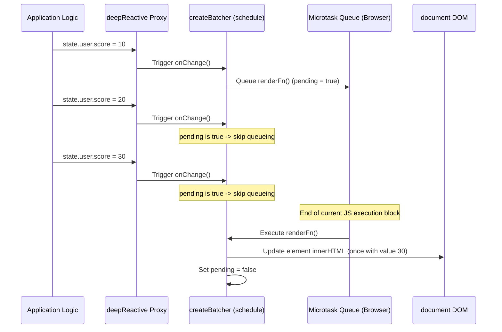

# ⚛️ ln-reactive (reactive.js)
> **Класификација:** ⚛️ Core Утилит / Нискобуџетен примитив (Layer 3 - Reactive State & Batch Rendering)

---

## 1. Заднинско дејство и одговорност
`reactive.js` е заеднички логички модул сместен во јадрото (`ln-core`) кој овозможува едноставно, но ефикасно реактивно управување со состојбите во апликацијата и нивно перформансно исцртување во DOM-от без користење на гломазни надворешни фрејмворци.

Скриптата извезува три клучни помошници:
*   **`reactiveState(...)`**: Креира плитка реактивна состојба (Shallow Reactive State) користејќи ES6 `Proxy`. При секоја промена на некое од коренските својства, го активира проследениот `onChange` повратен повик со детали за промената (својство, нова вредност, стара вредност).
*   **`deepReactive(...)`**: Креира длабока реактивна состојба (Deep Reactive State) со рекурзивно обвиткување на сите вгнездени објекти и низи. Секоја измена или бришење на кое било внатрешно својство автоматски испраќа сигнал за промена, користејќи специјален `PROXY_FLAG` симбол за заштита од двојно обвиткување.
*   **`createBatcher(...)`**: Управува со сериско исцртување (Render Batcher). Овозможува групирање на повеќе брзи последователни измени на состојбата во еден заеднички DOM приказ, со користење на микрозадачи (`queueMicrotask`). Ова спречува прекумерно исцртување (layout thrashing) и ги оптимизира перформансите на прелистувачот.

---

## 2. Минимален HTML Маркап и Варијанти на Употреба

Бидејќи се работи за чисто логички модул во јадрото, тој се користи директно во кодот на компонентите или координаторите за управување со податоци.

```javascript
import { deepReactive, createBatcher } from '../ln-core/reactive.js';

// 1. Дефинирај функција за рендерирање
const element = document.getElementById('state-box');
function render() {
    element.textContent = `Корисник: ${state.user.name}, Поени: ${state.user.score}`;
    console.log('DOM-от е ажуриран!');
}

// 2. Креирај Batcher за заштита на перформансите
const scheduleRender = createBatcher(render);

// 3. Иницирај длабока реактивна состојба поврзана со Batcher-от
const state = deepReactive({
    user: { name: 'Петар', score: 100 }
}, scheduleRender);

// 4. Направи брзи измени (Бачерот ќе го ажурира DOM-от само ЕДНАШ на крајот на микрозадачата)
state.user.name = 'Петар Петровски';
state.user.score = 105;
state.user.score = 110;

// Излез во конзола:
// "DOM-от е ажуриран!" (се појавува само еднаш, а не три пати!)
```

---

## 3. Декларативен API Договор (Атрибути и Настани)

Скриптата ги извезува следните функции:

### `reactiveState(initial, onChange)`
*   `initial` (Object): Почетниот објект на состојба.
*   `onChange` (Function): Повратен повик со потпис `(prop, value, oldValue)`.
*   **Враќа:** `Proxy` (плитка реактивна обвивка).

### `deepReactive(obj, onChange)`
*   `obj` (Object|Array): Почетниот објект или низа.
*   `onChange` (Function): Повратен повик без параметри кој се активира при било која измена/бришење на кое било ниво.
*   **Враќа:** `Proxy` (длабока рекурзивна реактивна обвивка).

### `createBatcher(renderFn, afterRender)`
*   `renderFn` (Function): Функцијата за исцртување на DOM-от која се дебаунсира во микрозадача.
*   `afterRender` (Function): Опционална функција која се извршува веднаш по рендерирањето.
*   **Враќа:** `schedule` (Function) - се повикува за да се закаже рендерирање.

---

## 4. CSS Стилизирање и Поведенски Концепт
Како логичка инфраструктура, `ln-reactive` нема визуелен приказ и нема сопствени CSS класи или стилови.

---

## 5. Пристапност (ARIA) и Чести Грешки
*   **Пристапност:** Сериското рендерирање (Batching) ја подобрува пристапноста бидејќи спречува "треперење" и брзо последователно менување на ARIA вредностите (на пр. кај прогрес барови или бројачи), овозможувајќи им на читачите на екрани да го најават само финалниот стабилен статус на елементот.
*   **Честа грешка 1 (Infinite Loop):** Менување на реактивната состојба директно внатре во нејзиниот `onChange` повратен повик (или внатре во `renderFn` функцијата). Ова создава бесконечен циклус на измени кој го блокира прелистувачот и предизвикува грешка од типот "Maximum call stack size exceeded".
*   **Честа грешка 2 (Reference Bypass):** Чување на референца од оригинален објект пред тој да биде обвиен во `deepReactive` и вршење измени директно врз оригиналниот објект наместо врз вратениот Proxy објект. Промените направени на оригиналниот објект нема да бидат пресретнати од Proxy-то и `onChange` нема да се активира.

---

## 6. Дијаграм на Текот и Животен Циклус

Овој дијаграм го илустрира процесот на групирање (batching) на три последователни измени на состојба во едно рендерирање.



---

## 7. Поврзани Компоненти
*   **`ln-core`**: Обезбедува основа за изградба на апликациски системи.
*   **`ln-data-store`**: Може да го користи овој систем за внатрешно следење на измените на локалниот кеш во меморијата пред да се изврши нивно перзистирање.
