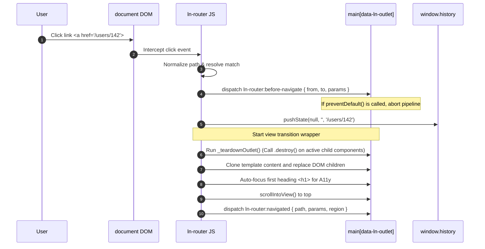

# 🧭 ln-router

> **Класификација:** ⚙️ Координатор / Core Систем (Layer 3 - SPA Routing Engine)  
> **Изворен код:** [`js/ln-router/src/ln-router.js`](../../js/ln-router/src/ln-router.js)

---

## 1. Заднинско дејство и одговорност

`ln-router` е јадрото на SPA (Single Page Application) рутирањето во `ln-ashlar` платформата. Секоја промена на URL адресата (преку клик, навигација назад/напред или програмски) се обработува од овој систем.

*   **Главна Одговорност:** Декларативно ги регистрира патеките наведени во HTML темплејтите (`<template data-ln-route="...">`), врши анализа и сортирање според специфичноста на рутите, ги набљудува URL промените и врши динамичка замена на содржината во целните приматели (outlets) без вчитување на целата страница.
*   **Специфичност на рути (Specificity Matching):** Компонентата применува интелигентно рангирање на патеките при споредба:
    1. Статичките сегменти имаат највисок приоритет (на пр. `/posts/new` секогаш е пред `/posts/:id`).
    2. Динамичките параметри (сегменти што почнуваат со `:`) се на второ место.
    3. Џокер знаците (wildcards `*`) имаат најнизок приоритет и служат за catch-all или 404 рути.
*   **Повеќе-регионална поддршка (Auxiliary Outlets):** Поддржува поделба на страната на независни региони. Покрај примарниот регион (`__primary__` кој ги полни `<main>` или `[data-ln-outlet]`), поддржува помошни региони означени со `data-ln-route-target="id"`. Ова овозможува истовремена навигација во независни странични панели (sidebars) или контролни табли.
*   **Чистење на активни компоненти (Teardown Pipeline):** При секое напуштање на рута, рутерот рекурзивно ги пронаоѓа сите внатрешни активни компоненти во целниот регион и универзално го повикува нивниот метод `.destroy()`, со што се спречува истекување на меморија (memory leaks).
*   **Зачувување состојба (Keep-Region State Survival):** Ако одреден помошен регион има знак `data-ln-route-keep` и при навигација се поклопува истиот темплејт, рутерот нема да го преизгради неговиот DOM со цел да се зачува внатрешната состојба (на пр. зачувување фокус, вредности во форми или скрол во страничното мени).
*   **Транзиции (View Transitions API):** Нативно го користи модерниот прелистувачки API `document.startViewTransition()` за мазни, хардверски забрзани транзиции меѓу страниците доколку прелистувачот ги поддржува.
*   **Изолација на URL фрагменти (Hash Popstate Guard):** Спречува преиспитување на рутите доколку `popstate` настанот содржи промена исклучиво во URL фрагментот (`#hash`), дозволувајќи им на сите хаш-зависни механизми да си оперираат независно без непотребно уништување на рутата.
*   **Ортогоналност (Што компонентата НЕ прави):**
    - Не содржи познавање ниту референци кон специфични UI компоненти (модали, поповери, тоасти и сл.).
    - Не врши AJAX барања за преземање на содржината на страниците (ова е одговорност на `ln-ajax` или на конкретни контејнери за податоци).
    - Не управува со рутни чувари (route guards) за безбедност или автентикација/авторизација на бизнис ниво.
    - Не врши парсирање или динамично составување на HTML елементите, туку исклучиво ги клонира однапред дефинираните темплејти.

---

## 2. Минимален HTML Маркап и Варијанти на Употреба

```html
<!-- Конфигурација на Рутите преку HTML Темплејти -->
<template data-ln-route="/" data-ln-route-title="Почетна">
    <section class="page-home">
        <h1>Добредојдовте</h1>
        <p>Ова е почетната страница.</p>
    </section>
</template>

<template data-ln-route="/users" data-ln-route-title="Корисници">
    <section class="page-users">
        <h1>Листа на корисници</h1>
        <div data-ln-list="users_list">...</div>
    </section>
</template>

<!-- Динамичка рута со параметар -->
<template data-ln-route="/users/:id" data-ln-route-title="Профил на корисник">
    <section class="page-user-profile">
        <h1>Профил на корисник</h1>
        <p>Преглед на детали...</p>
    </section>
</template>

<!-- Рута на помошен регион (data-ln-route-target) -->
<template data-ln-route="/users/:id" 
          data-ln-route-target="sidebar-panel" 
          data-ln-route-title="Детали за корисникот">
    <aside class="sidebar-details">
        <h3>Брзи Детали</h3>
    </aside>
</template>

<!-- Џокер рута за 404 Страна -->
<template data-ln-route="*" data-ln-route-title="Страницата не е пронајдена">
    <section class="page-not-found">
        <h1>Грешка 404</h1>
        <p>Бараната страница не постои.</p>
    </section>
</template>

<!-- ────────────────────────────────────────── -->
<!-- Целни Контејнери (Outlets) за приказ -->

<!-- Главна содржина (Primary Outlet) -->
<main data-ln-outlet></main>

<!-- Помошен контејнер за страничен панел -->
<div id="sidebar-panel" data-ln-route-keep></div>

<!-- ────────────────────────────────────────── -->
<!-- Пример на стандардни линкови кои се пресретнуваат без релоад -->
<a href="/">Почетна</a>
<a href="/users">Корисници</a>
<a href="/users/142">Профил на корисник 142</a>
```

---

## 3. Декларативен API Договор (Атрибути и Настани)

| Атрибут | Тип | Опис |
| :--- | :--- | :--- |
| `data-ln-route` | `String` | Го активира темплејтот како рута. Го дефинира шаблонот на патеката (пр. `/posts/:id` или `*`). |
| `data-ln-route-target` | `String` | Укажува во кој HTML контејнер ќе се рендерира овој темплејт при совпаѓање (default: примарен `data-ln-outlet`). |
| `data-ln-route-title` | `String` | Опционален наслов на страницата кој автоматски ќе се постави на `document.title` при транзиција. |
| `data-ln-route-keep` | `Flag` | Се поставува на помошниот контејнер. Спречува уништување и рендерирање на содржината ако темплејтот не е сменет. |
| `data-ln-outlet` | `Flag` | Го означува примарниот контејнер за приказ на главните страници. |
| `data-ln-router-hydrate` | `Flag` | Се поставува на целниот контејнер (аутлетот). Спречува ре-рендерирање (клонирање) на почетниот темплејт при првично вчитување (hydration) доколку контејнерот веќе содржи подготвен HTML. |

### DOM Настани (Слуша и Емитува)

* **`ln-router:before-navigate`** (Емитува на примарниот контејнер): Се емитува пред почеток на навигацијата. Може да биде откажан со `e.preventDefault()` за спречување на напуштање на страницата (на пр. ако корисникот има незачувани промени).
* **`ln-router:navigated`** (Емитува на секој ажуриран контејнер): Се емитува откако содржината во контејнерот е заменета и фокусот/насловот се поставени. Payload: `{ path, params, query, route, target, region }`.
* **`ln-router:not-found`** (Емитува на `document.body`): Се емитува кога примарниот контејнер нема совпаѓање за бараната патека.

### Јавен JS API (преку `window.lnRouter`)

* **`navigate(fullPath)`**: Програмски извршува навигација до нова патека со зачувување во историјата (`pushState`).
* **`replace(fullPath)`**: Ја заменува тековната патека во историјата без да додава нов чекор во Back копчето (`replaceState`).
* **`current()`**: Враќа објект со моменталните детали на активната рута: `{ path, params, query, route, regions }`.

---

## 4. CSS Стилизирање и Поведенски Концепт

Транзициите се олестени со автоматската интеграција на View Transitions API:

```scss
// SCSS Дефинирање на транзиција при промена на страница
::view-transition-old(root) {
    animation: fade-out 0.2s ease-out;
}
::view-transition-new(root) {
    animation: fade-in 0.2s ease-in;
}

@keyframes fade-out {
    from { opacity: 1; }
    to { opacity: 0; }
}
@keyframes fade-in {
    from { opacity: 0; }
    to { opacity: 1; }
}
```

---

## 5. Пристапност (ARIA) и Чести Грешки

* **Пристапност (Focus Management):** За да се спречи загуба на фокус за корисници со тастатура при промена на рута, `ln-router` автоматски го ре-лоцира фокусот. Тој го бара првиот наслов (`h1-h6`) во новиот контејнер, му додава `tabindex="-1"` и рачно го фокусира. Доколку нема наслов, го фокусира самиот контејнер на страницата.
* **Честа грешка 1 (Инфинитивна рекурзија):** Ставање на `<template data-ln-route="...">` *внатре* во сопствениот контејнер за приказ (на пр. внатре во `<main>`). При првата замена на содржината во `<main>`, темплејтот ќе се избрише од DOM-от и рутерот ќе го изгуби неговото дефинирање.
* **Честа грешка 2 (Резервиран збор):** Користење на клучниот збор `__primary__` во атрибутот `data-ln-route-target`. Овој збор е внатрешно резервиран за дефолтниот примател на рути и компонентата ќе го отфрли со предупредување.

---

## 6. Дијаграм на Текот и Животен Циклус



---

## 7. Поврзани Компоненти

* **[`ln-nav`](./ln-nav.md)**: Прецизно го следи `pushState` на `ln-router` за да ги означи соодветните линкови како активни.
* **[`ln-ajax`](./ln-ajax.md)**: За асинхроно преземање на содржини или темплејти.
