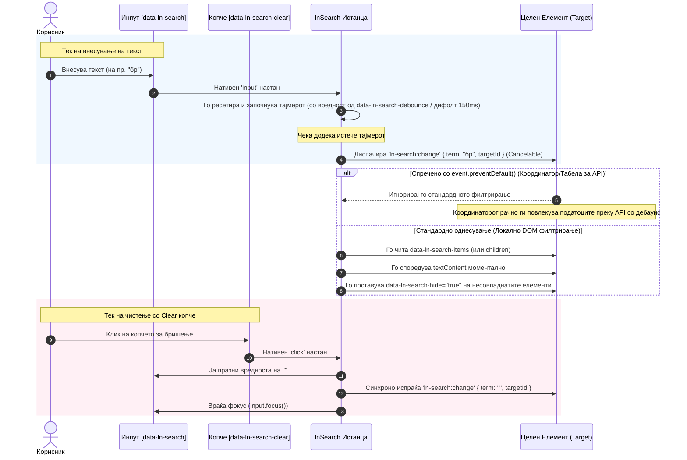

# 🔍 ln-search

> **Класификација:** 🟢 Едноставна компонента / Пребарувач и Филтер (Layer 1 - DOM Search & Debounced Filter)  
> **Изворен код:** [`js/ln-search/src/ln-search.js`](../../js/ln-search/src/ln-search.js)

---

## 1. Заднинско дејство и одговорност

- **Краток опис:** `ln-search` е лесна и брза компонента наменета за инстантно локално DOM филтрирање на содржини и емитување на дебаунсирани настани за оддалечено (API) пребарување. Таа овозможува корисниците преку текстуален влез (`<input type="search">`) динамички да филтрираат табели, листи, картички или под-елементи во DOM дрвото, како и да испраќаат одложени сигнали за пребарување до надворешни сервиси или координатори (како `ln-table` или `ln-data-coordinator`).

- **Разграничување на визуелниот и функционалниот слој:**
  - **Визуелен слој (HTML Маркап + CSS):** Сочинет од каноничниот HTML обвивач `label.search`, лупа иконата (`#ln-search`), влезното поле `<input type="search">` и интерактивното clear копче (`data-ln-search-clear`) со икона за затворање (`#ln-x`). Стилизацијата е дефинирана со `@mixin search` во SCSS и се применува преку класата `.search`. Овој визуелен маркап е препорачан и стандардизиран за секое поле за пребарување во апликацијата, независно дали зад него стои JavaScript логика.
  - **Логички / Функционален слој (`ln-search` JS компонента):** Се активира со додавање на атрибутот `data-ln-search="TARGET_ID"` на инпутот или неговиот обвивач. Управува со интерактивноста на копчето за чистење, дебаунсирањето при пишување, филтрирањето на DOM со атрибутот `data-ln-search-hide="true"`, и Reactive Form-Restore хукот (преку `queueMicrotask`).

- **Ортогоналност ("Што компонентата НЕ прави"):**
  - **НЕ ги филтрира податоците во меморија (`ln-data-store`)** — таа само сигнализира на целниот елемент што треба да се филтрира или ги скрива неговите DOM деца.
  - **НЕ се грижи за визуелното сокривање со JS стилови** — само го поставува статусниот атрибут `data-ln-search-hide="true"`. Вистинското сокривање со `display: none !important` се препушта на CSS слојот.
  - **НЕ прави AJAX/HTTP повици кон бекендот** — при оддалечено пребарување само емитува `ln-search:change` настан, препуштајќи ја комуникацијата со серверот на координаторите или самата табела (`ln-table`).

---

## 2. Минимален HTML Маркап и Варијанти на Употреба

### 2.1. Локално (Markup) наспроти Оддалечено (API) Пребарување и Debounce
Компонентата по дифолт применува одложување (debounce) од `150ms` на секој внес на текст за да спречи преоптоварување со настани. Сепак, преку атрибутот **`data-ln-search-debounce`** ова однесување целосно се прилагодува според потребата:
- **Локално DOM филтрирање (Markup Search):** Се препорачува експлицитно поставување на **`data-ln-search-debounce="0"`**. Со ова филтрирањето се извршува моментално при секој внес на карактер (`input` настан) за инстантна реакција на интерфејсот.
- **Оддалечено пребарување (API Search):** Се користи стандардниот дебаунс од **`150ms`** (доколку не е специфициран атрибутот) или повисока вредност по потреба (на пр. `300` за побавни сервери) за да се спречи праќање на мрежни HTTP барања за секоја напишана буква.

---

### Варијанта 1: Локално филтрирање на листа во DOM-от (Markup Search со инстантна реакција)
Се користи за инстантно филтрирање на рамни листи.

#### HTML Маркап
```html
<!-- Препорачан визуелен обвивач -->
<label class="search">
    <svg class="ln-icon" aria-hidden="true"><use href="#ln-search"></use></svg>
    <!-- Врзување на JS логиката со целниот контејнер и исклучување на дебаунсот -->
    <input type="search" 
           placeholder="Пребарај држави..." 
           data-ln-search="countries-list" 
           data-ln-search-debounce="0" 
           aria-label="Пребарај држави">
    <!-- Интерактивно clear копче -->
    <button type="button" data-ln-search-clear aria-label="Исчисти го пребарувањето">
        <svg class="ln-icon" aria-hidden="true"><use href="#ln-x"></use></svg>
    </button>
</label>

<!-- Целен контејнер што се филтрира моментално во DOM -->
<ul id="countries-list">
    <li>Аргентина</li>
    <li>Бразил</li>
    <li>Канада</li>
    <li>Германија</li>
</ul>
```

---

### Варијанта 2: Длабоко локално филтрирање со под-селектор (`data-ln-search-items`)
Се користи за моментално локално филтрирање на специфични под-елементи во вгнездени структури или табели.

#### HTML Маркап
```html
<label class="search">
    <svg class="ln-icon" aria-hidden="true"><use href="#ln-search"></use></svg>
    <input type="search" 
           placeholder="Пребарај корисници..." 
           data-ln-search="user-table" 
           data-ln-search-items="tbody tr" 
           data-ln-search-debounce="0"
           aria-label="Пребарај корисници">
    <button type="button" data-ln-search-clear aria-label="Исчисти го пребарувањето">
        <svg class="ln-icon" aria-hidden="true"><use href="#ln-x"></use></svg>
    </button>
</label>

<table id="user-table">
    <thead>
        <tr>
            <th>Име</th>
            <th>Улога</th>
        </tr>
    </thead>
    <tbody>
        <tr>
            <td>Џон До</td>
            <td>Администратор</td>
        </tr>
        <tr>
            <td>Марко Петров</td>
            <td>Корисник</td>
        </tr>
    </tbody>
</table>
```

---

### Варијанта 3: API / Server-Side пребарување (Координација со `ln-table`)
Улогата на `ln-search` тука е исклучиво да го диспачира настанот `ln-search:change` на целниот елемент по истекување на дебаунс времето (стандардно 150ms). Табелата (`ln-table`) го пресретнува овој настан и извршува `event.preventDefault()`, што овозможува рачно повлекување на нови податоци од серверот и спречува внатрешно DOM филтрирање.

#### HTML Маркап
```html
<label class="search">
    <svg class="ln-icon" aria-hidden="true"><use href="#ln-search"></use></svg>
    <!-- Без специфицирање на data-ln-search-debounce, користи дифолтно одложување од 150ms -->
    <input type="search" 
           placeholder="Пребарај во база..." 
           data-ln-search="main-data-table" 
           aria-label="Пребарај во база">
    <button type="button" data-ln-search-clear aria-label="Исчисти пребарување">
        <svg class="ln-icon" aria-hidden="true"><use href="#ln-x"></use></svg>
    </button>
</label>

<!-- Комплексна табела контролирана од податоци -->
<div data-ln-table="users" data-ln-table-source="users" id="main-data-table">
    <!-- ln-table структура -->
</div>
```

---

## 3. Декларативен API Договор (Атрибути и Настани)

### 3.1. Декларативни атрибути

| Атрибут | Локација | Тип | Стандардна вредност | Опис |
|---|---|---|---|---|
| `data-ln-search` | `<input>` или `<label>` | `string` | *Задолжително* | Го означува почетокот на компонентата. Вредноста мора да биде `id` на целниот елемент што се филтрира. |
| `data-ln-search-items` | `<input>` или `<label>` | `string` | `null` | Опционално. CSS селектор (на пр. `tbody tr` или `li`) за таргетирање на под-елементи за филтрирање, наместо директните деца. |
| `data-ln-search-debounce` | `<input>` или `<label>` | `number` | `150` | Опционално. Го дефинира времето на одложување (во ms) пред да се активира пребарувањето. Поставете `0` за инстантно локално филтрирање. |
| `data-ln-search-clear` | `<button>` | — | — | Го идентификува копчето за бришење на внесениот поим. На клик го празни полето, испраќа празен термин и го враќа фокусот. |
| `data-ln-search-hide` | Деца на целниот елемент | `boolean` | `false` | *Состојба*. Автоматски се поставува како `"true"` од JS на елементите кои не одговараат на филтерот, и се отстранува кај тие што одговараат. |

---

### 3.2. Настани (Events API)

| Насока | Настан | Локација | Payload (`event.detail`) | Откажување (`Cancelable`) | Опис |
|---|---|---|---|---|---|
| **Емитува** | `ln-search:change` | Целниот елемент (`targetId`) | `{ term: string, targetId: string }` | **Да** | Се испалува кога пребаруваниот термин ќе се промени (одложено според дебаунс вредноста или веднаш по клик на clear). Доколку се повика `event.preventDefault()`, внатрешниот DOM-walk се спречува. |

---

### 3.3. ЈаваСкрипт API (`el.lnSearch`)
Кога `ln-search` ќе се иницијализира на одреден елемент, истанцата е достапна директно на самиот DOM елемент преку својството `.lnSearch`.

#### Својства и Методи:
* **`targetId`** (`string`): Го содржи `id`-то на целниот елемент што се филтрира.
* **`input`** (`HTMLInputElement`): Референца до вистинското влезно поле кое ги генерира настаните.
* **`itemsSelector`** (`string | null`): Вредноста на селекторот за подлабоко филтрирање (од `data-ln-search-items`).
* **`debounceTime`** (`number`): Одреденото време на одложување во милисекунди (од `data-ln-search-debounce` или дифолт `150`).
* **`destroy()`** (`() => void`): Метод за расчистување. Ги отстранува event listeners од инпутот и clear копчето, ги брише тајмерите и ја деструктуира истанцата од DOM елементот.

Изворен код: [`../../js/ln-search/src/ln-search.js`](../../js/ln-search/src/ln-search.js)

---

## 4. CSS Стилизирање и Поведенски Концепт

### 4.1. SCSS Миксин и канонична класа (`class="search"`)
Обвивачот `label.search` ги користи дефинираните SCSS стилови од библиотеката за да овозможи компактен приказ со внатрешна икона и копче за бришење на десната страна.

```scss
/* scss/config/mixins/_form.scss */
@mixin search {
	width: min(100%, 20rem);          // Ограничена ширина на полето
	--color-bg: var(--bg-recessed);   // Затемнета позадина за да чита 'clear-hover' копчето
	--btn-bg-hover: var(--bg-base);   // Истакнување на clear копчето на hover

	// Стабилна густина без оглед на data-density на околината
	--size-xs: 0.125rem;
	--size-sm: 0.375rem;
	--font-size: 0.875rem;
	--line-height: 1.5;

	// Компактно влезно поле
	> input { --padding-y: var(--size-xs); }

	// Компактни икони
	.ln-icon { --icon-size: 1rem; }
}
```

### 4.2. Сокривање на несовпаднатите елементи
Вистинското сокривање на елементите кои не го содржат пребаруваниот текст се извршува со помош на атрибут селектор во глобалниот CSS на компонентата:

```scss
/* js/ln-search/ln-search.scss */
[data-ln-search-hide="true"] {
	display: none !important;
}
```

### 4.3. Поведенски концепти
- **Debounce тајмер:** При секој внес на карактер во влезното поле, компонентата го ресетира претходниот тајмер (`clearTimeout`) и започнува нов (`setTimeout`) со одреденото `debounceTime` (стандардно 150ms, односно 0ms за инстантно филтрирање).
- **Reactive Form-Restore Hook (`queueMicrotask`):** Доколку при превчитање на страницата (reload) прелистувачот ја врати претходно внесената вредност во инпутот, компонентата иницира `_search()` преку `queueMicrotask` со цел сите останати компоненти и слушатели прво да ја завршат својата иницијализација.
- **Интерактивност на Clear копчето:** При клик на копче со атрибут `data-ln-search-clear`, компонентата синхроно ја ресетира вредноста во инпутот (`input.value = ''`), веднаш испраќа настан со празен поим (`term: ''`) и го враќа фокусот на влезното поле (`input.focus()`).

---

## 5. Пристапност (ARIA) и Чести Грешки

### 5.1. ARIA Стандарди и Тастатурна Интеракција
- **Идентификација на инпутот:** Секогаш мора да се обезбеди `aria-label` (на пр. `aria-label="Пребарај корисници"`) или соодветно `label` обвивање за screen readers.
- **Копче за бришење:** Копчето со атрибут `data-ln-search-clear` мора да биде нативно `<button type="button">` со јасен `aria-label="Исчисти го пребарувањето"`.
- **Декоративни икони:** Сите икони (лупа `#ln-search` и x-икона `#ln-x`) мора да содржат `aria-hidden="true"` за да не се читаат дупликат од екранот.
- **Тастатурна навигација:** Влезното поле е пристапно преку стандардна `Tab` навигација. Копчето за бришење исто така влегува во таб редоследот и може да се активира со `Enter` или `Space`.

### 5.2. Чести грешки и невалидни пракси (Common Pitfalls)
- **Прислушување на нативен `input` настан за API пребарувања:**
  Доколку сопствени скрипти рачно прислушуваат `input` настани за API пребарување, го заобиколуваат вградениот дебаунс. За API пребарувања секогаш треба да се прислушува на `ln-search:change` кој веќе го содржи одложувањето.
- **Заборавање на `data-ln-search-debounce="0"` при локално DOM пребарување:**
  При филтрирање на веќе вчитани DOM елементи, неизоставно поставете `data-ln-search-debounce="0"` за филтрирањето да реагира моментално без одложување од 150ms.
- **Користење на застарениот атрибут `data-ln-table-search`:**
  Во постарите верзии на библиотеката се користеше `data-ln-table-search`. Овој атрибут е **целосно отстранет**. Сега табелите се поврзуваат чисто преку `data-ln-search="table-id"`.
- **Програмско менување на вредноста на инпутот без диспачирање на настан:**
  Директното менување во JS (`input.value = "Скопје"`) нема да предизвика пребарување бидејќи прелистувачот не испалува нативни `input` настани за програмски промени. Мора рачно да се испали настанот:
  ```javascript
  const input = document.querySelector('input[data-ln-search]');
  input.value = 'Скопје';
  input.dispatchEvent(new Event('input', { bubbles: true }));
  ```
- **Празна вредност за `data-ln-search`:**
  Доколку го оставите атрибутот `data-ln-search=""` празен, визуелниот CSS линтер (доколку е овозможен `data-ln-debug` на `html` или `body`) ќе прикаже развојна inline грешка: *"data-ln-search target is empty"*.

---


## 6. Дијаграм на Текот и Животен Циклус



---

## 7. Поврзани Компоненти

* **[ln-table](./ln-table.md)** — Ја пресретнува состојбата од пребарувањето за да ги рендерира, филтрира или сортира редовите на табелата (локално или од сервер).
* **[ln-data-coordinator](./ln-data-coordinator.md)** — Дејствува како главен координатор што го поврзува влезот од пребарувачот со складиштето на податоци ([ln-data-store](./ln-data-store.md)) за извршување на комплексни пребарувања.
* **[ln-data-store](./ln-data-store.md)** — Локално или централизирано мемориско складиште за податоци.
* **[ln-persist](./ln-persist.md)** — Овозможува автоматско зачувување на тековниот поим за пребарување во `localStorage` за да се врати состојбата по превчитање на страницата.
