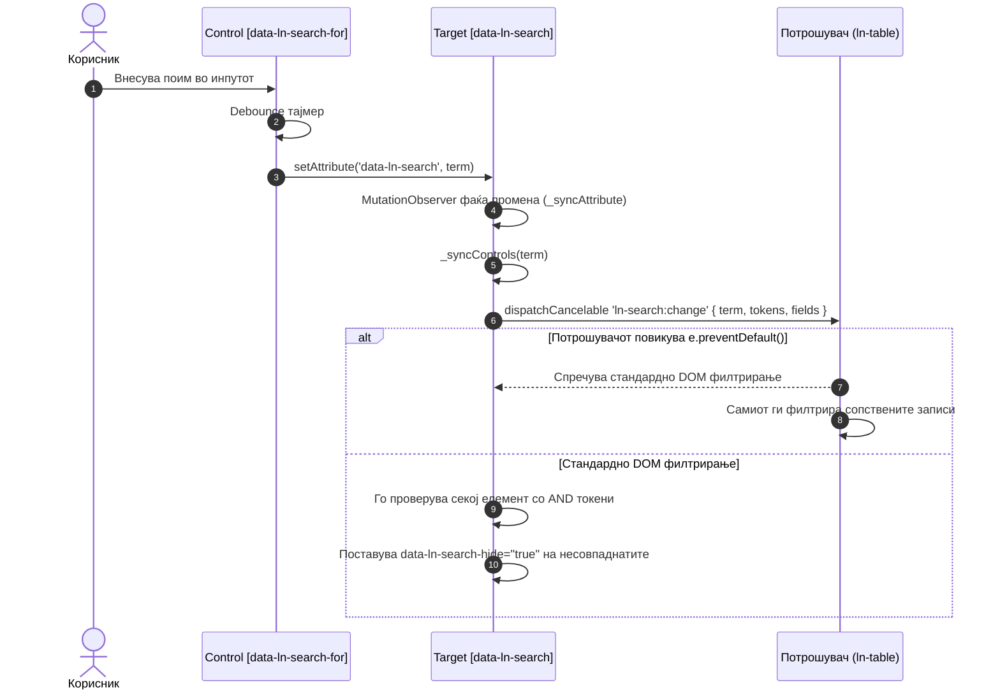

# 🔍 ln-search

> **Класификација:** 🟢 Едноставна компонента / Пребарувачки примитив (Layer 1)

---

## 1. Заднинско дејство и одговорност
- **Краток опис:** `ln-search` е decoupled пребарувачка компонента изградена врз архитектурата на две улоги (Two-Host / Attribute Bridge). Се состои од **Контрола** (`data-ln-search-for="target-id"`) која управува со инпутот, debounce тајмерот и копчето за бришење, и **Состојба** (`data-ln-search="term"` на самата цел) која ја поседува состојбата на поимот, реагира на промени преку `MutationObserver`, диспачира настани и извршува стандардно DOM филтрирање со AND токенизирано совпаѓање и динамичко кеширање на пребарувачкиот текст за брзи $O(1)$ пребарувања.
- **Ортогоналност (Што компонентата НЕ прави):**
  - НЕ чува директна JS мемориска референца помеѓу контролата и таргетот — комуникацијата се одвива исклучиво преку атрибутот `data-ln-search`.
  - НЕ филтрира директно надворешни мемориски структури (тоа го прават `ln-table` / `ln-data-store`).
  - НЕ поставува директни inline стилови (`el.style.display = 'none'`) — поставува само `data-ln-search-hide="true"`.
  - НЕ извршува директни HTTP мрежни повици (тоа го прават координатори или надворешни сервиси).

---

## 2. Минимален HTML Маркап и Варијанти на Употреба

### 1. Канонски HTML Маркап (Локално DOM филтрирање со `.search` хром)
```html
<label class="search">
  <svg class="ln-icon" aria-hidden="true"><use href="#ln-icon-search"></use></svg>
  <input type="search" placeholder="Пребарај..." data-ln-search-for="items-list" data-ln-search-debounce="0" aria-label="Пребарај ставки">
  <button type="button" data-ln-search-clear aria-label="Исчисти пребарување">
    <svg class="ln-icon" aria-hidden="true"><use href="#ln-icon-x"></use></svg>
  </button>
</label>

<ul id="items-list" data-ln-search="">
  <li>Ана Марија</li>
  <li>Марко Петровски</li>
  <li data-ln-search-exclude>Изземена ставка (секогаш видлива)</li>
</ul>
```

### 2. Длабоко селектирање на редови со исклучување на под-елементи
```html
<label class="search">
  <svg class="ln-icon" aria-hidden="true"><use href="#ln-icon-search"></use></svg>
  <input type="search" placeholder="Пребарај корисници..." data-ln-search-for="user-table" data-ln-search-debounce="0" aria-label="Пребарај корисници">
  <button type="button" data-ln-search-clear aria-label="Исчисти пребарување">
    <svg class="ln-icon" aria-hidden="true"><use href="#ln-icon-x"></use></svg>
  </button>
</label>

<table id="user-table" data-ln-search="" data-ln-search-items="tbody tr" data-ln-search-fields="ime,uloga">
  <thead>
    <tr><th>Име</th><th>Улога</th><th>Акции</th></tr>
  </thead>
  <tbody>
    <tr>
      <td>Ана Марија</td>
      <td>Администратор</td>
      <td data-ln-search-exclude><button type="button">Избриши</button></td>
    </tr>
  </tbody>
</table>
```

### 3. Ресетирање / Празнење на пребарувањето (`data-ln-search-clear`)
Копчето за бришење функционира универзално во три сценарија без потреба од координатор:
1. **Во `.search` хром (покрај инпутот):**
   ```html
   <label class="search">
     <input type="search" data-ln-search-for="items-list" placeholder="Пребарај...">
     <button type="button" data-ln-search-clear aria-label="Исчисти"><svg class="ln-icon"><use href="#ln-icon-x"></use></svg></button>
   </label>
   ```
2. **Во Empty State на самиот таргет (листа, секција, табела):**
   ```html
   <ul id="items-list" data-ln-search="">
     <li class="empty-state">
       <p>Нема пронајдено резултати.</p>
       <button type="button" data-ln-search-clear>Исчисти пребарување</button>
     </li>
   </ul>
   ```
3. **Како независно далечинско копче:**
   ```html
   <button type="button" data-ln-search-clear-for="items-list">Ресетирај филтер</button>
   ```

---

## 3. Декларативен API Договор (Атрибути и Настани)

### Атрибути

| Атрибут | Елемент | Стандардно | Опис |
| :--- | :--- | :--- | :--- |
| `data-ln-search-for="targetId"` | Контрола (`<input>` / wrapper) | — | Покажувач кон ID на целниот елемент (State Host). |
| `data-ln-search="term"` | Таргет (State Host) | `""` | Состојба на пребарувањето. Изворот на вистина (Single Source of Truth). |
| `data-ln-search-items="sel"` | Таргет (State Host) | `null` | CSS селектор за длабинско селектирање на ставки наместо `target.children`. |
| `data-ln-search-fields="a,b"` | Таргет (State Host) | `null` | Листа на полиња за филтрирање — се препраќа во `detail.fields` за потрошувачите. |
| `data-ln-search-exclude` | Ставка или потомок | — | На **корен на ставка**: ставката е целосно изземена од филтрирање (секогаш видлива). На **потомок**: под-дрвото не придонесува во текстот за пребарување. |
| `data-ln-search-debounce="ms"` | Контрола | `500` | Време на debounce во милисекунди (`0` за инстантно локално DOM пребарување). |
| `data-ln-search-clear` | Копче (во срч бокс или empty state) | — | Универзално копче за ресетирање на пребарувањето и враќање на фокусот во инпутот. |
| `data-ln-search-clear-for="id"` | Копче (било каде) | — | Далечинско копче за ресетирање на пребарувањето на специфичен целен елемент. |
| `data-ln-search-hide="true"` | Ставка од таргетот | — | Состојбен атрибут што се доделува на ставките што не се совпаѓаат (`display: none !important`). |

### Програмски JS API

| Инстанца | Својство / Метод | Опис |
| :--- | :--- | :--- |
| `el.lnSearchControl` (на контролата) | `targetId`, `input`, `debounceTime`, `destroy()` | Управува со инпутот, debounce тајмерот и clear копчето. |
| `el.lnSearch` (на таргетот) | `term`, `_apply()`, `destroy()` | Ја чува вистинската состојба и управува со настаните и филтрирањето. |

### Настани (Events API)

| Настан | Елемент | Откажлив | `detail` Структура | Опис |
| :--- | :--- | :--- | :--- | :--- |
| `ln-search:change` | Таргет (State Host) | Да (`preventDefault`) | `{ term: string, tokens: string[], targetId: string, fields: string[]\|null }` | Се диспачира при секоја промена на поимот. Со `preventDefault()` потрошувачот (`ln-table`) го презема филтрирањето и го исклучува стандардното DOM криење. |

---

## 4. CSS Стилизирање и Поведенски Концепт
- **Хром класа `.search`:** Го користи SCSS миксинот `@include search` за левиот лупа-икона индикатор, recessed позадина и вградено копче за бришење.
- **Скривање на несовпаднати елементи:** Стандардно скривање дефинирано во `ln-search.scss`:
  ```scss
  [data-ln-search-hide="true"] {
    display: none !important;
  }
  ```
- **Tokenized AND совпаѓање:** Пребарувањето стандардно го дели поимот на токени (по празно место) и бара секој токен да се содржи во текстот на ставката, независно од редоследот.

---

## 5. Пристапност (ARIA) и Чести Грешки
- **ARIA етикетирање:** Секогаш дефинирајте `aria-label="Пребарај..."` на инпутот или користете родителски `<label>`.
- **Копче за чистење:** Задолжително `type="button"` со соодветен `aria-label="Исчисти пребарување"`.
- **Декоративни икони:** Иконите со лупа и „x“ мора да имаат `aria-hidden="true"`.
- **Чести грешки (Анти-патерни):**
  - Не заборавајте `data-ln-search-debounce="0"` при локално филтрирање на готови DOM елементи за инстантен одѕив.
  - Не користете го `data-ln-search` на инпутот за дефинирање цел — користете `data-ln-search-for="targetId"`.

---

## 6. Дијаграм на Текот и Животен Циклус


```mermaid
sequenceDiagram
    autonumber
    actor User as Корисник
    participant Control as Control [data-ln-search-for]
    participant Target as Target [data-ln-search]
    participant Consumer as Потрошувач (ln-table)

    User->>Control: Внесува поим во инпутот
    Control->>Control: Debounce тајмер
    Control->>Target: setAttribute('data-ln-search', term)
    Target->>Target: MutationObserver фаќа промена (_syncAttribute)
    Target->>Target: _syncControls(term)
    Target->>Consumer: dispatchCancelable 'ln-search:change' { term, tokens, fields }

    alt Потрошувачот повикува e.preventDefault()
        Consumer-->>Target: Спречува стандардно DOM филтрирање
        Consumer->>Consumer: Самиот ги филтрира сопствените записи
    else Стандардно DOM филтрирање
        Target->>Target: Го проверува секој елемент со AND токени
        Target->>Target: Поставува data-ln-search-hide="true" на несовпаднатите
    end
```

---

## 7. Поврзани Компоненти
- [`ln-table.md`](./ln-table.md) — Табеларна компонента која слуша `ln-search:change`.
- [`ln-table-coordinator.md`](./ln-table-coordinator.md) — Координатор кој ги поврзува пребарувачите со табеларни сервиси.
- Изворен код: [`../../js/ln-search/src/ln-search.js`](../../js/ln-search/src/ln-search.js)
