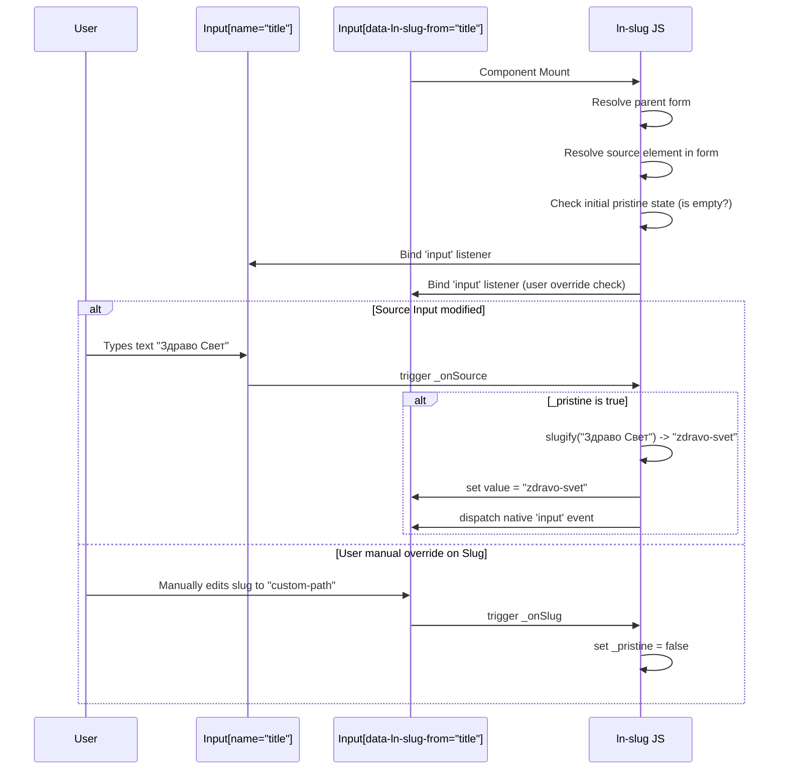

# 🔗 ln-slug
> **Класификација:** 🟢 Едноставна компонента (Layer 1 - Form Helper)

---

## 1. Заднинско дејство и одговорност

`ln-slug` е едноставна помошна компонента која се користи во форми за автоматско генерирање на URL-пријателски текстуални патеки (slugs) врз основа на вредноста внесена во друго изворно поле (на пр. наслов на статија, име на производ).

*   **Главна Одговорност:** Го набљудува изворниот инпут и соодветно ја трансформира неговата содржина во slug формат (мали букви, замена на сите знаци и празни места со еден дефис `-` и отстранување на дефиси од почетокот и крајот).
*   **Концепт на недопрена состојба (Pristine State):** Генерирањето работи сè додека корисникот рачно не ја промени вредноста на инпутот за slug. Штом корисникот рачно напише сопствен slug, автоматското пресликување се деактивира (`_pristine = false`). Доколку корисникот целосно го испразни полето за slug, пресликувањето повторно се активира.
*   **Иницирање на настани:** При секое автоматско пополнување, компонентата емитува нативен `input` настан во DOM-от за да можат другите инволвирани компоненти (како `ln-validate` за проверка на уникатност на патеката) навремено да реагираат.
*   **Ортогоналност (Што компонентата НЕ прави):**
    *   Не врши транслитерација на кирилични или не-ASCII знаци (ASCII-only во v1). Сите не-ASCII карактери се заменуваат со дефис.
    *   Не проверува дали генерираниот slug е веќе зафатен во базата на податоци (оваа проверка е одговорност на [ln-validate](./ln-validate.md)).
    *   Не управува со поднесување и зачувување на формата (тоа е задача на [ln-form](./ln-form.md)).
    *   Не се занимава со визуелно стилизирање или приказ на грешки.


---

## 2. Минимален HTML Маркап и Варијанти на Употреба

```html
<form id="article-form">
    <!-- Изворен инпут -->
    <div class="form-element">
        <label for="title">Наслов на статија:</label>
        <input type="text" id="title" name="title" required />
    </div>

    <!-- Целен инпут кој ќе го прими генерираниот slug -->
    <div class="form-element">
        <label for="slug">URL Патека (Slug):</label>
        <input type="text" 
               id="slug" 
               name="slug" 
               required 
               data-ln-slug-from="title" />
    </div>
</form>
```

---

## 3. Декларативен API Договор (Атрибути и Настани)

| Атрибут | Тип | Опис |
| :--- | :--- | :--- |
| `data-ln-slug-from` | `String` | Го активира компонентот врз целниот инпут. Вредноста го означува `name` атрибутот на изворниот инпут од истата форма (на пр. `title`). |

### Настани
Компонентата нема свои специфични CustomEvents, но при секое пресликување емитува нативен **`input`** настан (`{ bubbles: true }`) врз целниот елемент за координирање со компонентите за валидација.

---

## 4. CSS Стилизирање и Поведенски Концепт
Ова е логичка компонента која работи исклучиво во позадина и нема свои CSS класи. Изгледот на инпутот целосно зависи од глобалниот дизајн на формите во апликацијата.

---

## 5. Пристапност (ARIA) и Чести Грешки
*   **Пристапност:** Бидејќи полето се пополнува автоматски додека корисникот пишува во друго поле, се препорачува додавање на описни помошни текстови или `aria-describedby` за да му се укаже на корисникот дека ова поле е поврзано со претходното и автоматски се генерира.
*   **Честа грешка 1:** Примена на `data-ln-slug-from` на елемент кој не е од тип `<input>`. Компонентата во тој случај ќе прикаже предупредување (`console.warn`) и нема да се иницијализира.
*   **Честа грешка 2:** Поставување на инпутот надвор од `<form>`. Компонентата го бара изворот преку `dom.form.elements[sourceName]`. Доколку инпутот не е во форма, иницијализацијата ќе пропадне.
*   **Честа грешка 3:** Наведување име на изворно поле кое не постои или кое е дел од група со исто име (пр. радио копчиња). Изворното поле мора да биде единствен инпут елемент внатре во формата.

---

## 6. Дијаграм на Текот и Животен Циклус



---

## 7. Поврзани Компоненти

*   **[ln-slug.js](../../js/ln-slug/src/ln-slug.js)** — Изворен код на самата компонента.
*   **[ln-form](./ln-form.md)** — Формата во која се наоѓаат полињата.
*   **[ln-validate](./ln-validate.md)** — Го слуша емитуваниот `input` настан од slug инпутот за да изврши проверка за валидност и уникатност на генерираната патека.

