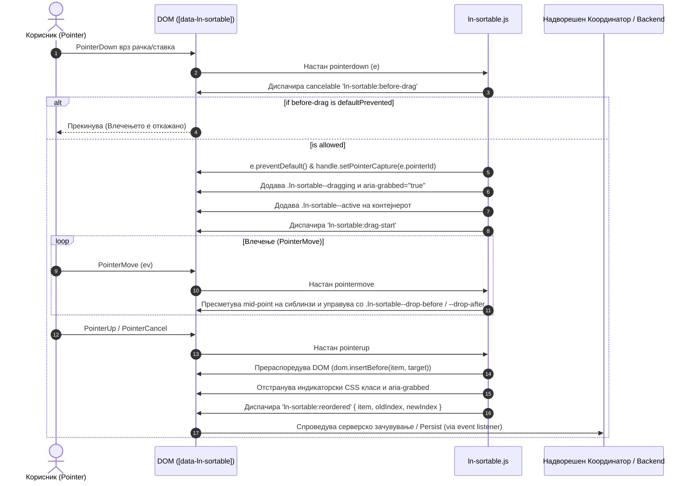

# 🔀 ln-sortable

> **Класификација:** 🧩 Едноставна Компонента (Simple Component / Primitive)

---

## 1. Заднинско дејство и одговорност

- **Краток опис:**
  `ln-sortable` е специјализирана, нула-депенденци примитива (Drag & Drop Reordering Primitive) одвојувана во модулот [`js/ln-sortable/src/ln-sortable.js`](../../js/ln-sortable/src/ln-sortable.js) за интерактивно прераспоредување на редоследот на DOM елементи во рамките на еден родителски контејнер (`[data-ln-sortable]`). Работи исклучиво со современиот прелистувачки Pointer Events API (`pointerdown`, `pointermove`, `pointerup`, `pointercancel`) овозможувајќи високи перформанси за глушец, допир (touch) и стилус без потреба од тешки HTML5 Drag and Drop библиотеки.

- **Ортогоналност (Што компонентата НЕ прави):**
  - **НЕ перзистира редослед на сервер:** `ln-sortable` врши исклучиво визуелно и DOM прераспоредување на деца елементите (`this.dom.insertBefore(...)`). Зачувувањето на новиот индекс/редослед во база или сервер се препушта целосно на надворешниот координатор (или апликациски JS), кој го слуша телеметрискиот настан `ln-sortable:reordered`.
  - **НЕ инјектира инлајн стилови:** Компонентата не додава директни CSS стилови (како `el.style.transform` или `position: absolute`). Состојбите се пренесени декларативно преку CSS класи (`.ln-sortable--dragging`, `.ln-sortable--drop-before`, `.ln-sortable--drop-after`, `.ln-sortable--active`) и ARIA атрибути (`aria-grabbed="true"`).
  - **НЕ креира монолитна бизнис логика:** `ln-sortable` се грижи само за гестовите и промената на позицијата на елементот во сопствениот контејнер (`this.dom`), без знаење за други компоненти во апликацијата.

---

## 2. Минимален HTML Маркап и Варијанти на Употреба

### Базен HTML Маркап (Drag-anywhere list)
Маркирајте го контејнерот (`<ul>`, `<ol>`, `<div>`) со атрибутот `data-ln-sortable`. Сите директни деца стануваат интерактивни за влечење:

```html
<ul data-ln-sortable>
    <li>Прва ставка</li>
    <li>Втора ставка</li>
    <li>Трета ставка</li>
</ul>
```

### Варијанти на Употреба

#### 1. Листа со наменски рачки (Handles-only Drag `data-ln-sortable-handle`)
За да се спречи ненамерно влечење на мобилни уреди кога корисникот клика на текст или копчиња внатре во ставката, се дефинира специфичен елемент-рачка (`data-ln-sortable-handle`). Кога најмалку една рачка е присутна во листата, влечењето е овозможено САМО кога Pointer down ќе започне од таа рачка:

```html
<ol data-ln-sortable>
    <li>
        <span data-ln-sortable-handle class="sortable-handle" aria-label="Премести ставка">
            <svg class="ln-icon" aria-hidden="true"><use href="#ln-grip-vertical"></use></svg>
        </span>
        <span>Конфигурација на таблата</span>
    </li>
    <li>
        <span data-ln-sortable-handle class="sortable-handle" aria-label="Премести ставка">
            <svg class="ln-icon" aria-hidden="true"><use href="#ln-grip-vertical"></use></svg>
        </span>
        <span>Управување со корисници</span>
    </li>
</ol>
```

#### 2. Онесведочена / Оневозможена листа (`data-ln-sortable="disabled"`)
Ако атрибутот `data-ln-sortable` ја има вредноста `"disabled"`, интерактивноста за влечење се блокира:

```html
<ul data-ln-sortable="disabled">
    <li>Заклучена ставка 1</li>
    <li>Заклучена ставка 2</li>
</ul>
```

#### 3. Програмско овозможување / оневозможување преку JS API
Стандардните методи на JS инстанцата го ажурираат атрибутот во DOM, што преку `MutationObserver` рефлектира во синхронизација:

```javascript
const listEl = document.querySelector('[data-ln-sortable]');
const instance = listEl.lnSortable;

// Оневозможи влечење
instance.disable(); // Додава data-ln-sortable="disabled"

// Повторно овозможи влечење
instance.enable();  // Го поставува data-ln-sortable=""
```

#### 4. Обичен JS пример: Синхронизација на нов редослед со Backend API (Ad-hoc слушател)
Пример за тоа како апликацискиот скрипт го слуша телеметрискиот настан `ln-sortable:reordered`, ги извлекува атрибутите од прераспоредените елементи и испраќа асинхроно HTTP барање (`fetch` / `POST` или `PUT`) до бекендот со соодветен автоматизиран Rollback (враќање во претходна состојба) доколку барањето падне:

```html
<ul id="task-list" data-ln-sortable>
    <li data-task-id="101">
        <span data-ln-sortable-handle class="sortable-handle">
            <svg class="ln-icon" aria-hidden="true"><use href="#ln-grip-vertical"></use></svg>
        </span>
        <span>Задача 1: Конфигурација на база</span>
    </li>
    <li data-task-id="102">
        <span data-ln-sortable-handle class="sortable-handle">
            <svg class="ln-icon" aria-hidden="true"><use href="#ln-grip-vertical"></use></svg>
        </span>
        <span>Задача 2: Изработка на REST API endpoints</span>
    </li>
    <li data-task-id="103">
        <span data-ln-sortable-handle class="sortable-handle">
            <svg class="ln-icon" aria-hidden="true"><use href="#ln-grip-vertical"></use></svg>
        </span>
        <span>Задача 3: Тестирање на перформанси</span>
    </li>
</ul>

<script>
document.getElementById('task-list').addEventListener('ln-sortable:reordered', async function (e) {
    const { item, oldIndex, newIndex } = e.detail;
    const container = e.target;

    // Извлечи ги сите ID-ња според новиот DOM редослед
    const orderedIds = Array.from(container.children)
        .map(child => child.getAttribute('data-task-id'))
        .filter(Boolean);

    try {
        const response = await fetch('/api/tasks/reorder', {
            method: 'PUT',
            headers: { 'Content-Type': 'application/json' },
            body: JSON.stringify({
                taskId: item.getAttribute('data-task-id'),
                oldIndex: oldIndex,
                newIndex: newIndex,
                orderedIds: orderedIds
            })
        });

        if (!response.ok) {
            throw new Error(`Серверот врати статус ${response.status}`);
        }

        // Информирај за успехот преку ln-toast (доколку постои)
        window.dispatchEvent(new CustomEvent('ln-toast:enqueue', {
            detail: { type: 'success', title: 'Зачувано', message: 'Новиот редослед е успешно синхронизиран.' }
        }));
    } catch (err) {
        console.error('Грешка при синхронизација:', err);

        // Rollback: Врати го елементот на старата DOM позиција
        const children = Array.from(container.children);
        children.splice(newIndex, 1); // Отстрани од новата позиција

        if (oldIndex >= children.length) {
            container.appendChild(item);
        } else {
            container.insertBefore(item, children[oldIndex]);
        }

        window.dispatchEvent(new CustomEvent('ln-toast:enqueue', {
            detail: { type: 'danger', title: 'Грешка', message: 'Синхронизацијата со серверот не успеа. Промените беа поништени.' }
        }));
    }
});
</script>
```

#### 5. ⭐ Префериран начин: Вистински Проектен Координатор (`data-project-sortable-sync` & `ln-project-sortable-sync.js`)

> **Доктрина за одвојување (Coordinators Doctrine & `ln-core` Архитектура):** Според принципите на `ln-ashlar`, координаторите НЕ се ad-hoc глобални скрипти со `document.getElementById` или глобални event listeners. Тие се **автономни IIFE компоненти регистрирани преку `registerComponent`**, кои се закачуваат директно врз својот DOM контејнер (`this.dom`). Координаторот ги слуша настаните што меурчат од неговите сопствени деца, управува со нивната состојба и доделува одговорности без да ја загадува апликацијата.

##### Декларативен HTML Маркап
Корисникот/девелоперот во шаблонот поставува само декларативен маркер за примитивата (`data-ln-sortable`) и за координаторот (`data-project-sortable-sync="/api/endpoint"`):

```html
<!-- Контејнерот носи примитива и проектен координатор со соодветен API endpoint -->
<ul data-ln-sortable 
    data-project-sortable-sync="/api/tasks/reorder" 
    data-project-item-key="task-id">
    
    <li data-task-id="101">
        <span data-ln-sortable-handle class="sortable-handle">
            <svg class="ln-icon" aria-hidden="true"><use href="#ln-grip-vertical"></use></svg>
        </span>
        <span>Задача 1: Конфигурација на база</span>
    </li>
    <li data-task-id="102">
        <span data-ln-sortable-handle class="sortable-handle">
            <svg class="ln-icon" aria-hidden="true"><use href="#ln-grip-vertical"></use></svg>
        </span>
        <span>Задача 2: Изработка на REST API endpoints</span>
    </li>
    <li data-task-id="103">
        <span data-ln-sortable-handle class="sortable-handle">
            <svg class="ln-icon" aria-hidden="true"><use href="#ln-grip-vertical"></use></svg>
        </span>
        <span>Задача 3: Тестирање на перформанси</span>
    </li>
</ul>
```

##### Имплементација на Проектниот Координатор (`js/coordinators/ln-project-sortable-sync.js`)

Овој координатор е изграден точно според `ln-` архитектурата: користи IIFE, се регистрира преку `registerComponent`, се иницијализира сам преку `MutationObserver` врз `[data-project-sortable-sync]`, се однесува исклучиво врз `this.dom` (без никаков `document.getElementById`) и менаџира API комуникација и UI нотификации:

```javascript
import { registerComponent, dispatch } from '../ln-core';

(function () {
    'use strict';

    const DOM_SELECTOR = 'data-project-sortable-sync';
    const DOM_ATTRIBUTE = 'lnProjectSortableSync';

    if (window[DOM_ATTRIBUTE] !== undefined) return;

    // ─── Component Constructor ─────────────────────────────

    function _component(dom) {
        this.dom = dom;
        
        // Резолвирај ги параметрите директно од атрибутите на закачениот DOM елемент
        this.endpoint = dom.getAttribute(DOM_SELECTOR) || dom.getAttribute('data-project-endpoint');
        this.itemKey = dom.getAttribute('data-project-item-key') || 'task-id';

        const self = this;
        this._onReordered = function (e) {
            self._handleReordered(e);
        };

        // Слушај го евентот што меурчи од децата ДИРЕКТНО врз сопствениот this.dom!
        dom.addEventListener('ln-sortable:reordered', this._onReordered);

        return this;
    }

    // ─── Dynamic Reorder Handler ───────────────────────────

    _component.prototype._handleReordered = async function (e) {
        const { item, oldIndex, newIndex } = e.detail;
        const attrName = `data-${this.itemKey}`;
        const itemId = item.getAttribute(attrName);
        const endpoint = this.endpoint || this.dom.getAttribute(DOM_SELECTOR);

        if (!endpoint) {
            console.warn('[lnProjectSortableSync] Отсутна вредност за API endpoint врз:', this.dom);
            return;
        }

        // Извлечи ги сите ID-ња на децата во новиот DOM редослед
        const orderedIds = Array.from(this.dom.children)
            .map(child => child.getAttribute(attrName))
            .filter(Boolean);

        try {
            const response = await fetch(endpoint, {
                method: 'PUT',
                headers: { 'Content-Type': 'application/json' },
                body: JSON.stringify({
                    itemId: itemId,
                    oldIndex: oldIndex,
                    newIndex: newIndex,
                    orderedIds: orderedIds
                })
            });

            if (!response.ok) {
                throw new Error(`Серверот врати статус ${response.status}`);
            }

            // Огласи нотификација преку ln-toast настанот
            dispatch(this.dom, 'ln-toast:enqueue', {
                type: 'success',
                title: 'Успешна синхронизација',
                message: 'Новиот редослед е зачуван на серверот.'
            });
        } catch (err) {
            console.error('[lnProjectSortableSync] Грешка при синхронизација:', err);

            // Оптимистички Rollback: Врати го елементот на старата DOM позиција
            const children = Array.from(this.dom.children);
            children.splice(newIndex, 1); // Отстрани од новата позиција

            if (oldIndex >= children.length) {
                this.dom.appendChild(item);
            } else {
                this.dom.insertBefore(item, children[oldIndex]);
            }

            // Извести за грешката и извршениот ролбек
            dispatch(this.dom, 'ln-toast:enqueue', {
                type: 'danger',
                title: 'Грешка при зачувување',
                message: 'Синхронизацијата со серверот не успеа. Редоследот е вратен на претходната состојба.'
            });
        }
    };

    // ─── Destroy and Cleanup ───────────────────────────────

    _component.prototype.destroy = function () {
        if (!this.dom[DOM_ATTRIBUTE]) return;
        this.dom.removeEventListener('ln-sortable:reordered', this._onReordered);
        delete this.dom[DOM_ATTRIBUTE];
    };

    // ─── Registration ──────────────────────────────────────

    registerComponent(DOM_SELECTOR, DOM_ATTRIBUTE, _component, 'ln-project-sortable-sync');
})();
```

##### Зошто ова е Вистинскиот `ln-` Координаторски Патерн?
1. **Само-иницијализација и Lifecycle:** Се користи IIFE со `registerComponent`, што значи дека секој елемент во DOM-от со `data-project-sortable-sync` автоматски се иницијализира при старт или при динамичко додавање преку MutationObserver.
2. **Контекстуална локализација (`this.dom`):** Никаде нема хардкодирани селектори или `document.getElementById`. Координаторот оперира исклучиво на елементот на кој е закачен (`this.dom`) и слуша настани во својот сопствен DOM подграф.
3. **Универзална повторливост:** Еден ист координаторски JS фајл управува со неограничен број листи на страницата едноставно преку закачување на `data-project-sortable-sync="/api/..."` атрибутот.
4. **Полна ортогоналност:** `ln-sortable` се грижи исклучиво за DOM влечењето, додека `lnProjectSortableSync` координаторот го слуша `ln-sortable:reordered`, го врши HTTP барањето и испраќа `ln-toast:enqueue` телеметриски евенти.

---

## 3. Декларативен API Договор (Атрибути и Настани)

### Табела со атрибути (HTML Attributes & Properties)

| Атрибут / Својство | Елемент | Тип | Стандардна вредност | Опис |
| :--- | :--- | :--- | :--- | :--- |
| `data-ln-sortable` | Обвивач (`<ul>`, `<ol>`, `<div>`) | `String` | `""` (овозможено) | Главен маркер за компонентата. Ако има вредност `"disabled"`, влечењето е оневозможено. |
| `data-ln-sortable-handle` | Потомок на ставката | Marker | / | Доколку е присутен во ставката/листата, влечењето може да отпочне САМО од овој елемент. |
| `lnSortable` | DOM Елемент (`this.dom.lnSortable`) | `Object` | `instance` | Референца до JS инстанцата на компонентата прикачена врз DOM јазолот. |
| `aria-roledescription` | Обвивач | `String` | `"sortable list"` | Автоматски се поставува од JS при иницијализација за читачи на екран. |
| `aria-grabbed` | Ставка која се влече | `Boolean string` | `"true"` / отстранет | Се додава на ставката што во моментот се влече; се отстранува по завршување на отпуштањето (`pointerend`). |

### Настани (Events API)

Сите настани меурчат (bubble) од родителскиот контејнер (`this.dom`):

| Име на настан | Диспачер | Откажлив (Cancelable) | Detail Пакетот (`e.detail`) | Опис |
| :--- | :--- | :--- | :--- | :--- |
| `ln-sortable:before-drag` | `this.dom` | **Да** | `{ item: HTMLElement, index: number }` | Се диспачира веднаш при `pointerdown` пред започнување на влечењето. Ако се повика `e.preventDefault()`, влечењето се откажува. |
| `ln-sortable:drag-start` | `this.dom` | Не | `{ item: HTMLElement, index: number }` | Се диспачира кога влечењето е успешно започнато и се овозможува Pointer Capture. |
| `ln-sortable:reordered` | `this.dom` | Не | `{ item: HTMLElement, oldIndex: number, newIndex: number }` | Се диспачира по завршување на прераспоредувањето (`pointerup`/`pointerend`) ДОКОЛКУ позицијата на елементот во DOM се променила. |
| `ln-sortable:enabled` | `this.dom` | Не | `{ target: HTMLElement }` | Се диспачира кога состојбата на `data-ln-sortable` ќе премине од `"disabled"` во овозможена. |
| `ln-sortable:disabled` | `this.dom` | Не | `{ target: HTMLElement }` | Се диспачира кога атрибутот `data-ln-sortable` ќе добие вредност `"disabled"`. |
| `ln-sortable:destroyed` | `this.dom` | Не | `{ target: HTMLElement }` | Се диспачира кога инстанцата се уништува преку `destroy()`. |

---

## 4. CSS Стилизирање и Поведенски Концепт

### CSS Класи и Декларативни Стилски Куки (CSS State Hooks)

Компонентата управува со следните CSS класи врз DOM елементите за време на интеракцијата:

| CSS Класа | Соодветен Елемент | Опис и Примена |
| :--- | :--- | :--- |
| `.ln-sortable--active` | Контејнер (`[data-ln-sortable]`) | Се додава на контејнерот додека трае сесијата на влечење. Овозможува спречување на селекција на текст. |
| `.ln-sortable--dragging` | Ставка (`item`) | Се додава на ставката која моментално се влече. Вообичаено се користи за намалување на `opacity` (на пр. `opacity: 0.4`). |
| `.ln-sortable--drop-before` | Ставка соборец (Neighbor) | Се додава на ставка врз која показателот се наоѓа во нејзината горна половина. Обично прикажува индикаторска линија одозгора (`box-shadow: inset 0 2px 0 0 ...`). |
| `.ln-sortable--drop-after` | Ставка соборец (Neighbor) | Се додава на ставка врз која показателот се наоѓа во нејзината долна половина. Обично прикажува индикаторска линија одолу (`box-shadow: inset 0 -2px 0 0 ...`). |

### Препорачани SCSS Правила

```scss
@use '../../scss/config/mixins' as *;

[data-ln-sortable] {
    list-style: none;
    padding: 0;
    margin: 0;

    // Спречи избор на текст додека се влече
    &.ln-sortable--active {
        user-select: none;
    }

    > li, > div {
        user-select: none;
        @include transition(box-shadow 0.15s ease, opacity 0.15s ease);

        &.ln-sortable--dragging {
            opacity: 0.4;
        }

        &.ln-sortable--drop-before {
            box-shadow: inset 0 2px 0 0 hsl(var(--color-primary));
        }

        &.ln-sortable--drop-after {
            box-shadow: inset 0 -2px 0 0 hsl(var(--color-primary));
        }
    }
}

// Задолжително за touch уреди на рачките!
[data-ln-sortable-handle],
.sortable-handle {
    touch-action: none;
    cursor: grab;

    &:active {
        cursor: grabbing;
    }
}
```

### Поведенски концепт (Pointer Capture & Collision Calculation)
- **Pointer Capture:** При `pointerdown`, компонентата користи `handle.setPointerCapture(e.pointerId)` што му овозможува на прелистувачот непречено да ги следи `pointermove` настаните дури и ако показателот брзо се помести надвор од прозорецот или надвор од ставката.
- **Пресметка на средина (Midpoint Collision):** За време на `pointermove`, компонентата ја пресметува средината на секое дете во контејнерот (`mid = rect.top + rect.height / 2`). Ако `clientY` се наоѓа во горната половина, се додава `.ln-sortable--drop-before`; ако е во долната половина, `.ln-sortable--drop-after`.

---

## 5. Пристапност (ARIA) и Чести Грешки

### ARIA & Тастатура
- **`aria-roledescription="sortable list"`:** Атрибутот се додава автоматски на родителскиот контејнер за да ги извести читачите на екран за динамичката природа на листата.
- **`aria-grabbed="true"`:** Се поставува динамички врз активната ставка што се влече за да одрази грабање според ARIA препораките.

### 5.2. Чести Грешки (Anti-Patterns / Common Pitfalls)

> [!CAUTION]
> **1. Изоставување на `touch-action: none;` на рачките или ставките**
> На мобилни уреди (touchscreen), доколку на рачката (`[data-ln-sortable-handle]`) или на ставката не и е доделено `touch-action: none;` во CSS, прелистувачот ќе го интерпретира допирот како нативно скролање на страницата (pan scroll). Ова ќе го прекине влечењето на самиот почеток и ќе диспачира `pointercancel`.

> [!WARNING]
> **2. Очекување за автоматско серверско зачувување (Auto-Sync)**
> `ln-sortable` е исклучиво DOM примитива за влечење. Таа **НЕ прави HTTP барања до бекендот**. Серверското зачувување мора да се имплементира преку соодветен проектен координатор (`data-project-sortable-sync`) или со слушање на телеметрискиот настан `ln-sortable:reordered`.

> [!CAUTION]
> **3. Неправилно поставена рачка (`data-ln-sortable-handle`) надвор од директно дете**
> Рачката мора да биде потомок на ставката која е **директно дете** на контејнерот `[data-ln-sortable]`. Доколку рачката се наоѓа надвор од листата или е поставена на погрешно ниво, алгоритмот за препознавање нема да ја поврзе со ставката и влечењето нема да започне.

> [!IMPORTANT]
> **4. Кликање врз интерактивни елементи кога нема поставено рачки**
> Доколку во листата нема дефинирано `data-ln-sortable-handle`, секој клик врз било кој елемент во ставката започнува влечење. Ако ставката содржи линкови (`<a>`), копчиња (`<button>`) или полиња за внес, кликањето врз нив може ненамерно да го активира влечењето. За комплексни UI интерфејси **секогаш користете наменски рачки (`data-ln-sortable-handle`)**.


---

## 6. Дијаграм на Текот и Животен Циклус



---

## 7. Поврзани Компоненти

- [`ln-table.md`](./ln-table.md) — Специјализирана компонента за табели која поддржува интерактивни структури.
- [`ln-data-coordinator.md`](./ln-data-coordinator.md) — Проектен координатор задужен за слушање на `ln-sortable:reordered` и перзистирање на новата структура на бекенд API.
- [`ln-toast.md`](./ln-toast.md) — За прикажување нотификации при успешно зачувување на новиот редослед на ставките.
