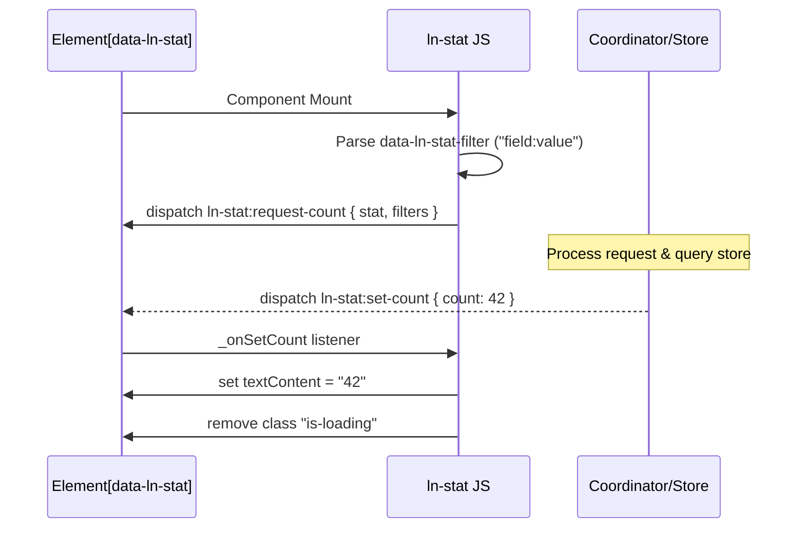

# 📊 ln-stat
> **Класификација:** 🟢 Едноставна компонента (Layer 1 - Data/UI Metric)

---

## 1. Заднинско дејство и одговорност
`ln-stat` е едноставна визуелна компонента наменета за прикажување на бројки од статистички карактер (бројачи на записи, суми и сл.) во корисничкиот интерфејс.

*   **Главна Одговорност:** Го бара и го прикажува бројот на записите од соодветниот податочен склад (`ln-data-store`), со поддршка за едноставно филтрирање.
*   **Декларативни Филтри:** Овозможува примена на едноставен филтер во формат `поле:вредност` (на пр. `status:active`) преку кој се брои само одредена подгрупа на податоци.
*   **Комуникација преку Настани:** Компонентата е целосно изолирана и нема сопствено познавање за базата или мрежата. При иницијализација испраќа настан `ln-stat:request-count` во DOM-от и чека соодветниот податочен координатор да ја врати вредноста преку `ln-stat:set-count`.
*   **Индикатор за вчитување:** Поддржува состојба на вчитување преку отстранување на CSS класата `is-loading` откако вредноста ќе пристигне.

---

## 2. Минимален HTML Маркап и Варијанти на Употреба

```html
<!-- Едноставен бројач на вкупни корисници -->
<div class="stat-card">
    <h3>Вкупно корисници</h3>
    <span class="is-loading" data-ln-stat="users">--</span>
</div>

<!-- Бројач со филтрирање (само активни проекти) -->
<div class="stat-card">
    <h3>Активни проекти</h3>
    <span class="is-loading" 
          data-ln-stat="projects" 
          data-ln-stat-filter="status:active">--</span>
</div>
```

---

## 3. Декларативен API Договор (Атрибути и Настани)

| Атрибут | Тип | Опис |
| :--- | :--- | :--- |
| `data-ln-stat` | `String` | Го активира компонентот и го означува името на податочниот склад (пр. `users`, `invoices`). |
| `data-ln-stat-filter` | `String` | Опционален филтер во формат `поле:вредност` (пр. `category:books`). |

### DOM Барања (Слуша)
| Настан | Payload `e.detail` | Опис |
| :--- | :--- | :--- |
| `ln-stat:set-count` | `{ count: Integer }` | Се активира кога координаторот ќе го врати пресметаниот број. Го пополнува текстот на елементот и ја отстранува класата `is-loading`. |

### Настани (Емитува)
| Настан | Payload `e.detail` | Опис |
| :--- | :--- | :--- |
| `ln-stat:request-count` | `{ stat: String, filters: Object }` | Се емитува при вчитување на страницата. `filters` содржи објект во формат `{ field: [value] }` извлечен од атрибутот за филтрирање. |

---

## 4. CSS Стилизирање и Поведенски Концепт
Компонентата го контролира текстот и класата `is-loading`. Се препорачува користење на пулсирачки ефекти или сива позадина додека бројката се вчитува:

```scss
// SCSS интеграција во дизајн системот
[data-ln-stat] {
    font-size: 2.25rem;
    font-weight: 700;
    color: var(--color-text-dark, #0f172a);
    
    // Скелетон ефект додека трае вчитувањето
    &.is-loading {
        display: inline-block;
        min-width: 40px;
        height: 1em;
        background-color: var(--color-gray-light, #e2e8f0);
        border-radius: 4px;
        color: transparent;
        animation: pulse 1.5s infinite ease-in-out;
    }
}

@keyframes pulse {
    0%, 100% { opacity: 0.6; }
    50% { opacity: 1; }
}
```

---

## 5. Пристапност (ARIA) и Чести Грешки
*   **Пристапност:** Секогаш поставувајте ја содржината на бројачот во соодветен контекст. Бидејќи вредноста се вчита динамички по вчитувањето на DOM-от, препорачливо е коренскиот елемент на статистиката (или неговата картичка) да содржи `aria-live="polite"` за екранските читачи да ја соопштат вредноста кога ќе биде вчитана.
*   **Честа грешка 1:** Неисправен формат на `data-ln-stat-filter`. Форматот мора строго да содржи една двоточка `:`, како на пример `status:pending`. Доколку се користи неисправен формат (на пр. `status=pending` или само `pending`), филтерот ќе биде игнориран и ќе биде побаран вкупниот број на записи.
*   **Честа грешка 2:** Очекување дека компонентата сама ќе се поврзе со базата без координатор. Доколку во DOM-от нема закачен координатор кој ги слуша настаните `ln-stat:request-count`, бројката ќе остане во вечна `is-loading` состојба со приказ `--`.

---

## 6. Дијаграм на Текот и Животен Циклус



---

## 7. Поврзани Компоненти
*   **`ln-data-store`**: Складот кој ги содржи податоците врз кои се прави броењето.
*   **`ln-data-coordinator`**: Медијатор кој го пресретнува барањето, прави query до соодветниот `ln-data-store` и го враќа резултатот назад до статистичкиот елемент.
