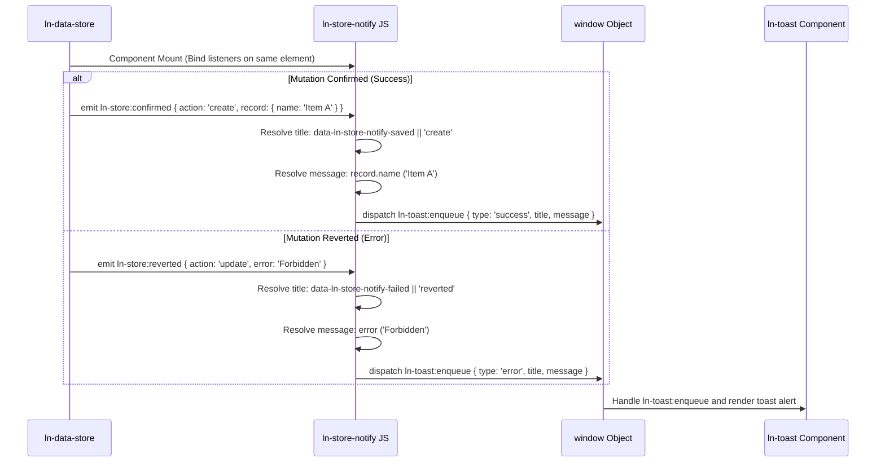

# 🔔 ln-store-notify
> **Класификација:** 🟢 Едноставна компонента / Преведувач на нотификации (Layer 1 - Data/UI Notification Bridge)

---

## 1. Заднинско дејство и одговорност
`ln-store-notify` е помошна логичка компонента која дејствува како мост помеѓу трансакциските промени во податочниот склад (`ln-data-store`) и системот за известување во корисничкиот интерфејс (`ln-toast`).

*   **Главна Одговорност:** Ги слуша настаните за потврда (`ln-store:confirmed`) и неуспех (`ln-store:reverted`) кои меурат од податочниот склад, ги анализира дејствата и нивните исходи и ги преточува во кориснички-пријателски пораки за успешност или грешка.
*   **Контекстуално склопување пораки:** Динамички ги чита податоците од трансакциите:
    *   При Креирање / Измена: Доколку е достапно, го користи насловот на објектот (`record.name`) за пораката.
    *   При Масовно Бришење (Bulk Delete): Пресметува колку записи се избришани и ја прикажува бројката.
*   **Изолација на интерфејсот:** Компонентата нема сопствен кориснички интерфејс и не рендерира ништо. За прикажување на нотификациите, таа го користи настанскиот модел со испраќање на `ln-toast:enqueue` настан на глобално ниво (`window`), оставајќи му ја визуелната презентација на `ln-toast` модулот.

---

## 2. Минимален HTML Маркап и Варијанти на Употреба

Се применува врз елементот на податочниот склад за да може веднаш да ги фати емитуваните настани кои меурат од него, или на негов директен родител.

```html
<!-- Интеграција во податочен склад за производи со сопствени пораки -->
<div data-ln-data-store="products" 
     data-ln-store-notify
     data-ln-store-notify-saved="Производот е успешно зачуван"
     data-ln-store-notify-deleted="Производот е избришан"
     data-ln-store-notify-failed="Грешка при синхронизација со серверот"
     id="products-store"
     class="hidden">
</div>
```

---

## 3. Декларативен API Договор (Атрибути и Настани)

| Атрибут | Тип | Опис |
| :--- | :--- | :--- |
| `data-ln-store-notify` | `Flag` | Го активира преведувачот на нотификации врз соодветниот елемент. |
| `data-ln-store-notify-saved` | `String` | Сопствен наслов за успешна потврда на Креирање/Измена. |
| `data-ln-store-notify-deleted` | `String` | Сопствен наслов за успешна потврда на Бришење/Масовно бришење. |
| `data-ln-store-notify-failed` | `String` | Сопствен наслов за грешки при откажување или враќање на трансакции. |

### DOM Сигнали од Складот (Слуша)
| Настан | Payload `e.detail` | Опис |
| :--- | :--- | :--- |
| `ln-store:confirmed` | `{ action, record, ids }` | Потврда за успешно извршена серверска мутација. |
| `ln-store:reverted` | `{ action, error }` | Неуспешна серверска трансакција (враќање на локалната состојба назад). |

### Нотификации кон Системот (Емитува на window)
| Настан | Payload `e.detail` | Опис |
| :--- | :--- | :--- |
| `ln-toast:enqueue` | `{ type: String, title: String, message: String }` | Налог до системот за нотификации за прикажување на тост со соодветната порака. |

---

## 4. CSS Стилизирање и Поведенски Концепт
Како логичка компонента без визуелен кориснички интерфејс (headless component), `ln-store-notify` нема сопствени CSS класи или стилови.

---

## 5. Пристапност (ARIA) и Чести Грешки
*   **Пристапност:** Бидејќи резултирачките тост пораки се прикажуваат преку `ln-toast`, осигурајте се дека Вашата `ln-toast` компонента има соодветна поддршка за пристапност (`role="status"`, `aria-live="polite"`).
*   **Честа грешка 1:** Поставување на `data-ln-store-notify` на елемент кој не се наоѓа во истата DOM гранка или е под нивото на `data-ln-data-store`. Бидејќи настаните меурат (bubble) нагоре во DOM дрвото, компонентата за нотификација мора да биде поставена на самиот елемент на продавницата или на некој негов родителски обвиткувач. Доколку се постави на соседен елемент, настаните нема да бидат пресретнати.
*   **Честа грешка 2:** Непоставување на `name` својство во податочниот запис на серверот. За креирање и измени, компонентата се обидува да го прочита `record.name` за пораката (пр. "Нов Продукт"). Доколку серверот враќа објект без `name` својство (на пр. користи `title` или `label`), пораката за тост ќе содржи само наслов без опис.

---

## 6. Дијаграм на Текот и Животен Циклус



---

## 7. Поврзани Компоненти
*   **`ln-data-store`**: Изворот на трансакциски настани врз кои се базираат нотификациите.
*   **`ln-toast`**: Примателот на глобалните `ln-toast:enqueue` пораки кој ја врши визуелната презентација на екранот.
