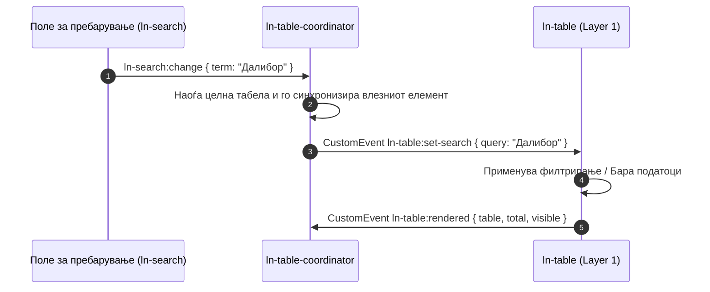

# 🎛️ ln-table-coordinator

> **Класификација:** 🔵 Координатор (Layer 2)

---

## 1. Заднинско дејство и одговорност
- **Краток опис:** `ln-table-coordinator` е централен координатор на ниво на документ кој ги поврзува сите надворешни UI контроли за пребарување (`ln-search`), филтрирање (`ln-filter`), копчиња за чистење филтри (`[data-ln-table-clear]`, `[data-ln-table-clear-all]`) и кратенката на тастатура (`'/'`) со соодветните `ln-table` компоненти на страницата.
- **Ортогоналност (Што компонентата НЕ прави):**
  - НЕ управува со табеларно рендерирање, виртуелен скрол или шаблони на редови (тоа го прави `ln-table`).
  - НЕ ги пресметува самите податоци ниту извршува директни сортирања во меморија (тоа го прави `ln-table`).
  - НЕ ги вчитува податоците од backend API (тоа го прави `ln-api-connector` / `ln-data-coordinator`).

---

## 2. Минимален HTML Маркап и Варијанти на Употреба

```html
<!-- Базен пример: Пребарувач и копче за ресетирање поврзани со табелата преку ID -->
<div class="table-toolbar">
  <div data-ln-search="employees-table">
    <input type="search" placeholder="Пребарај..." aria-label="Пребарај вработени">
  </div>
  <button type="button" data-ln-table-clear-all class="btn">Исчисти филтри</button>
</div>

<section data-ln-table="employees" id="employees-table">
  <table>
    <thead>
      <tr>
        <th data-ln-table-col="name">Име</th>
        <th data-ln-table-col="dept" data-ln-table-filter-col="dept">
          Оддел 
          <button type="button" data-ln-table-col-filter data-ln-popover-for="filter-dept">
            <svg class="ln-icon" aria-hidden="true"><use href="#ln-icon-filter"></use></svg>
          </button>
        </th>
      </tr>
    </thead>
    <tbody data-ln-table-body></tbody>
  </table>
</section>
```

---

## 3. Декларативен API Договор (Атрибути и Настани)

### Консумирани атрибути
| Атрибут | Елемент | Опис |
| :--- | :--- | :--- |
| `data-ln-search="tableId"` | Елемент со пребарувач | Го поврзува пребарувачот со табелата со соодветен ID. |
| `data-ln-filter="tableId"` | Форма / Поповер за филтрирање | Го поврзува филтерот со соодветната табела. |
| `data-ln-table-clear` / `data-ln-table-clear-all` | Копче | Врши ресетирање на сите филтри и пребарувања за табелата. |

### Настани (Events API)

#### Консумирани настани
| Настан | Извор | Опис |
| :--- | :--- | :--- |
| `ln-search:change` | `document` | Промена во пребарувачот → диспачира `ln-table:set-search`. |
| `ln-filter:changed` | `document` | Промена во колониски филтер → тогли `.ln-filter-active` и диспачира `ln-table:set-filter`. |
| `click` | `document` | Кликови на копчиња за чистење филтри → диспачира `ln-table:request-clear-filters`. |
| `keydown` (`'/'`) | `document` | Фокусирање на полето за пребарување. |

#### Диспачирани настани
| Настан | Цел | Детали (`detail`) | Опис |
| :--- | :--- | :--- | :--- |
| `ln-table:set-search` | `[data-ln-table]` | `{ query, term, table }` | Бара постава на пребарувачки поим во табелата. |
| `ln-table:set-filter` | `[data-ln-table]` | `{ key, values, table }` | Бара постава на филтер критериум по колона. |
| `ln-table:request-clear-filters` | `[data-ln-table]` | `{ table }` | Бара целосно ресетирање на филтрите. |

---

## 4. CSS Стилизирање и Поведенски Концепт
- **Визуелни индикатори (`.ln-filter-active`):** Координаторот ја тогли класата `.ln-filter-active` на копчето `[data-ln-table-col-filter]` во заглавието `<th>` кога има активни филтри. SCSS го поседува визуелниот изглед (акцент боја / точка).
- **Синхронизација на вредности (Value Mirroring):** Вредноста внесена во полето за пребарување се пресликува автоматски во сите соодветни влезни полиња на страницата.

---

## 5. Пристапност (ARIA) и Чести Грешки
- **ARIA пристапност:** Не влијае директно врз ARIA атрибутите на табелата, туку овозможува пристапност преку брзо фокусирање со тастатура (`'/'`).
- **Анти-патерни:**
  - Не заборавајте да поставите `id` на табелата кога користите надворешен пребарувач `data-ln-search="tableId"`.
  - Не повикувајте прототип методи директно врз табелата; комуникацијата оди исклучиво преку настани.

---

## 6. Дијаграм на Текот и Животен Циклус



---

## 7. Поврзани Компоненти
- [`ln-table`](./ln-table.md) — Базна компонента за табели (Layer 1).
- [`ln-search`](./ln-search.md) — Компонента за пребарувачко поле.
- [`ln-filter`](./ln-filter.md) — Компонента за филтрирање во поповер.
- Изворен код: [`../../js/ln-table-coordinator/src/ln-table-coordinator.js`](../../js/ln-table-coordinator/src/ln-table-coordinator.js)
