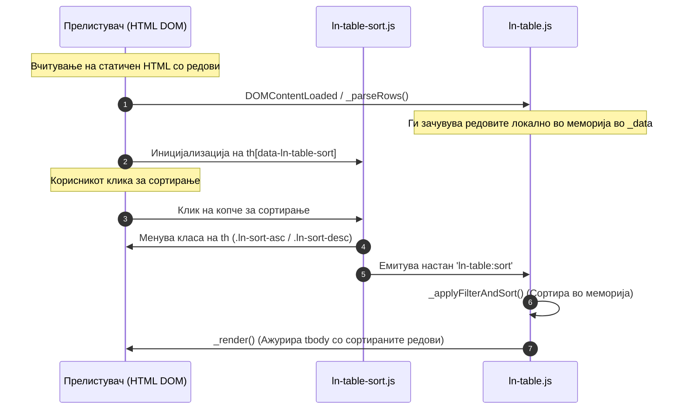
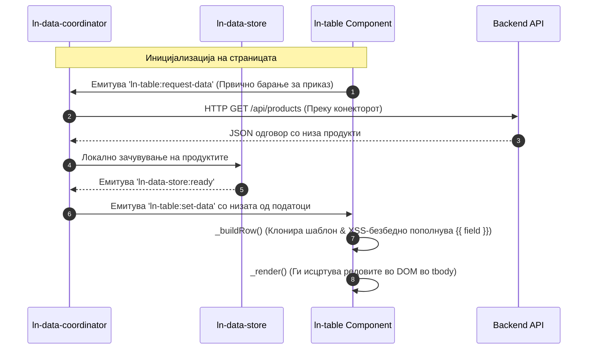
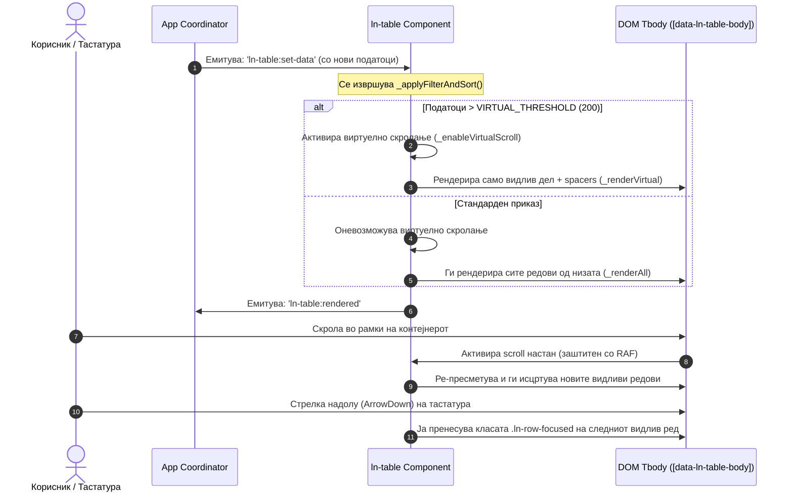
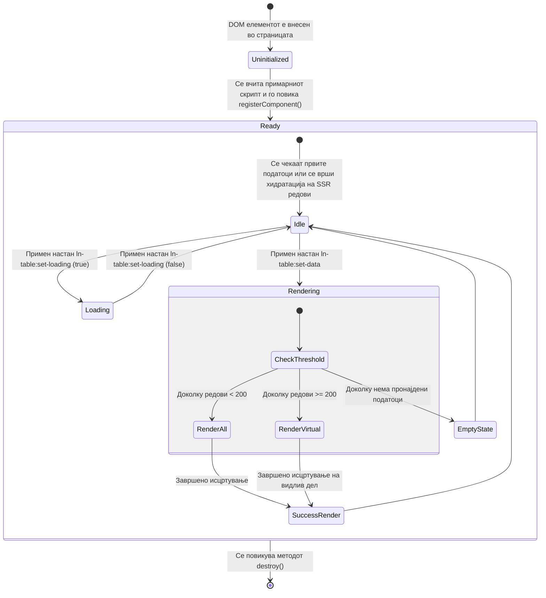

# 📊 ln-table

> **Класификација:** 🟢 Едноставна компонента / Презентер (Simple Presenter Component)

---

## 1. Заднинско дејство и одговорност

`ln-table` е специјализирана презентерска компонента без дополнителни зависности, наменета за брз и високоперформансен приказ на податоци во табеларна форма во `ln-ashlar` системот. Таа поддржува два фундаментални режими на работа:

1. **SSR (Server-Rendered) режим:** Ја хидрира постојната HTML структура испечатена од серверот. Еднаш ги чита редовите од `<tbody>` при иницијализација и овозможува инстантно клиентско сортирање, филтрирање, текстуално пребарување и виртуелно скролање директно над веќе постојниот маркап.
2. **Data-Driven режим:** Работи како динамички рендерирачки мотор кој прима чисти JSON низи од податоци, клонира дефиниран HTML шаблон (`<template data-ln-template="...-row">`), врши безбедна XSS интерполација со двојни кадрави загради (`{{ поле }}`), управува со активната селекција на редови и го ажурира подножјето на табелата.

### Ортогоналност (Што компонентата НЕ прави)
* **Не остварува директни мрежни AJAX повици** кон надворешни сервери. Доколку корисникот изврши сортирање, филтрирање или пребарување во Data-Driven режим, компонентата само емитува настан `ln-table:request-data`. Вчитувањето на податоците е одговорност на проектниот координатор (на пр. [ln-data-coordinator](./ln-data-coordinator.md)).
* **Не ја чува примарната состојба (State) на базата** — таа претставува само визуелен приказ. Сите промени на податоците се прифаќаат исклучиво од надворешниот податочен склад преку настанот `ln-table:set-data`.
* **Не генерира HTML елементи за интерфејс на филтри** (како checkbox-ови или dropdown-менија). Тие се градат како независни DOM структури преку [ln-filter](./ln-filter.md), при што `ln-table` само ги прифаќа нивните крајни филтрирани вредности преку настанот `ln-filter:changed`.

---

## 2. Минимален HTML Маркап и Варијанти на Употреба

### А. Базен HTML маркап за SSR (Server-Side Rendered) режим

Во овој режим, табелата е целосно функционална веднаш по вчитувањето на HTML-от генериран од серверот. Скриптата [ln-table-sort.js](../../js/ln-table/src/ln-table-sort.js) автоматски ги пребарува и ги активира сите табели кои содржат `data-ln-table-sort` атрибути на нивните заглавија, додека [ln-table.js](../../js/ln-table/src/ln-table.js) ги чита постојните редови за локално пребарување и филтрирање.

```html
<div id="employees-table" data-ln-table="employees">
  <!-- Шаблон за празна состојба -->
  <template data-ln-table-empty>
    <div class="ln-table__empty-state">
      <h3>Не се пронајдени совпаѓања</h3>
      <button type="button" data-ln-table-clear>Исчисти филтри</button>
    </div>
  </template>

  <table>
    <thead>
      <tr>
        <th data-ln-table-sort="string">
          Име
          <button type="button" class="table-sort" data-ln-table-col-sort aria-label="Сортирај по име">
            <svg class="ln-icon" aria-hidden="true" data-ln-table-col-sort-icon="none"><use href="#ln-arrows-sort"></use></svg>
            <svg class="ln-icon" aria-hidden="true" data-ln-table-col-sort-icon="asc"><use href="#ln-arrow-up"></use></svg>
            <svg class="ln-icon" aria-hidden="true" data-ln-table-col-sort-icon="desc"><use href="#ln-arrow-down"></use></svg>
          </button>
        </th>
        <th data-ln-table-sort="number">
          Плата
          <button type="button" class="table-sort" data-ln-table-col-sort aria-label="Сортирај по плата">
            <svg class="ln-icon" aria-hidden="true" data-ln-table-col-sort-icon="none"><use href="#ln-arrows-sort"></use></svg>
            <svg class="ln-icon" aria-hidden="true" data-ln-table-col-sort-icon="asc"><use href="#ln-arrow-up"></use></svg>
            <svg class="ln-icon" aria-hidden="true" data-ln-table-col-sort-icon="desc"><use href="#ln-arrow-down"></use></svg>
          </button>
        </th>
      </tr>
    </thead>
    <tbody>
      <tr>
        <td>Џон До (John Doe)</td>
        <td data-ln-value="120000">$120,000</td>
      </tr>
      <tr>
        <td>Џоана До (Joanna Doe)</td>
        <td data-ln-value="85000">$85,000</td>
      </tr>
    </tbody>
  </table>
</div>
```

#### Секуенцен дијаграм за SSR хидратација и интеракција (DOM Flow)



---

### Б. Базен HTML маркап за Data-Driven режим

Во овој режим, табелата работи како динамички презентер. Кога е поставен атрибутот `data-ln-table-source="products"`, табелата очекува посебен податочен склад во DOM со истиот клуч (`data-ln-data-store="products"`). Двата елементи мора да бидат спакувани под заеднички координатор (`data-ln-data-coordinator="products"`), кој ги прифаќа настаните за барање податоци и врши синхронизација.

Доколку `<tbody>` веќе содржи серверски рендерирани редови, табелата прво ги хидрира локално (progressive enhancement): записите се реконструираат од ќелиите преку мапирањето `data-ln-table-col` + `data-ln-value`, па дури потоа се емитува првичното `ln-table:request-data`.

> [!NOTE]
> **Не се пишува custom координатор по проект.** [ln-data-coordinator](./ln-data-coordinator.md) е генеричка библиотечна компонента — целото поврзување е чисто декларативно, со нула проектен JavaScript. „Врзувањето“ е самото DOM гнездење под заедничкиот координатор-елемент: складот **не се врзува директно** на конекторот, туку емитува `ln-data-store:request-remote-*` настани кои се креваат (bubble) нагоре, а координаторот ги фаќа и го повикува конекторот. Затоа конекторот е слободно заменлив (`data-ln-api-connector`, `data-ln-couchdb-connector`, `data-ln-websocket-connector`, `data-ln-rest-connector`) без складот да знае кој транспорт седи до него. Единствена проектно-специфична точка на проширување е опционалниот ingress/egress mapper регистриран преку `window.lnCore.registerDataMapper()` — стандардно е identity, па за чист 1:1 API не се пишува ништо.
>
> ```html
> <!-- Минимален пример: цела Data-Driven табела без ниту еден ред проектен JS -->
> <div data-ln-data-coordinator="products">
>   <div data-ln-data-store="products"></div>          <!-- IndexedDB склад, празен DOM држач -->
>   <div data-ln-api-connector="/api/products"></div>  <!-- заменлив транспорт -->
>   <div id="products-table" data-ln-table="products" data-ln-table-source="products" data-ln-table-store="products">
>     <!-- табела + шаблон за редови, како во примерот подолу -->
>   </div>
> </div>
> ```

```html
<!-- Глобален логички координатор кој ги поврзува складот и табелата -->
<div data-ln-data-coordinator="products" id="products-coordinator">
  
  <!-- Податочен склад (DOM извор за складирање на продукти во IndexedDB) -->
  <div data-ln-data-store="products" id="products-store"></div>

  <!-- API Конектор за комуникација со сервер -->
  <div data-ln-api-connector="/api/products" id="products-connector"></div>

  <!-- Табела која ги прикажува продуктите од складот -->
  <div id="products-table" data-ln-table="products" data-ln-table-source="products" data-ln-table-store="products">
    <table>
      <thead>
        <tr>
          <th data-ln-table-col="name" data-ln-table-sort="string">
            Производ
            <button type="button" class="table-sort" data-ln-table-col-sort aria-label="Сортирај по производ">
              <svg class="ln-icon" aria-hidden="true" data-ln-table-col-sort-icon="none"><use href="#ln-arrows-sort"></use></svg>
              <svg class="ln-icon" aria-hidden="true" data-ln-table-col-sort-icon="asc"><use href="#ln-arrow-up"></use></svg>
              <svg class="ln-icon" aria-hidden="true" data-ln-table-col-sort-icon="desc"><use href="#ln-arrow-down"></use></svg>
            </button>
          </th>
          <th data-ln-table-col="price" data-ln-table-sort="number">
            Цена
            <button type="button" class="table-sort" data-ln-table-col-sort aria-label="Сортирај по цена">
              <svg class="ln-icon" aria-hidden="true" data-ln-table-col-sort-icon="none"><use href="#ln-arrows-sort"></use></svg>
              <svg class="ln-icon" aria-hidden="true" data-ln-table-col-sort-icon="asc"><use href="#ln-arrow-up"></use></svg>
              <svg class="ln-icon" aria-hidden="true" data-ln-table-col-sort-icon="desc"><use href="#ln-arrow-down"></use></svg>
            </button>
          </th>
        </tr>
      </thead>
      <tbody data-ln-table-body>
        <!-- Динамичките редови ќе се исцртаат овде -->
      </tbody>
    </table>

    <!-- Шаблон за редови (Името мора да биде [data-ln-table]-row) -->
    <template data-ln-template="products-row">
      <tr data-ln-table-row>
        <td>{{ name }}</td>
        <td>{{ price }}</td>
      </tr>
    </template>
  </div>
</div>
```

#### Секуенцен дијаграм за Data-Driven синхронизација (Data Source Flow)



> [!IMPORTANT]
> Динамичкиот шаблон за редови ги пополнува вредностите само при клонирање преку интерполација со двојни кадрави загради (`{{ field }}`). Компонентата не го користи и не го поддржува атрибутот `data-ln-field` во самите шаблони за редови.

#### Празна состојба во Data-Driven режим

Табелата прво бара именуван шаблон според причината за празнина: `data-ln-template="{име}-empty"` (складот воопшто нема податоци) или `data-ln-template="{име}-empty-filtered"` (нема совпаѓања при активно пребарување/филтрирање). Ако ниту еден не постои, паѓа назад на генеричкиот `<template data-ln-table-empty>`, во кој со `data-ln-table-empty-when="initial"` и `data-ln-table-empty-when="search"` може да се дефинираат двете варијанти во еден шаблон.

---

### Варијанти на употреба

#### Варијанта 1: Data-Driven табела со селекција на редови и контролно поле за сите

Кога се користи `data-ln-table-selectable`, `ln-table` автоматски управува со чување на селектираните идентификатори и овозможува контролен checkbox на врвот. Како што е наведено во доктрината, ова бара соодветен податочен склад (`users`) во DOM под истиот координатор.

```html
<!-- Глобален координатор за корисници -->
<div data-ln-data-coordinator="users" id="users-coordinator">
  <!-- Податочен склад во DOM за корисниците -->
  <div data-ln-data-store="users" id="users-store"></div>
  
  <!-- API Конектор за корисници -->
  <div data-ln-api-connector="/api/users" id="users-connector"></div>
  
  <!-- Табела со овозможена селекција -->
  <div id="users-table" 
       data-ln-table="users" 
       data-ln-table-source="users" 
       data-ln-table-store="users"
       data-ln-table-selectable>
    
    <table>
      <thead>
        <tr>
          <!-- Селектор за сите редови во заглавието -->
          <th data-ln-table-col-select></th>
          <th data-ln-table-col="username">Корисничко име</th>
          <th data-ln-table-col="role">Улога</th>
        </tr>
      </thead>
      <tbody data-ln-table-body></tbody>
    </table>

    <!-- Шаблон со соодветните селекциски атрибути -->
    <template data-ln-template="users-row">
      <tr data-ln-table-row>
        <td>
          <!-- Локално селекциско поле за соодветниот ред -->
          <input type="checkbox" data-ln-table-row-select>
        </td>
        <td>{{ username }}</td>
        <td>{{ role }}</td>
      </tr>
    </template>

    <!-- Подножје со приказ на статистика -->
    <footer class="ln-table__footer">
      <div>
        Вкупно: <span data-ln-table-total>0</span>
      </div>
      <div data-ln-table-selected-wrap class="hidden">
        Селектирани: <span data-ln-table-selected>0</span>
      </div>
    </footer>
  </div>
</div>
```

---

#### Варијанта 2: Колона со акциски копчиња во редовите

Во шаблоните на редовите, копчињата со атрибутот `data-ln-table-row-action` овозможуваат емитување на настани при клик без да го активираат стандардниот настан за клик на целиот ред (`ln-table:row-click`).

```html
<template data-ln-template="users-row">
  <tr data-ln-table-row>
    <td>{{ username }}</td>
    <td>{{ role }}</td>
    <td>
      <!-- Акциско копче во ред -->
      <button type="button" data-ln-table-row-action="delete" class="btn-danger">
        Избриши
      </button>
    </td>
  </tr>
</template>
```

---

#### Варијанта 3: Интеграција на пребарување и филтрирање по колона

Пребарувањето на податоци во табелата се остварува преку поврзување на независна компонента за пребарување со помош на атрибутот `data-ln-search="[id-на-табела]"` дефиниран во [ln-search](./ln-search.md). Табелата под хауба ги слуша `ln-search:change` настаните и автоматски го филтрира/сортира соодветниот приказ.

* **Локално пребарување (Markup Search):** Се поставува `data-ln-search-debounce="0"` за моментална реакција при притискање тастери (instant filtering).
* **Оддалечено пребарување (Remote/API Search):** Се користи `data-ln-search-debounce="150"` или повеќе за да се спречи преоптоварување на серверот со премногу HTTP барања.

Филтрирањето по колони користи независни поповер обвивачи преку [ln-popover](./ln-popover.md) и листи со чекбоксови кои содржат `data-ln-filter="[id-на-табела]"` од [ln-filter](./ln-filter.md).

```html
<!-- Пребарувач поврзан со табелата 'users-table' (види ln-search) -->
<div class="search-field-group">
  <input type="search" 
         data-ln-search="users-table" 
         data-ln-search-debounce="0" 
         placeholder="Пребарај корисници...">
</div>

<!-- Заглавие на табела со копче за покренување поповер за филтрирање -->
<th data-ln-table-filter-col="role">
  Улога
  <button type="button" 
          data-ln-table-col-filter 
          data-ln-popover-for="filter-role-popover" 
          aria-label="Филтрирај улога">
    <svg class="ln-icon"><use href="#ln-filter"></use></svg>
  </button>
</th>

<!-- Поповер со филтри сместен надвор од табелата (види ln-popover и ln-filter) -->
<div data-ln-popover id="filter-role-popover">
  <ul data-ln-filter="users-table">
    <li>
      <label>
        <input type="checkbox" data-ln-filter-key="role" data-ln-filter-reset checked> 
        Сите
      </label>
    </li>
    <li>
      <label>
        <input type="checkbox" data-ln-filter-key="role" data-ln-filter-value="admin"> 
        Администратори
      </label>
    </li>
    <li>
      <label>
        <input type="checkbox" data-ln-filter-key="role" data-ln-filter-value="editor"> 
        Уредници
      </label>
    </li>
    <li>
      <label>
        <input type="checkbox" data-ln-filter-key="role" data-ln-filter-value="viewer"> 
        Гледачи
      </label>
    </li>
  </ul>
</div>
```

---

## 3. Декларативен API Договор (Атрибути и Настани)

### Атрибути на Конфигурација

| Атрибут | Елемент | Тип | Стандардна вредност | Опис |
| :--- | :--- | :--- | :--- | :--- |
| `data-ln-table` | Коренски контејнер | Стринг | - | Го идентификува контејнерот како табела. Неговата вредност служи за именување на настаните, а елементот мора да има уникатен `id`. |
| `data-ln-table-source` | Коренски контејнер | Стринг | - | Означува дека табелата работи во Data-Driven режим. Вредноста е името на изворот на податоци. |
| `data-ln-table-store` | Коренски контејнер | Стринг | - | Името на податочниот склад (data-store) во DOM со кој се поврзува табелата кога се користи `ln-data-coordinator`. |
| `data-ln-table-selectable` | Коренски контејнер | Булеан | `false` | Го активира менаџирањето со мулти-селекција на редови и зачувувањето на селектираните ID вредности во Set. |
| `data-ln-table-col` | `<th>` | Стринг | - | Го мапира заглавието на колоната со клучот од податочниот објект (JSON) во Data-Driven режим. |
| `data-ln-table-sort` | `<th>` | `string` \| `number` \| `date` | - | Овозможува сортирање по колона во SSR и Data-Driven режим со соодветен тип за споредување. Кликовите кружат: растечко → опаѓачко → без сортирање. Бара внатрешно копче `data-ln-table-col-sort`. |
| `data-ln-value` | `<td>` | Стринг | - | Се користи при читање на постојни редови (SSR режим и хидратација на почетни редови во Data-Driven режим). Ја дефинира суровата компјутерска вредност за сортирање/филтрирање, заменувајќи го видливиот текст во ќелијата. *(Се процесира преку `ln-core.js` / `fill()`)* |
| `data-ln-table-col-sort` | `<button>` | - | - | Идентификатор за копчето во заглавието на колоната кое при клик го активира сортирањето. |
| `data-ln-table-col-filter` | `<button>` | - | - | Идентификатор за филтер копчето (индикатор во форма на инка) кое добива класа `.ln-filter-active` кога има активни филтри. |
| `data-ln-table-col-select` | `<th>` | - | - | Означува колона со вграден контролен checkbox за селектирање/деселектирање на сите редови. |
| `data-ln-table-row` | `<tr>` | - | - | Го означува контејнерот на редот внатре во динамичкиот шаблон. |
| `data-ln-table-row-id` | `<tr>` | Стринг | - | Се доделува на секој рендериран ред за да се овозможи негова селекција или детекција на акција. |
| `data-ln-table-row-select` | `<input>` | - | - | Поле за селекција (checkbox) поставено во шаблонот за редови. |
| `data-ln-table-row-action` | `<button>` | Стринг | - | Означува акциско копче на кое му се доделува име на акција. Кликот на ова копче не го активира настанот за клик на целиот ред. |
| `data-ln-table-total` | `<span>` | - | - | Контејнер во подножјето кој автоматски го прикажува вкупниот број на рекорди во Data-Driven режим. |
| `data-ln-table-filtered` | `<span>` | - | - | Контејнер кој ја прикажува бројката на пронајдени редови при активно филтрирање. |
| `data-ln-table-selected` | `<span>` | - | - | Контејнер кој го прикажува вкупниот број на селектирани редови во моментот. |
| `data-ln-table-filter-col` | `<th>` | Стринг | - | Го мапира заглавието со филтер-клучот (`key` од `ln-filter:changed`). Задолжителен за колонско филтрирање во двата режими. |
| `data-ln-table-clear` | `<button>` | - | - | Копче (обично во празната состојба, SSR режим) кое ги чисти пребарувањето и сите колонски филтри и ги ресетира поврзаните `ln-search` / `ln-filter` контроли. |
| `data-ln-table-clear-all` | `<button>` | - | - | Копче во Data-Driven режим кое ги чисти сите колонски филтри, емитува `ln-table:clear-filters` и повторно бара податоци. |
| `data-ln-table-cell-attr` | Елемент во шаблон за ред | Стринг | - | Листа од `поле:атрибут` парови (одделени со запирка). При клонирање, вредноста на полето од записот се запишува како атрибут на елементот. *(Се извршува преку `ln-core.js` / `fillTemplate()`)* |
| `data-ln-table-empty-when` | Елемент во `<template data-ln-table-empty>` | `initial` \| `search` | - | Во Data-Driven режим избира која варијанта од генеричкиот празен шаблон се прикажува: без податоци (`initial`) или без совпаѓања (`search`). |
| `data-ln-persist` | Коренски контејнер | - | - | Го зачувува активното сортирање (колона + насока) и автоматски го обновува при следното вчитување на страницата (види [ln-table-sort.js](../../js/ln-table/src/ln-table-sort.js)). *(Се извршува преку `ln-persist.js`)* |

---

### Настани (Events API)

#### Примени настани (Слушатели)
* **`ln-table:set-data` (на коренски контејнер):** Вчитува нов сет на податоци. 
  * `detail: { data: Array, total: Number, filtered: Number }`
* **`ln-table:set-loading` (на коренски контејнер):** Го вклучува или исклучува визуелниот индикатор за вчитање.
  * `detail: { loading: Boolean }`
* **`ln-search:change` (на коренски контејнер):** Испратен кога корисникот пишува во поврзаниот влез за пребарување.
  * `detail: { term: String }`
* **`ln-filter:changed` (на коренски контејнер):** Се прима кога ќе се промени состојбата на чекбоксовите во соодветниот `ln-filter`.
  * `detail: { key: String, values: Array }`
* **`ln-table:sort` (на коренски контејнер во SSR режим):** Се емитува од придружниот скрипт [ln-table-sort.js](../../js/ln-table/src/ln-table-sort.js) до самата `<table>` со цел да се активира локално сортирање во SSR режим.
  * `detail: { column: Number, direction: String, sortType: String }`

#### Емитувани настани
* **`ln-table:ready`:** Се испраќа по првичното вчитување и парсирање на постојните редови.
  * `detail: { total: Number }`
* **`ln-table:request-data`:** Се испраќа кога се бара нов сет податоци поради сортирање, филтрирање или пребарување во Data-Driven режим.
  * `detail: { table: String, sort: Object, filters: Object, search: String }`
* **`ln-table:sort` (Data-Driven режим):** Се емитува при клик на копчето за сортирање во заглавието, непосредно пред новото барање податоци. Насоката кружи asc → desc → `null` (ресет). Да не се меша со истоимениот *примен* настан во SSR режим (различен `detail`).
  * `detail: { table: String, field: String, direction: String|null }`
* **`ln-table:search` (Data-Driven режим):** Се емитува кога табелата ќе прими нов термин од поврзаниот `ln-search`.
  * `detail: { table: String, query: String }`
* **`ln-table:clear-filters` (Data-Driven режим):** Се емитува при клик на копче со `data-ln-table-clear-all`, пред повторното барање податоци.
  * `detail: { table: String }`
* **`ln-table:filter` (SSR режим):** Се емитува по секое локално пребарување, колонско филтрирање или чистење на филтрите.
  * `detail: { term: String, matched: Number, total: Number }`
* **`ln-table:sorted` (SSR режим):** Се емитува откако локалното сортирање ќе биде применето и рендерирано.
  * `detail: { column: Number, direction: String|null, matched: Number, total: Number }`
* **`ln-table:rendered`:** Се активира откако динамичката табела ќе заврши со рендерирање на редовите во DOM дрвото.
  * `detail: { table: String, total: Number, visible: Number }`
* **`ln-table:row-click`:** Се активира при лев клик на ред (без кликање на линкови, копчиња или полиња за селекција).
  * `detail: { table: String, id: String, record: Object }`
* **`ln-table:row-action`:** Се испраќа при клик на копче со `data-ln-table-row-action`.
  * `detail: { table: String, id: String, action: String, record: Object }`
* **`ln-table:select`:** Се испраќа при промена на селектираната состојба на некој ред.
  * `detail: { table: String, selectedIds: Set, count: Number }`
* **`ln-table:select-all`:** Се испраќа кога ќе се кликне контролниот заглавен checkbox за селекција на сите редови.
  * `detail: { table: String, selected: Boolean }`
* **`ln-table:empty`:** Се емитува кога табелата ќе влезе во состојба на без податоци (Empty State).
  * `detail: { term: String, total: Number }`

---

## 4. CSS Стилизирање и Поведенски Концепт

Стилизирањето на табелата е поделено во два слоја со цел максимално почитување на принципот **Separation of Concerns**:
1. **Визуелен слој (Chrome и Стилизирање):** Се наоѓа во изворниот SCSS миксин [scss/config/mixins/_ln-table.scss](../../scss/config/mixins/_ln-table.scss).
2. **Структурен поведенски слој (State overrides):** Се наоѓа во локалната SCSS датотека на компонентата [js/ln-table/ln-table.scss](../../js/ln-table/ln-table.scss).

### Клучни SCSS Миксини

* **`@mixin ln-table`:** Го дефинира изгледот на табелата: ги заокружува аглите, поставува сенки, овозможува хоризонтален скрол на мобилни уреди и ги прави заглавијата (`thead`) лепливи (`sticky`).
* **`@mixin ln-table-footer`:** Го стилизира подножјето со статусните информации, со фиксирана позиција (`sticky`) на дното од контејнерот.
* **`@mixin ln-table-empty-state`:** Изглед на блокот за празна табела со центриран текст, зголемено растојание и намалена икона.
* **`@mixin ln-table-spacer-row`:** Овој миксин се користи од страна на JavaScript моторот за виртуелните скрол редови (`.ln-table__spacer`). Ги отстранува внатрешните растојанија (`padding: 0 !important`), рамките (`border: none !important`) и позадините на ќелиите со цел тие да останат невидливи.

---

### Поведенски Концепти

#### 1. Виртуелно скролање (Virtual Scrolling)
За да се овозможи одлична перформанса при прикажување на големи податочни сетови, `ln-table` автоматски активира виртуелно скролање кога бројот на редови го надминува лимитот `VIRTUAL_THRESHOLD = 200` ([js/ln-table/src/ln-table.js:L9](../../js/ln-table/src/ln-table.js#L9)).

* **Пресметка на висина:** Компонентата при иницијализација ја мери висината на првиот рендериран ред (`offsetHeight`).
* **Контејнер на скролање:** Во Data-Driven режим, преку функцијата `_findScrollContainer` моторот бара родителски контејнер со `overflow-y: auto/scroll`. Доколку не најде таков — како и секогаш во SSR режим — се скрола врз основа на глобалниот `window` објект.
* **Баферирање и Спајсери:** За да се спречи треперење при брзо скролање, моторот рендерира дополнителни `BUFFER_ROWS = 15` редови над и под видливиот дел. Дополнително, на врвот и на дното од `<tbody>` се вметнуваат два празни редови со класа `.ln-table__spacer` и атрибут `aria-hidden="true"`, кои добиваат динамичка висина (`style.height`) еднаква на висината на невидливите редови. Ова ја зачувува правилната висина на лизгачот на скролот (scrollbar).

```html
<!-- Пример за генериран маркап при виртуелно скролање -->
<tbody data-ln-table-body>
  <!-- Горен спајсер за скриените редови на врвот -->
  <tr class="ln-table__spacer" aria-hidden="true">
    <td colspan="3" style="height: 1200px;"></td>
  </tr>
  
  <!-- Видливи редови во viewport-от -->
  <tr data-ln-table-row data-ln-table-row-id="101">...</td>
  <tr data-ln-table-row data-ln-table-row-id="102">...</td>
  
  <!-- Долен спајсер за скриените редови на дното -->
  <tr class="ln-table__spacer" aria-hidden="true">
    <td colspan="3" style="height: 3400px;"></td>
  </tr>
</tbody>
```

#### 2. Заклучување на ширината на колоните (`_lockColumnWidths`)
Кога виртуелното скролање ги отстранува и додава редовите од DOM дрвото во реално време, колоните може да ги менуваат своите ширини во зависност од моментално испишаната содржина. За да се спречи ова треперење, `ln-table` при првото рендерирање динамички генерира `<colgroup>` елемент со дефинирани фиксни ширини на колоните во пиксели, земени од почетните димензии на `<th>` елементите ([js/ln-table/src/ln-table.js:L680-L693](../../js/ln-table/src/ln-table.js#L680-L693)).

#### 3. Локализирано сортирање и броеви
Текстуалното сортирање користи `Intl.Collator` со јазикот од `<html lang>` (`sensitivity: 'base'` — игнорира големина на букви и дијакритици), што дава правилен редослед за кирилица и латиница. Бројките во подножјето (вкупно/филтрирани/селектирани) се форматираат со `Intl.NumberFormat` според истиот јазик.

---

## 5. Пристапност (ARIA) и Чести Грешки

### Поддршка за ARIA и Навигација со Тастатура

* **Семантичка табела:** Сите елементи се потпираат на стандардниот HTML `<table>` маркап, овозможувајќи им на читачите на екран лесно да го идентификуваат бројот на колони и редови.
* **Навигација со стрелки (само во Data-Driven режим):** Кога фокусот е во рамките на табелата, корисникот може да користи:
  * `ArrowDown` / `ArrowUp` — се движи низ редовите, означувајќи го активниот ред со класата `.ln-row-focused` и поставувајќи `tabindex="0"`. Исто така, автоматски се повикува методот `.scrollIntoView({ block: 'nearest' })` за движење на фокусот во viewport-от.
  * `Home` / `End` — инстантен скок до првиот или последниот ред.
  * `Enter` — ја активира акцијата за клик на активниот ред (емитува `ln-table:row-click`).
  * `Space` — ја менува состојбата на селекција на тековниот ред (доколку е овозможена селекција).
  * `/` (коса црта) — автоматски го пренесува фокусот во поврзаниот инпут за пребарување.
* **Изолација на скрол спајсери:** Спајсер редовите се означени со `aria-hidden="true"` со цел да се сокријат од асистивните технологии и да не ја искривуваат статистиката на прочитани редови.

---

### Чести Грешки и Анти-патерни (Common Pitfalls)

* **Сортирачко заглавие без sort копче:**
  > [!WARNING]
  > `th[data-ln-table-sort]` сам по себе не врзува клик — слушателот се врзува исклучиво на внатрешното копче `data-ln-table-col-sort`. Без него сортирањето тивко не работи, а библиотечната diagnostics CSS го означува заглавието со inline dev-грешка („missing sort button").

* **Директна манипулација со DOM редови во Data-Driven режим:** 
  > [!WARNING]
  > Никогаш не додавајте и не бришете редови рачно со помош на `document.createElement` или `appendChild` во табели кои имаат `data-ln-table-source`. Секоја измена на податоците мора да оди преку емитување на настанот `ln-table:set-data` до коренскиот контејнер со цел правилно менаџирање на виртуелниот скрол и зачуваната состојба.
  
* **Игнорирање на `data-ln-value` кај SSR Сортирање:** 
  При сортирање по колона која содржи форматирани текстуални информации (на пр. датуми во формат `DD.MM.YYYY` или суми со валути `$120,000`), сортирањето по чист текст ќе даде неточни резултати. Секогаш дефинирајте `data-ln-value` со сурова компјутерска вредност на ниво на соодветната `<td>` ќелија (на пр. временски печат или чист број).

* **Погрешен Debounce тајмер при Remote пребарување:**
  > [!CAUTION]
  > При конфигурација на пребарување кое ги влече податоците од backend API ( Remote Search ), секогаш осигурајте се дека поврзаниот инпут има поставен `data-ln-search-debounce` со вредност не помала од `150` милисекунди (препорачано: `250`). Поставување на вредност `0` ќе предизвика AJAX барање на секој притиснат карактер на тастатурата, што сериозно ќе го преоптовари серверот. Вредноста `0` се користи исклучиво за локално филтрирање на веќе вчитани податоци во DOM.

---

## 6. Дијаграм на Текот и Животен Циклус

### Секуенцен Дијаграм на Животниот Циклус (Data-Driven Mode)

Следниот дијаграм ја прикажува интеракцијата помеѓу Координаторот, Моторот на табелата и DOM дрвото при промена на податоците и интеракција на корисникот со виртуелниот скрол.



---

### Дијаграм на состојби (Table Rendering State Machine)

Следниот дијаграм ги прикажува состојбите низ кои поминува компонентата за време на нејзиниот животен циклус на исцртување:



---

## 7. Поврзани Компоненти

* **[ln-search](./ln-search.md):** Ја придвижува табелата преку емитување на текстуални измени (`ln-search:change`).
* **[ln-filter](./ln-filter.md):** Овозможува филтрирање по колона преку испраќање на селектираните вредности во `ln-filter:changed`.
* **[ln-data-coordinator](./ln-data-coordinator.md):** Проектен координатор кој ги слуша барањата `ln-table:request-data` and преку AJAX сервиси враќа свежи податоци во табелата.
* **[ln-data-store](./ln-data-store.md):** Податочен склад кој емитува измени во зачуваните модели, на кои табелата реагира со ре-рендерирање.
* **Изворен код на табелата:** Сместен во [js/ln-table/src/ln-table.js](../../js/ln-table/src/ln-table.js).
* **Скрипт за сортирање на табели:** Сместен во [js/ln-table/src/ln-table-sort.js](../../js/ln-table/src/ln-table-sort.js).
