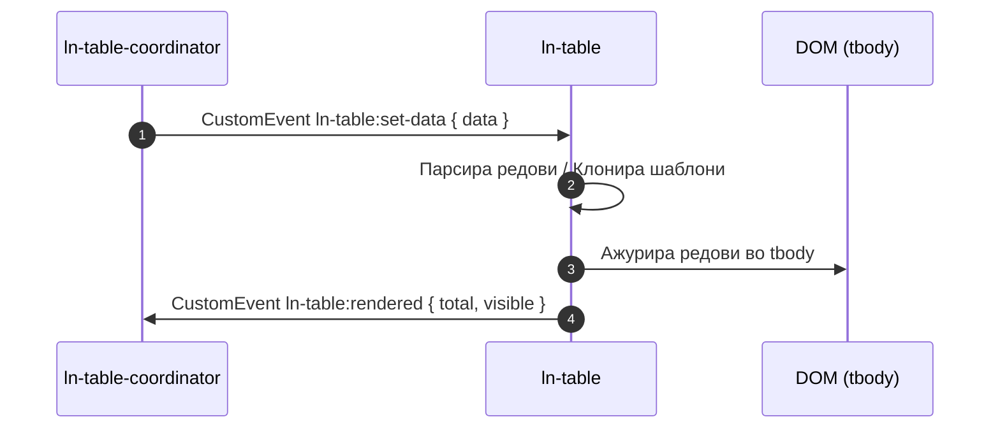

# 📊 ln-table

> **Класификација:** 🟢 Едноставна компонента / Презентер (Layer 1)

---

## 1. Заднинско дејство и одговорност
- **Краток опис:** `ln-table` е компонента за табеларно прикажување и управување со DOM редови која поддржува два начини на работа: Server-Rendered (SSR) режим и Data-Driven режим со виртуелен скрол и лизгачки прозорец (sliding window cache).
- **Ортогоналност (Што компонентата НЕ прави):**
  - НЕ пребарува надворешни влезни полиња во DOM (тоа го прави `ln-table-coordinator`).
  - НЕ управува со визуелни класи на надворешни копчиња за филтрирање (`.ln-filter-active`) (тоа го прави `ln-table-coordinator`).
  - НЕ извршува директни мрежни повици (тоа го прави `ln-api-connector` / `ln-data-coordinator`).

---

## 2. Минимален HTML Маркап и Варијанти на Употреба

### 1. SSR / Markup Mode
```html
<section data-ln-table="employees" id="employees-table">
  <table>
    <thead>
      <tr>
        <th>
          Име
          <ul data-ln-sort="employees-table" data-ln-sort-state="none">
            <li><button type="button" data-ln-sort-dir="asc" aria-label="Сортирај растечки"><svg class="ln-icon" aria-hidden="true"><use href="#ln-icon-arrows-sort"></use></svg></button></li>
            <li><button type="button" data-ln-sort-dir="desc" aria-label="Сортирај опаѓачки"><svg class="ln-icon" aria-hidden="true"><use href="#ln-icon-arrow-up"></use></svg></button></li>
            <li><button type="button" data-ln-sort-dir="none" aria-label="Отстрани сортирање"><svg class="ln-icon" aria-hidden="true"><use href="#ln-icon-arrow-down"></use></svg></button></li>
          </ul>
        </th>
        <th>Плата</th>
      </tr>
    </thead>
    <tbody>
      <tr>
        <td>Далибор Сојиќ</td>
        <td data-ln-value="120000">120,000 ден.</td>
      </tr>
    </tbody>
  </table>
</section>
```

### 2. Data-Driven Mode
```html
<section data-ln-table="products" data-ln-table-source="products" id="products-table">
  <table>
    <thead>
      <tr>
        <th data-ln-table-col="name">Назив</th>
        <th data-ln-table-col="price">Цена</th>
      </tr>
    </thead>
    <tbody data-ln-table-body></tbody>
  </table>

  <template data-ln-template="products-row">
    <tr data-ln-table-row>
      <td>{{ name }}</td>
      <td>{{ price }}</td>
    </tr>
  </template>
</section>
```

---

## 3. Декларативен API Договор (Атрибути и Настани)

### Атрибути
| Атрибут | Елемент | Опис |
| :--- | :--- | :--- |
| `data-ln-table` | Коренски контејнер | Идентификатор на компонентата (бара уникатен `id`). |
| `data-ln-table-source` | Коренски контејнер | Индикатор за Data-Driven режим. |
| `data-ln-table-selectable` | Коренски контејнер | Овозможува селектирање редови со чекбокси. |
| `data-ln-table-window="N"` | Коренски контејнер | Опционален sliding-window виртуелен скрол. |

### Настани (Events API)

#### Консумирани командни настани
| Настан | Детали (`detail`) | Опис |
| :--- | :--- | :--- |
| `ln-table:set-search` | `{ query }` | Го поставува пребарувачкиот поим. |
| `ln-table:set-filter` | `{ key, values }` | Поставува колониски филтер. |
| `ln-table:set-data` | `{ data, total, filtered }` | Вбризгува податоци во табелата. |
| `ln-table:set-loading` | `{ loading: true\|false }` | Ја тогли loading состојбата `.ln-table--loading`. |
| `ln-table:request-clear-filters` | `{}` | Го ресетира внатрешниот пребарувач и филтри. |

#### Диспачирани известителни настани
| Настан | Детали (`detail`) | Опис |
| :--- | :--- | :--- |
| `ln-table:ready` | `{ total }` | Се диспачира по иницијалното парсирање на редовите. |
| `ln-table:rendered` | `{ table, total, visible }` | Се диспачира по секое рендерирање на редовите. |
| `ln-table:filter` | `{ term, matched, total }` | Се диспачира при филтрирање. |
| `ln-table:row-click` | `{ table, id, record }` | Се диспачира при клик на ред. |
| `ln-table:select` | `{ table, selectedIds, count }` | Се диспачира при селекција на редови. |

---

## 4. CSS Стилизирање и Поведенски Концепт
- **Виртуелен скрол:** Користи спејсер редови `<tr class="ln-table__spacer">` за одржување на висината на скролот при прикажување големи множества на податоци (>200 редови).
- **Фиксирани ширини на колони:** При иницијализација се додава `<colgroup>` елемент за заклучување на ширината на колоните при динамичко менување на редовите.

---

## 5. Пристапност (ARIA) и Чести Грешки
- **Тастатурна навигација:** Поддржува `ArrowUp`, `ArrowDown`, `Home`, `End`, `Enter` и `Space` (за селекција) кога фокусот е внатре во редовите од `<tbody>`.
- **Анти-патерни:**
  - Не користете `<input type="checkbox">` надвор од стандардниот `data-ln-table-row-select` патерн.
  - Не менувајте ја содржината на `<tbody>` со директен innerHTML однадвор.

---

## 6. Дијаграм на Текот и Животен Циклус


```mermaid
sequenceDiagram
    autonumber
    participant Coord as ln-table-coordinator
    participant Table as ln-table
    participant Dom as DOM (tbody)

    Coord->>Table: CustomEvent ln-table:set-data { data }
    Table->>Table: Парсира редови / Клонира шаблони
    Table->>Dom: Ажурира редови во tbody
    Table->>Coord: CustomEvent ln-table:rendered { total, visible }
```

---

## 7. Поврзани Компоненти
- [`ln-table-coordinator`](./ln-table-coordinator.md) — Координатор за надворешни UI контроли.
- [`ln-data-coordinator`](./ln-data-coordinator.md) — Координатор за локални и remote податоци.
- Изворен код: [`../../js/ln-table/src/ln-table.js`](../../js/ln-table/src/ln-table.js)
