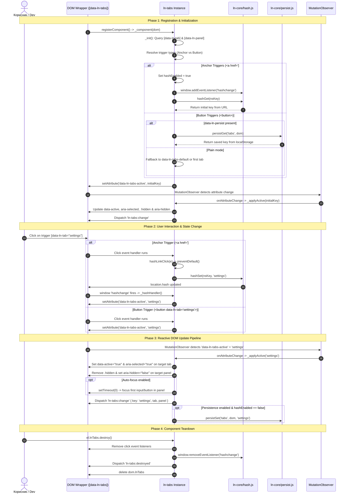

# 📂 ln-tabs

> **Класификација:** 🟢 Едноставна компонента / UI Примитива (Layer 1 - State Manager)  
> **Изворен код:** [`js/ln-tabs/src/ln-tabs.js`](../../js/ln-tabs/src/ln-tabs.js)

---

## 1. Заднинско дејство и одговорност

- **Краток опис:**
  `ln-tabs` е лесна, декларативна UI примитива (180 линии во JS) за менаџирање на N-насочна ексклузивна селекција на контекстуални панели во рамките на еден контејнер (`[data-ln-tabs]`). Нејзина основна задача е да управува со активниот клуч на табот во DOM-от, да синхронизира URL хешови за длабинско линкување (deep-linking), независно да поддржува `localStorage` перзистенција и реактивно да рефлектира ARIA пристапност.

- **Единствен извор на вистината (Single Source of Truth):**
  Договорот е апсолутен: **активниот клуч на табот живее во `data-ln-tabs-active="key"` на обвивачот (`[data-ln-tabs]`), кој претставува единствен извор на вистината.** Клик настаните, промените на URL хешот (`hashchange`), реставрацијата од `localStorage` и сите надворешни програмски промени се сливаат во еден `setAttribute('data-ln-tabs-active', key)` повик врз обвивачот. Стандардниот `MutationObserver` callback ја извршува целата пипелајн промена преку `_applyActive(key)`. Не постои втор паралелен пат.

- **Две оперативни моти во зависност од типот на тригер (Anchor vs Button):**
  Модот на работа НЕ се одредува со посебен атрибут на обвивачот, туку со **типот на елементите тригери**:
  1. **Anchor тригери (`<a href="#nsKey:key">`) → URL Hash Sync мод**:
     Се користи кога тригерите се `<a>` со `#` фрагменти. Овозможува споделливи (shareable), bookmarkable URL-а што се свесни за Back/Forward копчињата на прелистувачот. Хеш просторот се дефинира преку `id` или `data-ln-tabs-key` на обвивачот. Хеш кодекот се раководи преку соодветниот модул [`js/ln-core/hash.js`](../../js/ln-core/hash.js).
  2. **Button тригери (`<button>`) → localStorage Persist мод**:
     Се користи за стандардни копчиња во UI. Не го допира URL-то. Доколку се постави атрибутот `data-ln-persist`, активниот таб се зачувува и реставрира од `localStorage` преку модулот [`js/ln-core/persist.js`](../../js/ln-core/persist.js).

- **Зашто `ln-tabs` НЕ е изградена врз `ln-toggle` (Архитектонска разлика):**
  - **Двојна алфабета на состојби (Binary vs N-way):** `ln-toggle` оперира со затворен бинарен сет `{open, close}` за disclosure елементи преку `aria-expanded`. `ln-tabs` оперира со отворен N-насочен сет на клучеви дефинирани во маркапот (`data-ln-tab="key"` / `data-ln-panel="key"`), управувајќи со `aria-selected` на тригерите и `aria-hidden` на панелите.
  - **Координација и перзистенција:** Принудувањето на табови во N toggles би барало надворешен координатор за затворање на N-1 сиблинзи и би довело до судир на хеш и `localStorage` просторите.
  - **Ортогоналност:** `ln-tabs` е специјализирана примитива со нула визуелни стилови, овозможувајќи му на CSS-от целосна контрола над распоредот.

---

## 2. Минимален HTML Маркап и Варијанти на Употреба

### Каноничен (Основан) HTML Маркап (`<button>` тригери)

```html
<section data-ln-tabs data-ln-tabs-default="overview">
    <!-- Навигациска листа со тригери -->
    <nav>
        <button type="button" data-ln-tab="overview">Преглед</button>
        <button type="button" data-ln-tab="details">Детали</button>
        <button type="button" data-ln-tab="settings">Поставки</button>
    </nav>

    <!-- Панели со содржина -->
    <section data-ln-panel="overview">
        <h4>Преглед</h4>
        <p>Содржина за преглед на системот.</p>
    </section>

    <section data-ln-panel="details" class="hidden">
        <h4>Детали</h4>
        <p>Детални спецификации и технички податоци.</p>
    </section>

    <section data-ln-panel="settings" class="hidden">
        <h4>Поставки</h4>
        <p>Конфигурациски опции.</p>
    </section>
</section>
```

### Варијанти на Употреба

#### 1. URL Hash-Deep-Linkable Табови (`<a>` тригери)
Овозможува синхронизација со URL хешот за длабоки врски, споделување и Back/Forward навигација во прелистувачот. Обвивачот мора да има `id` или `data-ln-tabs-key` за хеш просторот:

```html
<section id="user-tabs" data-ln-tabs data-ln-tabs-default="info">
    <nav>
        <a href="#user-tabs:info" data-ln-tab>Информации</a>
        <a href="#user-tabs:settings" data-ln-tab>Поставки</a>
        <a href="#user-tabs:history" data-ln-tab>Историја</a>
    </nav>

    <section data-ln-panel="info">
        <h4>Информации</h4>
        <p>URL хеш: `#user-tabs:info`</p>
    </section>

    <section data-ln-panel="settings" class="hidden">
        <h4>Поставки</h4>
        <p>URL хеш: `#user-tabs:settings`</p>
    </section>

    <section data-ln-panel="history" class="hidden">
        <h4>Историја</h4>
        <p>URL хеш: `#user-tabs:history`</p>
    </section>
</section>
```

#### 2. Перзистирани Табови во `localStorage` (`data-ln-persist`)
За зачувување на активниот таб помеѓу пречитувања на страницата без менување на URL-то, користете `<button>` тригери со `data-ln-persist`:

```html
<section data-ln-tabs data-ln-persist="settings-tabs" data-ln-tabs-default="general">
    <nav>
        <button type="button" data-ln-tab="general">Општо</button>
        <button type="button" data-ln-tab="security">Безбедност</button>
        <button type="button" data-ln-tab="notifications">Известувања</button>
    </nav>

    <section data-ln-panel="general">
        <h4>Општи поставки</h4>
    </section>

    <section data-ln-panel="security" class="hidden">
        <h4>Безбедност</h4>
    </section>

    <section data-ln-panel="notifications" class="hidden">
        <h4>Известувања</h4>
    </section>
</section>
```

#### 3. Повеќе Независни Табсетови на Иста Страница (Multi-Namespace Hash Sync)
Повеќе `ln-tabs` инстанци со сопствени хеш простори соживуваат чисто во ист URL хеш (на пр. `#user-tabs:settings&project-tabs:members`). Благодарение на сочувувањето на туѓи хеш сегменти во [`js/ln-core/hash.js`](../../js/ln-core/hash.js), менувањето на таб во една инстанца не го брише хешот на друга инстанца или модал.

```html
<!-- Прва хеш секција -->
<section id="user-tabs" data-ln-tabs data-ln-tabs-default="info">
    <nav>
        <a href="#user-tabs:info" data-ln-tab>Корисник Инфо</a>
        <a href="#user-tabs:settings" data-ln-tab>Корисник Поставки</a>
    </nav>
    <section data-ln-panel="info">...</section>
    <section data-ln-panel="settings" class="hidden">...</section>
</section>

<!-- Втора хеш секција -->
<section id="project-tabs" data-ln-tabs data-ln-tabs-default="overview">
    <nav>
        <a href="#project-tabs:overview" data-ln-tab>Проект Преглед</a>
        <a href="#project-tabs:members" data-ln-tab>Проект Членови</a>
    </nav>
    <section data-ln-panel="overview">...</section>
    <section data-ln-panel="members" class="hidden">...</section>
</section>
```

---

## 3. Декларативен API Договор (Атрибути и Настани)

### HTML Атрибути

| Атрибут | Елемент | Тип | Опис |
|---|---|---|---|
| `data-ln-tabs` | Обвивач | Иницијализатор | Ја регистрира инстанцата на `ln-tabs`. Вредноста не се користи. |
| `data-ln-tabs-active` | Обвивач | Состојба | Активен клуч на табот. **Се запишува од компонентата**, а `MutationObserver` го следи за реактивни промени. |
| `data-ln-tabs-default="key"` | Обвивач | Конфигурација | Почетен клуч кога нема хеш или сочувана вредност. Доколку е изоставен, се зема клучот на првиот тригер. |
| `data-ln-tabs-focus="false"` | Обвивач | Конфигурација | Исклучува автоматско фокусирање на првиот фокусабилен елемент во активниот панел. По подразбирање е овозможено (`true`). |
| `data-ln-tabs-key="name"` | Обвивач | Конфигурација | Изречен хеш простор за anchor тригери доколку `id` не е соодветен. |
| `id="name"` | Обвивач | Стандард / Хеш | Служи како хеш простор за anchor тригери доколку `data-ln-tabs-key` е изоставен. |
| `data-ln-tab="key"` | Тригер (`<button>` / `<a>`) | Декларација | Го означува елементот како тригер. Вредноста е клучот (нормализиран со мали букви). За `<a>`, доколку вредноста е празна, клучот се парсира од `href`. |
| `data-ln-panel="key"` | Панел | Декларација | Го означува панелот со соодветниот клуч што се совпаѓа со `data-ln-tab`. |
| `data-ln-persist` / `data-ln-persist="key"` | Обвивач | Перзистенција | Вклучува `localStorage` за button тригери. Боолеан формата користи `id`, а изречната формата користи сопствен клуч. Не влијае врз anchor тригери. |

### DOM Настани (Events)

Сите настани меурат (`bubbles: true`) и се емитуваат директно од обвивачот (`[data-ln-tabs]`).

| Настан | Cancelable | `detail` структура | Кога се емитува |
|---|---|---|---|
| **`ln-tabs:change`** | Не | `{ key: string, tab: HTMLElement, panel: HTMLElement }` | Одосно откако панелот ќе се прикаже, ARIA атрибутите ќе се ажурираат, фокусот ќе се постави и `localStorage` ќе се сочува. |
| **`ln-tabs:destroyed`** | Не | `{ target: HTMLElement }` | Откако ќе се повика `destroy()`, ќе се отстранат listener-ите и ќе се избрише инстанцата. |

### Програмски (JS) Договор

`ln-tabs` нема методи за директна промена на состојбата како `activateTab()`. Напротив, промената се врши декларативно преку манипулација со DOM атрибутот:

```javascript
// Канонична промена на активен таб
const tabsEl = document.getElementById('user-tabs');
tabsEl.setAttribute('data-ln-tabs-active', 'settings');

// Читање на моментално активниот клуч
const activeKey = tabsEl.getAttribute('data-ln-tabs-active');

// Уништување на инстанцата (cleanup)
tabsEl.lnTabs.destroy();
```

---

## 4. CSS Стилизирање и Поведенски Концепт

`ln-tabs` во JS управува исклучиво со состојбите (`data-active` на тригерите и класата `.hidden` на панелите). Сите визуелни стилови (долна линија, бои, padding, премини) се одвоени во CSS / SCSS.

### SCSS Спецификација (`scss/components/_tabs.scss`)

```scss
@use '../config/mixins' as *;

[data-ln-tabs] nav {
    @include tabs-nav;
}

[data-ln-tabs] [data-ln-tab] {
    @include tabs-tab;
}

[data-ln-tabs] [data-ln-panel] {
    @include tabs-panel;
}

[data-ln-tabs] [data-ln-panel].hidden {
    @include hidden;
}
```

### SCSS Миксини (`scss/config/mixins/_tabs.scss`)

```scss
@mixin tabs-nav {
    @include flex;
    @include border-b;

    [data-ln-tab][data-active] {
        color: var(--color-accent);
        border-bottom-color: var(--color-accent);
        background: none;
    }

    [data-ln-tab][disabled] {
        --color-fg: var(--fg-subtle);
        color: var(--color-fg);
        @include cursor-not-allowed;
        @include opacity-50;

        &:hover {
            background: none;
            border-bottom-color: transparent;
        }
    }
}

@mixin tabs-tab {
    --color-fg: var(--fg-muted);
    all: unset;
    box-sizing: border-box;
    --padding-y: var(--size-sm);
    --padding-x: var(--size-md);
    padding: var(--padding-y) var(--padding-x);
    @include text-sm;
    @include font-medium;
    color: var(--color-fg);
    @include cursor-pointer;
    @include transition;
    border-bottom: 2px solid transparent;
    margin-bottom: -1px;

    &:hover {
        color: var(--color-accent);
        background-color: color-mix(in srgb, var(--color-accent) 5%, transparent);
        border-bottom-color: color-mix(in srgb, var(--color-accent) 30%, transparent);
    }
}

@mixin tabs-panel {
    --padding-y: var(--size-lg);
    --padding-x: var(--size-lg);
    padding: var(--padding-y) var(--padding-x);
}
```

---

## 5. Пристапност (ARIA) и Чести Грешки

### 5.1. ARIA и Тастатурна Навигација

При секоја промена на активниот таб во `_applyActive(key)`, компонентата ги врши следните ARIA синхронизации:

1. **Тригери (`[data-ln-tab]`)**:
   - Активен тригер: Добива `data-active` и `aria-selected="true"`.
   - Неактивни тригери: Го губат `data-active` и добиваат `aria-selected="false"`.
2. **Панели (`[data-ln-panel]`)**:
   - Активен панел: Се отстранува класата `.hidden` и се поставува `aria-hidden="false"`.
   - Неактивни панели: Се додава класата `.hidden` и се поставува `aria-hidden="true"`.
3. **Автоматско фокусирање (Auto-Focus Management)**:
   - Доколку `data-ln-tabs-focus` не е експлицитно поставено на `"false"`, компонентата преку `setTimeout(..., 0)` и `{ preventScroll: true }` го фокусира првиот фокусабилен елемент (`input, button, select, textarea, [tabindex]`) внатре во новоотворениот панел.

### 5.2. Чести Грешки (Anti-Patterns)

> [!CAUTION]
> **1. Копчиња тригери во форма без `type="button"`**
> По подразбирање, прелистувачот го третира `<button>` во форма како `type="submit"`. Кликот врз табот ќе ја испрати формата пред да се изврши промената на табот. **Секој тригер во форма мора да има `type="button"`**.

> [!WARNING]
> **2. Заборавање на `class="hidden"` на неактивните панели во почетниот HTML**
> Додека JS не се иницијализира, сите панели без класа `.hidden` ќе бидат видливи одеднаш, предизвикувајќи Layout Flash (FOUC). Неактивните панели мора однапред да имаат `class="hidden"`.

> [!IMPORTANT]
> **3. Мешање на Hash Sync и `data-ln-persist`**
> Типот на тригерот го избира модот. Anchor тригерите (`<a href="#...">`) вклучуваат Hash Sync и ја оневозможуваат `localStorage` перзистенцијата за да се спречи конфликт меѓу два извори на вистина.

> [!NOTE]
> **4. Динамичко додавање на табови по иницијализација**
> Клучевите за `mapTabs` и `mapPanels` се кешираат при `_init`. Ако динамично додадете нови табови во DOM-от, мора да повикате `el.lnTabs.destroy()` и повторно да ја иницијализирате инстанцата.

> [!WARNING]
> **5. Очекување на Arrow навигација од тастатура**
> `ln-tabs` го поддржува стандардното Tab/Enter/Space однесување на прелистувачот. Arrow Left/Right навигацијата е ARIA додаток и не е вградена во baseline однесувањето.

> [!CAUTION]
> **6. Поставување на `data-ln-tabs` на `<main>` елементот**
> HTML спецификацијата дозволува само еден `<main>` елемент по страница. Користете `<section>`, `<div>`, `<article>` или `<aside>`.

---

## 6. Дијаграм на Текот и Животен Циклус

Следниот Mermaid дијаграм го прикажува целосниот животен циклус на `ln-tabs`: иницијализацијата, изборот на мод, клик-настаните, хеш-синхронизацијата, `MutationObserver` реактивноста и финалната ARIA/DOM примена.



---

## 7. Поврзани Компоненти

- **Поврзани документи за архитектура:**
  - [`./ln-persist.md`](./ln-persist.md) — Документација за перзистенција на состојби во `localStorage`.
