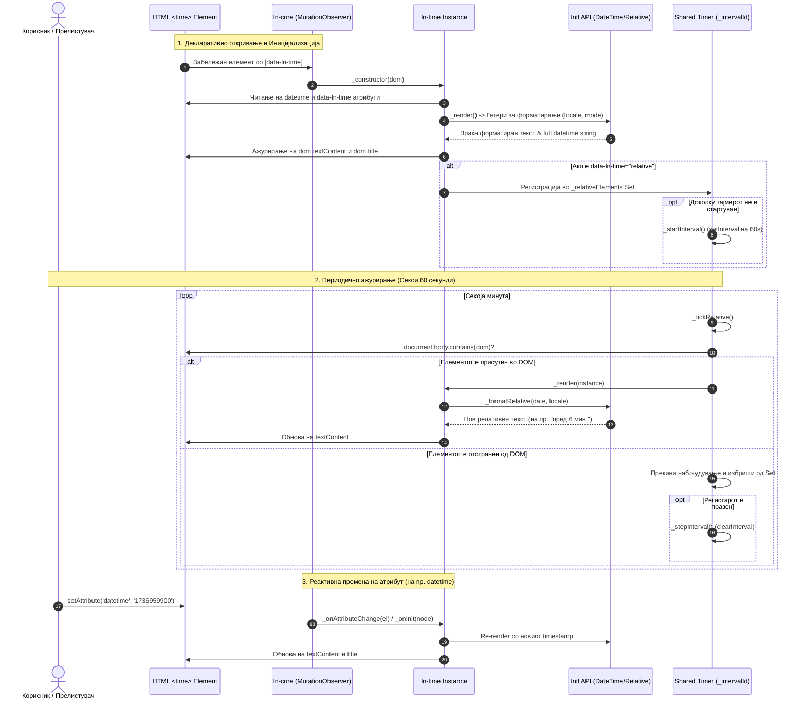

# 🕒 ln-time

> **Класификација:** 🟢 Едноставна компонента (Simple Component)

---

## 1. Заднинско дејство и одговорност

`ln-time` е овозможувач за форматирање и релативизација на временски ознаки (timezone-aware timestamp formatter) за нативни HTML `<time>` елементи. Имплементирана во [`js/ln-time/src/ln-time.js`](../../js/ln-time/src/ln-time.js), нејзината примарна одговорност е да ги трансформира статичките Unix timestamp вредности во динамички локализирани датуми и времиња, применувајќи ги нативните API функционалности на прелистувачот (`Intl.DateTimeFormat` и `Intl.RelativeTimeFormat`) со поддршка за автоматско ажурирање во реално време за релативни прикази.

Основната одговорност на компонентата опфаќа:

* **Прогресивно подобрување (Progressive Enhancement):** Серверските шаблони (на пр. Laravel Blade) можат да рендерираат резервен статички текст во `<time>` елементот. Доколку JavaScript е исклучен или се вчита со доцнење, корисникот ја гледа оригиналната текстуална вредност; кога `ln-time` се иницијализира, таа го пресметува и заменува текстот со локализирана вредност.
* **Нативни прелистувачки API без надворешни библиотечни зависности:** Целосно се потпира врз стандардните `Intl.DateTimeFormat` и `Intl.RelativeTimeFormat` JavaScript енџини. Изоставени се тешки надворешни библиотеки (како Moment.js или Day.js), обезбедувајќи минимален бизнис-отисок и брзи перформанси.
* **Кеширање на форматиери (Formatter Cache):** За оптимизација на меморијата и извршувањето, сите креирани инстанци на `Intl.DateTimeFormat` и `Intl.RelativeTimeFormat` се сочуваат во внатрешни објекти-кешови (`_formatters` и `_relativeFormatters`) врз основа на комбинацијата од локалитет и опции.
* **Споделен глобален тајмер за релативно ажурирање (Shared Interval Loop):** За сите елементи со режим `data-ln-time="relative"`, компонентата одржува единствен глобален `setInterval` тајмер кој итерира на секои 60 секунди (60.000 ms). Доколку елементот се отстрани од DOM (не е содржан во `document.body`), тој автоматски се отстранува од регистарот (`_relativeElements`), а доколку регистарот се испразни, тајмерот автоматски се запира за да се спречат протекувања на меморија (memory leaks).
* **Автоматски `title` атрибут за дополнителни информации:** За сите режими освен `full` (`relative`, `short`, `date`, `time`), компонентата автоматски го поставува атрибутот `dom.title` на целосниот форматиран датум и час (на пр. `"15 јануари 2025 г. во 14:30"`). При преминување со глувчето (hover), корисникот ја гледа точната полноправна временска ознака.
* **Флексибилна детерминација на локалитетот:** Локалитетот се одредува редоследно преку: `data-ln-time-locale` атрибутот на елементот -> `document.documentElement.lang` (`<html lang="...">`) -> стандардниот локалитет на прелистувачот (`undefined`).
* **Реактивна синхронизација на атрибути:** Преку регистрираните `extraAttributes: ['datetime']` и мутациски куки во `ln-core`, промените на `datetime` или `data-ln-time` динамички го преформатираат DOM текстот во живо.

> [!IMPORTANT]
> **Што `ln-time` НЕ прави (Orthogonality Doctrine):**
> * **НЕ манипулира со формулари и формални инпути:** Работи исклучиво врз семантички HTML `<time>` елементи. За инпути со датуми се користи [`ln-date`](./ln-date.md).
> * **НЕ управува со одбројувачи (countdowns) или штопери во реално време:** Форматира и релативизира фиксни временски ознаки; не нуди контролни копчиња за старт/стоп или милисекундно одбројување.
> * **НЕ врши рачна конверзија на временски зони со offset таблици:** Целосно му се препушта на енџинот на прелистувачот и локалните поставки на корисничкиот уред.
> * **НЕ перзистира податоци во LocalStorage / SessionStorage:** Не чува состојба и нема бизнис логика.
> * **НЕ халуцинира нестандардни атрибути:** Работи исклучиво преку оние дефинирани во нејзиниот API договор.

---

## 2. Минимален HTML Маркап и Варијанти на Употреба

### Базен HTML Маркап

Стандардна статичка или релативна временска ознака се дефинира со поставување на Unix timestamp во секунди во атрибутот `datetime`.

```html
<!-- Базен приказ (режим "short" по подразбирање) -->
<time data-ln-time datetime="1736952600">15 јан</time>
```

> [!NOTE]
> **Важна напомена за Unix timestamp вредностите:**
> `ln-time` бара Unix timestamp во **секунди** (10 цифри, на пр. `1736952600`), а НЕ во милисекунди (13 цифри). Ако нативниот JS `Date.now()` или серверот враќа милисекунди, соодветно поделете ја вредноста со `1000` пред генерирање на маркапот.

---

### Варијанта 1: Динамички Релативен Приказ (`data-ln-time="relative"`)

Се користи за новости, коментари, нотификации или логови каде што времето се прикажува релативно во однос на тековниот момент (на пр. "пред 5 мин.", "пред 2 часа"). Се ажурира во живо на секои 60 секунди.

```html
<time data-ln-time="relative" datetime="1736952600">пред малку</time>
```

#### Прагови и единици на релативно форматирање (Relative Thresholds):

| Изминато време | Единица (`Intl.RelativeTimeFormat`) | Излезен пример (mk) | Излезен пример (en) |
| :--- | :--- | :--- | :--- |
| `< 10 секунди` | `second` (вредност `0`) | `"пред 0 сек."` | `"now"` |
| `< 60 секунди` | `second` | `"пред 45 сек."` | `"45 sec. ago"` |
| `< 60 минути` | `minute` | `"пред 5 мин."` | `"5 min. ago"` |
| `< 24 часа` | `hour` | `"пред 3 ч."` | `"3 hr. ago"` |
| `< 7 дена` | `day` | `"пред 2 дена"` | `"2 days ago"` |
| `< 30 дена` | `week` | `"пред 2 нед."` | `"2 wk. ago"` |
| `>= 30 дена` | — *(Автоматски се префрла на режим `short`)* | `"15 јан"` / `"15 јан 2024"` | `"Jan 15"` / `"Jan 15, 2024"` |

---

### Варијанта 2: Статички Формати (`short`, `full`, `date`, `time`)

```html
<!-- Режим short: "15 јан" (ако е во тековната година) или "15 јан 2024" (ако е во друга година) -->
<time data-ln-time="short" datetime="1736952600">15 јан</time>

<!-- Режим full: "15 јануари 2025 г. во 14:30" -->
<time data-ln-time="full" datetime="1736952600">15 јануари 2025 14:30</time>

<!-- Режим date: "15.1.2025" -->
<time data-ln-time="date" datetime="1736952600">15.1.2025</time>

<!-- Режим time: "14:30" -->
<time data-ln-time="time" datetime="1736952600">14:30</time>
```

---

### Варијанта 3: Експлицитен Локалитет (`data-ln-time-locale`)

Овозможува преклопување на системскиот/глобалниот јазик на страницата за специфичен елемент.

```html
<!-- Принудно форматирање на германски јазик (de) -->
<time data-ln-time="full" datetime="1736952600" data-ln-time-locale="de">
    15. Januar 2025 um 14:30
</time>

<!-- Принудно форматирање на англиски јазик (en-US) -->
<time data-ln-time="relative" datetime="1736952600" data-ln-time-locale="en-US">
    5 min. ago
</time>
```

---

## 3. Декларативен API Договор (Атрибути и Настани)

### Декларативни HTML Атрибути

| Атрибут | Елементи | Тип | Стандардна вредност | Опис |
| :--- | :--- | :--- | :--- | :--- |
| `data-ln-time` | `<time>` | `String` | `"short"` | Го одредува режимот на форматирање: `"relative"`, `"short"`, `"full"`, `"date"`, `"time"`. Доколку вредноста е празна или непозната, се применува `"short"`. |
| `datetime` | `<time>` | `String` / `Number` | — *(Задолжително)* | Unix timestamp во **секунди**. Ако е невалиден број или отсуствува, компонентата не го модифицира описниот текст. |
| `data-ln-time-locale` | `<time>` | `String` | `undefined` | BCP 47 јазична ознака (на пр. `"mk"`, `"en-US"`, `"de"`). Доколку е изоставен, се користи `document.documentElement.lang` или прелистувачкиот локалитет. |

---

### Програмски JS Интерфејс (`element.lnTime`)

По иницијализацијата, инстанцата на компонентата е достапна директно преку својството `.lnTime` на DOM елементот:

```javascript
const timeEl = document.querySelector('time[data-ln-time]');

// Прилап до инстанцата
const instance = timeEl.lnTime;

// Принудно ре-рендерирање на текстот и title атрибутот
instance.render();

// Уништување на инстанцата и отстранување од регистарот за авто-ажурирање
instance.destroy();
```

| Својство / Метод | Тип | Опис |
| :--- | :--- | :--- |
| `instance.dom` | `HTMLElement` | Референца до соодветниот `<time>` DOM елемент. |
| `instance.render()` | `Function` | Го препресметува форматираниот текст и го обновува `textContent` и `title` атрибутот. |
| `instance.destroy()` | `Function` | Го отстранува елементот од глобалниот базен за релативно ажурирање, го гасне тајмерот ако е празен и го брише `.lnTime` својството. |

---

### Настани (Events API)

`ln-time` е чиста презентациска компонента која **не диспачира сопствени прилагодени DOM настани** (CustomEvents) со цел максимални перформанси. Набљудувањето и синхронизацијата со промените на DOM атрибутите (`datetime`, `data-ln-time`) се одвиваат автоматозирано преку централниот `MutationObserver` во `ln-core`.

---

## 4. CSS Стилизирање и Поведенски Концепт

### Визуелно Стилизирање (SCSS / CSS)

Компонентата `ln-time` не бара задолжителни вградени CSS класи и користи нативни HTML `<time>` елементи. Ипак, за подобра читливост и конзистентност во апликацискиот дизајн систем, се препорачува стандардно стилизирање:

```scss
// Опционално стилизирање за соодветен визуелен приказ
time[data-ln-time] {
    font-variant-numeric: tabular-nums; // Спречува промена на ширината при дигитални ажурирања
    display: inline-block;

    &[data-ln-time="relative"] {
        cursor: help; // Индицира дека постои детална информација на title hover
    }
}
```

---

### Поведенски Концепти и Оптимизации

1. **Единствен Глобален Тајмер (Single Shared Interval Scheduler):**
   Наместо да се започнува `setInterval` за секој релативен елемент поединечно (што може брзо да ослободи стотици тајмери при листи или табели), сите активни релативни инстанци се регистрираат во единствен JavaScript `Set` (`_relativeElements`). Еден централен тајмер ги ажурира сите релативни елементи во една итерација на секои 60 секунди.

2. **Автоматско чистење на отстранети елементи (Garbage Collection & Memory Safety):**
   При секој "отчук" на тајмерот (`_tickRelative`), компонентата проверува дали елементот сè уште постои во активниот DOM (`document.body.contains(instance.dom)`). Доколку елементот бил отстранет од DOM (на пр. преку AJAX, SPA рутирање или `innerHTML = ''`), тој веднаш се брише од `Set` регистарот. Кога регистарот ќе стане празен, тајмерот автоматски се поништува со `clearInterval`.

3. **Интелигентно автоматизирано поставување на `title`:**
   За сите режими освен `full`, компонентата во позадина генерира целосен описен датум со опциите `{ dateStyle: 'long', timeStyle: 'short' }` и го доделува на атрибутот `title`. Ова и овозможува на пристапноста да го задржи точниот датум/час независно од тоа колку е скратен видикот (на пр. за `"пред 5 мин."` tooltip-от ќе покаже `"15 јануари 2025 г. во 14:30"`).

---

## 5. Пристапност (ARIA) и Чести Грешки

### ARIA и Семантика

* **Семантичка HTML5 обвивка:** Заднински се користи стандардниот HTML `<time>` елемент кој е нативно поддржан од читачите на екран (Screen Readers) и пребарувачите (SEO crawlers).
* **Семантички машински читлив `datetime`:** Читачите на екран и машините можат да го прочитаат оригиналниот `datetime` атрибут за прецизно утврдување на UTC временскиот печат, додека луѓето го читаат локализираниот текстуален содржина.
* **Нативен Tooltip преку `title`:** Атрибутот `title` овозможува стандардна помошна информација за корисници со глувче или фокус.

---

### Чести Грешки и Анти-патерни (Common Pitfalls)

#### 1. Внесување на вредности во милисекунди наместо во секунди
> [!CAUTION]
> **Грешка:** `datetime="1736952600000"` (13 цифри - JavaScript `Date.now()`).
> **Резултат:** `ln-time` очекува секунди. Доколку внесете милисекунди, датумот ќе се пресмета во далечната иднина (на пр. година 57000+).
> **Исправно:** Внесете секунди: `datetime="1736952600"` или поделете со 1000 во бекендот/JS (`Math.floor(date / 1000)`).

#### 2. Внесување на ISO 8601 стрингови наместо Unix timestamp
> [!WARNING]
> **Грешка:** `datetime="2025-01-15T14:30:00Z"`.
> **Резултат:** `ln-time` прави `Number("2025-01-15T14:30:00Z")` што враќа `NaN`. Компонентата го игнорира форматирањето и во DOM останува исклучиво резервниот серверски текст.
> **Исправно:** Претворете го ISO стрингот во Unix timestamp во секунди пред да го доделите на `datetime`.

#### 3. Празен или отсутен `datetime` атрибут
> [!NOTE]
> Доколку `datetime` атрибутот е празен или отсутен (`datetime=""`), `ln-time` нема да изврши никаква промена врз содржината на елементот.

#### 4. Очекување на 1-секундно ажурирање за релативно време
> [!IMPORTANT]
> За зачувување на батеријата и CPU ресурсите, глобалниот тајмер за `data-ln-time="relative"` се активира на секои **60 секунди** (1 минута), а не на секоја секунда.

---

## 6. Дијаграм на Текот и Животен Циклус

Следниот Mermaid дијаграм го илустрира целосниот животен циклус на компонентата `ln-time`: иницијализација од DOM, форматирање преку `Intl`, регистрација во споделениот тајмер и автоматско ре-рендерирање при измени или одминување на времето.



---

## 7. Поврзани Компоненти

* [`ln-date`](./ln-date.md) — Овозможувач за форматирање и внесување датуми кај нативни HTML `<input type="date">` полиња во форми.
* [`ln-number`](./ln-number.md) — Овозможувач за форматирање на броеви, валути и проценти според `Intl.NumberFormat`.
* [`ln-table`](./ln-table.md) — Датотечна и податочна табела која често инкорпорира `ln-time` за прикажување на релативно време на модификација на записи.
* [`ln-toast`](./ln-toast.md) — Систем за известувања кој користи временски ознаки за нотификации.
