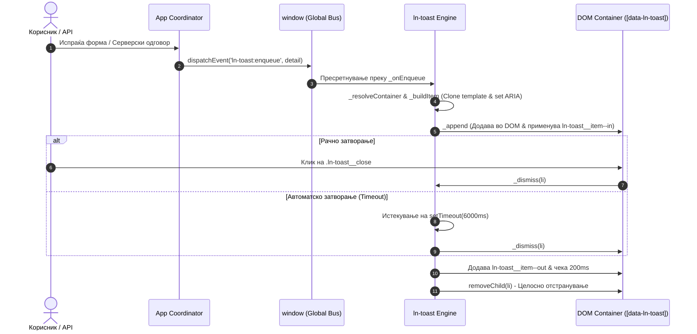
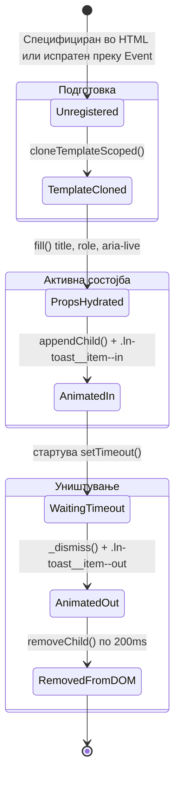

# 🔔 ln-toast

> **Класификација:** 🟢 Едноставна компонента / Сервис (Simple Component / Viewport Service)

---

## 1. Декларативна & SSR Употреба, HTML Маркап и Шаблон (Template)

За разлика од сложените JS компоненти, `ln-toast` започнува со едноставна и чиста HTML структура. Најпрво ќе ја разгледаме **декларативната SSR примена** каде што маркапот е директно видлив, а потоа HTML шаблонот од кој динамички се штанпаат нотификациите.

### А. Статичен / SSR Маркап (Server-Side Rendered Flash Messages)

Кога бекендот (Laravel, Rails, ASP.NET и сл.) генерира флеш пораки при вчитување на страницата, нотификациите се запишуваат како обични `<li>` елементи со атрибутот `data-ln-toast-item` внатре во контејнерот `[data-ln-toast]`:

```html
<!-- Глобален контејнер со статични SSR тостерчиња -->
<ul data-ln-toast data-ln-toast-timeout="6000" data-ln-toast-max="5">
    <!-- Успешна SSR нотификација -->
    <li data-ln-toast-item data-type="success" data-title="Зачувано">
        Промените беа успешно зачувани во базата.
    </li>

    <!-- Серверска опомена -->
    <li data-ln-toast-item data-type="warn" data-title="Внимание">
        Вашата претплата истекува за 3 дена.
    </li>
</ul>
```

> **Како функционира хидратацијата:** При стартување, JavaScript моторот ([js/ln-toast/src/ln-toast.js:L145](file:///c:/laragon/www/ln-ashlar/js/ln-toast/src/ln-toast.js#L145)) ги наоѓа овие `[data-ln-toast-item]` елементи, ги чита атрибутите `data-type` и `data-title`, автоматски ги трансформира во целосни визуелни картички со икони и затворач, и го покренува автоматскиот тајмер за нивно исчезнување.

---

### Б. Внатрешен HTML Шаблон на Тостерчето (`template.html`)

За динамички генерираните нотификации, `ln-toast` користи стандарден HTML5 `<template>` елемент со име `ln-toast-item`. Овој шаблон или е дефиниран во самиот HTML документ, или моторот автоматски го внесува во `<body>` ([template.html](file:///c:/laragon/www/ln-ashlar/js/ln-toast/template.html)):

```html
<!-- HTML Шаблон за штанпање картички (data-ln-template="ln-toast-item") -->
<template data-ln-template="ln-toast-item">
    <li class="ln-toast__item">
        <div class="ln-toast__card" data-ln-attr="role:role, aria-live:ariaLive">
            <!-- Лева колона со динамичка SVG икона -->
            <div class="ln-toast__side">
                <svg class="ln-icon" aria-hidden="true">
                    <use href=""></use>
                </svg>
            </div>
            
            <!-- Содржина: наслов, копче за затворање и тело -->
            <div class="ln-toast__content">
                <div class="ln-toast__head">
                    <strong class="ln-toast__title" data-ln-field="title"></strong>
                </div>
                <button type="button" class="ln-toast__close" aria-label="Close">
                    <svg class="ln-icon" aria-hidden="true">
                        <use href="#ln-x"></use>
                    </svg>
                </button>
                <div class="ln-toast__body" data-ln-show="hasBody"></div>
            </div>
        </div>
    </li>
</template>
```

---

### В. Финален Генериран DOM Маркап (Rendered Card Output)

Откако моторот ќе го клонира шаблонот и ќе ги пополни податоците преку `ln-core` функциите `cloneTemplateScoped` и `fill`, во DOM дрвото се добива следната целосна визуелна структура:

```html
<ul data-ln-toast data-ln-toast-timeout="6000" data-ln-toast-max="5">
    <li class="ln-toast__item ln-toast__item--in">
        <div class="ln-toast__card success" role="status" aria-live="polite">
            <div class="ln-toast__side">
                <svg class="ln-icon" aria-hidden="true">
                    <use href="#ln-circle-check"></use>
                </svg>
            </div>
            <div class="ln-toast__content">
                <div class="ln-toast__head">
                    <strong class="ln-toast__title">Зачувано</strong>
                </div>
                <button type="button" class="ln-toast__close" aria-label="Close">
                    <svg class="ln-icon" aria-hidden="true">
                        <use href="#ln-x"></use>
                    </svg>
                </button>
                <div class="ln-toast__body">
                    <p>Промените беа успешно зачувани во базата.</p>
                </div>
            </div>
        </div>
    </li>
</ul>
```

---

## 2. Динамична Апстракција со JavaScript (Window Event Bus)

Откако го видовме конкретниот HTML маркап и шаблонот, преоѓаме кон поапстрактниот слој — **динамично управување преку JavaScript**.

Согласно **Simple Components vs. Coordinators Doctrine** во `ln-ashlar`:
* Компонентите и скриптите во апликацијата **никогаш не повикуваат методи за цртање** ниту директно креираат DOM елементи за нотификации.
* За да се прикаже тостерче, скриптата едноставно емитува асинхрон настан `ln-toast:enqueue` до глобалниот `window` објект.
* `ln-toast` сервисот го слуша овој настан, го користи горенаведениот HTML шаблон, извршува XSS безбедно пополнување и управува со анимациите.

### Примарна JavaScript Апстракција (`window.dispatchEvent`)

```javascript
// Апстрактен повик — без допир со DOM или класи
window.dispatchEvent(new CustomEvent('ln-toast:enqueue', {
    detail: {
        type: 'success', // 'success' | 'error' | 'warn' | 'info'
        title: 'Успешна операција',
        message: 'Податоците се успешно зачувани.'
    }
}));
```

---

### Поврзување во Координациски Сценарија (`ln-form` + `app-coordinator`)

Во реална апликација, проектниот координатор (напр. `app-coordinator.js`) го пресретнува исходот од формата или AJAX мрежниот повик и го испраќа тостерчето:

```javascript
// app-coordinator.js
document.addEventListener('DOMContentLoaded', () => {
    const profileForm = document.getElementById('user-profile-form');

    // Успешно испратена форма -> Тостерче за успех
    profileForm?.addEventListener('ln-form:success', (e) => {
        window.dispatchEvent(new CustomEvent('ln-toast:enqueue', {
            detail: {
                type: 'success',
                title: 'Профилот е ажуриран',
                message: 'Сите промени беа успешно зачувани.'
            }
        }));
    });

    // Грешка при испраќање -> Тостерче за грешка со листа
    profileForm?.addEventListener('ln-form:error', (e) => {
        window.dispatchEvent(new CustomEvent('ln-toast:enqueue', {
            detail: {
                type: 'error',
                title: 'Грешка при валидација',
                message: e.detail?.errors || ['Ве молиме проверете ги внесените податоци.']
            }
        }));
    });
});
```

---

## 3. Минимален HTML Маркап и Варијанти на Употреба

Со цел да се испочитува принципот на **Separation of Concerns**, сите визуелни стилови (аценти, бои, картички, позиционирање) се дефинирани во CSS/SCSS преку соодветните миксини, додека JavaScript логиката реагира исклучиво на `data-ln-toast` атрибутите и глобалните настани.

---

### Варијанта 1: Стандарден сервисен контејнер (Viewport Blueprint)

Потребно е да се дефинира само еден глобален HTML контејнер `<ul>`, најчесто поставен на дното на лејаутот пред `</body>` ознаката.

#### HTML Маркап
```html
<ul data-ln-toast data-ln-toast-timeout="6000" data-ln-toast-max="5"></ul>
```

#### Иницирање преку JavaScript (Window Event)
```javascript
window.dispatchEvent(new CustomEvent('ln-toast:enqueue', {
    detail: {
        type: 'info',
        title: 'Системско известување',
        message: 'Имате нова порака во вашето сандаче.'
    }
}));
```

---

### Варијанта 2: Приказ на мапа од валидациски грешки (Validation Error List)

Кога се пренесуваат повеќе пораки одеднаш (на пример, од серверска валидација на форма), својството `message` прифаќа низа од стрингови, или објектот `data.errors` пренесува мапа од грешки. Картичката автоматски генерира подредена `<ul>` листа со заштита од XSS.

#### Иницирање со низа од пораки
```javascript
window.dispatchEvent(new CustomEvent('ln-toast:enqueue', {
    detail: {
        type: 'error',
        title: 'Неуспешна валидација',
        message: [
            'Е-поштата е задолжително поле.',
            'Лозинката мора да содржи најмалку 8 карактери.',
            'Полето за потврда на условите е задолжително.'
        ]
    }
}));
```

#### Иницирање со серверски `data.errors` објект (напр. Laravel API)
```javascript
window.dispatchEvent(new CustomEvent('ln-toast:enqueue', {
    detail: {
        type: 'error',
        title: 'Валидацијата не успеа',
        data: {
            errors: {
                email: ['Е-поштата веќе постои во системот.'],
                phone: ['Неважечки формат на телефонски број.']
            }
        }
    }
}));
```

---

### Варијанта 3: Глобално чистење на нотификациите (`ln-toast:clear`)

Доколку е потребно сите моментално прикажани нотификации на екранот веднаш да се затворат (на пример, при промена на рута или ресетирање на состојба), се испраќа настанот `ln-toast:clear`.

```javascript
// Затворање на сите toasts во сите контејнери
window.dispatchEvent(new CustomEvent('ln-toast:clear'));

// Затворање на toasts само во специфичен контејнер
window.dispatchEvent(new CustomEvent('ln-toast:clear', {
    detail: { container: '#custom-toast-container' }
}));
```

---

### Варијанта 4: SCSS Стилизација и Архитектура на Миксини

Стилирањето се врши преку наменските SCSS миксини во [scss/config/mixins/_toast.scss](file:///c:/laragon/www/ln-ashlar/scss/config/mixins/_toast.scss) и компонентата во [scss/components/_toast.scss](file:///c:/laragon/www/ln-ashlar/scss/components/_toast.scss).

#### Примарни SCSS Миксини

```scss
/* scss/config/mixins/_toast.scss */

// Контејнер позициониран фиксно на долу-десно од екранот
@mixin toast-container {
    @include fixed;
    @include z-toast; // Висок z-index слој
    list-style: none;
    padding: 0;
    margin: 0;
    pointer-events: none; // Овозможува кликовите да минуваат низ празниот простор
    right: var(--size-lg);
    bottom: var(--size-lg);
    display: flex;
    flex-direction: column-reverse; // Новите нотификации се појавуваат на дното
}

// Поединечен toast елемент со анимациска поддршка
@mixin toast-item {
    list-style: none;
    opacity: 0;
    pointer-events: auto; // Овозможува интеракција со самата картичка
    @include motion-safe {
        transform: translateX(30px);
        transition: all var(--transition-base) var(--easing-standard);
    }
}

// Визуелна флуидна картичка со страничен акцент за боја
@mixin toast-card {
    @include floating-panel;
    @include flex;
    min-width: 320px;
    max-width: 450px;
    @include overflow-hidden;
}
```

---

## 4. Функционални и ARIA Атрибути

Компонентата користи збир од функционални атрибути за конфигурација и автоматски внесува пристапни ARIA својства во согласност со WAI-ARIA стандардите.

| Атрибут | Тип | Задолжително | Опис |
|---|---|---|---|
| `data-ln-toast` | Идентификатор | **Да** | Го означува `<ul>` елементот како глобален сервисен контејнер за toasts. |
| `data-ln-toast-timeout` | Број (ms) | Не (Дефолт: `6000`) | Време во милисекунди пред нотификацијата автоматски да се затвори. Користете `0` за трајни нотификации. |
| `data-ln-toast-max` | Број | Не (Дефолт: `5`) | Максимален број на истовремено прикажани нотификации во стек-от. Постарите нотификации се отстрануваат според FIFO ред. |
| `data-ln-toast-item` | Идентификатор | Не | Се користи кај SSR елементи за хидратација на статичен `<li>` нотификациски елемент. |
| `data-type` | Стринг | Не | Категорија на SSR нотификација: `success`, `error`, `warn`, `info`. |
| `data-title` | Стринг | Не | Наслов за SSR нотификација. |

### Динамички ARIA атрибути (Автоматски поставени од JS моторот)

Во зависност од категоријата (`type`), моторот [ln-toast.js](file:///c:/laragon/www/ln-ashlar/js/ln-toast/src/ln-toast.js#L72-L73) автоматски ги доделува соодветните ARIA улоги за читачите на екран:

| Категорија (`type`) | `role` | `aria-live` | Дефолтен Наслов | Икона |
|---|---|---|---|---|
| `success` | `status` | `polite` | `Success` | `#ln-circle-check` |
| `error` | `alert` | `assertive` | `Error` | `#ln-circle-x` |
| `warn` | `status` | `polite` | `Warning` | `#ln-alert-triangle` |
| `info` | `status` | `polite` | `Information` | `#ln-info-circle` |

---

## 5. Емитувани и Примени Настани (Events API)

`ln-toast` функционира исклучиво преку примање на глобални CustomEvents испратени до `window` објектот.

### Примени Настани (Window Event Listeners)

#### 1. `ln-toast:enqueue`
Додава нова нотификациска картичка во контејнерот.

```javascript
window.dispatchEvent(new CustomEvent('ln-toast:enqueue', {
    detail: {
        type: 'success',           // 'success' | 'error' | 'warn' | 'info'
        title: 'Успешна операција', // Опционален наслов
        message: 'Податоците се зачувани.', // Стринг или Низа од стрингови
        timeout: 4000,             // Опционално преклопување на тајмерот (ms)
        container: '#my-toasts'    // Опционален CSS селектор за контејнер
    }
}));
```

#### 2. `ln-toast:clear`
Ги отстранува сите моментално активни нотификациски картички.

```javascript
window.dispatchEvent(new CustomEvent('ln-toast:clear', {
    detail: {
        container: '#my-toasts' // Опционално: расчистува само одреден контејнер
    }
}));
```

---

## 6. Архитектура на JavaScript Моторот (JS Engine Internal Architecture)

Изворниот код на моторот е сместен во [js/ln-toast/src/ln-toast.js](file:///c:/laragon/www/ln-ashlar/js/ln-toast/src/ln-toast.js). Тој користи IIFE заштитен модул со поддршка за безбедно извршување во DOM средина.

```
┌─────────────────────────────────────────────────────────────────────────┐
│                           window (Global Bus)                           │
└─────────────────────────────────────────────────────────────────────────┘
        │                                             │
        │ Event: 'ln-toast:enqueue'                   │ Event: 'ln-toast:clear'
        ▼                                             ▼
┌──────────────────────────────┐              ┌──────────────────────────┐
│   _onEnqueue(e) Handler      │              │    _onClear(e) Handler   │
└──────────────────────────────┘              └──────────────────────────┘
        │                                             │
        ▼                                             ▼
┌──────────────────────────────┐              ┌──────────────────────────┐
│   _resolveContainer(detail)  │              │  Dismiss all cards from  │
└──────────────────────────────┘              │  matched containers      │
        │                                     └──────────────────────────┘
        ▼
┌─────────────────────────────────────────────────────────────────────────┐
│   _Component Instance (attached via dom['lnToast'])                    │
│   • timeoutDefault: parseInt(data-ln-toast-timeout) || 6000             │
│   • max: parseInt(data-ln-toast-max) || 5                               │
└─────────────────────────────────────────────────────────────────────────┘
        │
        ├─► _buildItem(opts, container)
        │     ├─► Clones template: cloneTemplateScoped(container, 'ln-toast-item')
        │     ├─► Populates text: fill(li, { title, role, ariaLive, hasBody })
        │     ├─► Sets SVG icon: <use href="#ln-circle-check">
        │     └─► Attaches close listener: _dismiss(li)
        │
        ├─► _append(cmp, li)
        │     ├─► Evicts oldest items if children.length >= cmp.max
        │     └─► Triggers entry animation: requestAnimationFrame(() => li.classList.add('ln-toast__item--in'))
        │
        └─► Auto-Dismiss Timer Setup
              └─► li._timer = setTimeout(() => _dismiss(li), timeout)
```

### Клучни фази на моторот:

1. **Автоматска иницијализација на HTML шаблонот (`_ensureTemplate`)**:
   Доколку во документот не постои `template[data-ln-template="ln-toast-item"]`, моторот автоматски креира и го додава стандардниот HTML шаблон ([template.html](file:///c:/laragon/www/ln-ashlar/js/ln-toast/template.html)) во `document.body` при стартувањето ([js/ln-toast/src/ln-toast.js:L19-L27](file:///c:/laragon/www/ln-ashlar/js/ln-toast/src/ln-toast.js#L19-L27)).

2. **Детекција со MutationObserver (`_findContainers`)**:
   Моторот користи `MutationObserver` кој го надгледува целиот `document.body` за динамички додадени `[data-ln-toast]` контејнери или елементи, автоматизирајќи ја инстанцијацијата на компонентниот објект.

3. **Лимит на максимален стек (`_append`)**:
   Пред да се додаде новата картичка во контејнерот, моторот го проверува атрибутот `data-ln-toast-max`. Доколку броот на активни деца го надмине лимитот, најстариот елемент (првото дете) веднаш се отстранува од DOM ([js/ln-toast/src/ln-toast.js:L122-L126](file:///c:/laragon/www/ln-ashlar/js/ln-toast/src/ln-toast.js#L122-L126)).

4. **Двофазни CSS Анимации (`_dismiss`)**:
   Затворањето не го брише елементот инстантно. Најпрво се прекинува тајмерот `clearTimeout(li._timer)`, се отстранува класата `.ln-toast__item--in` и се додава `.ln-toast__item--out`. По 200ms (времетраење на CSS транзицијата), елементот целосно се отстранува од DOM дрвото ([js/ln-toast/src/ln-toast.js:L128-L134](file:///c:/laragon/www/ln-ashlar/js/ln-toast/src/ln-toast.js#L128-L134)).

---

## 7. Безбедносни мерки, Принципи и Edge-Cases

### 1. Безбедност од XSS напади (Safe Body Rendering)
При прикажување на динамички пораки или мапи со серверски грешки, моторот не користи `innerHTML`. Во функцијата `_renderBody` ([js/ln-toast/src/ln-toast.js:L95-L120](file:///c:/laragon/www/ln-ashlar/js/ln-toast/src/ln-toast.js#L95-L120)), пораките се креираат исклучиво преку `document.createElement('p')` / `document.createElement('li')` и се доделуваат со `textContent`. Со ова целосно се спречува можноста за Script Injection преку грешки внесени од корисникот.

### 2. Изолација на pointer-events (Viewport Non-Blocking)
Глобалниот контејнер `[data-ln-toast]` користи `pointer-events: none` во SCSS миксинот [@mixin toast-container](file:///c:/laragon/www/ln-ashlar/scss/config/mixins/_toast.scss#L23). Ова гарантира дека празниот простор околу нотификациите не ги блокира кликовите на корисникот кон веб страницата под него. Самите картички ресетираат `pointer-events: auto` со цел да овозможат клик на копчето за затворање.

### 3. Респектирање на кориснички преференци за движење (`motion-safe`)
Анимациите за лизгање и транзиција се обвиткани во `@include motion-safe` миксин. Доколку корисникот има овозможено `prefers-reduced-motion` во оперативниот систем, нотификациите ќе се појавуваат и исчезнуваат веднаш без да предизвикуваат моторички пречки.

---

## 8. Системски Дијаграми

### Секуенцен дијаграм (Window Event Dispatch -> Render -> Exit)



---

### Дијаграм на состојби на нотификациска картичка (Card Lifecycle)


