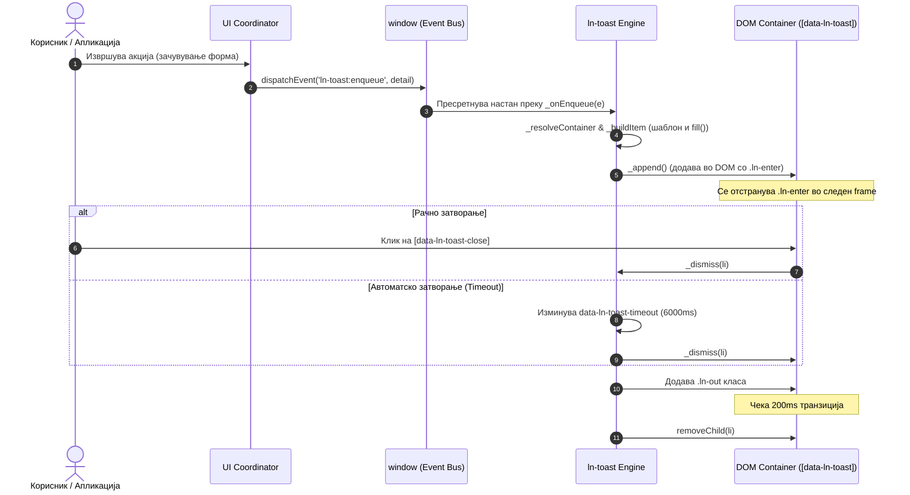

# 🔔 ln-toast

> **Класификација:** 🟢 Едноставна компонента / Сервис (Simple Component / Viewport Service)

---

## 1. Заднинско дејство и одговорност
- **Краток опис:** Глобален сервис за приказ на статус нотификации (toasts) во реално време, кој функционира преку глобален систем за размена на настани (Event Bus) и овозможува асинхроно и неблокирачко прикажување на информации.
- **Ортогоналност (Што компонентата НЕ прави):**
  - Не комуницира со бекенд API-ја и не прави AJAX барања за добивање пораки.
  - Не содржи тврдо-кодиран јазичен превод или текст (целиот текст се обезбедува динамички).
  - Не прикажува интерактивни дијалози со барање за потврда (за тоа се користат [ln-confirm](./ln-confirm.md) или [ln-modal](./ln-modal.md)).
  - Не гради DOM структури директно во JavaScript за примарниот лејаут (користи наменски HTML шаблони).
  - Не одлучува кога треба да се прикаже нотификација (тоа го прави координатор или форма преку настани).

---

## 2. Минимален HTML Маркап и Варијанти на Употреба

### А. Базен HTML контејнер
За овозможување на сервисот, во главниот лејаут на апликацијата (најчесто пред `</body>`) се поставува само еден контејнер:
```html
<ul data-ln-toast data-ln-toast-timeout="6000" data-ln-toast-max="5"></ul>
```

### Б. Дефолтен HTML Шаблон (template.html)
Доколку нема дефинирано специфичен шаблон во контејнерот, моторот автоматски го бара или вметнува следниот шаблон:
```html
<template data-ln-template="ln-toast-item">
    <li data-ln-toast-item data-ln-attr="class:type">
        <div class="icon">
            <ul>
                <li data-ln-toast-when="success"><svg class="ln-icon" aria-hidden="true"><use href="#ln-circle-check"></use></svg></li>
                <li data-ln-toast-when="error"><svg class="ln-icon" aria-hidden="true"><use href="#ln-circle-x"></use></svg></li>
                <li data-ln-toast-when="warn"><svg class="ln-icon" aria-hidden="true"><use href="#ln-alert-triangle"></use></svg></li>
                <li data-ln-toast-when="info"><svg class="ln-icon" aria-hidden="true"><use href="#ln-info-circle"></use></svg></li>
            </ul>
        </div>
        <section class="content">
            <header>
                <strong class="title" data-ln-field="title"></strong>
                <button type="button" data-ln-toast-close aria-label="Close">
                    <svg class="ln-icon" aria-hidden="true"><use href="#ln-x"></use></svg>
                </button>
            </header>
            <main class="body" data-ln-field="message"></main>
        </section>
    </li>
</template>
```

### В. Варијанти на употреба

#### Варијанта 1: Статичен / SSR Маркап (Hydration)
Бекендот може директно да испрати готови `<li>` елементи во рамките на контејнерот. Скриптата ги наоѓа и ги хидрира без рендирање на шаблон:
```html
<ul data-ln-toast data-ln-toast-timeout="6000" data-ln-toast-max="5">
    <li data-ln-toast-item class="success">
        <div class="icon">
            <svg class="ln-icon" aria-hidden="true"><use href="#ln-circle-check"></use></svg>
        </div>
        <section class="content">
            <header>
                <strong class="title">Зачувано</strong>
                <button type="button" data-ln-toast-close aria-label="Close">
                    <svg class="ln-icon" aria-hidden="true"><use href="#ln-x"></use></svg>
                </button>
            </header>
            <main class="body"><p>Податоците се успешно снимени во базата.</p></main>
        </section>
    </li>
</ul>
```

#### Варијанта 2: Динамично испраќање нотификација преку JavaScript
Секој координатор или форма може да испрати глобален настан до `window` за да прикаже нотификација:
```javascript
window.dispatchEvent(new CustomEvent('ln-toast:enqueue', {
    detail: {
        type: 'success', // success | error | warn | info
        title: 'Успешна операција',
        message: 'Податоците се снимени.'
    }
}));
```

#### Варијанта 3: Рендирање на листа од грешки (Validation Errors)
Кога својството `message` прифаќа низа од стрингови или кога се испраќа мапа на грешки преку `data.errors`, моторот ги рендира безбедно како `<ul>` листа:
```javascript
// Со низа на пораки
window.dispatchEvent(new CustomEvent('ln-toast:enqueue', {
    detail: {
        type: 'error',
        title: 'Грешка при валидација',
        message: [
            'Полето име е задолжително.',
            'Е-поштата не е во валиден формат.'
        ]
    }
}));

// Со серверска мапа на грешки (пр. од Laravel)
window.dispatchEvent(new CustomEvent('ln-toast:enqueue', {
    detail: {
        type: 'error',
        title: 'Грешка при валидација',
        data: {
            errors: {
                username: ['Името веќе постои'],
                password: ['Лозинката е премногу кратка']
            }
        }
    }
}));
```

---

## 3. Декларативен API Договор (Атрибути и Настани)

### А. Функционални Атрибути

| Атрибут | Опсег | Тип | Стандардна вредност | Опис |
|---|---|---|---|---|
| `data-ln-toast` | Контејнер | Идентификатор | - | Го означува `<ul>` елементот како контејнер за toasts. |
| `data-ln-toast-timeout` | Контејнер | Број (ms) | `6000` | Стандардно време на траење на секоја нотификација. Вредност `0` ги прави трајни. |
| `data-ln-toast-max` | Контејнер | Број | `5` | Максимален број на активни нотификации во стек (FIFO). |
| `data-ln-toast-item` | Тостер картичка | Идентификатор | - | Го означува елементот како toast картичка за хидратација/бришење. |
| `data-ln-toast-close` | Тостер картичка | Идентификатор | - | Атрибут за копчето за затворање. |
| `data-ln-toast-when` | Шаблон икони | Стринг | - | Го поврзува соодветниот `<li>` за икона со типот на картичката. |

### Б. Глобални Настани (Events API)

Компонентата реагира на следните настани испратени до `window`:

- **`ln-toast:enqueue`**
  Додава нова картичка во стек. Параметрите во `event.detail` се:
  - `type` (стринг, опционално): `success` | `error` | `warn` | `info`
  - `title` (стринг, опционално): Наслов на картичката.
  - `message` (стринг или низа од стрингови, опционално): Содржина.
  - `data.errors` (мапа, опционално): Серверски грешки.
  - `timeout` (број во ms, опционално): Специфичен тајмаут за оваа картичка.
  - `container` (стринг селектор, опционално): Идентификатор на специфичен контејнер.

- **`ln-toast:clear`**
  Ги отстранува сите активни картички. Доколку во `detail.container` е проследен CSS селектор, го чисти само тој контејнер.

---

## 4. CSS Стилизирање и Поведенски Концепт

### А. Изворни SCSS Миксини
Стилизирањето и структурата се дефинирани во [scss/config/mixins/_toast.scss](../../scss/config/mixins/_toast.scss) и се применуваат преку [scss/components/_toast.scss](../../scss/components/_toast.scss):

- `@mixin toast-container`: Позиционирање на контејнерот фиксно во долниот десен агол, притоа овозможувајќи ги кликовите да минуваат околу нотификациите (`pointer-events: none`).
- `@mixin toast-item`: Базна структура на `<li>` картичките (ресетирање на `pointer-events: auto`).
- `@mixin toast-item-enter`: Состојба кога картичката се монтира (`opacity: 0`, `translateX(30px)`) преку класата `.ln-enter`.
- `@mixin toast-item-out`: Состојба кога картичката излегува (`opacity: 0`, `scale(0.95)`) преку класата `.ln-out`.
- `@mixin toast-card`: Панел со сенки и заоблени рабови.
- `@mixin toast-icon`: Стилизирање на левата лента со SVG икона во соодветната боја на категоријата.
- `@mixin toast-icon-list`: Овозможува приказ само на иконата која одговара на типот на картичката.

### Б. Поведенски Концепти
- **Анимациски тајминг**: Картичката користи двофазна CSS транзиција. При рачно или автоматско затворање, JS ја додава класата `.ln-out` и по 200ms (колку што трае транзицијата) елементот физички се отстранува од DOM преку `removeChild()`.
- **Флексибилни димензии**: Картичките имаат дефинирано минимална ширина од `320px` и максимална ширина од `450px`, со автоматско собирање на празниот простор во насловот и телото со помош на CSS `:empty { display: none; }` правила.
- **Поддршка за Reduced Motion**: Сите транзиции се спакувани во `@include motion-safe` блокови, спречувајќи ги анимациите кај корисници кои ги имаат исклучено во нивниот систем.

---

## 5. Пристапност (ARIA) и Чести Грешки

### А. WAI-ARIA Спецификации
- **Контејнер за нотификации (`[data-ln-toast]`)**: Задолжително содржи `aria-live="polite"` (или `assertive` за грешки) и `aria-atomic="false"` за да може корисниците со асистивна технологија веднаш да ја чујат секоја нова нотификација без прекинување на нивната тековна акција.
- **Изолација на картичките**: Самите `<li>` картички немаат сопствени `role` и `aria-live` атрибути, со што се спречува несакано дуплирање на гласовните известувања.
- **Копче за затворање**: Копчето мора да содржи јасен `aria-label="Close"` или превод.

### Б. Чести Грешки и Анти-патерни
- **Директен JS пристап**: Повикување на `container.lnToast._append()` или слични методи за рачно градење елементи е строго забрането. Користете го настанскиот систем со `ln-toast:enqueue`.
- **Селекторски конфликти (BEM класи)**: Користење на измислени BEM класи како `.ln-toast__item` или `.ln-toast__card` кои не се користат во нашиот CSS систем. Стилизирањето се потпира на атрибутот `[data-ln-toast] > li`.
- **HTML во JS пораки**: Внесување на HTML во својството `message`. Моторот за заштита користи `textContent` (како и `fill` алатката) и директно ги неутрализира сите XSS обиди. За прикажување структурирани грешки, секогаш испраќајте ги како низа.

---

## 6. Дијаграм на Текот и Животен Циклус



---

## 7. Поврзани Компоненти
- [ln-core](../../js/ln-core/index.js) — Заеднички функции за шаблонирање и манипулација со DOM.
- [ln-form](./ln-form.md) — Испраќач на податоци кој емитува настани за успех/грешка уловени од координаторите.
- [ln-validate](./ln-validate.md) — Компонента за клиентска валидација која може да иницира приказ на грешки.
