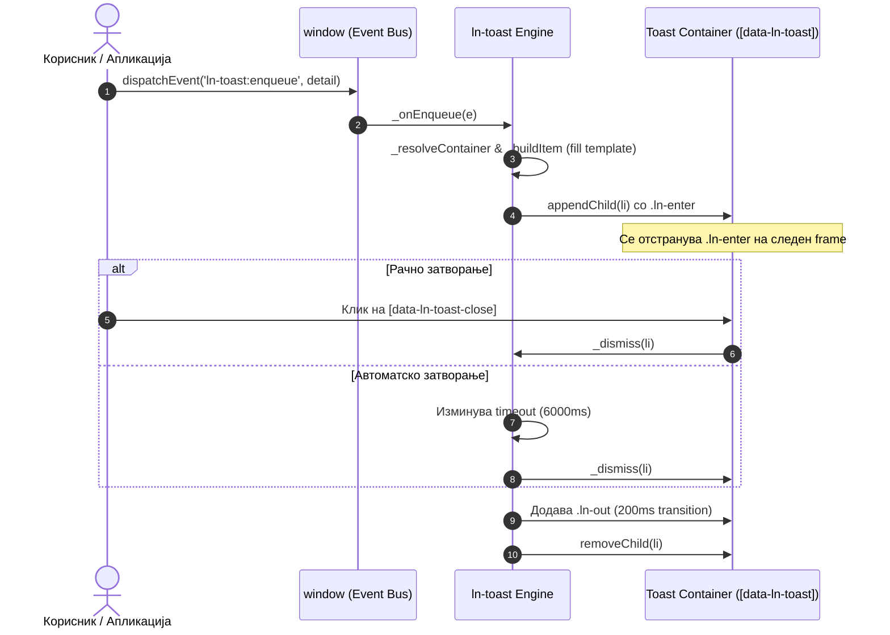

# 🔔 ln-toast

> **Класификација:** 🟢 Едноставна компонента / Viewport Сервис (Layer 1 - UI Messaging)  
> **Изворен код:** [`js/ln-toast/src/ln-toast.js`](../../js/ln-toast/src/ln-toast.js)

---

## 1. Заднинско дејство и одговорност

- **Краток опис:** `ln-toast` е глобален сервис за неблокирачки приказ на статус нотификации (toasts) во реално време, кој функционира преку глобален систем на настани (`window.addEventListener`).
- **Декларативно шаблонирање:** Тоаст картичките се рендираат декларативно од HTML шаблон `<template data-ln-template="ln-toast-item">` со помош на `cloneTemplateScoped` и `fill` од [`ln-core`](../../js/ln-core/src/ln-core.js).
- **SSR / Хидратација:** Поддржува директно хидрирање на серверски-рендирани статички `<li>` елементи присутни во контејнерот пред иницијализацијата.
- **Ограничување на стек (FIFO Eviction):** Контејнерот автоматски го ограничува бројот на активни нотификации (`data-ln-toast-max="5"`) со отстранување на најстарите картички кога границата ќе се надмине.
- **Ортогоналност (Што компонентата НЕ прави):**
  - **НЕ комуницира со бекенд API-ја:** Не прави AJAX барања за добивање пораки.
  - **НЕ содржи тврдо-кодиран текст:** Целиот текст се проследува динамички преку настанот.
  - **НЕ прикажува интерактивни дијалози со потврда:** За акции со потврда се користат [`ln-confirm`](./ln-confirm.md) или [`ln-modal`](./ln-modal.md).
  - **НЕ одлучува кога се прикажува нотификација:** Тоа го прават координаторите или формите преку настани.

---

## 2. Минимален HTML Маркап и Варијанти на Употреба

```html
<!-- Базен HTML контејнер (се поставува на дното на лејаутот пред </body>) -->
<ul data-ln-toast data-ln-toast-timeout="6000" data-ln-toast-max="5"></ul>

<!-- Дефолтен HTML Шаблон (во template.html или на страната) -->
<template data-ln-template="ln-toast-item">
    <li data-ln-toast-item data-ln-attr="class:type">
        <div class="icon">
            <ul>
                <li data-ln-toast-when="success"><svg class="ln-icon" aria-hidden="true"><use href="#ln-circle-check"></use></svg></li>
                <li data-ln-toast-when="error"><svg class="ln-icon" aria-hidden="true"><use href="#ln-circle-x"></use></svg></li>
                <li data-ln-toast-when="warn"><svg class="ln-icon" aria-hidden="true"><use href="#ln-alert-triangle"></use></svg></li>
                <li data-ln-toast-when="info"><svg class="ln-icon" aria-hidden="true"><use href="#ln-info-circle"></use></svg></li>
            </ul>
        </div>
        <section class="content">
            <header>
                <strong class="title" data-ln-field="title"></strong>
                <button type="button" data-ln-toast-close aria-label="Close">
                    <svg class="ln-icon" aria-hidden="true"><use href="#ln-x"></use></svg>
                </button>
            </header>
            <main class="body" data-ln-field="message"></main>
        </section>
    </li>
</template>

<!-- Варијанта 1: Динамично испраќање нотификација од JS -->
<script>
window.dispatchEvent(new CustomEvent('ln-toast:enqueue', {
    detail: {
        type: 'success', // success | error | warn | info
        title: 'Успешна операција',
        message: 'Податоците се снимени.'
    }
}));
</script>

<!-- Варијанта 2: Рендирање на листа од валидациски грешки -->
<script>
window.dispatchEvent(new CustomEvent('ln-toast:enqueue', {
    detail: {
        type: 'error',
        title: 'Грешка при валидација',
        message: ['Полето е задолжително.', 'Е-поштата е невалидна.']
    }
}));
</script>
```

---

## 3. Декларативен API Договор (Атрибути и Настани)

### Атрибути

| Атрибут | Елемент | Тип | Стандардна вредност | Опис |
| :--- | :--- | :--- | :--- | :--- |
| `data-ln-toast` | Контејнер (`ul`) | Идентификатор | — | Го означува контејнерот за тоаст нотификации. |
| `data-ln-toast-timeout` | Контејнер / Барање | `Number (ms)` | `6000` | Време на траење во ms. Вредност `0` ја прави нотификацијата трајна до рачно затворање. |
| `data-ln-toast-max` | Контејнер (`ul`) | `Number` | `5` | Максимален број на истовремено видливи нотификации (FIFO стек). |
| `data-ln-toast-item` | Картичка (`li`) | Идентификатор | — | Ја означува поединечната тоаст картичка за хидратација и отстранување. |
| `data-ln-toast-close` | Копче | Идентификатор | — | Го означува копчето за затворање на картичката. |

### Настани (Events API)

| Настан | Target | Payload `e.detail` | Опис |
| :--- | :--- | :--- | :--- |
| `ln-toast:enqueue` | `window` | `{ type, title, message, data, timeout, container }` | Додава нова тоаст картичка во контејнерот. |
| `ln-toast:clear` | `window` | `{ container }` | Ги отстранува сите активни тоаст картички (или во одреден контејнер). |

---

## 4. CSS Стилизирање и Поведенски Концепт

Стилизирањето е дефинирано во SCSS миксини од дизајн системот:

```scss
// SCSS миксини за toast компонентата
[data-ln-toast] {
    @include toast-container; // Fixed позиционирање во долниот десен агол, pointer-events: none

    > li {
        @include toast-item; // pointer-events: auto, layout & flex

        &.ln-enter { @include toast-item-enter; } // initial state (opacity: 0, slide)
        &.ln-out   { @include toast-item-out; }   // dismiss animation (opacity: 0, scale)
    }
}
```

* **`@mixin toast-container`** ([`scss/config/mixins/_toast.scss`](../../scss/config/mixins/_toast.scss)): Го позиционира контејнерот фиксно во долен десен агол со `pointer-events: none` за да не ги блокира кликовите на остатокот од страницата.
* **Двофазна анимација:** При монтирање картичката добива `.ln-enter` класа која веднаш се отстранува со `requestAnimationFrame`. При затворање се додава `.ln-out` и по 200ms елементот физички се отстранува со `removeChild()`.
* **Motion Safe:** Анимациите се заштитени со `@include motion-safe`.

---

## 5. Пристапност (ARIA) и Чести Грешки

* **Пристапност:** Контејнерот `[data-ln-toast]` задолжително содржи `aria-live="polite"` и `aria-atomic="false"` за екранските читачи автоматски да ги најават новите тоасти. Копчето за затворање треба да има `aria-label="Close"`.
* **Честа грешка 1: Рачно повикување на внатрешни JS методи:** Повикување на `container.lnToast._append()` наместо користење на настанот `ln-toast:enqueue`.
* **Честа грешка 2: Проследување на суров HTML во `message`:** Пораката се поставува преку `textContent` и `fill()`, неутрализирајќи XSS. За рендирање повеќе пораки проследете низа од стрингови.
* **Честа грешка 3: Непоставување на `data-ln-toast` атрибутот на контејнерот:** Без овој атрибут `ln-toast` нема да го пронајде контејнерот.

---

## 6. Дијаграм на Текот и Животен Циклус



---

## 7. Поврзани Компоненти

- [`ln-core`](../../js/ln-core/src/ln-core.js) — Главна библиотека за шаблонирање (`cloneTemplateScoped`, `fill`).
- [`ln-confirm.md`](./ln-confirm.md) — Двокликов потврдувач за директни единечни акции.
- [`ln-modal.md`](./ln-modal.md) — Модални прозорци за сложени акции и потврди со висок ризик.
