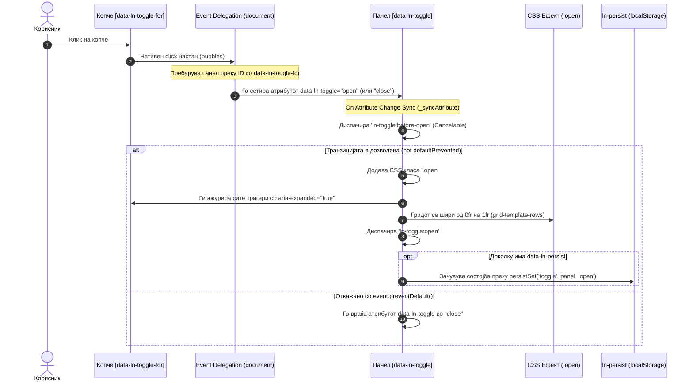

# 🎚️ ln-toggle

> **Класификација:** 🟢 Едноставна компонента (Simple Component)

---

## 1. Заднинско дејство и одговорност

`ln-toggle` е фундаменталниот градивен блок за контрола на состојба во `ln-ashlar`. Таа претставува високо-специјализирана бинарна состојбена машина имплементирана во [`js/ln-toggle/src/ln-toggle.js`](../../js/ln-toggle/src/ln-toggle.js) која:

* **Управува со сопствената бинарна состојба** на отвореност (`open` / `close`) преку HTML атрибутот `data-ln-toggle`.
* **Ја синхронизира пристапноста (ARIA)** — автоматски го ажурира нативниот `aria-expanded` атрибут (`true` / `false`) на сите активатори (triggers) поврзани со неа преку `data-ln-toggle-for`.
* **Делегира анимирање на CSS слојот** — додава или отстранува CSS класа `.open` на сопствениот елемент, овозможувајќи му на CSS слојот да изврши мазни грид транзиции на висина, позиција или транспарентност.
* **Перзистира состојба** во `localStorage` преку интеграција со [`ln-persist`](./ln-persist.md) кога е присутен атрибутот `data-ln-persist`.
* **Изолирана природа** — компонентата е целосно несвесна за нејзината околина. Таа не знае дали се наоѓа во мени, странична лента, табови или аккордион.

> [!IMPORTANT]
> **Што `ln-toggle` НЕ прави (Orthogonality Doctrine):**
> * **НЕ анимира преку JavaScript** — сите анимирани транзиции (висина, транспарентност, трансформации) се строго во надлежност на CSS (`.collapsible`, `grid-template-rows`, `.app-sidebar`, `.alert`).
> * **НЕ координира групи** — за однесување како „само еден отворен таб/аккордион“, таа се потпира на координаторот [`ln-accordion`](./ln-accordion.md) кој управува со атрибутите на панели однадвор.
> * **НЕ се позиционира динамички** — позиционирањето, лебдењето и телепортацијата на менија се одговорност на координаторите [`ln-popover`](./ln-popover.md) / [`ln-dropdown`](./ln-dropdown.md) или соодветен CSS менаџмент.
> * **НЕ заробува фокус** — не управува со focus traps или `ESC` затворање (тоа е одговорност на [`ln-modal`](./ln-modal.md) или [`ln-popover`](./ln-popover.md)).

---

## 2. Минимален HTML Маркап и Варијанти на Употреба

> [!IMPORTANT]
> **Задолжителен `id` атрибут:**
> Секој панел со `data-ln-toggle` **мора да има уникатен `id` атрибут**. Ова `id` не е потребно само за да може активаторот да го пронајде панелот преку `data-ln-toggle-for`, туку е клучно и за ARIA синхронизацијата: без него, JavaScript моторот не може да ги лоцира соодветните тригери во DOM-от за да им го ажурира `aria-expanded` статусот.

### Базен HTML Маркап

```html
<!-- Активатор / Копче -->
<button type="button" data-ln-toggle-for="faq-panel">Отвори детали</button>

<!-- Колапсирачки панел -->
<section id="faq-panel" data-ln-toggle class="collapsible">
    <div class="collapsible-body">
        <p>Содржината на овој панел се отвара и затвора мазно...</p>
    </div>
</section>
```

---

### Варијанта 1: Inline колапсирачки панел (Smooth Collapsible Grid Panel)

Се користи за приказ и криење на содржина која се наоѓа директно во текот на документот (inline content) и која при отворање ја турка останатата содржина надолу (пр. кај FAQ секции или дополнителни филтри).

#### HTML Маркап
```html
<!-- Активатор со стрелка за ротација -->
<button type="button" class="btn" data-ln-toggle-for="filter-panel">
    <span>Филтрирај резултати</span>
    <svg class="ln-icon ln-chevron" aria-hidden="true">
        <use href="#ln-chevron-down"></use>
    </svg>
</button>

<!-- Колапсирачки панел -->
<section id="filter-panel" data-ln-toggle class="collapsible">
    <div class="collapsible-body">
        <div class="form-group">
            <label for="search-input">Пребарај:</label>
            <input type="text" id="search-input" class="input" />
        </div>
    </div>
</section>
```

---

### Варијанта 2: Странично мени / Фиока (Sidebar Drawer со Scrim)

Се користи кога панелот излегува над содржината од страната на екранот (фиксиран позициски), наместо да го нарушува протокот во содржината. На мобилни уреди користи затемнување во позадина (scrim).

> [!NOTE]
> За разлика од другите преклопувања, фиоката мора задолжително да биде дефинирана со `<aside>` таг за да може придружниот скрим (`.app-scrim`) автоматски да реагира преку CSS селекторот `aside[data-ln-toggle="open"] ~ .app-scrim`.

#### HTML Маркап
```html
<!-- Активатор на менито -->
<button type="button" data-ln-toggle-for="main-sidebar" class="btn">Мени</button>

<!-- Странично мени (Мора да биде <aside> со класа .app-sidebar) -->
<aside id="main-sidebar" data-ln-toggle class="app-sidebar">
    <header class="app-sidebar__head">
        <span class="app-name">Апликација</span>
        <!-- Копче кое експлицитно затвора -->
        <button type="button" data-ln-toggle-for="main-sidebar" data-ln-toggle-action="close" aria-label="Затвори мени">×</button>
    </header>
    <main class="app-sidebar__body">
        <nav class="nav-menu">
            <a href="/dashboard">Почетна</a>
            <a href="/settings">Поставки</a>
        </nav>
    </main>
</aside>

<!-- Скрим позадина (Scrim overlay) -->
<div class="app-scrim"></div>
```

---

### Варијанта 3: Банер / Известие за затворање со перзистенција (`data-ln-persist`)

Додавањето на `data-ln-persist` атрибутот овозможува состојбата на отвореност автоматски да се зачува во `localStorage` на прелистувачот и да се врати истата при следно вчитување на страницата преку интеграцијата со [`ln-persist`](./ln-persist.md).

#### HTML Маркап
```html
<!-- Промотивен банер кој корисникот може да го затвори и да остане затворен при следна посета -->
<div class="alert banner" id="promo-banner" data-ln-toggle="open" data-ln-persist>
    <span>Попуст од 20% со кодот ASHLAR!</span>
    <button type="button" data-ln-toggle-for="promo-banner" data-ln-toggle-action="close" aria-label="Затвори банер">Игнорирај</button>
</div>
```

---

### Варијанта 4: Активатори со експлицитни акции (`open`, `close`, `toggle`)

Атрибутот `data-ln-toggle-action` овозможува прецизно контролирање на акцијата на тригерот.

#### HTML Маркап
```html
<!-- Односно копче кое САМО отвора -->
<button type="button" data-ln-toggle-for="info-panel" data-ln-toggle-action="open">Отвори</button>

<!-- Копче кое САМО затвора -->
<button type="button" data-ln-toggle-for="info-panel" data-ln-toggle-action="close">Затвори</button>

<!-- Копче со стандардна преклопна (toggle) акција -->
<button type="button" data-ln-toggle-for="info-panel" data-ln-toggle-action="toggle">Преклопи</button>

<!-- Панел -->
<div id="info-panel" data-ln-toggle class="collapsible">
    <div class="collapsible-body">
        <p>Панел кој се контролира со посебни копчиња.</p>
    </div>
</div>
```

---

## 3. Декларативен API Договор (Атрибути и Настани)

### Табела со Атрибути

| Атрибут | Елемент | Тип / Вредности | Стандардна вредност | Опис |
|---|---|---|---|---|
| `data-ln-toggle` | Панел | `"open"` \| `"close"` \| `""` | `""` (close) | Го активира однесувањето на компонентата. Вредноста `"open"` го означува панелот како отворен (и ја додава `.open` класата); секоја друга вредност или празен атрибут означува затворен панел. |
| `data-ln-toggle-for` | Активатор | `String` (ID) | *Задолжително* | Го дефинира `id`-то на целниот панел што треба да се контролира со овој активатор. |
| `data-ln-toggle-action` | Активатор | `"toggle"` \| `"open"` \| `"close"` | `"toggle"` | Дефинира што прави кликот на активаторот. Непознати/невалидни вредности предизвикуваат `no-op` (без дејство). |
| `data-ln-persist` | Панел | `Boolean` \| `String` (Клуч) | `""` | Го овозможува зачувувањето на состојбата во `localStorage` преку `persistGet` / `persistSet`. Форматот на клучот е `ln:toggle:{pagePath}:{identifier}`. |
| `aria-expanded` | Активатор | `"true"` \| `"false"` | `"false"` | Се управува **автоматски** од JavaScript моторот. Се сетира на сите тригери во DOM со соодветен `data-ln-toggle-for`. |

---

### Настани (Events API)

Сите настани меурат (`bubbles: true`) нагоре по DOM стеблото. Внатре во `event.detail.target` секогаш се наоѓа DOM референцата кон самиот панел.

| Настан | Насока | Cancelable | Опис | `detail` Објект |
|---|---|---|---|---|
| `ln-toggle:before-open` | Емитува | **Да** | Се испалува по промена на атрибутот во `"open"`, пред аплицирање на `.open` класата и ARIA синхронизацијата. | `{ target: HTMLElement }` |
| `ln-toggle:open` | Емитува | Не | Се испалува откако панелот е целосно отворен, ажурирана е `.open` класата и ARIA состојбата. | `{ target: HTMLElement }` |
| `ln-toggle:before-close` | Емитува | **Да** | Се испалува по промена на атрибутот во `"close"`, пред отстранување на `.open` класата и ARIA синхронизацијата. | `{ target: HTMLElement }` |
| `ln-toggle:close` | Емитува | Не | Се испалува откако панелот е целосно затворен, отстранета е `.open` класата и ARIA состојбата. | `{ target: HTMLElement }` |
| `ln-toggle:destroyed` | Емитува | Не | Се испалува кога компонентата се деструктуира од DOM-от. | `{ target: HTMLElement }` |

> [!NOTE]
> **Иницијалната состојба е „тивка“ (Silent Initialization):**
> При иницијализација на страницата, доколку панелот содржи атрибут `data-ln-toggle="open"` во HTML маркапот или доколку состојбата се врати од `localStorage` преку `data-ln-persist`, се аплицираат класата `.open` и `aria-expanded` атрибутите, но **не се диспачираат** настаните `ln-toggle:open` или `ln-toggle:before-open`. Ова спречува испалување на непотребни каскадни настани за време на вчитувањето на страницата.

> [!TIP]
> **Пропуштање на нативни модифицирани кликови (Modifier Clicks):**
> Доколку корисникот кликне на активатор кој содржи `data-ln-toggle-for` со клуч `Ctrl`, `Cmd` (`metaKey`) или со средното копче на глувчето (middle click), JavaScript компонентата го пропушта кликот нативно и не извршува `preventDefault()`. Ова овозможува стандардно однесување на прелистувачот (пр. отворање на врската во нов таб ако активаторот е `<a>` елемент).

---

## 4. CSS Стилизирање и Поведенски Концепт

Визуелните анимации се целосно делегирани на CSS слојот преку комбинација на миксини и класи во [`scss/config/mixins/_collapsible.scss`](../../scss/config/mixins/_collapsible.scss) и [`scss/components/_toggle.scss`](../../scss/components/_toggle.scss).

### 4.1. SCSS Grid Анимација (`grid-template-rows`)

Наместо да се користи класичниот пристап со `max-height` (кој внесува лаг или бара дефинирање фиксни пиксели), `ln-ashlar` користи CSS Grid за мазни транзиции на висината:

```scss
/* scss/config/mixins/_collapsible.scss */
@use 'transitions' as *;
@use 'motion' as *;

@mixin collapsible {
	display: grid;
	grid-template-rows: 0fr; /* Почетно е затворен и зазема 0 висина */
	@include motion-safe {
		transition: grid-template-rows var(--transition-base);
	}

	&.open {
		grid-template-rows: 1fr; /* Се отвора до природната висина на содржината */
	}
}

@mixin collapsible-content {
	overflow: hidden;
	// Во парови со overflow:hidden за автоматиката на гридот да отиде до 0px
	min-height: 0;
}
```

```scss
/* scss/components/_toggle.scss */
.collapsible {
	@include collapsible;

	> * {
		@include collapsible-content;
	}
}
```

### 4.2. Архитектура на Внатрешна Содржина и Растојанија

За да може висината да колапсира точно до `0px` без визуелни аномалии (како „сечење“ на букви или мали празнини), се применуваат следниве правила за структурата:

1. **Парентот (`.collapsible`) е zero-padding grid container**: Самиот панел што колапсира никогаш не смее да има вертикален padding или граници (borders), бидејќи тие не можат да се анимираат со `grid-template-rows: 0fr` и ќе остават празен простор кога е затворен.
2. **Внатрешниот елемент (`.collapsible-body`) ги носи транзициите**: Неговата содржина има `overflow: hidden` и `min-height: 0` за прелистувачот да дозволи целосно собирање.
3. **Растојанијата се дефинираат строго на ДЕЦАТА на `.collapsible-body`**:
   ```scss
   /* scss/components/_toggle.scss */
   .collapsible-body > * {
       --padding-y: var(--size-sm-up);
       --padding-x: var(--size-md);
       padding: var(--padding-y) var(--padding-x);
       margin: 0; /* Се отстрануваат маргините за да не излегуваат надвор од парентот */
   }
   ```

---

### 4.3. Ротација на chevron стрелката (`.ln-chevron`)

За да се обезбеди јасен визуелен индикатор за состојбата на отвореност, во активаторите често се поставува икона со класа `.ln-chevron`. Ротацијата на оваа икона е решена целосно на ниво на CSS, управувана од атрибутот `aria-expanded` кој го менува JavaScript моторот:

```scss
/* scss/components/_toggle.scss */
[data-ln-toggle-for] .ln-chevron {
	@include flex-shrink-0;
	@include motion-safe {
		transition: transform var(--transition);
	}
}

/* Кога активаторот има статус на отвореност, стрелката се ротира за 180° */
[data-ln-toggle-for][aria-expanded="true"] .ln-chevron {
	transform: rotate(180deg);
}
```

---

### 4.4. Стилизирање на Иконски Активатори (Icon-only Trigger Buttons)

Кога активаторот е `<button data-ln-toggle-for>` со само една икона како дете, `ln-ashlar` автоматски го отстранува стандардниот суров изглед на копчето:

```scss
/* scss/components/_toggle.scss */
button[data-ln-toggle-for]:has(> .ln-icon:only-child) {
	--btn-bg:           transparent;
	--btn-border:       transparent;
	--btn-bg-hover:     var(--bg-sunken);
	--btn-border-hover: transparent;
	--btn-fg-hover:     var(--color-fg);
}
```

---

### 4.5. Повеќекратни Визуелни Слоеви (Sidebar Drawer, Alerts & Scrim)

Однесувањето на `ln-toggle` се пресликува и во други UI компоненти:

* **Sidebar Drawer ([`scss/config/mixins/_app-shell.scss`](../../scss/config/mixins/_app-shell.scss))**:
  ```scss
  @mixin sidebar-drawer {
      @include fixed;
      top: var(--app-header-height);
      left: 0;
      height: calc(100vh - var(--app-header-height));
      width: var(--app-sidebar-width);
      z-index: var(--z-sticky);
      transform: translateX(-100%);

      @include motion-safe {
          transition: transform var(--transition);
      }

      &[data-ln-toggle="open"] {
          transform: translateX(0);
      }
  }

  @mixin app-scrim {
      @include fixed;
      @include inset-0;
      background: var(--app-scrim-bg);
      z-index: calc(var(--z-overlay) - 1);
      opacity: 0;
      pointer-events: none;

      @include motion-safe {
          transition: opacity var(--transition);
      }

      aside[data-ln-toggle="open"] ~ & {
          opacity: 1;
          pointer-events: auto;
      }
  }
  ```
* **Alert Banners ([`scss/components/_alert.scss`](../../scss/components/_alert.scss))**:
  ```scss
  .alert[data-ln-toggle="close"] {
      display: none;
  }
  ```

---

## 5. Пристапност (ARIA) и Чести Грешки

### ARIA & Тастатура

* **Синхронизација на `aria-expanded`**: JavaScript моторот [`js/ln-toggle/src/ln-toggle.js`](../../js/ln-toggle/src/ln-toggle.js) при секоја промена на состојбата прави `document.querySelectorAll('[data-ln-toggle-for="' + panelEl.id + '"]')` и го сетира `aria-expanded="true"` или `"false"`.
* **Семантички копчиња**: Активаторите се препорачува секогаш да бидат `<button type="button">` или семантички заглавија со `role="button"`. Ова овозможува нативна фокус навигација со `Tab` и активирање со `Space` / `Enter`.
* **Пристапност без халуцинирани атрибути**: Не додавајте `data-ln-action` или рачни `aria-expanded` во статичниот HTML за компонентата; `ln-toggle` тоа го прави автоматски декларативно.

---

### Чести Грешки и Анти-патерни (Common Pitfalls)

> [!CAUTION]
> 1. **Изоставување на `id` на панелот:**
>    Панелот со `data-ln-toggle` **мора да има уникатен `id`**. Доколку нема `id`, активаторот нема да може да го пронајде со `data-ln-toggle-for`, а ARIA синхронизацијата `_syncTriggerAria` нема да работи.
>
> 2. **Поставување `padding` или `border` директно на `.collapsible` или `.collapsible-body`:**
>    Ова ја нарушува `grid-template-rows: 0fr` анимацијата. Прелистувачот смета дека `padding`-от е минимална висина на елементот, што ќе резултира со останување на визуелна празнина (сливер) дури и кога панелот е во состојба `close`. Вертикалните растојанија мора строго да се дефинираат на децата: `.collapsible-body > *`.
>
> 3. **Обид за координирање аккордион со единечни `ln-toggle` панели без координатор:**
>    `ln-toggle` е изолирана компонента и НЕ знае за другите панели. Доколку сакате однесување во кое отворање на еден панел автоматски ги затвора останатите, обвиете ги панелите во `[data-ln-accordion]` координатор.
>
> 4. **Користење ad-hoc класи наместо системски стандарди:**
>    Доколку за промотивен банер ја пропуштите класата `.alert`, промената на `data-ln-toggle="close"` ќе се случи во JS и во `localStorage`, но банерот нема визуелно да исчезне бидејќи недостасува CSS правилото `.alert[data-ln-toggle="close"] { display: none; }`.

---

## 6. Дијаграм на Текот и Животен Циклус

Следниот Mermaid sequence дијаграм ја прикажува комплетната интеракција помеѓу корисникот, DOM тригерите, JavaScript моторот и CSS слојот:



---

## 7. Поврзани Компоненти

* [`ln-accordion`](./ln-accordion.md) — Координатор кој ги прислушува `ln-toggle:open` настаните и експлицитно ги затвора останатите отворени панели во истата група (Accordion pattern).
* [`ln-persist`](./ln-persist.md) — Заедничка компонента за зачувување и реставрација на состојби во `localStorage`.
* [`ln-dropdown`](./ln-dropdown.md) — Координатор кој ги проширува концепти на отворање со позиционирање на менија и кликање надвор (click-outside).
* [`ln-popover`](./ln-popover.md) — Едноставна компонента за floating/portaled лебдечки слоеви со фокус управување.
* [`ln-modal`](./ln-modal.md) — Модален дијалог кој управува со блокирачки overlay содржини и focus trap.
