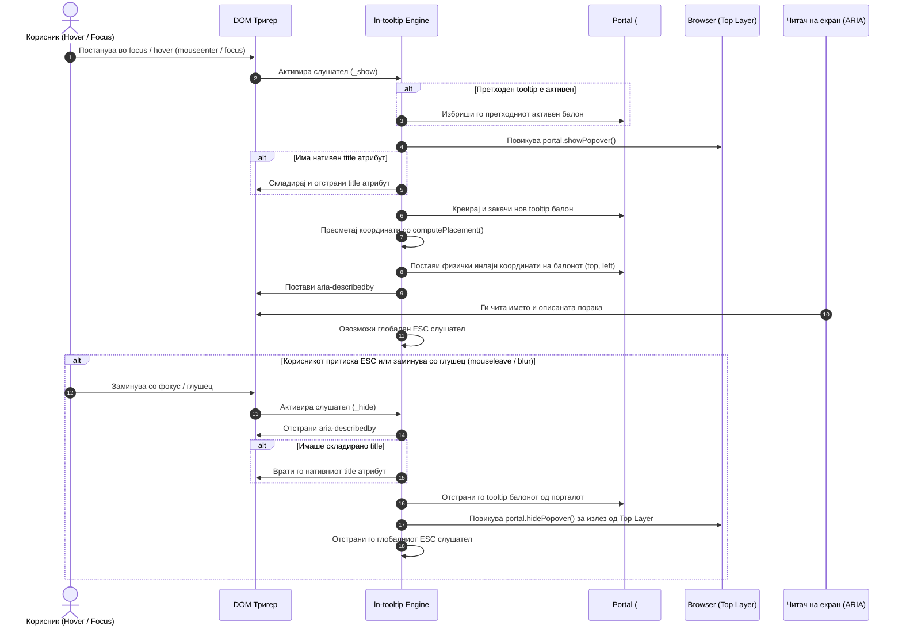

# 💡 ln-tooltip

> **Класификација:** 🟢 Едноставна компонента / UI Примитив (Simple Component / Contextual Hint Primitive)

---

## 1. Заднинско дејство и одговорност

`ln-tooltip` е ултра-лесна, двослојна (Dual-Layer) компонента за прикажување на брзи контекстуални совети и описи при преминување со глушецот (`hover`) или фокусирање со тастатура (`focus`). Имплементирана е во [`js/ln-tooltip/src/ln-tooltip.js`](../../js/ln-tooltip/src/ln-tooltip.js) (~170 линии) и стилизирана преку SCSS во [`scss/components/_tooltip.scss`](../../scss/components/_tooltip.scss) и [`scss/config/mixins/_tooltip.scss`](../../scss/config/mixins/_tooltip.scss).

Компонентата е дизајнирана според принципот на **прогресивно подобрување (Progressive Enhancement)** и се состои од два комплементарни слоја:

* **Слој 1: Чист CSS базна линија (Zero-JS Baseline)**: Секој HTML елемент што содржи атрибут `data-ln-tooltip="Текст"` веднаш добива визуелно подобрен tooltip преку CSS `::after` псевдо-елемент. Овој слој работи без ниту еден ред JavaScript, нуди моментален одзив и нулта потрошувачка на меморија.
* **Слој 2: JS прогресивно подобрување (Portaled JS Enhancement)**: Кога на елементот ќе се додаде атрибутот `data-ln-tooltip-enhance` (или при авто-детекција на семантички `<abbr>` со `title`), JavaScript моторот го презема приказот. Тој го користи глобалниот портал контејнер (`#ln-tooltip-portal`) промовиран нативно во Top Layer преку Popover API (`popover="manual"`), што спречува какво било скратување од `overflow: hidden` кај родителите, овозможува прецизно auto-flip позиционирање и го поврзува атрибутот `aria-describedby`.
* **Автоматско потиснување на нативниот `title` (Native Tooltip Stripping)**: Кај елементи со нативен `title` атрибут (на пример `<abbr data-ln-tooltip title="...">`), JS слојот привремено го отстранува `title` за време на приказот за да спречи дуплирање со системското жолто балонче.

> [!IMPORTANT]
> **Што `ln-tooltip` НЕ прави (Orthogonality Doctrine):**
> * **НЕ учествува во бизнис настани или дата-тек** — `ln-tooltip` е пасивен визуелен примитив. Не бара и не користи никаков JS координаторски код. Единствен настан кој го емитува е `ln-tooltip:destroyed` при чистење.
> * **НЕ го заробува фокусот (No Focus Trap)** — tooltip балончињата се чисто информативни со `pointer-events: none`. Навигацијата со `Tab` продолжува мазно кон следниот елемент.
> * **НЕ поддржува истовремен приказ на повеќе балончиња** — во даден момент во целата апликација може да биде активен точно ЕДЕН tooltip (`activeTrigger`).

---

## 2. Минимален HTML Маркап и Варијанти на Употреба

`ln-tooltip` овозможува чиста декларативна употреба преку HTML атрибути, поддржувајќи три основни сценарија:

---

### Варијанта 1: Чист CSS Базен Tooltip (Zero-JS Baseline)

Се користи за стандардни иконски копчиња или контроли во нормален DOM тек каде нема опасност од исекување со `overflow: hidden`.

```html
<!-- Иконско копче за зачувување со чист CSS tooltip -->
<button type="button" 
        class="btn btn-icon" 
        data-ln-tooltip="Зачувај промени" 
        aria-label="Зачувај промени">
    <svg class="ln-icon" aria-hidden="true">
        <use href="#ln-device-floppy"></use>
    </svg>
</button>
```

---

### Варијанта 2: JS Подобрен Tooltip со Позиционирање (Portaled Tooltip)

Се користи во табели, картички или странични ленти каде родителските контејнери имаат `overflow: hidden` или `overflow-x: auto`, како и за копчиња блиску до работ на екранот.

```html
<!-- Копче за бришење сместено во компактна табела -->
<button type="button" 
        class="btn btn-icon btn-ghost-danger" 
        data-ln-tooltip="Трајно избриши ставка" 
        data-ln-tooltip-enhance 
        data-ln-tooltip-position="right"
        aria-label="Избриши ставка">
    <svg class="ln-icon" aria-hidden="true">
        <use href="#ln-trash"></use>
    </svg>
</button>
```

---

### Варијанта 3: Семантички `<abbr>` со Автоматско Подобрување (Auto-Enhancement)

Кога елементот содржи `data-ln-tooltip` и нативен `title` атрибут, JS моторот автоматски го надградува за да го отстрани нативниот системски приказ.

```html
<p>
    Системот користи 
    <abbr data-ln-tooltip title="Application Programming Interface">API</abbr> 
    за синхронизација на податоците.
</p>
```

---

## 3. Декларативен API Договор (Атрибути и Настани)

Сите опции на `ln-tooltip` се дефинираат декларативно преку HTML атрибути:

| Атрибут / Својство | Применливост | Тип / Дозволени вредности | Опис |
| :--- | :--- | :--- | :--- |
| `data-ln-tooltip` | Активатор | `string` | Текстуална содржина на tooltip-от. Задолжителен атрибут. Доколку е празен (`""`), ја презема содржината од `title`. |
| `data-ln-tooltip-position` | Активатор | `top` \| `bottom` \| `left` \| `right` | Претпочитана страна за позиционирање (стандардно: `top`). Автоматски се превртува доколку нема простор. |
| `data-ln-tooltip-enhance` | Активатор | Флаг (без вредност) | Експлицитна активација на JS прогресивно подобрување (портал во `body`, auto-flip позиционирање и ARIA поврзување). |
| `title` | Активатор | `string` | Семантички нативен наслов. Кога е присутен со `data-ln-tooltip`, овозможува авто-подобрување и се оневозможува нативниот приказ. |
| `data-ln-tooltip-placement` | Портал балон (`.ln-tooltip`) | `top` \| `bottom` \| `left` \| `right` | Вистинска активна страна доделена од `computePlacement` по извршената проверка за физички простор. |
| `data-ln-tooltip-enhanced` | Активатор | Флаг (состојба) | Автоматски додаден од JS за CSS да го скрие `::after` baseline слојот (`content: none`). |
| `aria-describedby` | Активатор | ID на балончето | Динамички поврзано од JS при приказ (на пр. `ln-tooltip-1`) и отстрането при скривање. |

### Емитувани Настани (Events API)
* `ln-tooltip:destroyed`: Се диспачира исклучиво при експлицитно уништување на компонентата преку `.destroy()`.

---

## 4. CSS Стилизирање и Поведенски Концепт

Визуелниот приказ („мало темно балонче“) е дефиниран преку SCSS миксини во [`scss/config/mixins/_tooltip.scss`](../../scss/config/mixins/_tooltip.scss).

### SCSS Миксин (`@mixin tooltip-bubble`)
```scss
@mixin tooltip-bubble {
    --padding-y: var(--size-xs);
    --padding-x: var(--size-sm);
    padding: var(--padding-y) var(--padding-x);
    background: var(--fg-default); /* Секогаш чита инверзна боја од :root */
    color: var(--bg-base);
    @include typography(caption);
    --radius: var(--radius-sm);
    border-radius: var(--radius);
    white-space: nowrap;
    pointer-events: none;
    z-index: var(--z-dropdown);
    --shadow: var(--shadow-floating);
    box-shadow: var(--shadow);
}
```

### Поведенски Концепти:
* **Глобално Порталирање во Top Layer (`#ln-tooltip-portal`)**: Наместо само додаден `div`, порталот користи `popover="manual"`. Со повикување на `showPopover()` на порталот пред секое мерење и приказ, тој се промовира во Top Layer на прелистувачот, со што се елиминираат сите `overflow` и `z-index` ограничувања.
* **Потиснување на Двојно Рендерирање**: Кога JS слојот е активен (`data-ln-tooltip-enhance` или `[title]`), CSS моторот го поставува псевдо-елементот на `content: none !important` за да спречи дуплирање на балончето.

---

## 5. Пристапност (ARIA) и Чести Грешки

### ARIA Спецификација
* **`aria-describedby`**: Автоматски го поврзува тригерот со уникатниот ID на портал балончето за време на приказот. Доколку тригерот веќе содржи постоечка вредност во `aria-describedby`, таа вредност се зачувува (стешира) и ID-то на tooltip-от се спојува како дел од листата (space-separated list). При скривање, оригиналната вредност целосно се обновува без да се изгуби.
* **Управување со тастатура и интеракција (`Tab`, `ESC` & Hover)**: Приказот реагира на фокус во Capture фаза (`focus`/`blur`) и ховер (`mouseenter`/`mouseleave`). За доследност со WAI-ARIA tooltip шемата (WAI-ARIA tooltip pattern), балончето се скрива само кога елементот не е ниту ховериран, ниту пак фокусиран (вклучувајќи и негови евентуални фокусирани деца). Притискањето на `Escape` веднаш и безусловно го затвора активниот tooltip без оглед на состојбата на фокусот или ховерот.

### Чести грешки при употреба (Anti-Patterns)
> [!WARNING]
> **1. Испуштање на `aria-label` кај иконски копчиња:**
> Tooltip-от нуди визуелен опис за корисници со глушец. Читачите на екран бараат примарно име за интерактивното копче — секогаш додавајте соодветен `aria-label="Зачувај"`.

> [!CAUTION]
> **2. Примена на нефокусирачки HTML елементи:**
> Ставањето tooltip на `<span>` или `<div>` без `tabindex="0"` го прави описниот совет недостапен за навигација со тастатура.

> [!WARNING]
> **3. Употреба на нативно оневозможени копчиња (`<button disabled>`):**
> Оневозможените копчиња ги блокираат `pointer-events` во прелистувачите. За зачувување на tooltip приказ, користете `aria-disabled="true"`.

---

## 6. Дијаграм на Текот и Животен Циклус

Следниов дијаграм го прикажува интеракцискиот тек од детекција, порталирање, ARIA поврзување, до отстранување при `mouseleave` или `Escape`.



---

## 7. Поврзани Компоненти

* [`ln-confirm`](./ln-confirm.md) — Заштитник на деструктивни акции кој при иконски мод користи аналогија на tooltip балонче.

