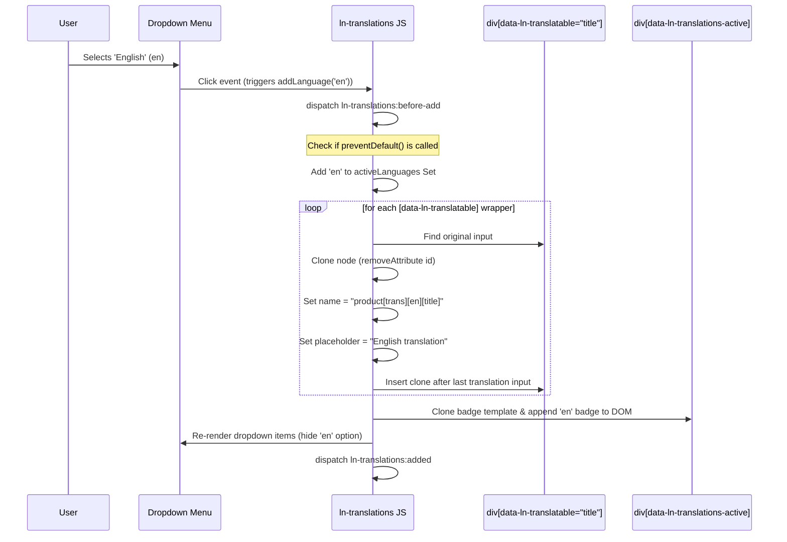

# 🔤 ln-translations
> **Класификација:** 🟢 Едноставна компонента (Layer 1 - i18n Form Manager)

---

## 1. Заднинско дејство и одговорност
`ln-translations` е помошна компонента наменета за динамичко управување со повеќејазични полиња во рамките на веб формите. Овозможува корисникот во реално време да додава и отстранува преводи за конкретни внесови (на пр. име на производ на македонски, англиски и албански јазик).

*   **Главна Одговорност:** Ги набљудува обвиткувачите на повеќејазични полиња (`data-ln-translatable`), динамички клонира инпути за новоизбраните јазици, правилно ги именува полињата во низа формат (пр. `trans[en][title]`) за соодветно испраќање на серверот и овозможува бришење на преводите заедно со нивните контроли од DOM-от.
*   **Детекција на Серверски Преводи (Hydration):** При иницијализација, компонентата автоматски го скенира DOM дрвото за да открие дали веќе постојат претходно изрендерирани полиња за превод од серверот (означени со `data-ln-translatable-lang`) и соодветно ги гради активните јазични значки во UI.
*   **Клонирање и Сигурност:** Клонирањето на инпутите се врши со исклучување на нивните уникатни `id` атрибути со цел спречување на дуплицирање на идентификатори во DOM-от, со што се чува структурата валидна.
*   **Локализиран избор:** Секоја инстанца може да дефинира сопствен сет на дозволени јазици преку JSON формат во соодветен атрибут.

---

## 2. Минимален HTML Маркап и Варијанти на Употреба

За правилна работа, компонентата бара дефинирање темплејти за значката за јазик (`ln-translations-badge`) и за ставките во менито за избор (`ln-translations-menu-item`).

```html
<div data-ln-translations 
     data-ln-translations-default="mk"
     data-ln-translations-locales='{"en": "Англиски", "sq": "Албански", "de": "Германски"}'>
     
    <!-- Дел каде ќе се прикажуваат значките за активни јазици -->
    <div data-ln-translations-active class="language-badges"></div>

    <!-- Избор на нов јазик преку Dropdown -->
    <div data-ln-dropdown class="dropdown">
        <button type="button" data-ln-translations-add class="btn">Додади превод</button>
        <div data-ln-toggle="close" class="dropdown-menu">
            <!-- Тука ln-translations динамички ќе ги истури достапните јазици -->
        </div>
    </div>

    <!-- Обвиткувачи на повеќејазични полиња во формата -->
    <div class="form-element" data-ln-translatable="title" data-ln-translations-prefix="product">
        <label for="product-title">Наслов на македонски (дефолт):</label>
        <input type="text" id="product-title" name="product[title]" required />
        <!-- Генерираните преводи ќе бидат инјектирани тука -->
    </div>

    <!-- ────────────────────────────────────────── -->
    <!-- Темплејти потребни за приказ -->
    
    <!-- Темплејт за јазична значка (Badge) -->
    <template data-ln-template="ln-translations-badge">
        <span class="badge" data-ln-translations-lang>
            <span></span> <!-- име на јазикот -->
            <button type="button" class="btn-close" aria-label="Remove">&times;</button>
        </span>
    </template>

    <!-- Темплејт за ставка во менито -->
    <template data-ln-template="ln-translations-menu-item">
        <button type="button" class="dropdown-item" data-ln-translations-lang></button>
    </template>
</div>
```

---

## 3. Декларативен API Договор (Атрибути и Настани)

| Атрибут | Тип | Опис |
| :--- | :--- | :--- |
| `data-ln-translations` | `Flag` | Го активира компонентот. |
| `data-ln-translations-default` | `String` | Ознака за стандардниот јазик (default: празно, оригиналното поле нема префикс во името). |
| `data-ln-translations-locales` | `JSON` | Листа на дозволени јазици во JSON формат (пр. `{"en": "English"}`). |
| `data-ln-translations-active` | `Flag` | Се поставува на контејнерот каде ќе се рендерираат активните јазични значки. |
| `data-ln-translations-add` | `Flag` | Го означува копчето за активирање на изборот за нов јазик. |
| `data-ln-translatable` | `String` | Го означува обвиткувачот на полето кое поддржува превод. Вредноста е името на полето (пр. `title`). |
| `data-ln-translations-prefix` | `String` | Опционален префикс за името на формата (на пр. `product` ќе генерира `product[trans][en][title]`). |

### DOM Сигнали (Слуша)
| Настан | Payload `e.detail` | Опис |
| :--- | :--- | :--- |
| `ln-translations:request-add` | `{ lang: String }` | Инструкција за активирање и клонирање на полиња за одреден јазик. |
| `ln-translations:request-remove` | `{ lang: String }` | Инструкција за деактивирање и чистење на полињата за одреден јазик. |

### Настани кон формите (Емитува)
| Настан | Payload `e.detail` | Опис |
| :--- | :--- | :--- |
| `ln-translations:before-add` | `{ target, lang, langName }` | Се емитува пред клонирање. Може да биде откажан со `e.preventDefault()`. |
| `ln-translations:added` | `{ target, lang, langName }` | Се емитува откако сите полиња се клонирани и додадени во DOM. |
| `ln-translations:before-remove`| `{ target, lang }` | Се емитува пред бришење на преводите. Може да биде откажан. |
| `ln-translations:removed` | `{ target, lang }` | Се емитува по успешно отстранување на клоновите од DOM-от. |

### Јавен JS API (преку `el.lnTranslations`)
*   **`addLanguage(lang, values)`**: Додава нов јазик и опционално ги пополнува клонираните полиња со почетни вредности.
*   **`removeLanguage(lang)`**: Го отстранува јазикот и ги брише сите негови клонови.
*   **`getActiveLanguages()`**: Враќа `Set` од моментално активните јазици.
*   **`hasLanguage(lang)`**: Проверува дали одреден јазик е веќе активен.

---

## 4. CSS Стилизирање и Поведенски Концепт
Клонираните инпути се редат еден под друг внатре во обвиткувачот. Се препорачува соодветно визуелно одвојување за корисникот да ги препознае како преводи:

```scss
// SCSS стилизирање за повеќејазични полиња
[data-ln-translatable] {
    display: flex;
    flex-direction: column;
    gap: 0.5rem;

    // Клонираните полиња за превод добиваат помошен стил
    input[data-ln-translatable-lang], 
    textarea[data-ln-translatable-lang] {
        border-left: 3px solid var(--color-primary-light, #93c5fd);
        background-color: var(--color-gray-lightest, #f8fafc);
        
        &::placeholder {
            font-style: italic;
        }
    }
}

// Значки за јазици
.language-badges {
    display: flex;
    gap: 0.5rem;
    margin-bottom: 1rem;
    
    .badge {
        display: inline-flex;
        align-items: center;
        gap: 0.25rem;
        padding: 0.25rem 0.5rem;
        background-color: var(--color-gray-light, #e2e8f0);
        border-radius: 4px;
        font-size: 0.85rem;
        
        button {
            background: transparent;
            border: none;
            cursor: pointer;
            font-weight: bold;
        }
    }
}
```

---

## 5. Пристапност (ARIA) и Чести Грешки
*   **Пристапност:** Клонираните полиња за превод немаат сопствени етикети (labels), туку секој клон добива генериран `placeholder` во формат `[Јазик] translation` (на пр. `English translation`). Ова им овозможува на корисниците со екрански читачи веднаш да ја разберат наменетоста на полето при фокус. Копчињата за затворање во значките мора да содржат `aria-label="Remove [Language]"` за тастатурна навигација.
*   **Честа грешка 1:** Неисправен JSON во `data-ln-translations-locales`. Форматот бара користење на двојни наводници за клучевите и вредностите. Единечните наводници ќе предизвикаат неуспешно парсирање и компонентата ќе се врати на дефолтните јазици (English, Shqip, Srpski).
*   **Честа грешка 2:** Дуплирање на уникатни `id` атрибути во клонираните полиња. `ln-translations` нативно го отстранува `id` од клонираните инпути, но развивачите понекогаш се обидуваат рачно да додадат `id` преку JS дејства со што ги кршат ARIA правилата.
*   **Честа грешка 3:** Изоставување на `data-ln-translatable` атрибутот кај обвиткувачите на инпутите, што резултира со неклонирање на полињата при додавање нов јазик.

---

## 6. Дијаграм на Текот и Животен Циклус (Додавање нов јазик)



---

## 7. Поврзани Компоненти
*   **`ln-form`**: Ја обвиткува целата структура. При испраќање на податоците, таа ги собира сите генерирани `trans[lang][field]` полиња како структурирана низа кон серверот.
*   **`ln-dropdown`**: Често се користи како контролен механизам за менито за избор на нов јазик за превод.
*   **`ln-validate`**: Врши валидација на вредностите во клонираните полиња во согласност со правилата на формата.
