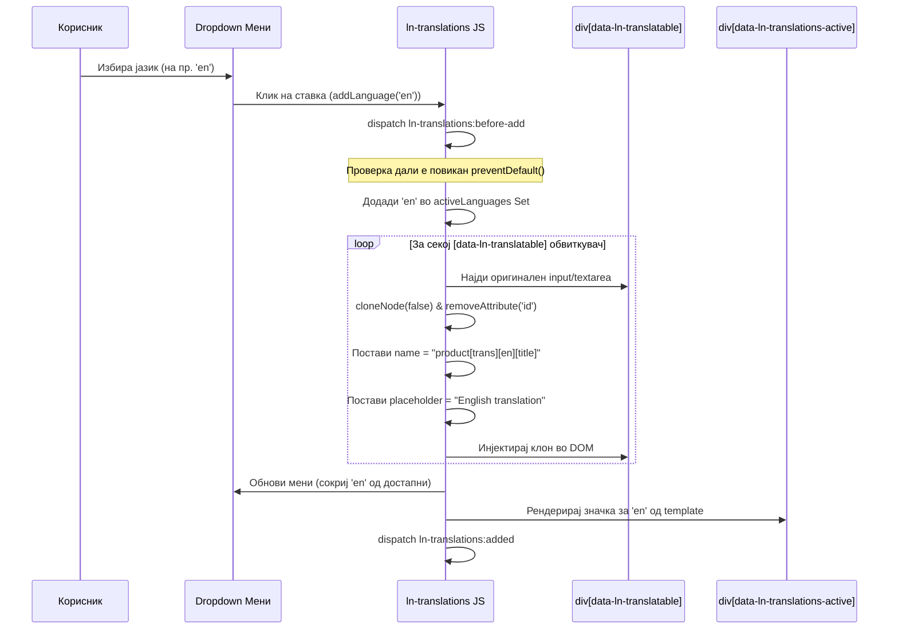

# 🔤 ln-translations

> **Класификација:** 🟢 Едноставна компонента (Layer 1 - i18n Form Manager)  
> **Изворна датотека:** [ln-translations.js](../../js/ln-translations/src/ln-translations.js)

---

## 1. Заднинско дејство и одговорност

`ln-translations` е помошна компонента наменета за динамичко управување со повеќејазични полиња во рамките на веб формите. Овозможува корисникот во реално време да додава и отстранува преводи за конкретни внесови (на пр. име на производ на македонски, англиски, албански или српски јазик).

*   **Главна одговорност:** При секое повикување на `addLanguage`, повторно ги пребарува обвиткувачите на повеќејазични полиња (`data-ln-translatable`) во DOM (нема постојан observer врз нив), динамички ги клонира внесните контроли за новоизбраните јазици, ги форматира имињата на полињата во низа формат (пр. `trans[en][title]` или `product[trans][en][title]`) за серверот и управува со отстранувањето на преводите и нивните значки.
*   **Детекција на серверски преводи (Hydration):** При иницијализација, компонентата ги скенира постоечките полиња за превод генерирани од серверот (означени со `data-ln-translatable-lang`) и соодветно ги гради активните јазични значки и менито за избор.
*   **Спречување на ID дуплирање:** При клонирање на инпутите, оригиналните `id` атрибути се отстрануваат за да се одржи DOM валидноста и ARIA пристапноста.
*   **Ортогоналност (Што НЕ прави):**
    *   **НЕ врши AJAX испраќање:** Не комуницира директно со бекендот; се потпира на нативниот `form` или [`ln-form`](./ln-form.md).
    *   **UI текстот е конфигурабилен:** Placeholder-от и `aria-label` за копчето за бришење се читаат преку `data-ln-translations-placeholder` / `data-ln-translations-remove-label` (со англиски стандардни вредности), а не се хардкодирани во кодот.
    *   **НЕ отвора сопствени модали/дијалози:** Се однесува исклучиво внатре во својот DOM контејнер.

---

## 2. Минимален HTML Маркап и Варијанти на Употреба

### 2.1 Базен HTML Маркап
За правилна работа, компонентата бара глобални HTML темплејти за значката за јазик (`ln-translations-badge`) и за ставката во менито (`ln-translations-menu-item`).

```html
<div data-ln-translations 
     data-ln-translations-default="mk"
     data-ln-translations-locales='{"en": "English", "sq": "Shqip", "sr": "Srpski"}'>
     
    <!-- Контејнер за активни јазични значки -->
    <div data-ln-translations-active class="language-badges"></div>

    <!-- Избор на нов јазик преку Dropdown -->
    <div data-ln-dropdown class="dropdown">
        <button type="button" data-ln-translations-add class="btn">Додади превод</button>
        <div data-ln-toggle="close" class="dropdown-menu">
            <!-- Dynamic dropdown items generated from template -->
        </div>
    </div>

    <!-- Повеќејазично поле во формата -->
    <div class="form-element" data-ln-translatable="title" data-ln-translations-prefix="product">
        <label for="product-title">Наслов (Стандарден):</label>
        <input type="text" id="product-title" name="product[title]" required />
        <!-- Генерираните клонови за преводи се инјектираат тука -->
    </div>

    <!-- ────────────────────────────────────────── -->
    <!-- Темплејти потребни за компонентата -->
    
    <!-- Темплејт за јазична значка (Badge) -->
    <template data-ln-template="ln-translations-badge">
        <span class="badge" data-ln-translations-lang>
            <span></span>
            <button type="button" class="btn-close" aria-label="Remove">&times;</button>
        </span>
    </template>

    <!-- Темплејт за ставка во менито -->
    <template data-ln-template="ln-translations-menu-item">
        <button type="button" class="dropdown-item" data-ln-translations-lang></button>
    </template>
</div>
```

---

## 3. Декларативен API Договор (Атрибути и Настани)

### 3.1 Табела со атрибути

| Атрибут | Применлив елемент | Тип | Стандардна вредност | Опис |
| :--- | :--- | :--- | :--- | :--- |
| `data-ln-translations` | Контејнер / `<form>` | `Flag` | — | Ознака за иницијализација на компонентата. |
| `data-ln-translations-default` | Контејнер | `String` | `""` | Стандарден јазик (на пр. `mk`). Поставува `data-ln-translatable-lang` на оригиналните полиња. |
| `data-ln-translations-locales` | Контејнер | `JSON` | `{en: "English", sq: "Shqip", sr: "Srpski"}` | JSON мапирање на овозможени јазици со нивните лабели. |
| `data-ln-translations-active` | Контејнер | `Flag` | — | DOM контејнер за рендерирање на значките за активни јазици. |
| `data-ln-translations-add` | Копче | `Flag` | — | Копче за активирање на менито за додавање јазик (се крие кога сите јазици се додадени). |
| `data-ln-translations-placeholder` | Контејнер | `String` | `{lang} translation` | Темплејт за placeholder на клонираните полиња; `{lang}` се заменува со името на јазикот. |
| `data-ln-translations-remove-label` | Контејнер | `String` | `Remove {lang}` | Темплејт за `aria-label` на копчето за бришење значка; `{lang}` се заменува со името на јазикот. |
| `data-ln-translatable` | Обвиткувач | `String` | — | Име на полето за превод (на пр. `title`, `description`). |
| `data-ln-translations-prefix` | Обвиткувач | `String` | `""` | Опционален префикс во името на инпутот (на пр. `product` ќе генерира `product[trans][en][title]`). |
| `data-ln-translatable-lang` | `<input>`, `<textarea>`, `<select>` | `String` | — | Означува клон или претходно изрендерирано поле за одреден јазик. |
| `data-ln-translations-lang` | Внатре во `<template>` (`ln-translations-badge` и `ln-translations-menu-item`) | `Flag` (атрибут-договор) | — | Задолжителен во двата темплејта — кодот бара `frag.querySelector('[data-ln-translations-lang]')` и не рендерира ништо без него. |

### 3.2 DOM Настани (Events API)

#### Барања од надворешни координатори (Слуша)
| Настан | Payload `e.detail` | Опис |
| :--- | :--- | :--- |
| `ln-translations:request-add` | `{ lang: String }` | Бара додавање и клонирање на полиња за наведениот јазик. |
| `ln-translations:request-remove` | `{ lang: String }` | Бара отстранување на полињата за наведениот јазик. |

Слушателите за овие настани се врзани директно на контејнерот (елементот со `data-ln-translations`), не на `document`. Dispatch-от мора да се изврши на самиот контејнер или на негов потомок со `bubbles: true` — dispatch на `document` не стигнува до компонентата.

#### Животен циклус на компонентата (Емитува)
| Настан | Откажлив | Payload `e.detail` | Опис |
| :--- | :--- | :--- | :--- |
| `ln-translations:before-add` | Да (`preventDefault()`) | `{ target: HTMLElement, lang: String, langName: String }` | Се емитува пред клонирање на полињата. |
| `ln-translations:added` | Не | `{ target: HTMLElement, lang: String, langName: String }` | Се емитува откако полињата и значките се инјектирани. |
| `ln-translations:before-remove` | Да (`preventDefault()`) | `{ target: HTMLElement, lang: String }` | Се емитува пред отстранување на клоновите. |
| `ln-translations:removed` | Не | `{ target: HTMLElement, lang: String }` | Се емитува откако клоновите се избришани од DOM. |

### 3.3 Јавен JS API (преку `el.lnTranslations`)

```javascript
// Додавање на нов јазик со опционални почетни вредности за полињата
el.lnTranslations.addLanguage('en', { title: 'Product Title', description: 'Product Desc' });

// Отстранување на јазик
el.lnTranslations.removeLanguage('en');

// Проверка на активен јазик
const isEnglishActive = el.lnTranslations.hasLanguage('en');

// Земање на сите активни јазици (Set)
const activeLangs = el.lnTranslations.getActiveLanguages();

// Уништување на инстанцата и чистење на емитувачите
el.lnTranslations.destroy();
```

---

## 4. CSS Стилизирање и Поведенски Концепт

### 4.1 SCSS Стилизирање
За подобра прегледност, клонираните полиња се стилизираат со визуелна индикација (на пр. лева маргина и различна позадина):

```scss
[data-ln-translatable] {
    display: flex;
    flex-direction: column;
    gap: 0.5rem;

    // Стил за клонирани полиња
    input[data-ln-translatable-lang], 
    textarea[data-ln-translatable-lang] {
        border-left: 3px solid hsl(var(--color-primary-light));
        background-color: hsl(var(--color-neutral-100));
        
        &::placeholder {
            font-style: italic;
        }
    }
}

.language-badges {
    display: flex;
    flex-wrap: wrap;
    gap: 0.5rem;
    margin-bottom: 1rem;
    
    .badge {
        display: inline-flex;
        align-items: center;
        gap: 0.35rem;
        padding: 0.25rem 0.5rem;
        background-color: hsl(var(--color-neutral-200));
        border-radius: 4px;
        font-size: 0.85rem;
        
        button {
            background: transparent;
            border: none;
            cursor: pointer;
            font-weight: bold;
            line-height: 1;
        }
    }
}
```

### 4.2 Поведенски концепти
1. **DOM Клонирање:** `cloneNode()` никогаш не копира event listeners (тие не се "отстрануваат" — едноставно не постојат на клонот). `id` атрибутот СЕ копира и потоа експлицитно се отстранува (`removeAttribute('id')`) за да се спречи дуплирање. За `<select>` елементи клонирањето е длабоко (`cloneNode(true)`) за да се зачуваат `<option>` децата; за `<input>`/`<textarea>` клонирањето е плитко (`cloneNode(false)`).
2. **Нумерирање на вредности:** Вредноста на името на клонот користи стандардизирана синтакса за низи:
   - Без префикс: `trans[lang][field_name]`
   - Со префикс: `prefix[trans][lang][field_name]`
3. **Автоматско криење на копчето за додавање:** Кога сите овозможени јазици ќе се додадат, `data-ln-translations-add` автоматски добива нативниот `hidden` атрибут.

---

## 5. Пристапност (ARIA) и Чести Грешки

### 5.1 ARIA & Тастатурна пристапност
- **Конфигурабилен Placeholder:** Секој клон добива placeholder преку `data-ln-translations-placeholder` (стандардно `"{lang} translation"`, со `{lang}` заменето со името на јазикот), што обезбедува контекст за пристапност и корисници со читачи на екран.
- **Интерактивни копчиња:** Копчето за бришење на значката добива `aria-label` преку `data-ln-translations-remove-label` (стандардно `"Remove {lang}"`).
- **Тастатура:** Копчињата за избор на јазик и за бришење реагираат на стандардни клик дејства и тастатурна навигација (Enter / Space).

### 5.2 Чести грешки (Anti-patterns)
- ❌ **Невалиден JSON во `data-ln-translations-locales`:** Користење на единечни наводници наместо валиден JSON со двојни наводници предизвикува грешка во парсирањето и враќање на стандардните јазици (`en`, `sq`, `sr`).
- ❌ **Рачно додавање на `id` на клонирани полиња:** Повторното додавање на `id` атрибути во клоновите ги крши ARIA спецификациите за уникатни ID-а во HTML документот.
- ❌ **Изоставување на темплејтите `ln-translations-badge` или `ln-translations-menu-item`:** Придонесува компонентата да не може да го изрендерира менито за избор или значките.

---

## 6. Дијаграм на Текот и Животен Циклус



---

## 7. Поврзани Компоненти

*   [`ln-form`](./ln-form.md) — Обвиткувачка форма која ги собира и испраќа генерираните преводи какo структурирани податоци.
*   [`ln-dropdown`](./ln-dropdown.md) — Се користи за преклопното мени за избор на достапни јазици.
*   [`ln-toggle`](./ln-toggle.md) — Се користи за управување со состојбата (close/open) на менито при избор на јазик.
*   [`ln-validate`](./ln-validate.md) — Врши валидација на внесените вредности и во клонираните полиња за превод.
