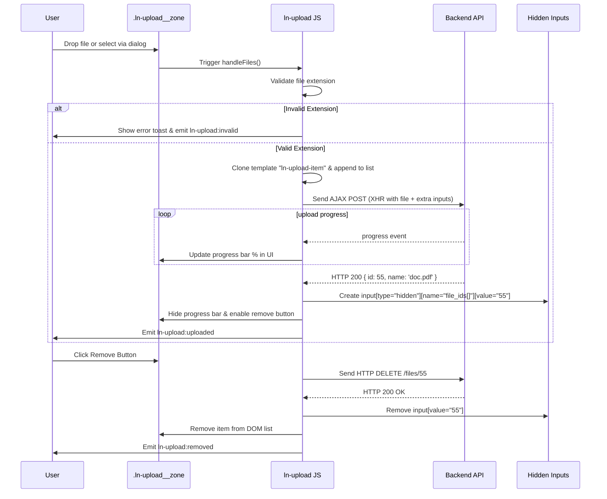

# 📁 ln-upload
> **Класификација:** 🟢 Едноставна компонента (Layer 1 - File Upload)

---

## 1. Заднинско дејство и одговорност
`ln-upload` е едноставна визуелна компонента која овозможува напреден кориснички интерфејс за прикачување датотеки преко Drag-and-Drop или традиционален избор, проследено со визуелизација на прогресот на прикачување во реално време.

*   **Главна Одговорност:** ОбезбедуваDrag-and-Drop зона (`.ln-upload__zone`), прикажува листа на прикачени датотеки (`.ln-upload__list`), управува со процесот на AJAX испраќање (XMLHttpRequest) со прогрес барови и овозможува бришење на датотеките од серверот преку DELETE барања.
*   **Интеграција во форми (Form Binding):** По секое успешно прикачување, компонентата динамички инјектира сокриени полиња во DOM-от (`<input type="hidden" name="file_ids[]" value="serverId">`). Ова овозможува родителската форма при испраќање нативно да ги достави Идентификаторите (IDs) на сите прикачени датотеки до бекендот.
*   **Паралелен Внес (Payload Enrichment):** При прикачување на датотеката, компонентата автоматски ги собира сите соседни полиња (инпути) од контејнерот и ги испраќа како FormData заедно со датотеката (пр. за пренос на контекст или категории).
*   **Безбедност (CSRF & XSS):** Автоматски го чита CSRF токенот од `<meta name="csrf-token">` и го додава во `X-CSRF-TOKEN` заглавието на секое POST/DELETE барање. Дополнително, врши валидација на екстензиите на клиентот и користи сигурно темплејт рендерирање.
*   **Тост Нотификации:** Се интегрира со `ln-toast` за инстантно информирање при грешки при прикачување или надминување на правилата за екстензии.

---

## 2. Минимален HTML Маркап и Варијанти на Употреба

```html
<!-- Стандарден прикачувач со поддршка за PDF и Слики -->
<div data-ln-upload="/api/documents/upload"
     data-ln-upload-accept=".pdf,.jpg,.png"
     data-ln-upload-context="user_profile"
     class="ln-upload">
     
    <!-- Drag & Drop Зона -->
    <div class="ln-upload__zone">
        <svg class="ln-icon"><use href="#ln-upload-cloud"></use></svg>
        <p>Повлечете датотеки тука или кликнете за избор</p>
    </div>

    <!-- Листа за приказ на прогрес и прикачени фајлови -->
    <ul class="ln-upload__list"></ul>

    <!-- Локализиран речник за грешки и акции (Dict) -->
    <ul hidden data-ln-upload-dict>
        <li data-ln-upload-dict="invalid-type">Избраниот формат не е дозволен.</li>
        <li data-ln-upload-dict="invalid-title">Грешен формат</li>
        <li data-ln-upload-dict="upload-failed">Грешка при прикачување.</li>
        <li data-ln-upload-dict="remove">Отстрани</li>
        <li data-ln-upload-dict="error-title">Грешка во мрежата</li>
    </ul>
</div>
```

---

## 3. Декларативен API Договор (Атрибути и Настани)

| Атрибут | Тип | Опис |
| :--- | :--- | :--- |
| `data-ln-upload` | `String` | Го активира компонентот и ја дефинира POST URL адресата за прикачување (default: `/files/upload`). |
| `data-ln-upload-accept` | `String` | Запирка-одделени дозволени екстензии (пр. `.pdf,.jpg`). |
| `data-ln-upload-context` | `String` | Опционална вредност за контекст која ќе биде испратена во `context` полето со секое барање. |
| `data-ln-upload-delete` | `String` | URL шема за DELETE барања (default: замена на `/upload` со `/{id}`). |

### Настани (Емитува)
| Настан | Payload `e.detail` | Опис |
| :--- | :--- | :--- |
| `ln-upload:invalid` | `{ file, message }` | Се емитува кога избраната датотека не е дозволена според екстензијата. |
| `ln-upload:uploaded` | `{ localId, serverId, name }` | Се емитува по успешно прикачување и зачувување на датотеката на серверот. |
| `ln-upload:error` | `{ file, message }` | Се емитува при грешка од серверот или мрежен прекин. |
| `ln-upload:removed` | `{ localId, serverId }` | Се емитува кога датотеката е успешно избришана од серверот (DELETE). |
| `ln-upload:cleared` | `{}` | Се емитува кога ќе се повика методот `clear()` од JS API. |

### Јавен JS API (преку `container.lnUploadAPI`)
*   **`getFileIds()`**: Враќа низа со сите серверски IDs на успешно прикачените датотеки.
*   **`getFiles()`**: Враќа низа со комплетни објекти на датотеките.
*   **`clear()`**: Ги брише сите прикачени датотеки од серверот и ја празни листата.
*   **`destroy()`**: Ги отстранува сите слушатели на настани и ја чисти инстанцата.

---

## 4. CSS Стилизирање и Поведенски Концепт
Компонентата менува класи на зоната при влечење датотека и на елементите од листата за време на прикачување:

```scss
.ln-upload {
    // Зона за влечење
    .ln-upload__zone {
        border: 2px dashed var(--border-color, #cbd5e1);
        padding: 2rem;
        text-align: center;
        cursor: pointer;
        transition: background-color 0.2s, border-color 0.2s;
        
        // Класа при влечење фајл над зоната
        &.ln-upload__zone--dragover {
            background-color: var(--color-primary-lightest, #eff6ff);
            border-color: var(--color-primary, #3b82f6);
        }
    }

    // Листа со датотеки
    .ln-upload__list {
        list-style: none;
        padding: 0;
        margin-top: 1rem;
    }

    // Состојби на ставка од листата
    .ln-upload__item {
        display: flex;
        align-items: center;
        gap: 0.5rem;
        padding: 0.5rem;
        border: 1px solid var(--border-color);
        margin-bottom: 0.5rem;
        position: relative;
        
        &.ln-upload__item--uploading {
            background-color: var(--color-gray-lightest);
        }
        
        &.ln-upload__item--error {
            border-color: var(--color-danger, #ef4444);
            color: var(--color-danger);
        }
        
        &.ln-upload__item--deleting {
            opacity: 0.5;
            pointer-events: none;
        }
    }

    // Прогрес лента внатре во ставката
    .ln-upload__progress {
        position: absolute;
        bottom: 0;
        left: 0;
        width: 100%;
        height: 3px;
        background-color: transparent;
        
        .ln-upload__progress-bar {
            height: 100%;
            background-color: var(--color-primary);
            width: 0%;
            transition: width 0.1s linear;
        }
    }
}
```

---

## 5. Пристапност (ARIA) и Чести Грешки
*   **Пристапност:** Бидејќи Drag-and-Drop зоните не се нативно пристапни за корисници со тастатура или екрански читачи, инпутот `input[type="file"]` е скриен во DOM дрвото, но со клик на зоната се отвора нативниот дијалог. За најдобра практика, осигурајте се дека зоната има соодветен `tabindex="0"` и реагира на Space/Enter за да го активира изборот на датотеки.
*   **Честа грешка 1:** Непоставување на мета тагот за CSRF токен во заглавието на страницата (`<meta name="csrf-token" content="...">`). Доколку овој таг фали, сите барања за прикачување или бришење ќе бидат одбиени од серверот (најчесто со HTTP 419 или 403 статус).
*   **Честа грешка 2:** Непоставување на класата `.ln-upload__zone` или `.ln-upload__list` во контејнерот. Компонентата нема да се иницијализира и ќе прикаже предупредување во конзолата бидејќи не знае каде да ги прикаже датотеките.

---

## 6. Дијаграм на Текот и Животен Циклус



---

## 7. Поврзани Компоненти
*   **`ln-form`**: Формата во која се наоѓа `ln-upload`. При поднесување, таа автоматски ги собира сите инјектирани `file_ids[]` вредности.
*   **`ln-toast`**: Прима настани за грешки од `ln-upload` и прикажува визуелни известувања до корисникот.
