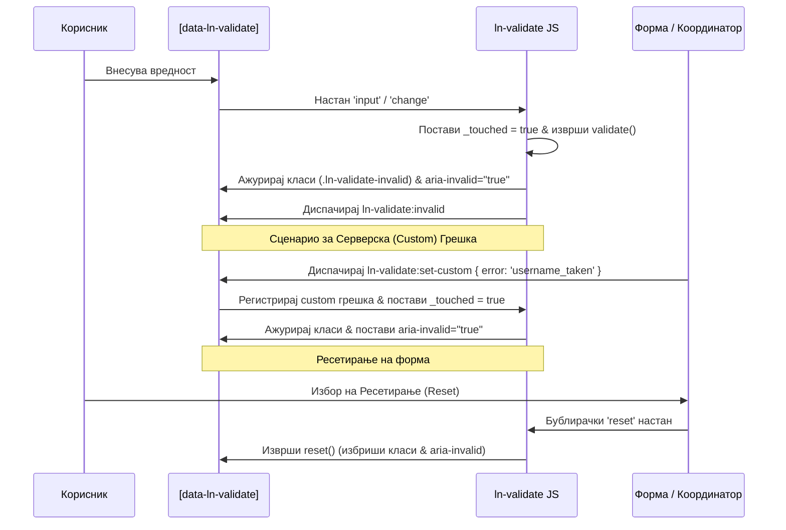

# 🛡️ ln-validate

> **Класификација:** 🟢 Едноставна компонента / Внатрешен валидациски примитив (Simple Component / Validity State Adapter)

---

## 1. Заднинско дејство и одговорност

`ln-validate` е лесен, изолиран примитив за визуелна валидација на кориснички внес (лоциран во [`js/ln-validate/src/ln-validate.js`](../../js/ln-validate/src/ln-validate.js)) кој ја обвиткува нативната `ValidityState` API на прелистувачот. Неговата примарна задача е да врши синхронизација помеѓу моменталната валидност на инпутот и придружните визуелни елементи за прикажување грешки во DOM-от.

За да се спречи агресивното прикажување на грешки веднаш при вчитување на страницата, компонентата користи **порта на допир (touched gate)** — визуелните индикатори се активираат дури откако корисникот ќе направи прва интеракција со полето.

> [!IMPORTANT]
> **Што `ln-validate` НЕ прави (Orthogonality Doctrine):**
> * **НЕ го блокира поднесувањето на формите** — спречувањето на `submit` настанот при невалидна состојба е исклучива одговорност на координаторот `ln-form`.
> * **НЕ чува сопствени правила за валидација** во JavaScript — во целост се потпира на стандардните HTML5 атрибути (`required`, `minlength`, `pattern`, `type="email"`, итн.).
> * **НЕ отвора дијалози, модали или тост-нотификации** — сите визуелни промени се строго ограничени на рамките на придружниот контејнер `.form-element`.
> * **НЕ врши преформатирање или чистење на вредностите** (пр. trim, lowercase).

---

## 2. Минимален HTML Маркап и Варијанти на Употреба

Компонентата бара инпутот да биде спакуван во контејнер со класа `.form-element` за да се обезбеди правилно наоѓање на придружниот список за грешки.

### Варијанта 1: Нативна валидација (Текстуално поле)

```html
<div class="form-element">
    <label for="user-email">Е-пошта:</label>
    <input 
        type="email" 
        id="user-email" 
        name="email" 
        required 
        pattern=".+@.+\..+"
        data-ln-validate 
    />
    
    <!-- Листа со грешки поврзани со полето -->
    <ul class="form-errors" data-ln-validate-errors>
        <li class="hidden" data-ln-validate-error="required">Полето е задолжително.</li>
        <li class="hidden" data-ln-validate-error="typeMismatch">Внесете валидна е-адреса.</li>
        <li class="hidden" data-ln-validate-error="patternMismatch">Е-поштата мора да содржи @ и точка.</li>
    </ul>
</div>
```

### Варијанта 2: Валидација на Select / Изборни елементи

Приказот за грешка кај `isChangeBased` елементи реагира директно на `change` настани.

```html
<div class="form-element">
    <label for="user-country">Држава:</label>
    <select id="user-country" name="country" required data-ln-validate>
        <option value="">Изберете опција...</option>
        <option value="mk">Македонија</option>
    </select>
    
    <div data-ln-validate-errors>
        <p class="hidden" data-ln-validate-error="required">Мора да изберете држава.</p>
    </div>
</div>
```

### Варијанта 3: Внесување на Custom (Серверски) грешки

За валидација на правила кои не можат да се изразат преку стандардни HTML5 атрибути (на пр. уникатност на корисничко име на сервер).

```html
<div class="form-element">
    <label for="username">Корисничко име:</label>
    <input type="text" id="username" name="username" required data-ln-validate />
    
    <ul data-ln-validate-errors>
        <li class="hidden" data-ln-validate-error="required">Внесете корисничко име.</li>
        <li class="hidden" data-ln-validate-error="username_taken">Ова корисничко име е зафатено.</li>
    </ul>
</div>
```

---

## 3. Декларативен API Договор (Атрибути и Настани)

### HTML Атрибути

| Атрибут | Тип | Стандардна вредност | Опис |
| :--- | :--- | :--- | :--- |
| `data-ln-validate` | `Flag` | *(Задолжително)* | Го иницира компонентот врз даден `<input>`, `<select>` или `<textarea>`. |
| `data-ln-validate-errors` | `Flag` | `/` | Го означува контејнерот каде се наоѓаат пораките за грешка за тоа поле. |
| `data-ln-validate-error` | `String` | `/` | Вредноста мора да соодветствува на нативен клуч (види подолу) или на custom серверски клуч. |

### Нативни Клучеви за Грешки

| Клуч во HTML | Мапирано ValidityState својство | Нативен Атрибут |
| :--- | :--- | :--- |
| `required` | `valueMissing` | `required` |
| `typeMismatch` | `typeMismatch` | `type="email"`, `type="url"` |
| `tooShort` | `tooShort` | `minlength` |
| `tooLong` | `tooLong` | `maxlength` |
| `patternMismatch` | `patternMismatch` | `pattern` |
| `rangeUnderflow` | `rangeUnderflow` | `min` |
| `rangeOverflow` | `rangeOverflow` | `max` |

---

### Настани што ги слуша (Event Listeners)

| Настан | Payload `e.detail` | Опис |
| :--- | :--- | :--- |
| `ln-validate:set-custom` | `{ error: 'клуч' }` | Поставува рачна (custom) грешка на полето. Ја означува како `_touched = true`, го поставува инпутот во невалидна состојба и ја прикажува соодветната порака. |
| `ln-validate:clear-custom` | `{ error: 'клуч' }` *(Опционално)* | Ја отстранува специфичната custom грешка (или сите custom грешки ако не е пратен клуч) и ја проверува нативната валидност за да ја ажурира состојбата. |

### Настани што ги емитува (Emitted Events)

Сите настани се диспачираат со својството `{ bubbles: true }`.

| Настан | Payload `e.detail` | Опис |
| :--- | :--- | :--- |
| `ln-validate:valid` | `{ target: Node, field: String }` | Се емитува кога полето ќе премине во валидна состојба. |
| `ln-validate:invalid` | `{ target: Node, field: String }` | Се емитува кога полето ќе премине во невалидна состојба. |
| `ln-validate:destroyed` | `{ target: Node }` | Се емитува кога компонентата се уништува во DOM-от. |

---

### JavaScript Програмски API

Координаторите или надворешните скрипти можат да пристапат до инстанцата преку својството `lnValidate` на самиот DOM елемент:

*   **`element.lnValidate.isValid`** *(Getter)*: Враќа `true` доколку елементот е нативно валиден и нема активни custom грешки.
*   **`element.lnValidate.validate()`**: Рачно ја стартува процедурата за валидација на инпутот (ги ажурира визуелните класи, ги прикажува грешките и емитува настани).
*   **`element.lnValidate.reset()`**: Го ресетира полето во неговата првична (недопрена) состојба — ги брише визуелните класи, ги трга ARIA индикаторите и ги крие сите пораки за грешки.
*   **`element.lnValidate.destroy()`**: Ги чисти регистрираните слушатели на настани, ја брише инстанцата од DOM елементот и емитува `destroyed` настан.

---

## 4. CSS Стилизирање и Поведенски Концепт

Компонентата автоматски ги менаџира визуелните класи на инпутот, кои служат за дефинирање стилови во CSS/SCSS слојот:

*   **`ln-validate-valid`**: Се додава кога инпутот е валиден и корисникот веќе има направено интеракција со него (`_touched` состојба).
*   **`ln-validate-invalid`**: Се додава кога инпутот е невалиден и корисникот веќе направил интеракција или пристигнал настан за custom грешка.
*   **`hidden`**: Класа за криење на неактивните пораки за грешка (`display: none;`).

### Автоматска интеграција со Форми (Reset Hook)

`ln-validate` автоматски ја наоѓа формата во која се наоѓа (`dom.form`). Доколку формата се ресетира (нативно или преку `form.reset()`), `ln-validate` автоматски го пресретнува тој настан и ги брише сите класи и видливи грешки, враќајќи го полето во неговата примарна „чиста“ состојба.

---

## 5. Пристапност (ARIA) и Чести Грешки

### Пристапност (ARIA)
*   **`aria-invalid`**: Компонентата автоматски управува со овој атрибут. При валидација, атрибутот се поставува на `aria-invalid="false"` кога полето е валидно, односно `aria-invalid="true"` кога е невалидно. При ресетирање, атрибутот се отстранува целосно.
*   **`aria-describedby`** *(Рачна интеграција)*: За екранските читачи да ја прочитаат специфичната текстуална грешка кога полето ќе го добие фокусот, се препорачува развивачот рачно да го додаде атрибутот `aria-describedby` на инпутот, поврзан со ID-то на контејнерот со грешки:
    ```html
    <input type="email" id="email" aria-describedby="email-error-list" data-ln-validate>
    <ul id="email-error-list" data-ln-validate-errors>...</ul>
    ```

### Чести Грешки и Анти-патерни
*   **Изоставување на `.form-element` контејнерот:** Бидејќи `ln-validate` бара грешки користејќи `dom.closest('.form-element')`, доколку овој контејнер не постои во DOM-от, пораките за грешка нема да се појават.
*   **Поставување на `data-ln-validate` на самата форма:** Овој атрибут се става исклучиво на поединечните влезни полиња (`<input>`, `<select>`, `<textarea>`). За целата форма се користи координаторот `ln-form`.

---

## 6. Дијаграм на Текот и Животен Циклус



---

## 7. Поврзани Компоненти

*   **`ln-form`**: Координатор на ниво на форма кој ги менаџира настаните за поднесување, врши целосна формална проверка на сите влезни полиња и ги дистрибуира серверските custom грешки кон соодветните инпути преку `ln-validate:set-custom`.
*   **`ln-ajax`**: Компонента за асинхроно праќање податоци која соработува со `ln-form` и при грешка 422 ги враќа невалидните полиња за приказ во `ln-validate`.
