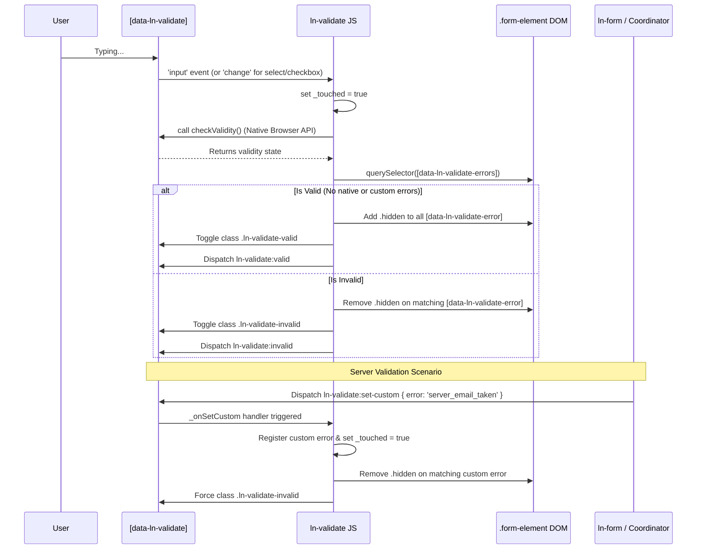

# 🛡️ ln-validate
> **Класификација:** 🟢 Едноставна компонента (Layer 1)

---

## 1. Заднинско дејство и одговорност
`ln-validate` е едноставна компонента одговорна исклучиво за визуелна валидација на внесени податоци во HTML форми, базирана на стандардната `ValidityState` API на прелистувачот.
Нејзината основна улога е да врши синхронизација помеѓу внатрешната валидност на инпутот (пр. `required`, `pattern`, `minlength`, `maxlength`) и прикажувањето на соодветни пораки за грешка во DOM-от.
Не влијае на поднесувањето на формата (тоа го контролира `ln-form`), туку само ги менува CSS класите и крие/прикажува `<li>` елементи за грешки во рамките на родителскиот `.form-element` контејнер. 

Исто така, поддржува рачно (custom) наметнување грешки преку CustomEvents (на пр., кога серверот ќе врати одговор дека "е-поштата е веќе регистрирана"). За да се избегне агресивно покажување на грешки при самото отворање на формата, `ln-validate` ги применува визуелните индикатори (т.н. dirty state) само откако корисникот ќе направи интеракција (`_touched` состојба) преку `input` или `change` настани.

---

## 2. Минимален HTML Маркап и Варијанти на Употреба

```html
<!-- Стандардна употреба (Нативна валидација) -->
<div class="form-element">
    <label for="reg-email">Е-пошта:</label>
    <input 
        type="email" 
        id="reg-email" 
        name="email" 
        required 
        pattern=".+@.+\..+"
        data-ln-validate 
    />
    
    <!-- Контејнер со дефинирани грешки кој се наоѓа во истиот .form-element -->
    <ul class="form-errors" data-ln-validate-errors>
        <li class="hidden" data-ln-validate-error="required">Полето е задолжително.</li>
        <li class="hidden" data-ln-validate-error="typeMismatch">Внесете валидна е-пошта.</li>
        <li class="hidden" data-ln-validate-error="patternMismatch">Е-поштата мора да содржи @ и точка.</li>
        <!-- Custom серверска грешка -->
        <li class="hidden" data-ln-validate-error="server_email_taken">Оваа е-пошта е веќе регистрирана.</li>
    </ul>
</div>

<!-- Употреба кај Select елементи (isChangeBased) -->
<div class="form-element">
    <label for="country">Држава:</label>
    <select id="country" name="country" required data-ln-validate>
        <option value="">Изберете...</option>
        <option value="mk">Македонија</option>
    </select>
    
    <ul data-ln-validate-errors>
        <li class="hidden" data-ln-validate-error="required">Мора да изберете држава.</li>
    </ul>
</div>
```

---

## 3. Декларативен API Договор (Атрибути и Настани)

| Атрибут | Тип | Опис |
| :--- | :--- | :--- |
| `data-ln-validate` | `Flag` | Го иницира компонентот врз даден `<input>`, `<select>` или `<textarea>`. |
| `data-ln-validate-errors` | `Flag` | Контејнер (`<ul>` или `<div>`) каде се наоѓаат пораките за грешка за даденото поле. |
| `data-ln-validate-error` | `String` | Мапира нативен `ValidityState` клуч (пр. `required`, `typeMismatch`, `tooShort`, `tooLong`, `patternMismatch`, `rangeUnderflow`, `rangeOverflow`) или custom серверски клуч. |

| Настан (Слуша) | Payload `e.detail` | Опис |
| :--- | :--- | :--- |
| `ln-validate:set-custom` | `{ error: 'клуч' }` | Поставува рачна (custom) грешка на полето. Ова го прави полето невалидно (добива `ln-validate-invalid` класа) и ја прикажува соодветната грешка, и ја означува формата како `_touched = true`. |
| `ln-validate:clear-custom` | `{ error: 'клуч' }` (Опционално) | Ја чисти специфичната custom грешка, или сите custom грешки ако не е наведен клуч, и повторно ја проверува нативната валидност за да ја ажурира визуелната состојба. |

| Настан (Емитува) | Payload `e.detail` | Опис |
| :--- | :--- | :--- |
| `ln-validate:valid` | `{ target: Node, field: String }` | Емитуван кога полето преминува во валидна состојба (нативна и без custom грешки). |
| `ln-validate:invalid` | `{ target: Node, field: String }` | Емитуван кога полето преминува во невалидна состојба. |
| `ln-validate:destroyed` | `{ target: Node }` | Емитуван при уништување (отстранување) на компонентата. |

---

## 4. CSS Стилизирање и Поведенски Концепт
Компонентата автоматски додава/отстранува CSS класи на самиот инпут елемент, кои потоа се користат за визуелен фидбек.
*   **`ln-validate-valid`**: Се додава кога инпутот е валиден и корисникот веќе има направено интеракција.
*   **`ln-validate-invalid`**: Се додава кога инпутот е невалиден и корисникот веќе има направено интеракција.

Класата `hidden` се користи за криење на `[data-ln-validate-error]` елементите, врз кои CSS Engine-от реагира.

```scss
// Пример SCSS за интеграција во дизајн системот
.form-element {
    position: relative;
    margin-bottom: 1.5rem;
    
    input, select, textarea {
        border: 1px solid var(--border-color);
        transition: border-color 0.2s, box-shadow 0.2s;
        
        // Визуелен фидбек базиран на валидација
        &.ln-validate-invalid {
            border-color: var(--color-danger);
            &:focus { 
                box-shadow: 0 0 0 3px rgba(var(--color-danger-rgb), 0.2); 
            }
        }
        
        &.ln-validate-valid {
            border-color: var(--color-success);
        }
    }
    
    // Стилизирање на контејнерот за грешки
    [data-ln-validate-errors] {
        margin-top: 0.375rem;
        padding-left: 0;
        list-style: none;
        
        [data-ln-validate-error] {
            color: var(--color-danger);
            font-size: 0.875rem;
            
            &.hidden {
                display: none;
            }
        }
    }
}
```

---

## 5. Пристапност (ARIA) и Чести Грешки
*   **ARIA Поврзување:** Иако HTML5 автоматски наметнува некои валидации за екранските читачи преку `required`, идеално е `<input>` елементот да има `aria-describedby` атрибут кој референцира кон ID-то на контејнерот со грешки (`[data-ln-validate-errors]`) за екранските читачи експлицитно да ги прочитаат специфичните custom пораки.
*   **Честа грешка 1:** Непоставување на класата `.form-element` на родителскиот елемент. `ln-validate` во JS користи `dom.closest('.form-element')` за да го пронајде контејнерот со грешки. Доколку структурата е различна, грешките нема да се прикажат.
*   **Честа грешка 2:** Обид за користење на `ln-validate` на самата `<form>` наместо на поединечниот инпут. Атрибутот `data-ln-validate` секогаш се аплицира на `<input>`, `<select>` или `<textarea>`. За валидација на целата форма и спречување на поднесување, координаторот `ln-form` е задолжен.

---

## 6. Дијаграм на Текот и Животен Циклус



---

## 7. Поврзани Компоненти
*   **`ln-form`**: Ја следи состојбата на целата форма и го спречува нејзиното поднесување ако `checkValidity()` на формата враќа `false`. `ln-form` често е тој што испраќа `ln-validate:set-custom` настани кон поединечни `ln-validate` инпути врз основа на серверски JSON одговори (на пр. HTTP 422 Unprocessable Entity од `app-coordinator.js`).
