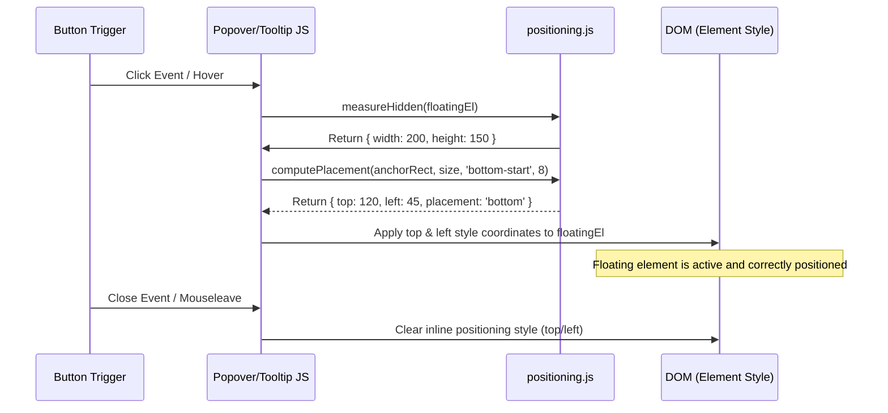

# 📍 positioning.js
> **Класификација:** ⚙️ Нискобуџетен Примитив / Заедничка скрипта (Layer 3 - Floating UI Mechanics)

---

## 1. Заднинско дејство и одговорност
`positioning.js` е нискобуџетна помошна скрипта лоцирана во јадрото (`ln-core`) која обезбедува чисти математички и DOM помошници за прецизно позиционирање на лебдечки интерфејси (floating UI) како што се скокачки прозорци (`ln-popover`), балони за помош (`ln-tooltip`) и паѓачки менија (`ln-dropdown`).

Скриптата извезува две клучни функции:
*   **`computePlacement(...)`**: Чиста функција која пресметува каде треба да се постави лебдечкиот елемент во однос на неговиот корен (anchor) со цел да се избегне излегување од видливиот дел на екранот (viewport). Поддржува префиксни насоки (на пр. `bottom-start`, `top-end`) и доколку нема доволно простор во примарната насока, го ротира елементот според редоследот на алтернативи (`opposite -> perpendicular`).
*   **`measureHidden(...)`**: Динамички ја мери ширина и висината на елементите кои во моментот се сокриени во DOM-от со `display: none` (или `popover` кои се сокриени) со цел да се добијат точните димензии потребни за пресметка на позицијата пред да се изврши визуелното отворање.

---

## 2. Минимален HTML Маркап и Варијанти на Употреба

Бидејќи се работи за инфраструктурна JS скрипта, таа не се иницира директно преку HTML атрибути, туку се увезува и користи од другите Layer 1/2 компоненти.

```javascript
import { computePlacement, measureHidden } from '../ln-core/positioning.js';

// Пример за позиционирање на скокачки панел (popover)
const anchor = document.getElementById('trigger-button');
const popover = document.getElementById('popover-panel');

// 1. Измери ги димензиите на скриениот панел
const size = measureHidden(popover);

// 2. Пресметај ги координатите
const anchorRect = anchor.getBoundingClientRect();
const coords = computePlacement(anchorRect, size, 'bottom-start', 8);

// 3. Нанеси ги координатите во стиловите
popover.style.top = coords.top + 'px';
popover.style.left = coords.left + 'px';
```

---

## 3. Декларативен API Договор (Атрибути и Настани)

Скриптата извезува две функции со следните потписи:

### `computePlacement(anchorRect, floatingSize, preferred, offset)`
*   `anchorRect` (DOMRect): Границите на сидрото (копчето) добиени преку `getBoundingClientRect()`.
*   `floatingSize` (`{width, height}`): Димензиите на лебдечкиот елемент.
*   `preferred` (`String`): Претпочитана позиција (на пр. `top`, `bottom-start`, `left-end`).
*   `offset` (`Integer`): Растојание во пиксели помеѓу сидрото и лебдечкиот елемент.
*   **Враќа:** `{ top: Float, left: Float, placement: String }` каде `placement` ја означува победничката страна.

### `measureHidden(el)`
*   `el` (HTMLElement): Скриениот елемент со `display: none` или скриен со popover однесување.
*   **Враќа:** `{ width: Integer, height: Integer }` со реалните димензии на елементот.

---

## 4. CSS Стилизирање и Поведенски Концепт
Елементите кои се позиционираат лебдечки на екранот мора да бидат стилизирани со `position: fixed` или `position: absolute` во нивните CSS класи за да можат правилно да ги прифатат доделените стилови за висина и ширина од JS пресметката.

```scss
// Пример во co-located стиловите на ln-popover
[data-ln-popover] {
    position: fixed; // Задолжително за правилно позиционирање со positioning.js
    z-index: 1000;
    will-change: top, left; // Перформанси на прелистувачот
}
```

---

## 5. Пристапност (ARIA) и Чести Грешки
*   **Пристапност:** Лебдечките елементи кои се позиционираат надвор од нормалниот DOM тек (преку Popover API или апсолутно позиционирање) можат да го нарушат редоследот на тастатурната навигација (Tab Order). Корисникот кога ќе стисне Tab на копчето за активирање нема лесно да стигне до лебдечкиот прозорец ако не е соодветно поврзан. Секогаш користете логички фокус менаџмент (како кај `ln-popover`) за програмски да го пренасочите фокусот внатре во содржината.
*   **Честа грешка 1:** Неовозможување на `position: fixed` или `position: absolute` во CSS за позиционираниот елемент. Доколку елементот остане со `position: static`, пресметаните стилови `top` и `left` ќе бидат игнорирани од прелистувачот и лебдечкиот елемент ќе се исцрта на погрешна позиција на дното од страницата.

---

## 6. Дијаграм на Текот и Животен Циклус



---

## 7. Поврзани Компоненти
*   **`ln-popover`**: Го користи `computePlacement` за управување со својата визуелна позиција.
*   **`ln-tooltip`**: Се потпира на `computePlacement` за позиционирање на балоните за помош над/под елементите.
*   **`ln-dropdown`**: Користи `computePlacement` за правилно позиционирање на паѓачките листи.
