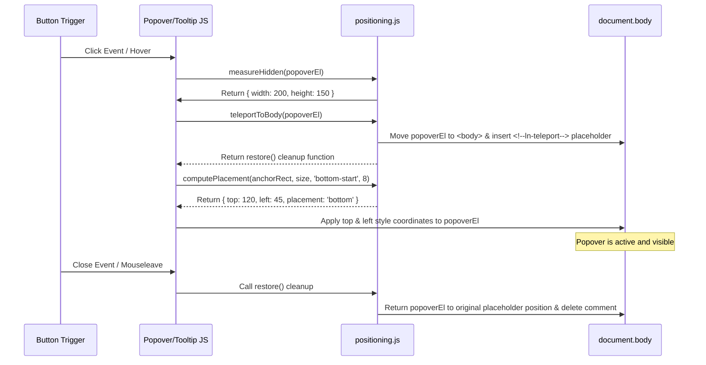

# 📍 positioning.js
> **Класификација:** ⚙️ Нискобуџетен Примитив / Заедничка скрипта (Layer 3 - Floating UI Mechanics)

---

## 1. Заднинско дејство и одговорност
`positioning.js` е нискобуџетна помошна скрипта лоцирана во јадрото (`ln-core`) која обезбедува чисти математички и DOM помошници за прецизно позиционирање на лебдечки интерфејси (floating UI) како што се скокачки прозорци (`ln-popover`), балони за помош (`ln-tooltip`) и паѓачки менија (`ln-dropdown`).

Скриптата извезува три клучни функции:
*   **`computePlacement(...)`**: Чиста функција која пресметува каде треба да се постави лебдечкиот елемент во однос на неговиот корен (anchor) со цел да се избегне излегување од видливиот дел на екранот (viewport). Поддржува префиксни насоки (на пр. `bottom-start`, `top-end`) и доколку нема доволно простор во примарната насока, го ротира елементот според редоследот на алтернативи (`opposite -> perpendicular`).
*   **`teleportToBody(...)`**: Се користи за т.н. "телепортирање" на лебдечкиот елемент директно во коренот на документот (`<body>`). Ова овозможува елементот да ги избегне ограничувањата на родителските контејнери како што се `overflow: hidden` или `position: relative` кои можат да го скратат неговиот приказ. Притоа, вметнува привремен HTML коментар `<!--ln-teleport-->` за да знае точно каде да го врати елементот во DOM дрвото при чистење.
*   **`measureHidden(...)`**: Динамички ја мери ширина и висината на елементите кои во моментот се сокриени во DOM-от со `display: none` со цел да се добијат точните димензии потребни за пресметка на позицијата пред да се изврши визуелното отворање.

---

## 2. Минимален HTML Маркап и Варијанти на Употреба

Бидејќи се работи за инфраструктурна JS скрипта, таа не се иницира директно преку HTML атрибути, туку се увезува и користи од другите Layer 1/2 компоненти.

```javascript
import { computePlacement, teleportToBody, measureHidden } from '../ln-core/positioning.js';

// Пример за позиционирање на скокачки панел (popover)
const anchor = document.getElementById('trigger-button');
const popover = document.getElementById('popover-panel');

// 1. Измери ги димензиите на скриениот панел
const size = measureHidden(popover);

// 2. Телепортирај го панелот во body за да избегнеш скратување
const restoreDOM = teleportToBody(popover);

// 3. Пресметај ги координатите
const anchorRect = anchor.getBoundingClientRect();
const coords = computePlacement(anchorRect, size, 'bottom-start', 8);

// 4. Нанеси ги координатите во стиловите
popover.style.top = coords.top + 'px';
popover.style.left = coords.left + 'px';

// 5. Врати го во DOM при затворање
// restoreDOM();
```

---

## 3. Декларативен API Договор (Атрибути и Настани)

Скриптата извезува три функции со следните потписи:

### `computePlacement(anchorRect, floatingSize, preferred, offset)`
*   `anchorRect` (DOMRect): Границите на сидрото (копчето) добиени преку `getBoundingClientRect()`.
*   `floatingSize` (`{width, height}`): Димензиите на лебдечкиот елемент.
*   `preferred` (`String`): Претпочитана позиција (на пр. `top`, `bottom-start`, `left-end`).
*   `offset` (`Integer`): Растојание во пиксели помеѓу сидрото и лебдечкиот елемент.
*   **Враќа:** `{ top: Float, left: Float, placement: String }` каде `placement` ја означува победничката страна.

### `teleportToBody(el)`
*   `el` (HTMLElement): Елементот кој треба да се премести на крајот на `<body>`.
*   **Враќа:** `Function` (чистач/cleanup). Повикувањето на оваа функција го отстранува коментарот и го враќа елементот на неговата првобитна DOM позиција.

### `measureHidden(el)`
*   `el` (HTMLElement): Скриениот елемент со `display: none`.
*   **Враќа:** `{ width: Integer, height: Integer }` со реалните димензии на елементот.

---

## 4. CSS Стилизирање и Поведенски Концепт
Елементите кои се телепортираат во `body` мора да бидат стилизирани со `position: fixed` или `position: absolute` во нивните CSS класи за да можат правилно да ги прифатат доделените стилови за висина и ширина од JS пресметката.

```scss
// Пример во co-located стиловите на ln-popover
[data-ln-popover] {
    position: fixed; // Задолжително за правилно телепортирање со positioning.js
    z-index: 1000;
    will-change: top, left; // Перформанси на прелистувачот
}
```

---

## 5. Пристапност (ARIA) и Чести Грешки
*   **Пристапност:** Телепортирањето на елементите на крајот на `<body>` физички го нарушува редоследот на тастатурната навигација (Tab Order). Корисникот кога ќе стисне Tab на копчето за активирање нема лесно да стигне до скокачкиот прозорец бидејќи тој сега е на крајот од DOM стеблото. Секогаш користете логички фокус трапинг (како кај `ln-modal` или `ln-popover`) за програмски да го пренасочите фокусот внатре во телепортираната содржина.
*   **Честа грешка 1:** Изоставување на повикот на вратената `restore()` функција од `teleportToBody`. Доколку развивачот го премести елементот во `body` и при затворање го сокрие со `display: none` без да ја повика функцијата за враќање, елементот ќе се акумулира во `body` секој пат кога ќе се отвори, што доведува до дуплицирање на DOM јазли.
*   **Честа грешка 2:** Неовозможување на `position: fixed` во CSS за телепортираниот елемент. Доколку елементот остане со `position: static` во `body`, пресметаните стилови `top` и `left` ќе бидат игнорирани од прелистувачот и лебдечкиот елемент ќе се исцрта на погрешна позиција на дното од страницата.

---

## 6. Дијаграм на Текот и Животен Циклус



---

## 7. Поврзани Компоненти
*   **`ln-popover`**: Директно го користи `teleportToBody` и `computePlacement` за управување со својата визуелна позиција.
*   **`ln-tooltip`**: Се потпира на `computePlacement` за позиционирање на балоните за помош над/под елементите.
*   **`ln-dropdown`**: Користи внатрешна верзија на мерење димензии за правилно позиционирање на паѓачките листи.
