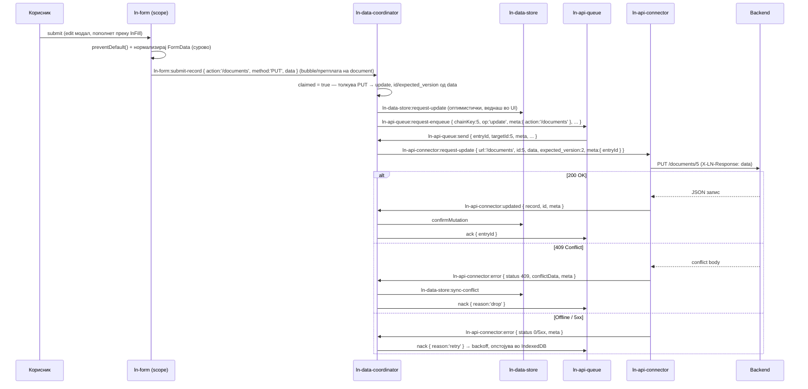

# 📝 Form Write Workflow — „како треба да работи"
> **Статус:** ✅ ИМПЛЕМЕНТИРАНО (2026-07-08) — компонентниот рефактор е завршен; демо-режирањето (§9 чекор 5) е одложено за втор бран. Потрошувачки водич: [write-workflow-guide.md](write-workflow-guide.md)
> **Опфат:** `ln-form`, `ln-data-coordinator`, `ln-ajax` (мал guard), демо-страници
> **Датум:** 2026-07-07

---

## 1. Проблемот што го решаваме

Денес библиотеката има чисти слоеви за data workflow-от — store (оптимистички кеш), queue (offline outbox), connector (транспорт), координатор (медијатор кој сето тоа веќе го оркестрира интернално) — но **влезната точка на мутациите не е декларативна**. Секоја CRUD демо-страница рачно гради `ln-data-store:request-create/update/delete` настани од form payload со inline JS (api-queue.html, coordinator.html, store-usecase.html...). Тоа значи:

*   Секој потрошувач ја препишува истата жица (FormData → detail објект → dispatch).
*   Формата и data слојот немаат договор — врската е ад-хок.
*   Не постои единствена приказна „како се пишува запис" низ двата архетипа (SSR и local-first).

**Целта:** формата е универзалниот write-влез. Едно исто `<form data-ln-form>` парче маркап, а патот на submit-от се одредува декларативно.

---

## 2. Доктрина: скала на пресретнување на submit

`submit` настанот е природната граница. Кој го „присвојува" одредува архетип:

| Скалило | Кој слуша | Што се случува | Архетип |
| :--- | :--- | :--- | :--- |
| 1. Никој | — | Нативен browser submit кон `action` (+ `_method`), HTML одговор | SSR (Laravel) |
| 2. `ln-ajax` | форма со ajax опт-ин | `fetch()` кон `action`, страницата останува | SSR + progressive enhancement |
| 3. `ln-data-coordinator` | форма со `data-ln-form-scope` | Нормализиран запис → координаторски write pipeline (store → queue → connector) | Local-first / SPA |

**Правило на предност:** `data-ln-form-scope` победува — `ln-ajax` мора да игнорира форма што носи scope атрибут (guard од една линија во ln-ajax при рефакторот).

**No-JS деградација:** local-first формата смее да задржи `action` + `data-ln-form-action-edit` — ако JS не се вчита, submit-от паѓа на скалило 1 и записот сепак стигнува на серверот.

---

## 3. Договорот (contract)

### 3.1 Нов атрибут: `data-ln-form-scope`

| Вредност | Значење |
| :--- | :--- |
| `data-ln-form-scope` (празно) | Опт-ин. Формата ѝ припаѓа на **најблиската предок** `[data-ln-data-coordinator]` (containment). |
| `data-ln-form-scope="documents"` | Формата ѝ припаѓа на именуваниот координатор, каде било во DOM (override за форми надвор од wrapper-от). |

> Containment е одржлив default: `ln-modal` **не** преместува елементи во DOM (проверено — само `body` класа), па модал авториран внатре во координаторот останува негов потомок.

### 3.2 [СУПЕРСЕДИРАНО 2026-07-12] Нов настан: `ln-form:submit-record` — заменето со native submit intake

> **Оваа секција е историски запис.** Одлука 2026-07-12: `ln-form:submit-record`
> е избришан. `ln-form` задржува само validation gate-от (§3.1 подолу останува
> точен); `ln-data-coordinator` сега слуша native `submit` на `document`
> (bubble фаза) и презема со `preventDefault()` наместо да чека
> `detail.claimed`. Деталите се во `js/ln-data-coordinator/README.md` §0.

При submit на форма со scope атрибут, `ln-form`:

1.  Го чита ефективниот метод (`_method` ако постои, инаку `method` атрибутот). Ако не е `POST`/`PUT`/`PATCH` — **не прави ништо**: нативниот submit си тече (пр. комплексна search форма со GET, макар и внатре во координатор). Инаку повикува `preventDefault()`.
2.  Го нормализира payload-от (FormData → плитко JSON). Без интерпретација: `_method` се промовира во `method` полето на detail-от, `_token` се трга (транспортна грижа) — сè друго оди сурово.
3.  Емитува **bubbling** `ln-form:submit-record` на самата форма:

```js
detail: {
	scope: String|null,        // вредноста на data-ln-form-scope (null = containment)
	action: String,            // РЕСУРСНИОТ action URL — single source of truth за
	                           // мутацискиот endpoint (базниот, оној што ln-form
	                           // и онака го чува за reset; пр. /documents)
	actionResolved: String,    // моменталниот action атрибут при submit
	                           // (пр. /documents/5 по fill со action-edit)
	method: String,            // ефективниот метод: _method ако постои, инаку form.method
	data: Object,              // суров нормализиран payload — сè што формата содржи
	                           // (вкл. id / expected_version ако постојат како полиња)
	form: HTMLFormElement,
	claimed: false             // приемачот го поставува на true синхроно
}
```

**Формата НЕ одредува режим** (create/update) и не вади `id` / `expected_version` од payload-от — таа само диспечира што има и каде/како ќе одеше нативно. Толкувањето е на приемачот. `ln-form` останува **coordinator-blind** — не бара, не именува и не повикува координатор; само емитува.

### 3.3 Присвојување од координаторот

`ln-data-coordinator` слуша `ln-form:submit-record` на `document` ниво и презема настан ако:

*   `detail.scope === неговото име`, **или**
*   `detail.scope` е празен и формата е DOM потомок на неговиот root.

При преземање: поставува `detail.claimed = true` (dispatch е синхрон), **го толкува** суровиот detail и го преведува во постоечкиот влез на store детето:

*   **Режим:** буквално читање, без претпоставки — `POST` → `ln-data-store:request-create`; `PUT`/`PATCH` → `ln-data-store:request-update`. Сигналот го одржува постоечкиот fill/reset примитив: `lnFill` на edit запис поставува `_method` + препишан action; reset го враќа create обликот (`_method` се празни, останува `method="post"` од маркапот).
*   **Идентитет:** `id` и `expected_version` ги вади од `data` (координаторска конвенција, не формина).
*   **URL:** проследениот `action` е **изворот на вистина за мутацискиот endpoint** (HTML-first — истиот URL на кој формата би направила нативен submit без JS). Координаторот го персистира во queue entry-то (`meta.action` — queue-от останува blind, `meta` е opaque како и досега), а во send мигот конекторот извршува кон `action` (create) односно `action + '/' + targetId` (update/delete), со `X-LN-Response: data`. **Клучно:** се персистира ресурсниот URL, без id во него — резолвиран per-record URL со temp id внатре би останал stale по remap; id-то се дошива при send од моменталниот `targetId`. Конекторската `data-ln-api-path` конфигурација останува само за read/sync.

*   **Транспортна врска = евенти, не методи:** координаторот диспечира `ln-api-connector:request-*` на конектор-детето и ги слуша `:created` / `:updated` / `:error` одговорите — никогаш не повикува JS методи (`lnConnector.update(...)` во тековниот код е кратенка за рефактор). Конектор е кој било елемент што го зборува тој евент вокабулар — затоа транспортите се заменливи (`ln-couchdb-connector` е преседанот). **Проширување на договорот:** request евентите примаат opaque `meta` (носи `entryId`), одговорите го ехо-ираат непроменето — корелација без Promise, издржлива и за споделен queue (§8.7).

**Сè низводно е непроменето**: оптимистички запис → enqueue (ако има queue) → send → connector → confirm/remap/ack.

**Незапросен настан (нема таков координатор):** по dispatch, `ln-form` проверува `claimed`. Ако е `false` → `console.warn` со упатство (погрешно име на scope / формата не е во координатор). Нема тивок fallback на нативен submit — експлицитна грешка наместо изненадувачка навигација.

### 3.4 Create наспроти Update — одлучува приемачот

Формата не носи `mode`. Сигналот веќе постои во она што fill патот го остава во формата: `lnFill` на постоечки запис поставува `_method` (→ `detail.method = 'PUT'`) и препишан action; ресетирана форма е во create облик (`method = 'POST'`). Координаторот чита `method` за режим, а `data.id` / `data.expected_version` за идентитет. Нема нова магија — и нема data-layer вокабулар во ln-form.

### 3.5 Delete (отворена точка)

Формите се за create/update. Delete останува како денес — dispatch на `ln-data-store:request-delete` (копче + confirm). Идна опција: декларативен атрибут за delete копче врзано за scope, но тоа е надвор од овој опфат.

---

## 4. Што експлицитно НЕ се менува

*   **`ln-api-connector` останува единствениот извршител на транспортот** (verbs, headers, credentials, 409, резолуција на одговори), консумиран **исклучиво преку евент договорот** (`:request-*` → `:created`/`:updated`/`:error` + `meta` ехо) — JS методите остануваат како тенка внатрешност/escape hatch. Write операциите **примаат URL во detail-от** (од entry-то, потекло: формата) наместо да го градат од конфигурација. `data-ln-api-base-url` / `data-ln-api-path` остануваат само за read/sync (`fetchDelta`) — читањето нема форма да го изрази. Никој друг не праќа: queue-от останува blind, извршува само конекторот.
*   **`ln-api-queue` останува connector-blind и transport-blind.** Single source of truth за *pending* writes (веќе е — ништо не се праќа освен од негов drain), но извршувањето останува делегирано преку координаторот.
*   **`ln-data-store` останува storage-blind.** Не пресретнува DOM/form настани — data/render разделбата важи.
*   **SSR патот (`action` + `data-ln-form-action-edit`) останува недопрен.**
*   **Постоечкиот event влез (`ln-data-store:request-*`) останува јавен** — формата е удобниот влез, не единствениот (bulk акции, sortable reorder, autosave и понатаму дишат директно).

---

## 5. Дијаграм — local-first submit, од крај до крај



Offline сценариото не е посебен режим: submit-от секогаш минува низ queue (кога е присутен) — offline само значи дека drain паузира и записите чекаат, вклучително и преку затворање на табот (drain-on-init).

---

## 6. Отфрлени алтернативи (за да не се навраќаме)

| Алтернатива | Зошто НЕ |
| :--- | :--- |
| **Queue сам праќа (станува испраќач)** | Queue-от би морал да знае verbs/headers/auth/409 → втор конектор, венчан за REST (CouchDB патот умира — `ln-couchdb-connector` го зборува истиот договор токму зашто queue е transport-blind). Queue-от чува ентриja (вкл. URL во opaque `meta`) и диригира редослед; извршува само конекторот. |
| **Конекторот поседува mutation URL конфигурација** | Двоен извор на вистина: формината `action` е канонскиот мутациски endpoint (HTML-first — работи и без JS; `X-LN-Response` постои токму за еден endpoint да служи HTML и JSON). Конекторската `path` конфигурација е само за read/sync. |
| **Резолвиран per-record URL во queue entry** | Offline create + edit на истиот запис: entry-то би носело `/documents/tmp_xyz`; remap го поправа `targetId`, но URL стрингот останува stale → 404. Се персистира ресурсниот URL; id-то се дошива при send. |
| **Store пресретнува submit** | Влече DOM/form семантика во data слојот — против data/render разделбата. |
| **Queue пресретнува само offline** | Queue-от дава FIFO-per-chain, temp-id remap, retry и crash-recovery и online. Гранење online/offline на пресретнување = две однесувања + race при flapping конекција. |
| **Координатор чита FormData директно** | Координаторот би учел form семантика (полиња, service вредности, edit детекција). Формата веќе го поседува тоа знаење — таа нормализира, тој рутира. |
| **Тивок fallback на нативен submit при unclaimed scope** | Изненадувачка навигација + двојна семантика. Гласна грешка е подобра. |
| **Формата одредува `mode` и вади `id`/`expected_version`** | Влече data-layer вокабулар во render слојот. Формата диспечира сурово (`action`, `method`, `data`) — она што и онака го одржува преку fill/action-edit примитивите; толкувањето е на приемачот. |

---

## 7. Примери

### 7.1 SSR (непроменето — скалило 1)
```html
<form data-ln-form action="/packages" data-ln-form-action-edit>
	<!-- полиња -->
</form>
```

### 7.2 Local-first CRUD страница (скалило 3)
```html
<section class="crud-page">
	<!-- Data слој (headless координатор со деца) -->
	<ul data-ln-data-coordinator="documents" hidden>
		<li data-ln-data-store data-ln-store-indexes="status,updated_at"></li>
		<!-- path = само read/sync; мутацискиот URL доаѓа од формата -->
		<li data-ln-api-connector data-ln-api-base-url="" data-ln-api-path="/documents"></li>
		<li data-ln-api-queue></li>
	</ul>

	<!-- Render слој -->
	<table data-ln-table><!-- ... --></table>

	<!-- Модал-форма: го користи соодветниот именуван scope -->
	<dialog data-ln-modal="document-edit">
		<form data-ln-form data-ln-form-scope="documents"
		      action="/documents" method="post" data-ln-form-action-edit>
			<input type="hidden" name="id">
			<input type="hidden" name="expected_version">
			<!-- полиња -->
			<button type="submit">Зачувај</button>
		</form>
	</dialog>
</section>
```
> `action` + `action-edit` остануваат како no-JS резерва; со вчитан JS, scope патот победува.

### 7.3 Форма надвор од wrapper-от (scope override)
```html
<form data-ln-form data-ln-form-scope="documents">
	<!-- каде било во DOM -->
</form>
```

---

## 8. Отворени точки за консензус

1.  ~~**Име на настанот** — `ln-form:submit-record`? (`:record-submit`, `:mutate`?)~~ — пресудено 2026-07-12: нема custom настан; native submit + preventDefault() claim.
2.  **Име на атрибутот** — `data-ln-form-scope`? (наспроти `data-ln-form-store`, `data-ln-form-coordinator`)
3.  **Полиња-конвенција (координаторска)** — координаторот чита `id` / `expected_version` од `data`: фиксни имиња или конфигурабилни? (Формина грижа веќе не е — таа праќа сурово.)
4.  **Delete патот** — HTML-first кандидат: delete како мини-форма (`action` + `_method=DELETE`) низ истиот submit-record пат. Отворено: delete формата типично носи резолвиран `action="/documents/5"` — како entry-то го добива ресурсниот облик (сплит од `data.id`? посебен атрибут?).
5.  **ln-ajax guard** — потврда дека ajax опт-ин + scope на иста форма е грешка (warn) а не тивка предност.
6.  **Read/write иста рута** — мутацискиот endpoint доаѓа од формата, read/sync од конекторската `path` конфигурација. Доктрински мора да е истиот ресурс (инаку delta sync не ги гледа сопствените write-ови) — тивка претпоставка или dev warn при разидување?
7.  **Опфат на queue-от** — со URL во entry, еден queue природно може да служи повеќе форми/ресурси (заеднички page-level outbox). Сега останува per-coordinator (по scope), или генерализираме веднаш? Генерализацијата бара resource-квалификуван chainKey (пр. `documents:5` — две табели можат да имаат запис со id 5).

---

## 9. План по консензус (груба секвенца, не имплементационен план)

1.  `ln-form`: scope атрибут + нормализација + `submit-record` емисија (со `action` ресурсен + `actionResolved`) + unclaimed warn.
2.  `ln-data-coordinator`: document-level claim + толкување (method → режим) + `meta.action` во enqueue + при send диспечира `ln-api-connector:request-*` евенти (никакво `lnConnector.*` повикување — постоечката метод-кратенка се вади).
3.  `ln-api-connector`: request евентите примаат `url` + opaque `meta` (ехо во одговорите); `path` конфигурацијата останува за `fetchDelta`.
4.  `ln-ajax`: guard за форми со scope.
5.  Демоа: замена на рачната жица во api-queue.html / coordinator.html / store-usecase.html со декларативниот пат (table-sync.html **не се допира** — заштитен showcase).
6.  Документација: README-а + architecture_docs_draft (ln-form.md, ln-data-coordinator.md, ln-api-connector.md §7 „кога кој пат").
