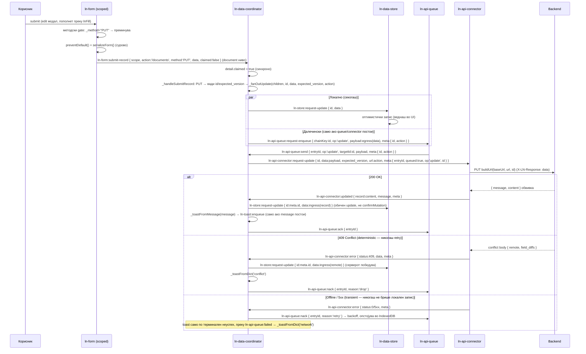

# 📝 Write Workflow Guide — Формата како универзален write-влез

> Ова **не е** компонентен draft по темплејтот (`COMPONENT_DOCUMENTATION_TEMPLATE.md`). Ова е потрошувачки (consumer-facing) водич кој ги врзува четирите компоненти (`ln-form`, `ln-data-coordinator`, `ln-api-connector`, `ln-ajax`) во еден нараративен тек — „како да напишам CRUD страница со декларативен write pipeline, без апликациски JS".
>
> Извор на вистина за архитектурната одлука: [`architecture_docs_draft/form-write-workflow.md`](./form-write-workflow.md) (спецификацијата). Овој документ е практичниот „recipe" изведен од имплементацијата.

---

## 1. Кратка слика: трите скалила на пресретнување на `submit`

`submit` настанот е природната граница. Секоја форма минува низ една од три можни скалила, во зависност од тоа кој ја „присвојува":

| Скалило | Кој слуша | Што се случува | Кога се користи |
| :--- | :--- | :--- | :--- |
| **1. Никој** | — | Нативен browser submit кон `action` (+ `_method` за method spoofing), сервер враќа HTML одговор. | SSR страници (Laravel Blade и слично) — форма без никаков опт-ин атрибут. |
| **2. `ln-ajax`** | Контејнер со `data-ln-ajax` | `fetch()` кон `action`, страницата останува иста, серверот враќа структуриран JSON (`title`/`content`/`message`). | SSR + progressive enhancement — сакаш да избегнеш целосно превчитување, но серверот сепак е тој што ја компајлира HTML содржината. |
| **3. `data-ln-form-scope`** | Најблискиот предок `[data-ln-data-coordinator]` (или именуван, преку вредноста на атрибутот) | Формата се сериjaлизира сурово и се дистачира `ln-form:submit-record`; координаторот го презема и го рутира низ **store → queue → connector** write pipeline-от. | Local-first / SPA страници — податоците живеат прво во IndexedDB, серверот е конечна дестинација, не единствен извор. |

**Правило на предност:** `data-ln-form-scope` победува секогаш. `ln-ajax` активно ги прескокнува ваквите форми (со еднократен `console.warn`). Формата не може истовремено да биде и ајакс и scoped — тоа е противречност во намера, не поддржана комбинација.

**Литерален метод-gate (важно за скалило 3):** `ln-form` пресретнува submit **само** ако ефективниот метод (прочитан од `<input name="_method">`, инаку од атрибутот `method`) е точно `POST`, `PUT` или `PATCH`. Секој друг метод (типично `GET`) минува нативно, непреземено — на пример, форма за пребарување вгнездена внатре во координаторски subtree сепак си работи нормално, GET-от никогаш не се прекинува.

---

## 2. Сопственост — кој за што одговара

Секој слој си останува во својата надлежност; никој не навлегува во туѓа:

| Слој | Одговорност | НЕ прави |
| :--- | :--- | :--- |
| **Форма** (`ln-form` + `data-ln-form-scope`) | **Извор на вистина за мутацискиот endpoint.** HTML `action` атрибутот е канонски — истиот што би се употребил за нативен submit без JS (HTML-first). Само нормализира (сурово JSON, без интерпретација) и диспачира. | Не одредува create/update режим, не вади `id`/`expected_version`, не праќа мрежен повик. |
| **Store** (`ln-data-store`) | Оптимистички кеш во IndexedDB. Веднаш го запишува рекордот локално (UI-видливо мигновено), потоа сигнализира дека треба remote синхронизација. | Не знае за HTTP, не знае за форми, storage-blind. |
| **Queue** (`ln-api-queue`, опционален) | Редослед и персистенција на пратките (FIFO по chain key), temp-id remap, retry/backoff. Опстојува низ рестарт на табот (drain-on-init). | **Никогаш не праќа сама** — само сигнализира кога е ред некој запис да замине (`ln-api-queue:send`), а извршувањето е туѓа работа. |
| **Connector** (`ln-api-connector` / `ln-couchdb-connector`) | Единствениот извршител на вистински HTTP/мрежен повик. Прима `:request-*` настан со `url`/`meta`, прави `fetch()`, го echo-ира `meta` назад на одговорот. | Не знае за store, queue, ниту за форма — чист транспортен драјвер. |
| **Координатор** (`ln-data-coordinator`) | Лепило меѓу горните — **само настани**, никогаш директни методски повици кон конекторот. Го толкува `ln-form:submit-record` (и своите сопствени `ln-data-coordinator:request-*` настани) и **паралелно** го праќа записот и кон store-от и кон queue/connector-от од истиот синхрон handler (fan-out) — нема повеќе correlation мапи. Одговорите ги толкува назад како обични `ln-store:request-update`/`request-delete` настани (id-swap за create), никогаш преку `confirmMutation`/`revertMutation`/`resolveConflict` (отстранети). | Не серијализира форма, не гради HTTP барања сам, не одлучува транспорт. |

---

## 3. Комплексен пример: целосна CRUD страница

Целосен маркап за local-first CRUD страница со табела, модал за create/edit, и офлајн queue:

```html
<section data-ln-data-coordinator="documents" class="crud-page">

	<!-- Data слој (headless деца — невидливи, само конфигурација) -->
	<div data-ln-data-store="documents" data-ln-store-indexes="status,updated_at"></div>

	<!-- path = само read/sync fallback; мутацискиот URL доаѓа од формата -->
	<div data-ln-api-connector="documents"
	     data-ln-api-base-url=""
	     data-ln-api-path="/documents"></div>

	<!-- Офлајн outbox (опционално) -->
	<div data-ln-api-queue="documents"></div>

	<!-- Render слој -->
	<header class="page-header">
		<h1>Документи</h1>
		<button type="button" data-ln-modal-open="document-edit">Нов документ</button>
	</header>

	<table data-ln-table="documents" data-ln-table-source="documents" data-ln-table-store="documents">
		<thead>
			<tr>
				<th data-ln-table-col="title">Наслов</th>
				<th data-ln-table-col="status">Статус</th>
				<th data-ln-table-col="actions">Акции</th>
			</tr>
		</thead>
		<tbody data-ln-table-body></tbody>
	</table>

	<template data-ln-template="documents-row">
		<tr data-ln-table-row>
			<td>{{ title }}</td>
			<td>{{ status_display }}</td>
			<td>
				<ul class="table-actions">
					<li>
						<button type="button"
						        data-ln-fill-form="document-form"
						        data-ln-fill-id="{{ id }}"
						        data-ln-fill-title="{{ title }}"
						        data-ln-fill-status="{{ status }}"
						        data-ln-fill-expected_version="{{ expected_version }}"
						        data-ln-modal-open="document-edit">
							Измени
						</button>
					</li>
				</ul>
			</td>
		</tr>
	</template>

	<!-- Модал-форма: остана DOM потомок на координаторот (containment) -->
	<dialog data-ln-modal="document-edit">
		<form id="document-form"
		      data-ln-form
		      data-ln-form-scope
		      method="post"
		      action="/documents"
		      data-ln-form-action-edit>

			<input type="hidden" name="id">
			<input type="hidden" name="expected_version">

			<div class="form-element">
				<label for="document-title">Наслов</label>
				<input id="document-title" name="title" type="text" required data-ln-validate>
			</div>

			<div class="form-element">
				<label for="document-status">Статус</label>
				<select id="document-status" name="status">
					<option value="draft">Нацрт</option>
					<option value="published">Објавено</option>
				</select>
			</div>

			<ul class="form-actions">
				<li><button type="button" data-ln-modal-close>Откажи</button></li>
				<li><button type="submit">Зачувај</button></li>
			</ul>
		</form>
	</dialog>
</section>
```

**Забелешки за маркапот:**
- `method="post"` е задолжителен на scoped формата (види §1 — литералниот gate ниту еднаш не пресретнува GET; без експлицитен `method="post"` некои прелистувачи би паднале на GET по default).
- `data-ln-form-action-edit` (без вредност) е no-JS резервата: доколку JS не се вчита, submit-от паѓа на скалило 1 (нативен) и записот сепак стигнува на серверот преку RESTful `action`/`_method` рутирање што `ln-form` веќе го одржува независно од scoped патот.
- Скриените `id` / `expected_version` полиња се координаторска конвенција — координаторот ги чита фиксно по име од `data`, формата само ги носи сурово.
- `data-ln-fill-*` атрибутите на копчето „Измени" го користат постоечкиот `ln-fill` механизам — потполно независен од write pipeline-от опишан тука.
- Модалот не мора да биде потомок на координаторот — ако стои надвор (пр. споделен модал на ниво на страница), scope-от се именува експлицитно: `data-ln-form-scope="documents"`; демо страницата `demo/admin/write-workflow.html` ја користи токму именуваната варијанта.

### Сценарио 1: Create (нов запис)

1. Корисникот го отвора модалот преку „Нов документ" (форма е во create облик — нема `id`, `_method` е празно).
2. Пополнува „Наслов" и „Статус", кликнува „Зачувај".
3. `ln-form._onSubmit`: ефективен метод = `POST` (нема `_method` вредност) → gate поминува. `preventDefault()`, `serializeForm()`, диспачира `ln-form:submit-record { scope: null, action: '/documents', method: 'POST', data: { title, status }, claimed: false }`.
4. `ln-data-coordinator` (containment match) → `detail.claimed = true` → `_handleSubmitRecord`: `method === 'POST'` → повикува `_fanOutCreate(children, data, action)`. Координаторот сам го генерира `tempId`-от (`'_temp_' + crypto.randomUUID()`) — нема повеќе `WeakMap` за паметење на `action`, тој едноставно патува како аргумент.
5. `_fanOutCreate` **паралелно**, од истиот синхрон повик: (a) `dispatch(storeEl, 'ln-store:request-create', { tempId, data })` → `ln-data-store` веднаш го запишува оптимистички во IndexedDB (UI-видливо мигновено — табелата се освежува преку `ln-store:created`); (b) ако **има** queue: `dispatch(queueEl, 'ln-api-queue:request-enqueue', { chainKey: tempId, op: 'create', payload: egress(data), meta: { tempId, action } })`. И двете гранки се независни — локалниот запис не чека на мрежниот исход.
6. Queue-от подоцна сам одлучува кога е ред и диспачира `ln-api-queue:send`. Координаторовиот `queueSend` слушател: чита `meta.action`, диспачира `ln-api-connector:request-create { data: payload, url: action, meta: { entryId, queued: true, op: 'create', tempId } }`.
7. Конекторот прави `POST` кон `buildUrl(baseUrl, url)` (не `data-ln-api-path` — `url` победува). При успех: серверот одговара со `{ message, content }` обвивка (види §7 подолу); конекторот ја „одмотува" во `dispatch(connectorEl, 'ln-api-connector:created', { record: content, message, meta })`.
8. Координаторовиот `connCreated` слушател: **обичен** `dispatch(storeEl, 'ln-store:request-update', { id: meta.tempId, data: ingress(record) })` — store-от детектира дека `data.id !== tempId` и прави id-swap (rekey), а не `confirmMutation`. Потоа `_toastFromMessage(message)` — ако серверот испратил `message`, се диспачира `ln-toast:enqueue`; ако не, нема toast. Потоа, **бидејќи `meta.queued === true`**: `dispatch(queueEl, 'ln-api-queue:request-remap', { oldKey: tempId, newId: record.id })` **пред** `dispatch(queueEl, 'ln-api-queue:ack', { entryId })`.

Ако **нема** queue: чекор 6 отпаѓа — координаторот директно диспачира `ln-api-connector:request-create` со `meta.queued: false` веднаш во `_fanOutCreate`, а `connCreated` го прескокнува remap/ack чекорот.

Ако **нема ниту connector ниту queue** (само store): `_fanOutCreate` застанува по чекор 5(a) — записот останува локален со `_temp_` id, без мрежен повик и без toast (види README §„Local-only mode").

### Сценарио 2: Edit преку `lnFill`

1. Копчето „Измени" во редот на табелата диспачира `ln-fill` со целиот запис (вклучувајќи `id`, `expected_version`).
2. `ln-form._onLnFill`: `fill(record)` ги пополнува полињата, `_applyActionMode(record)` (бидејќи `data-ln-form-action-edit` е присутен): `action` се препишува во `/documents/{id}`, скриеното `<input name="_method">` добива `PUT`.
3. Корисникот кликнува „Зачувај". `ln-form._onSubmit`: ефективен метод сега = `PUT` (чита го `_method` input-от, не `method` атрибутот) → gate поминува.
4. `serializeForm()` го зема **целото** сурово `data`, вклучувајќи `id` и `expected_version` (полиња во формата). `_method`/`_token` се бришат од `data`, но `method: 'PUT'` е веќе поставено во detail-от.
5. `ln-data-coordinator._handleSubmitRecord`: `method === 'PUT'` → вади `id`/`expected_version` од `data` → повикува `_fanOutUpdate(children, id, data, expectedVersion, action)`. Нема повеќе `Map` за паметење на `action`.
6. `_fanOutUpdate` паралелно: (a) `dispatch(storeEl, 'ln-store:request-update', { id, data })` — веднаш го применува измененото локално (нема повеќе `store.getById(id)` пред-читање од страна на координаторот — payload-от за egress е директно `data`-та од формата); (b) или директно `ln-api-connector:request-update`, или queue-иран `ln-api-queue:request-enqueue` со `meta: { id, action }`.
7. Одговорот се толкува исто како во Сценарио 1 чекор 8: обичен `ln-store:request-update` (без id-swap овојпат — `id`-то не се менува), `_toastFromMessage(message)`.

### Сценарио 3: Офлајн edit

1. Мрежата е недостапна кога корисникот го зачувува измененото. Чекорите 1-5 од Сценарио 2 се идентични — оптимистичкиот запис во IndexedDB и `ln-api-queue:request-enqueue` **не** знаат дека мрежата е долу (queue-от е transport-blind по дизајн).
2. Queue-от го персистира записот во сопствената IndexedDB табела (не онаа на `ln-data-store`) — опстојува дури и ако корисникот го затвори табот.
3. При следен старт на страницата (drain-on-init) или при `online` настан (глобалниот sync singleton во координаторот), queue-от повторно се обидува да го испразни редот и диспачира `ln-api-queue:send` кога е ред записот.
4. Координаторот го обработува исто како во сценарио 1/2 — `queueSend` слушателот прочитува `meta.action` (запаметен во queue записот при enqueue, персистиран заедно со него) и го проследува како `url` во `ln-api-connector:request-update`.
5. Клучна поента: `action`-от **не** се резолвира по-record (пр. со temp id вбризган во URL) — се персистира ресурсниот URL (`/documents`), а конкретното `targetId` (реалното id по евентуален remap) се дошива дури при `send` мигот. Ова е свесна одлука (види `form-write-workflow.md` §6) — resolved per-record URL со temp id внатре би останал stale по remap.

### Сценарио 4: 409 конфликт

1. Друг корисник веќе го изменил истиот запис со поновa `expected_version` пред нашиот `PUT` да стигне.
2. Серверот враќа `409 Conflict` со тело што содржи `remote` (моменталната серверска верзија) и `field_diffs`.
3. Конекторот: `dispatch(connectorEl, 'ln-api-connector:error', { action: 'update', status: 409, data: { remote, field_diffs }, meta })`.
4. Координаторовиот `connError` слушател класифицира по `status` — `409` е **deterministic** (никогаш retry): ако `detail.data.remote` постои → обичен `dispatch(storeEl, 'ln-store:request-update', { id: meta.id, data: mapper.ingress(remote) })` (серверот победува, никаков `resolveConflict`/snapshot) → `_toastFromDict('conflict')` (текстот доаѓа од `data-ln-data-coordinator-dict="conflict"`, никогаш hardcoded). Ако е queue-иран пат: потоа `dispatch(queueEl, 'ln-api-queue:nack', { entryId, reason: 'drop' })` — записот се отфрла од редицата, нема повторен обид.
5. Ако патот е **директен** (нема queue): истата гранка (server-wins update + `conflict` toast), само без queue nack.

---

## 4. Mermaid дијаграм — update патот, крај до крај

Адаптирано од `form-write-workflow.md` §5, со точните евенти од имплементацијата:



Офлајн сценариото не е посебен режим во дијаграмот погоре — submit-от секогаш минува низ queue (кога е присутен); offline само значи дека drain паузира и записите чекаат, вклучително и преку рестарт на табот.

---

## 5. Чести грешки

| Грешка | Симптом | Решение |
| :--- | :--- | :--- |
| Scoped форма без `method="post"` | Нема пресретнување воопшто — нативен GET submit, полето `data` во query стрингот, страницата се превчитува. Гласен симптом (навигацијата е очигледна), не тивок бug. | Секогаш експлицитен `method="post"` на секоја форма со `data-ln-form-scope` — задолжително и за no-JS резервата. |
| Погрешно име во `data-ln-form-scope` | `console.warn('[ln-form] ln-form:submit-record was not claimed...')` — записот никогаш не стигнува до координаторот. | Проверете дека вредноста на `data-ln-form-scope="име"` точно се совпаѓа со вредноста на `data-ln-data-coordinator="име"`, или отстранете ја вредноста (празно) за containment-базирано совпаѓање. |
| Form `action` и connector `data-ln-api-path` покажуваат кон различен ресурс | Delta sync (`fetchDelta` преку `data-ln-api-path`) никогаш не ги гледа записите создадени/изменети преку формата — двата патишта мора да покажуваат кон истиот ресурс, инаку идниот `sync` не ги препознава сопствените write-ови. | Усогласете ги: `data-ln-api-path="/documents"` и формината `action="/documents"` мора да упатуваат кон истиот ресурс. |
| Cross-origin base URL + очекувани session колачиња | Конекторот испраќа барања со `credentials: 'same-origin'` (не е конфигурабилно) — колачиња не патуваат кон друг origin, авторизацијата тивко пропаѓа. | Види [`ln-api-connector.md`](./components/ln-api-connector.md) §5 „Честа грешка 3" — користете Backend Proxy Gateway на сопствениот origin наместо директен cross-origin `data-ln-api-base-url`. |
| `data-ln-table-row-action` + `data-ln-modal-for` на исто копче | Кликот не го отвора модалот — `ln-table` прави `e.stopPropagation()` на tbody ниво, па document-ниво слушателите на `ln-modal` и `ln-fill` никогаш не го гледаат кликот. | Едно копче = еден механизам. `row-action` е за page-wired акции (пр. delete); за отворање модал + fill користи `data-ln-modal-for` + `data-ln-fill-*` без `row-action`. |

---

## 6. `{ message, content }` — обвивката на одговорот при мутација

Секој успешен одговор на create/update/delete (и bulk-delete, за симетрија)
конекторот го проверува за опционален обвивка:

```json
{
  "message": { "type": "success", "title": "Зачувано", "body": "Документот е креиран" },
  "content": { "id": 42, "title": "Нов документ", "status": "draft" }
}
```

- **`content`** — самиот запис. Конекторот го „одмотува" (`body.content !== undefined ? body.content : body`) во `detail.record` на `ln-api-connector:created`/`:updated`; ако одговорот нема `content` клуч, целото тело се третира како сурoв запис (back-compat).
- **Дуалност на `content`** — истата обвивка ја користи и `ln-ajax` (веќе постоечки прецедент, `ln-ajax.js:160`), само со различна интерпретација: таму `content` е `{ targetId: html }` мапа за HTML fragment замена; тука е JSON запис. Иста обвивка, два консументи, две значења на `content`.
- **`message` присуство = opt-in за toast.** Ако `message` недостасува, `detail.message` е `null` и не се случува ништо — координаторот никогаш не измислува toast текст сам, серверот е единствениот автор на пораката.
- **204 каveat.** DELETE со `204 No Content` нема тело (`_resolve` враќа `null`), значи нема обвивка и нема toast. Ако серверот сака да потврди бришење со toast, мора да одговори `200 OK` со обвивката (`content` може да биде `null`).

---

## 7. Врски

- Спецификација: [`architecture_docs_draft/form-write-workflow.md`](./form-write-workflow.md)
- [`architecture_docs_draft/components/ln-form.md`](./components/ln-form.md)
- [`architecture_docs_draft/components/ln-data-coordinator.md`](./components/ln-data-coordinator.md)
- [`architecture_docs_draft/components/ln-api-connector.md`](./components/ln-api-connector.md)
- [`architecture_docs_draft/components/ln-ajax.md`](./components/ln-ajax.md)
