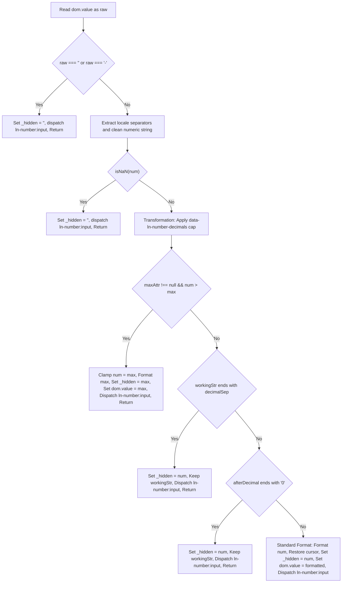

# ln-number

Real-time locale-aware number formatting for input fields.

## Usage

```html
<input type="number" name="amount" data-ln-number>
```

The component creates a hidden input that holds the raw numeric value for form submission and formats the visible input with locale-aware thousand separators. After initialization:

```html
<input type="text" inputmode="decimal" data-ln-number>
<input type="hidden" name="amount" value="1234567">
```

## Loading & Source Files

### Loading the Component

#### 1. In-Bundle (Standard Integration)
To load `ln-number` as part of the main `ln-ashlar` bundle, include the compiled bundle script:
```html
<script src="dist/ln-ashlar.iife.js" defer></script>
```

#### 2. Standalone (Zero-Dependency IIFE)
To load `ln-number` as a standalone component, include its compiled IIFE under the component directory:
```html
<script src="components/ln-number/ln-number.js" defer></script>
```

### Source Files

* **Active Development Source**: [components/ln-number/src/ln-number.js](file:///c:/laragon/www/ln-ashlar/components/ln-number/src/ln-number.js) (source of truth)
* **Pure Mathematical & Formatting Model**: [components/ln-number/src/number-model.js](file:///c:/laragon/www/ln-ashlar/components/ln-number/src/number-model.js)
* **Compiled Standalone**: [components/ln-number/ln-number.js](file:///c:/laragon/www/ln-ashlar/components/ln-number/ln-number.js)

## Attributes

| Attribute | On | Description |
|-----------|-----|-------------|
| `data-ln-number` | `<input>` | Enables number formatting |
| `data-ln-number-decimals` | `<input>` | Max decimal places (default: unlimited) |
| `data-ln-number-min` | `<input>` | Minimum allowed value |
| `data-ln-number-max` | `<input>` | Maximum allowed value |

## Events

| Event | Bubbles | Cancelable | Detail |
|-------|---------|------------|--------|
| `ln-number:input` | yes | no | `{ value: Number, formatted: String }` |
| `ln-number:destroyed` | yes | no | `{ target: Element }` |

## API

```javascript
const el = document.querySelector('[data-ln-number]');

el.lnNumber.value;           // get raw number (Number or NaN if empty)
el.lnNumber.value = 1234.56; // set value programmatically — formats display
el.lnNumber.formatted;       // get formatted display string

el.lnNumber.destroy();       // remove component, restore original input
```

## Locale

The component reads the nearest ancestor `[lang]` attribute (typically `<html lang>`); falls back to `navigator.language`. Locale changes propagate live — re-formatting all instances when `<html lang>` changes.

| `lang` | Display |
|---|---|
| `mk` | `1.234.567` |
| `en-US` | `1,234,567` |

## Examples

```html
<!-- Basic -->
<div class="form-element">
    <label for="amount">Amount</label>
    <input type="number" id="amount" name="amount" data-ln-number>
</div>

<!-- With decimal limit -->
<div class="form-element">
    <label for="price">Price</label>
    <input type="number" id="price" name="price"
           data-ln-number data-ln-number-decimals="2">
</div>

<!-- With min/max -->
<div class="form-element">
    <label for="quantity">Quantity</label>
    <input type="number" id="quantity" name="quantity"
           data-ln-number data-ln-number-min="0" data-ln-number-max="999999">
</div>

<!-- Pre-filled value -->
<div class="form-element">
    <label for="budget">Budget</label>
    <input type="number" id="budget" name="budget" value="1500000"
           data-ln-number>
</div>
```

## Integration with ln-validate

Place `data-ln-validate` on the same input. The `required` attribute stays
on the visible input and works as expected:

```html
<div class="form-element">
    <label for="salary">Salary</label>
    <input type="number" id="salary" name="salary"
           required data-ln-validate data-ln-number>
    <ul data-ln-validate-errors>
        <li class="hidden" data-ln-validate-error="required">Required field</li>
    </ul>
</div>
```

## Integration with ln-form

Works automatically. `serializeForm()` reads the hidden input (which has the
`name`). `populateForm()` sets the hidden input's value, which triggers the
display update.

---

## 🔧 Internals

Source: `components/ln-number/src/ln-number.js` and `components/ln-number/src/number-model.js`. Each `[data-ln-number]` gets a `_component` instance at `element.lnNumber`, holding `dom` (visible input), `_hidden` (hidden input), and bound `_onInput`/`_onKeyDown`/`_onPaste` handlers.

### Formatter cache

One `Intl.NumberFormat` instance per unique locale, cached at module level (`_formatterCache[locale]`), storing the formatter plus `groupSep`/`decimalSep` extracted once via `formatToParts()`. Supports standard spaces, commas, dots, and Unicode narrow no-break space (`\u202F` for `fr-FR`). Separate cache keys exist for decimal-capped and user-decimal-preserving formatters.

### Input flow



On every `input` event:
1. **Empty / Minus Sign:** Clears `_hidden` and dispatches `ln-number:input`.
2. **Parsing & Cleaning:** Numeric strings are cleaned of separators and parsed according to active locale rules.
3. **Decimal Cap Transformation:** `data-ln-number-decimals` truncates excessive decimal digits *before* trailing zero/separator checks.
4. **Max Clamping:** Evaluated *before* trailing separators/zeros to strictly prevent typing values beyond `max`.
5. **Trailing Decimals & Zeros:** Preserves input text during active progressive decimal typing, synchronizes `_hidden`, and dispatches `ln-number:input`.
6. **Standard Formatting:** `Intl.NumberFormat` formats the display value, restores cursor position via digit-count index calculation, synchronizes `_hidden`, and dispatches `ln-number:input`.

### Backspace Separator Interception

When the cursor is positioned directly after a thousand separator (e.g. `1,|234`), pressing Backspace is intercepted by `_onKeyDown` (guarded against active range selections). It deletes the preceding digit directly and dispatches a native `input` event, keeping parent form validations (`ln-validate`, `ln-autosave`) synchronized and preventing infinite cursor traps.

### Hidden input value interceptor

`hidden.value` is wrapped via `Object.defineProperty` so programmatic sets (e.g. `populateForm()` writing `hidden.value = "1234"`) route through the same parse → format → display path as user input. Internal code writes through `_setHiddenRaw()`, which calls the prototype's original setter directly — bypassing the custom setter avoids the interceptor re-triggering itself (infinite loop).

### Auto-init

A single `document.body` `MutationObserver` watches `childList` (subtree — new `[data-ln-number]` elements auto-initialize via `findElements`) and `attributes` on `data-ln-number` (attribute added to an existing element initializes it in place).
