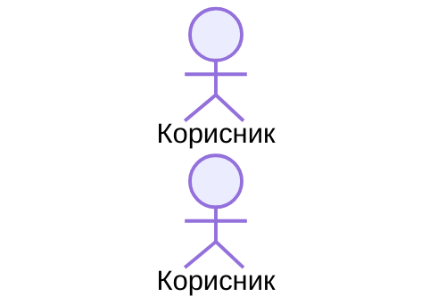

# [емоџи] ln-ime

> **Класификација:** 🟢 Едноставна компонента / Координатор / Сервис

---

## 1. Заднинско дејство и одговорност

- Концизно објаснување на основната улога (bullet листа со **задебелени** клучни одговорности).
- Линк кон изворниот фајл во првиот пасус.

> [!IMPORTANT]
> **Што компонентата НЕ прави (Orthogonality Doctrine):**
> - Експлицитна листа на одговорности што ѝ припаѓаат на друга компонента, со линк кон неа.

---

## 2. Минимален HTML Маркап и Варијанти на Употреба

### Базен HTML Маркап

```html
<!-- Наједноставниот комплетен, copy-paste функционален пример -->
```

### Варијанта 1: [Име на варијантата]

Кратко објаснување кога се користи.

#### HTML Маркап
```html
<!-- Комплетен пример за варијантата -->
```

---

## 3. Декларативен API Договор (Атрибути и Настани)

### Табела со Атрибути

| Атрибут | Елемент | Тип / Вредности | Стандардна вредност | Опис |
|---|---|---|---|---|
| `data-ln-ime` | Панел | `"a"` \| `"b"` | `"a"` | ... |

### Настани (Events API)

| Настан | Насока | Cancelable | Опис | `detail` Објект |
|---|---|---|---|---|
| `ln-ime:open` | Емитува | Не | ... | `{ target: HTMLElement }` |

---

## 4. CSS Стилизирање и Поведенски Концепт

SCSS миксини, класи и поведенски концепти (порталирање, позиционирање, анимации),
со линкови кон изворните `.scss` фајлови и кратки изворни извадоци.

---

## 5. Пристапност (ARIA) и Чести Грешки

### ARIA & Тастатура

- ARIA улоги, поврзувања и тастатурна навигација.

### Чести Грешки и Анти-патерни (Common Pitfalls)

> [!CAUTION]
> 1. **[Грешка]:** објаснување и последица.

---

## 6. Дијаграм на Текот и Животен Циклус



---

## 7. Поврзани Компоненти

- [`ln-drugo`](./ln-drugo.md) — зошто е поврзана.
