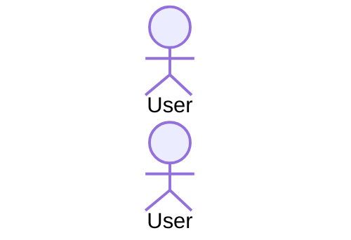

# [emoji] ln-name

> **Classification:** 🟢 Simple component / Coordinator / Service

---

## 1. Core Behavior & Responsibility

- Concise explanation of the core role (bullet list with **bold** key responsibilities).
- Link to the source file in the first paragraph.

> [!IMPORTANT]
> **What the component does NOT do (Orthogonality Doctrine):**
> - Explicit list of responsibilities that belong to another component, with a link to it.

---

## 2. Minimal HTML Markup & Usage Variants

### Base HTML Markup

```html
<!-- The simplest complete, copy-paste functional example -->
```

### Variant 1: [Variant name]

Short explanation of when to use it.

#### HTML Markup
```html
<!-- Complete example for the variant -->
```

---

## 3. Declarative API Contract (Attributes & Events)

### Attributes Table

| Attribute | Element | Type / Values | Default | Description |
|---|---|---|---|---|
| `data-ln-name` | Panel | `"a"` \| `"b"` | `"a"` | ... |

### Events API

| Event | Direction | Cancelable | Description | `detail` Object |
|---|---|---|---|---|
| `ln-name:open` | Emits | No | ... | `{ target: HTMLElement }` |

---

## 4. CSS Styling & Behavioral Concept

SCSS mixins, classes and behavioral concepts (teleporting, positioning, animations),
with links to the source `.scss` files and short source excerpts.

---

## 5. Accessibility (ARIA) & Common Pitfalls

### ARIA & Keyboard

- ARIA roles, relationships and keyboard navigation.

### Common Pitfalls & Anti-patterns

> [!CAUTION]
> 1. **[Pitfall]:** explanation and consequence.

---

## 6. Flow Diagram & Lifecycle



---

## 7. Related Components

- [`ln-other`](./ln-other.md) — why it is related.
