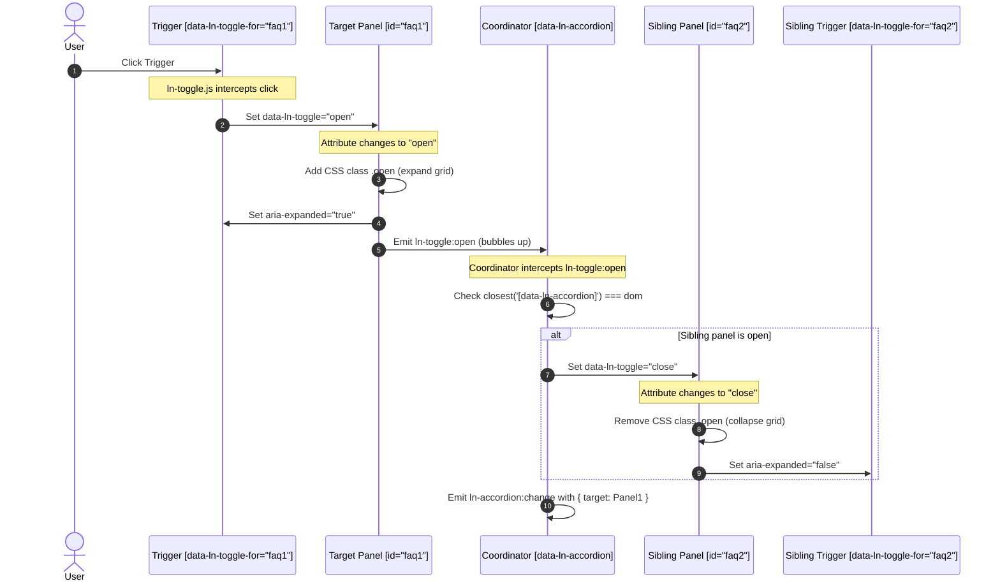

# ⚙️ ln-accordion

> **Classification:** ⚙️ Coordinator

---

## 1. Core Behavior & Responsibility

The `ln-accordion` component is a DOM coordinator whose sole responsibility is to enforce mutual exclusivity (single-open behavior) among a group of [`ln-toggle`](./ln-toggle.md) panels. It does not directly manage the state of individual panels; instead, it listens for the bubbling `ln-toggle:open` event and declaratively closes any other open sibling panels within the same accordion group.

The JavaScript source is located at [ln-accordion.js](../../js/ln-accordion/src/ln-accordion.js).

Key responsibilities include:
- **Mutual Exclusivity:** Ensuring only one collapsible panel is open at a time in the accordion container by toggling sibling states.
- **Event Orchestration:** Catching bubbling `ln-toggle:open` events and matching them against the closest accordion container.
- **State Synchronization:** Closing other panels by setting their `data-ln-toggle` attribute to `"close"`.
- **Event Dispatching:** Signaling state changes to external systems by emitting `ln-accordion:change`.

> [!IMPORTANT]
> **What the component does NOT do (Orthogonality Doctrine):**
> - **Individual Binary State:** It does not manage individual panel states, ARIA expansions, or button relationships directly (handled by [`ln-toggle`](./ln-toggle.md)).
> - **Visual Animations:** It does not calculate heights or animate panel opening in JavaScript (handled by Vanilla CSS/SCSS grid mixins).
> - **Direct State Mutations:** It does not mutate memory states or call private methods (communicates strictly via standard HTML `setAttribute('data-ln-toggle', 'close')`).
> - **State Persistence:** It does not handle saving or restoring states from `localStorage` (delegated to [`ln-persist`](./ln-persist.md)).

---

## 2. Minimal HTML Markup & Usage Variants

### Base HTML Markup

The standard markup uses a `<ul>` list with the `data-ln-accordion` attribute serving as the coordinating wrapper:

```html
<ul data-ln-accordion id="faq-accordion">
    <li>
        <!-- Trigger for first panel -->
        <header data-ln-toggle-for="faq-panel-1" class="accordion-trigger">
            <span>What is Ashlar?</span>
            <svg class="ln-icon ln-chevron" aria-hidden="true">
                <use href="#ln-arrow-down"></use>
            </svg>
        </header>
        <!-- First collapsible panel -->
        <section id="faq-panel-1" data-ln-toggle class="collapsible">
            <div class="collapsible-body">
                <p>Ashlar is a lightweight frontend system built on web standards and isolated components.</p>
            </div>
        </section>
    </li>
    <li>
        <!-- Trigger for second panel -->
        <header data-ln-toggle-for="faq-panel-2" class="accordion-trigger">
            <span>What is the role of the coordinator?</span>
            <svg class="ln-icon ln-chevron" aria-hidden="true">
                <use href="#ln-arrow-down"></use>
            </svg>
        </header>
        <!-- Second collapsible panel -->
        <section id="faq-panel-2" data-ln-toggle class="collapsible">
            <div class="collapsible-body">
                <p>Coordinators observe DOM states and orchestrate behavior through attribute changes.</p>
            </div>
        </section>
    </li>
</ul>
```

### Variant 1: Pre-Opened Panel

To start the accordion with a specific panel already expanded, set its initial state to `"open"` using `data-ln-toggle="open"`. Any others should remain closed or default:

```html
<section id="faq-panel-1" data-ln-toggle="open" class="collapsible">...</section>
<section id="faq-panel-2" data-ln-toggle class="collapsible">...</section>
```

### Variant 2: Persistent Accordion

Add the `data-ln-persist` attribute to individual panels to save their open/closed state in `localStorage` across page reloads:

```html
<ul data-ln-accordion>
    <li>
        <header data-ln-toggle-for="faq-p1">Section 1</header>
        <section id="faq-p1" data-ln-toggle data-ln-persist class="collapsible">
            <div class="collapsible-body"><p>Content...</p></div>
        </section>
    </li>
    <li>
        <header data-ln-toggle-for="faq-p2">Section 2</header>
        <section id="faq-p2" data-ln-toggle data-ln-persist class="collapsible">
            <div class="collapsible-body"><p>Content...</p></div>
        </section>
    </li>
</ul>
```

### Variant 3: Nested Accordions

Due to the scoping guard (`closest('[data-ln-accordion]') === dom`), nested accordions function independently from their parent accordion:

```html
<ul data-ln-accordion id="outer-accordion">
    <li>
        <header data-ln-toggle-for="outer-p1">Outer Category</header>
        <section id="outer-p1" data-ln-toggle class="collapsible">
            <div class="collapsible-body">
                <!-- Inner Coordinator -->
                <ul data-ln-accordion id="inner-accordion">
                    <li>
                        <header data-ln-toggle-for="inner-p1">Sub-category 1</header>
                        <section id="inner-p1" data-ln-toggle class="collapsible">
                            <div class="collapsible-body"><p>Sub-content...</p></div>
                        </section>
                    </li>
                </ul>
            </div>
        </section>
    </li>
</ul>
```

### Variant 4: Multi-Open Mode (No Coordinator)

To allow multiple panels to be open simultaneously without closing siblings, simply omit the `data-ln-accordion` coordinator attribute from the container element. The underlying `ln-toggle` panels will continue to function independently.

---

## 3. Declarative API Contract (Attributes & Events)

### Attributes Table

| Attribute | Element | Type / Values | Default | Description |
|---|---|---|---|---|
| `data-ln-accordion` | Wrapper (`<ul>` \| `<div>`) | Presence | Absent | Initializes the `ln-accordion` coordinator on the wrapper element. |

### Programmatic JS API

The initialized coordinator instance is exposed on the wrapper element via the property `dom.lnAccordion`.

| Property / Method | Type | Description |
|---|---|---|
| `dom.lnAccordion` | `Object` | The coordinator component instance attached to the DOM element. |
| `dom.lnAccordion.destroy()` | `Function` | Cleans up the event listener, dispatches `ln-accordion:destroyed`, and deletes the instance reference. |

### Events API

All events bubble up from the accordion wrapper element.

| Event | Direction | Cancelable | Description | `detail` Object |
|---|---|---|---|---|
| `ln-toggle:open` | Listens | No | Bubbles up from an internal `ln-toggle` panel when opened. Triggers the coordinator to close siblings. | `{ target: HTMLElement }` |
| `ln-accordion:change` | Emits | No | Fires from the wrapper after the coordinator has closed other sibling panels. | `{ target: HTMLElement }` |
| `ln-accordion:destroyed` | Emits | No | Fires from the wrapper when the component's `destroy()` method is invoked. | `{ target: HTMLElement }` |

#### Listening to Accordion Changes:
```javascript
const accordion = document.getElementById('faq-accordion');
accordion.addEventListener('ln-accordion:change', (event) => {
    console.log('Newly opened panel:', event.detail.target);
});
```

---

## 4. CSS Styling & Behavioral Concept

The styling is split into a reusable mixin and a declarative selector binding:
- Reusable mixin: `@mixin accordion` defined in [_accordion.scss](../../scss/config/mixins/_accordion.scss)
- Style binding: `[data-ln-accordion]` defined in [_accordion.scss](../../scss/components/_accordion.scss)

### SCSS Mixin Reference:
```scss
// In scss/config/mixins/_accordion.scss
@mixin accordion {
	@include border;
	--radius: var(--radius-lg);
	border-radius: var(--radius);
	overflow: hidden;

	> li {
		border-block-end: var(--border-block-end, var(--border-width) solid var(--color-border));

		&:last-child { border-block-end: none; }

		// Trigger
		> [data-ln-toggle-for] {
			@include flex;
			@include justify-between;
			@include items-center;
			--padding-y: var(--size-md);
			--padding-x: var(--size-md);
			padding: var(--padding-y) var(--padding-x);
			@include cursor-pointer;
		}
	}
}
```

### SCSS Component Selector Binding:
```scss
// In scss/components/_accordion.scss
[data-ln-accordion] {
	@include accordion;

	> li {
		> [data-ln-toggle-for] {
			@include font-medium;
			color: var(--color-fg);
			@include transition;

			&:hover {
				--color-bg: var(--bg-sunken);
				background: var(--color-bg);
			}

			.ln-chevron {
				--color-fg: var(--fg-subtle);
				color: var(--color-fg);
			}
		}
	}
}
```

### Behavioral Concept

1. **Declarative Orchestration:** The coordinator does not manipulate visual styles or classes. It toggles states by changing attributes:
   ```javascript
   el.setAttribute('data-ln-toggle', 'close');
   ```
2. **Event Bubbling & Scoping:** By listening to the bubbling `ln-toggle:open` event, the coordinator avoids heavy DOM queries. It guards against closing nested accordion panels by validating:
   ```javascript
   if (e.detail.target.closest('[data-ln-accordion]') !== dom) return;
   ```
3. **Visual Isolation:** Opening/closing animations are handled entirely via the `.collapsible` CSS class (managed by `ln-toggle` and CSS Grid transition). The coordinator does not contain any layout code.

---

## 5. Accessibility (ARIA) & Common Pitfalls

### ARIA & Keyboard

- **Delegated ARIA Responsibility:** `ln-accordion` does not modify accessibility attributes directly. ARIA behavior is managed by the underlying [`ln-toggle`](./ln-toggle.md) panels:
  - Triggers are synced with `aria-expanded="true"` or `"false"`.
  - Trigger and panel relationship is linked via `aria-controls="panel-id"`.
- **Keyboard Navigation:** Users can navigate through headers using `Tab` and `Shift+Tab`, and activate/toggle them using `Enter` or `Space`.

### Common Pitfalls & Anti-patterns

> [!CAUTION]
> 1. **Padding on Collapsible Containers:** Never apply padding directly to the `.collapsible` container. Padding is ignored by the CSS Grid row collapse calculation, leaving a visible box. Always apply padding to the inner `.collapsible-body` wrapper.
> 2. **Missing Panel ID:** Collapsible panels must have a unique `id` attribute. Triggers match panels by ID, and accessibility linking relies on it.
> 3. **Role Merging:** Avoid placing both `data-ln-toggle` (panel behavior) and `data-ln-toggle-for` (trigger behavior) on the same element. Keep triggers and panels separate.
> 4. **Imperative JS Mutations:** Do not call private component methods or manually mutate element styles to close siblings. Always change states declaratively via `setAttribute('data-ln-toggle', 'close')`.

---

## 6. Flow Diagram & Lifecycle

Below is the execution flow detailing how user actions propagate from a trigger to the panel, bubble to the `ln-accordion` coordinator, and close open sibling panels:



---

## 7. Related Components

- [`ln-toggle`](./ln-toggle.md) — The binary state primitive that manages individual panel expand/collapse states.
- [`ln-persist`](./ln-persist.md) — Service used by `ln-toggle` to persist panel states.
- [Source JavaScript](../../js/ln-accordion/src/ln-accordion.js) — Core implementation of the accordion coordinator.
- [Source Component SCSS](../../scss/components/_accordion.scss) — Core stylesheet for accordion elements.
- [Source Mixin SCSS](../../scss/config/mixins/_accordion.scss) — Reusable SCSS mixin for accordions.
