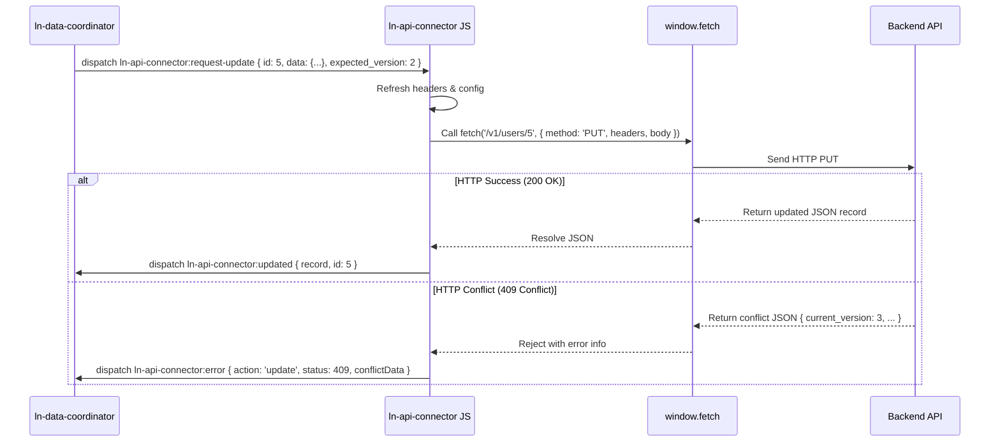

# 🔗 ln-api-connector

> **Classification:** 🌐 Simple component / Remote DB Connection Driver

---

## 1. Core Behavior & Responsibility

- Serves as the standard RESTful remote API network client connector for the local-first architecture.
- Translates incoming CustomEvents database commands into standard HTTP fetch requests.
- Appends required JSON configuration headers and dynamic `X-LN-Response: data` flags to queries.
- Dispatches responses or request errors as bubbled CustomEvents back to the DOM tree.
- Decouples remote storage paths from UI layers.
- Located in [`js/ln-api-connector/src/ln-api-connector.js`](../../js/ln-api-connector/src/ln-api-connector.js).

> [!IMPORTANT]
> **What the component does NOT do (Orthogonality Doctrine):**
> - **Does NOT preserve local cache copies** — delegated to [`ln-data-store`](./ln-data-store.md).
> - **Does NOT maintain outbox retries** — delegated to [`ln-api-queue`](./ln-api-queue.md).
> - **Does NOT track query states** — delegated to coordinators.

---

## 2. Minimal HTML Markup & Usage Variants

### Base HTML Markup

```html
<div data-ln-api-connector="products"
     data-ln-api-base-url=""
     data-ln-api-path="/api/v1/products"
     id="products-connector">
</div>
```

---

## 3. Declarative API Contract (Attributes & Events)

### Attributes Table

| Attribute | Element | Type / Values | Default | Description |
|---|---|---|---|---|
| `data-ln-api-connector` | Wrapper | `String` | — | Initializes the component and declares the driver namespace. |
| `data-ln-api-base-url` | Wrapper | `String` | — | Base HTTP URL address of backend API endpoint. |
| `data-ln-api-path` | Wrapper | `String` | — | Targeted query path resource name. |
| `data-ln-api-headers` | Wrapper | `String` | — | Comma-separated list of custom HTTP headers. |

### Programmatic JS API

| Helper | Signature | Returns | Description |
|---|---|---|---|
| `element.lnConnector.refreshConfig` | `()` | `void` | Reloads URL, path, and header configurations. |
| `element.lnConnector.fetchDelta` | `(since: String)` | `Promise` | Fetches delta updates since sequence tag. |
| `element.lnConnector.create` | `(payload: Object, url?: String)` | `Promise` | Sends POST request. |
| `element.lnConnector.update` | `(id: ID, payload: Object, expectedVersion?: Int, url?: String)` | `Promise` | Sends PUT update. |
| `element.lnConnector.delete` | `(id: ID, url?: String)` | `Promise` | Sends DELETE request. |
| `element.lnConnector.bulkDelete` | `(ids: Array, url?: String)` | `Promise` | Sends POST/DELETE bulk request. |
| `element.lnConnector.destroy` | `()` | `void` | Unbinds all listeners. |

### Events API

*Responds to events under `ln-api-connector:...` and `ln-rest-connector:...` namespaces for compatibility.*

| Event | Direction | Cancelable | Description | `detail` Object |
|---|---|---|---|---|
| `:request-sync` / `:request-fetch` | Listens | No | Triggers delta updates query. | `{ since?: String, meta?: Object }` |
| `:request-create` | Listens | No | Triggers document create request. | `{ data: Object, tempId: String, url?: String, meta?: Object }` |
| `:request-update` | Listens | No | Triggers document PUT edit. | `{ id: ID, data: Object, expected_version?: Int, url?: String, meta?: Object }` |
| `:request-delete` | Listens | No | Triggers document DELETE. | `{ id: ID, url?: String, meta?: Object }` |
| `:request-bulk-delete` | Listens | No | Triggers bulk document deletes. | `{ ids: Array, url?: String, meta?: Object }` |
| `ln-api-connector:fetched` | Emits | No | Dispatched upon delta sync responses. | `{ data: Array, since: String, meta: Object }` |
| `ln-api-connector:created` | Emits | No | Dispatched upon successful document creation. | `{ record: Object, tempId: String, message: String, meta: Object }` |
| `ln-api-connector:updated` | Emits | No | Dispatched upon successful document edit. | `{ record: Object, id: ID, message: String, meta: Object }` |
| `ln-api-connector:deleted` | Emits | No | Dispatched upon successful document deletion. | `{ response: Object, id: ID, message: String, meta: Object }` |
| `ln-api-connector:bulk-deleted` | Emits | No | Dispatched upon successful bulk deletion. | `{ response: Object, ids: Array, message: String, meta: Object }` |
| `ln-api-connector:error` | Emits | No | Dispatched upon HTTP or network errors. | `{ action: String, error: String, status: Int, conflictData?: Object, meta: Object }` |
| `ln-api-connector:config-changed` | Emits | No | Dispatched whenever `refreshConfig()` reloads URL, path, and header configuration (including on init). | `{ baseUrl: String, path: String, headers: Object }` |
| `ln-api-connector:destroyed` | Emits | No | Dispatched when the component is destroyed. | `{ target: HTMLElement }` |

---

## 4. CSS Styling & Behavioral Concept

- **Headless Component:** `ln-api-connector` is a logical wrapper with no UI footprint. It registers no styles or visual stylesheet.
- **Envelope Response unwrap:** Unwraps response envelopes checking if backend wraps payloads into `{message, content}` structures.

---

## 5. Accessibility (ARIA) & Common Pitfalls

### ARIA & Keyboard
- Headless driver. Accessibility structures are not applicable.

### Common Pitfalls & Anti-patterns

> [!CAUTION]
> 1. **Credentials leak:** Storing authorization secrets in `data-ln-api-headers` is highly discouraged due to XSS vulnerability. Always use HttpOnly session cookies.
> 2. **Cross-Origin Cookie issues:** Because `credentials` is set to `same-origin`, cookies will not be sent to external hosts. Use a Backend Proxy Gateway on the same host if required.

---

## 6. Flow Diagram & Lifecycle



---

## 7. Related Components

- [`ln-data-coordinator.md`](./ln-data-coordinator.md) — Connects this driver to local cache stores.
- [`ln-http.md`](./ln-http.md) — HTTP engine wrapping fetch calls.
