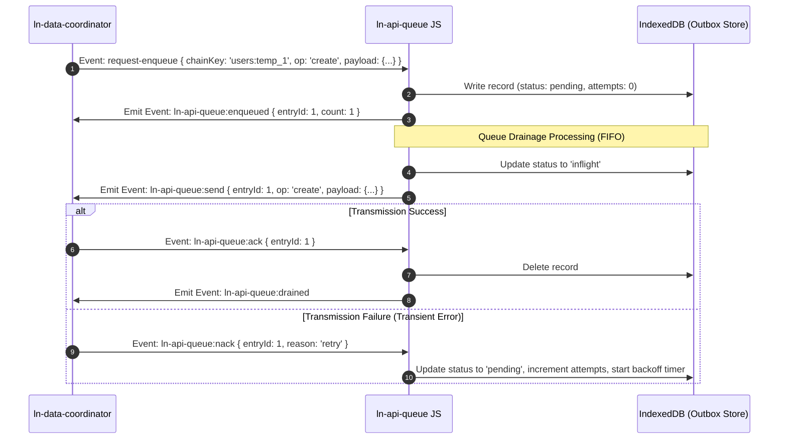

# 📥 ln-api-queue

> **Classification:** 🌐 Simple component / Offline Outbox Queue

---

## 1. Core Behavior & Responsibility

- Provides a reliable transaction outbox mechanism (Offline Outbox Pattern) via `IndexedDB` database storage.
- Guarantees sequential write delivery (FIFO order) scoped per `chainKey` (typically the record ID) to preserve modification order.
- Implements dynamic **exponential backoff retry schedules** (`2s, 5s, 15s, 60s, 300s` intervals) for handling temporary network dropouts, up to 8 max attempts.
- Performs runtime **ID Remapping**: replaces offline temporary record IDs (`_temp_uuid`) with official server-issued database IDs across all queued pending requests once creations succeed.
- Retrying `failed` entries after retries are exhausted is manual — dispatch `ln-api-queue:request-drain` (e.g. from a "retry failed" UI action) to re-attempt them.
- Located in [`js/ln-api-queue/src/ln-api-queue.js`](../../js/ln-api-queue/src/ln-api-queue.js).

> [!IMPORTANT]
> **What the component does NOT do (Orthogonality Doctrine):**
> - **Does NOT perform network queries directly** — it dispatches `ln-api-queue:send` events requesting the coordinator to execute the transport request.
> - **Does NOT cache data view records** — delegated to [`ln-data-store`](./ln-data-store.md).

---

## 2. Minimal HTML Markup & Usage Variants

### Base HTML Markup

```html
<!-- Logical transaction queue for the 'products' dataset -->
<div data-ln-api-queue="products"
     data-ln-api-queue-online="auto"
     id="products-queue"
     class="hidden">
</div>

<!-- UI Sync Indicator Badge -->
<div class="sync-badge hidden" id="sync-indicator" data-ln-fillable>
    Pending sync changes: <span data-ln-field="count">0</span>
</div>
```

---

## 3. Declarative API Contract (Attributes & Events)

### Attributes Table

| Attribute | Element | Type / Values | Default | Description |
|---|---|---|---|---|
| `data-ln-api-queue` | Wrapper | `String` | — | Initializes the queue and defines the dataset scope. |
| `data-ln-api-queue-online` | Wrapper | `"auto"` \| `"true"` \| `"false"` | `"auto"` | Online detection state. `"auto"` listens to navigator state. |

### Programmatic JS API

| Helper | Signature | Returns | Description |
|---|---|---|---|
| `element.lnApiQueue.destroy` | `()` | `void` | Clears event bindings. |

### Events API

| Event | Direction | Cancelable | Description | `detail` Object |
|---|---|---|---|---|
| `ln-api-queue:request-enqueue` | Listens | No | Enqueues a transaction. | `{ chainKey: String, op: String, targetId: ID, payload: Object, expectedVersion?: String, meta?: Object }` |
| `ln-api-queue:ack` | Listens | No | Acknowledges successful delivery; removes entry. | `{ entryId: ID }` |
| `ln-api-queue:nack` | Listens | No | Rejects transmission; triggers retry, drop, or pause. | `{ entryId: ID, reason: "retry" \| "drop" \| "auth" }` |
| `ln-api-queue:request-remap` | Listens | No | Triggers temporary ID remapping. | `{ oldKey: String, newId: ID }` |
| `ln-api-queue:request-resume` | Listens | No | Triggers queue drainage resumption. | `{}` |
| `ln-api-queue:request-drain` | Listens | No | Manually triggers a drain attempt — the canonical way to retry `failed` entries (e.g. a UI "retry failed" action). | `{}` |
| `ln-api-queue:request-clear` | Listens | No | Empties the queue local store. | `{}` |
| `ln-api-queue:send` | Emits | No | Dispatched to coordinator to execute request. | `{ entryId: ID, chainKey: String, op: String, payload: Object }` |
| `ln-api-queue:enqueued` | Emits | No | Dispatched when a task is written. | `{ entryId: ID, chainKey: String, count: Number }` |
| `ln-api-queue:pending-count` | Emits | No | Emits pending count updates for UI widgets. | `{ count: Number, scope: String }` |
| `ln-api-queue:drained` | Emits | No | Dispatched when the outbox becomes empty. | `{ scope: String }` |
| `ln-api-queue:failed` | Emits | No | Dispatched when 8 retry attempts are exhausted. | `{ entryId: ID, chainKey: String, attempts: Number }` |
| `ln-api-queue:auth-required` | Emits | No | Dispatched when auth pause occurs. | `{ entryId: ID, chainKey: String }` |
| `ln-api-queue:paused` | Emits | No | Dispatched when draining pauses for a scope (e.g. after an `auth` nack). | `{ reason: String }` |
| `ln-api-queue:resumed` | Emits | No | Dispatched when draining resumes for a scope. | `{}` |
| `ln-api-queue:destroyed` | Emits | No | Dispatched when the instance is torn down. | `{ scope: String }` |

---

## 4. State & Persistence

- **Storage:** `IndexedDB` (database: `ln_api_queue`, object store: `queue`).
- **Key format:** Auto-incrementing integer key.
- **Written when:** Enqueued on write mutations, or when request transmission fails with network dropouts.
- **Cleared when:** Acknowledged via `ack` events.
- **Invalidation / versioning:** ID mappings are resolved at runtime via `request-remap` events; database clearing is supported via `request-clear`.

---

## 5. CSS Styling & Behavioral Concept

- **Headless Component:** Logical module. No visual styles.
- **Sync Badge SCSS example:**
```scss
#sync-indicator {
    position: fixed;
    bottom: 1rem;
    right: 1rem;
    padding: 0.75rem 1rem;
    background-color: var(--color-warning-light, #fef3c7);
    border: 1px solid var(--color-warning, #f59e0b);
    color: var(--color-warning-dark, #78350f);
    border-radius: 8px;
    z-index: 1000;
    
    &.hidden {
        display: none;
    }
}
```

---

## 6. Accessibility (ARIA) & Common Pitfalls

### ARIA & Keyboard
- Ensure the sync badge has `role="status"` and `aria-live="polite"` so screen readers announce synchronization updates.

### Common Pitfalls & Anti-patterns

> [!CAUTION]
> 1. **Failing to acknowledge (ACK/NACK) requests:** If the coordinator fails to return `ack` or `nack` after a `send` event, the queue blocks in `inflight` state, stalling the FIFO pipeline for that `chainKey`.
> 2. **Omiting ID Remapping:** Remapping must be triggered upon successful creations of temporary elements to ensure later modifications do not query non-existent temp IDs.

---

## 7. Flow Diagram & Lifecycle



---

## 8. Related Components

- [`ln-data-coordinator.md`](./ln-data-coordinator.md) — Consumes outbox items and coordinates database updates.
- [`ln-data-store.md`](./ln-data-store.md) — The local cache storage.
