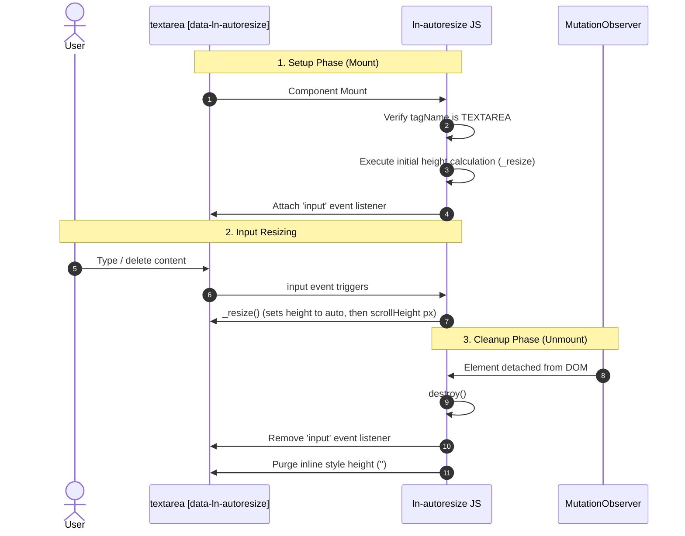

# ↕️ ln-autoresize

> **Classification:** 🟢 Simple Component / Layer 1 UI Utility

---

## 1. Core Behavior & Responsibility

- **Core Role:** Dynamically adjusts the vertical height of HTML `<textarea>` elements to fit their content, eliminating unnecessary scroll bars and improving visual layouts.
- **Real-Time Resizing:** Monitors the native `input` event on textareas and matches the CSS height property to the element's current `scrollHeight`.
- **Pre-filled Content Recognition:** Computes and sets initial heights immediately upon page load to accommodate pre-populated server-rendered content (such as edit states).
- **Cleanup Mechanics:** Restores original styling properties and clears event listeners when the instance is torn down.
- Located in [`js/ln-autoresize/src/ln-autoresize.js`](../../js/ln-autoresize/src/ln-autoresize.js).

> [!IMPORTANT]
> **What the component does NOT do (Orthogonality Doctrine):**
> - **Does NOT validate input lengths** — Form constraints are managed by [`ln-validate`](./ln-validate.md).
> - **Does NOT persist input text** — Preserving drafts is delegated to [`ln-persist`](./ln-persist.md) or coordinators.
> - **Does NOT submit forms** — Form transactions are handled by [`ln-form`](./ln-form.md).

---

## 2. Minimal HTML Markup & Usage Variants

### Base HTML Markup

Standard copy-paste implementation showing how to activate auto-resizing on a textarea:

```html
<textarea data-ln-autoresize placeholder="Write text..."></textarea>
```

---

### Variant 1: Pre-populated Form Data (SSR / Edit Modes)

When data is loaded dynamically or rendered by the server, the component automatically calculates the initial volume and expands the textarea accordingly:

```html
<div class="form-element">
    <label for="description">Detailed Description:</label>
    <textarea id="description" 
              name="description" 
              data-ln-autoresize
              rows="3">This is a long pre-populated description. The textarea automatically adjusts its layout height to ensure the entirety of this text is readable without displaying scroll bars.</textarea>
</div>
```

---

## 3. Declarative API Contract (Attributes & Events)

### Attributes Table

| Attribute | Element | Type / Values | Default | Description |
|---|---|---|---|---|
| `data-ln-autoresize` | `<textarea>` | Flag | — | Initializes the auto-resizing behavior on the target element. |

### Events API

`ln-autoresize` does not emit custom events. It functions entirely by listening to native **`input`** events on target `<textarea>` nodes.

---

## 4. CSS Styling & Behavioral Concept

### Styling Guidelines

For optimal display, disable browser manual resizing hooks and hide the overflow-y scroll indicators in your stylesheet:

```scss
textarea[data-ln-autoresize] {
    resize: none;
    overflow-y: hidden;
    min-height: 80px;
}
```

### Height Calculation Algorithm

On every typing input, height calculation must temporarily reset the height style to measure the true container scroll bounds:

1. `this.dom.style.height = 'auto';`
2. `this.dom.style.height = this.dom.scrollHeight + 'px';`

> [!NOTE]
> Avoid binding long CSS height transitions (`transition: height ...`) to auto-resizing textareas. Transition delays disrupt typing flows and cause cursor jump issues.

---

## 5. Accessibility (ARIA) & Common Pitfalls

### ARIA & Keyboard Semantics

- **Native Textareas:** Standard keyboard commands, visual focus borders, and screen reader announcements are fully managed by the browser. No custom ARIA properties are required.

### Common Pitfalls & Anti-patterns

> [!CAUTION]
> 1. **Applying to Unsupported Tags:**
>    Placing `data-ln-autoresize` on generic text `<input>` fields or `<div>` boxes causes initialization to fail, logging console warnings.
> 2. **Zero-Height Measurements in Collapsed Containers:**
>    If the `<textarea>` resides in a hidden tab, drawer, or modal dialog (`display: none`), its `scrollHeight` measures as `0` on load. Once the container is revealed:
>    - **Option 1 (HTML):** Dispatch a native event: `textarea.dispatchEvent(new Event('input'))`
>    - **Option 2 (JS API):** Call the internal resize method directly:
>      ```javascript
>      textarea.lnAutoresize._resize();
>      ```

---

## 6. Flow Diagram & Lifecycle



---

## 7. Related Components

- [`ln-form.md`](./ln-form.md) — Standard wrapping form context.
- [`ln-modal.md`](./ln-modal.md) — Target overlays where saving canvas layout space is essential.
