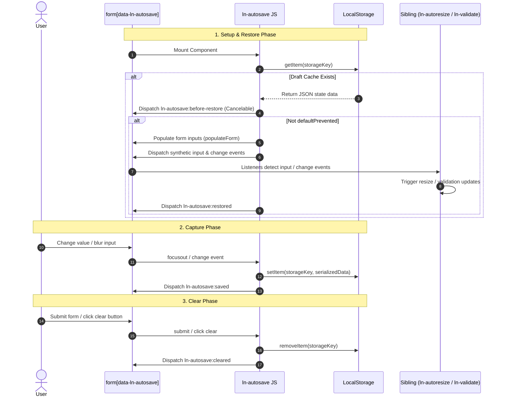

# 💾 ln-autosave

> **Classification:** 🟢 Simple Component / Layer 1 Form Helper

---

## 1. Core Behavior & Responsibility

- **Core Role:** Automatically captures and persists the temporary draft states of HTML forms to the browser's `localStorage` to prevent data loss.
- **Form Serialization:** Automatically serializes form elements and stores them on `focusout` or `change` events.
- **Opt-in Debounced Input:** Optionally performs debounced auto-saving on native `input` events while typing (configured via `data-ln-autosave-debounce-input`).
- **Clean Invalidation:** Clears the stored draft when the form is submitted (`submit`), reset (`reset`), or when an element marked with `data-ln-autosave-clear` is clicked.
- **Decoupled Event Restoration:** Restores form state on initialization and dispatches standard native `input` and `change` events on all restored fields. This automatically triggers sibling primitives (such as `ln-validate` and `ln-autoresize`) to re-evaluate their state without direct integration logic in `ln-autosave`.
- Located in [`js/ln-autosave/src/ln-autosave.js`](../../js/ln-autosave/src/ln-autosave.js).

> [!IMPORTANT]
> **What the component does NOT do (Orthogonality Doctrine):**
> - **Does NOT directly query or control sibling components** — It is completely unaware of [`ln-autoresize`](./ln-autoresize.md) or [`ln-validate`](./ln-validate.md). Instead, it relies on standard, decoupled native DOM events (`input` and `change`) during form restoration, which naturally trigger those components.
> - **Does NOT submit data or perform network requests** — Form submissions and remote server sync are managed by [`ln-form`](./ln-form.md) or [`ln-data-coordinator`](./ln-data-coordinator.md).
> - **Does NOT validate input constraints** — Form validation is delegated to [`ln-validate`](./ln-validate.md).
> - **Does NOT persist sensitive fields or nameless inputs** — Avoids saving credentials or custom inputs by ignoring fields without a `name` attribute, fields of type `file`, or elements decorated with `data-ln-autosave-exclude`.

---

## 2. Minimal HTML Markup & Usage Variants

### Base HTML Markup

Standard implementation showing how to activate draft persistence on a form:

```html
<form id="feedback-form" data-ln-autosave>
    <div class="form-element">
        <label for="comment">Comment</label>
        <textarea id="comment" name="comment" placeholder="Write feedback..."></textarea>
    </div>
    <ul class="form-actions">
        <li><button type="submit">Submit</button></li>
    </ul>
</form>
```

---

### Variant 1: Debounced Continuous Input with Clear Action

Shows how to configure continuous debounced auto-saving while typing, excluding a sensitive verification pin field, and adding a cancel/clear draft button:

```html
<form id="editor-form" 
      data-ln-autosave="blog-editor" 
      data-ln-autosave-debounce-input="1500">
      
    <div class="form-element">
        <label for="title">Title</label>
        <input type="text" id="title" name="title" />
    </div>

    <div class="form-element">
        <label for="content">Content</label>
        <!-- Composes with ln-autoresize via native input events -->
        <textarea id="content" name="content" data-ln-autoresize></textarea>
    </div>

    <!-- Sensitive inputs can be excluded -->
    <div class="form-element">
        <label for="passcode">Verification Pin</label>
        <input type="password" id="passcode" name="pin" data-ln-autosave-exclude />
    </div>

    <ul class="form-actions">
        <li><button type="button" data-ln-autosave-clear>Discard Draft</button></li>
        <li><button type="submit">Publish</button></li>
    </ul>
</form>
```

---

## 3. Declarative API Contract (Attributes & Events)

### Attributes Table

| Attribute | Element | Type / Values | Default | Description |
|---|---|---|---|---|
| `data-ln-autosave` | `<form>` | `String` \| Flag | — | Enables autosave. The value defines the storage key identifier; defaults to the form's `id`. |
| `data-ln-autosave-debounce-input` | `<form>` | `Integer` | `1000` | Optional. If present, saves draft on idle typing after specified milliseconds. |
| `data-ln-autosave-clear` | Element | Flag | — | Clears the persisted localStorage draft entry upon click. |
| `data-ln-autosave-exclude` | Input control | Flag | — | Excludes this specific input from being serialized and saved. |

### Programmatic JS API

Access the persistence instance directly via the `lnAutosave` property on the form element:

| Helper | Signature | Returns | Description |
|---|---|---|---|
| `form.lnAutosave.destroy` | `()` | `void` | Cleans up event listeners and cancels any active debounce timers. Does not purge the stored draft. |

- `form.lnAutosave.dom`: Reference to the `HTMLFormElement`.
- `form.lnAutosave.key`: The resolved localStorage key string (`ln-autosave:{pathname}:{identifier}`).

### Events API

| Event | Direction | Cancelable | Description | `detail` Object |
|---|---|---|---|---|
| `ln-autosave:before-restore` | Emits | Yes | Dispatched before filling the form. Prevent default to abort restoration. | `{ target: HTMLFormElement, data: Object }` |
| `ln-autosave:restored` | Emits | No | Dispatched after filling the form and triggering synthetic events. | `{ target: HTMLFormElement, data: Object }` |
| `ln-autosave:saved` | Emits | No | Dispatched after successfully writing the serialized form state to localStorage. | `{ target: HTMLFormElement, data: Object }` |
| `ln-autosave:cleared` | Emits | No | Dispatched after the form's draft entry is removed from localStorage. | `{ target: HTMLFormElement }` |
| `ln-autosave:destroyed` | Emits | No | Dispatched when the component is torn down via `.destroy()`. | `{ target: HTMLFormElement }` |

---

## 4. State & Persistence

- **Storage:** `localStorage`
- **Key format:** `ln-autosave:{window.location.pathname}:{identifier}` where `{identifier}` is the value of `data-ln-autosave` or, if empty, the form's `id`.
- **Written when:** On `focusout` or `change` events from any non-excluded input element. If `data-ln-autosave-debounce-input` is active, also written on a debounced `input` event.
- **Cleared when:** On form `submit` event, form `reset` event, or when an element with the `data-ln-autosave-clear` attribute is clicked.
- **Invalidation / versioning:** Tied to `window.location.pathname`. A custom identifier can be used in `data-ln-autosave="identifier"` to prevent pathname scoping (useful for cross-page forms or SPA routes).

---

## 5. CSS Styling & Behavioral Concept

- **Headless Architecture:** `ln-autosave` does not introduce any custom CSS styling, classes, or visual markup.
- **Decoupled Restoration Flow:**
  Upon page load, when a draft is found, `ln-autosave` restores the values via `populateForm` and then dispatches synthetic events on each restored field:
  ```javascript
  restored[k].dispatchEvent(new Event('input', { bubbles: true }));
  restored[k].dispatchEvent(new Event('change', { bubbles: true }));
  ```
  This is the official contract of cooperation between `ln-autosave` and styling or validation helpers:
  - `input` triggers visual textarea resizing in `ln-autoresize` and re-evaluation in `ln-validate`.
  - `change` triggers updates in checkboxes, select drop-downs, and radio groups.

---

## 6. Accessibility (ARIA) & Common Pitfalls

### ARIA & Keyboard

- **Form Semantics:** Leverages native `<form>` elements and input components. No custom ARIA roles or keyboard handlers are required.

### Common Pitfalls & Anti-patterns

> [!CAUTION]
> 1. **Missing Form Identifier:**
>    If the form does not have an `id` attribute and `data-ln-autosave` is empty, `_getStorageKey` returns `null`. The component logs a console warning and aborts initialization.
> 2. **Stale Drafts Overwriting Server Data:**
>    When the server renders updated database records, restoring an older draft from `localStorage` may overwrite fresh data. Prevent this by listening to the cancelable `ln-autosave:before-restore` event:
>    ```javascript
>    document.addEventListener('ln-autosave:before-restore', function (e) {
>        if (e.target.dataset.hasServerData === 'true') {
>            e.preventDefault();
>            localStorage.removeItem(e.target.lnAutosave.key);
>        }
>    });
>    ```
> 3. **Input Debounce Configured Per Form:**
>    The `data-ln-autosave-debounce-input` option applies to the entire form. Fields cannot have separate debounce timings.

---

## 7. Flow Diagram & Lifecycle



---

## 8. Related Components

- [`ln-form.md`](./ln-form.md) — Standard wrapping form context.
- [`ln-autoresize.md`](./ln-autoresize.md) — Standard textarea resizing component that reacts to the restored `input` events.
- [`ln-validate.md`](./ln-validate.md) — Form validation component that reacts to the restored `change`/`input` events.
- [`ln-persist.md`](./ln-persist.md) — Lower-level storage utility primitive.
