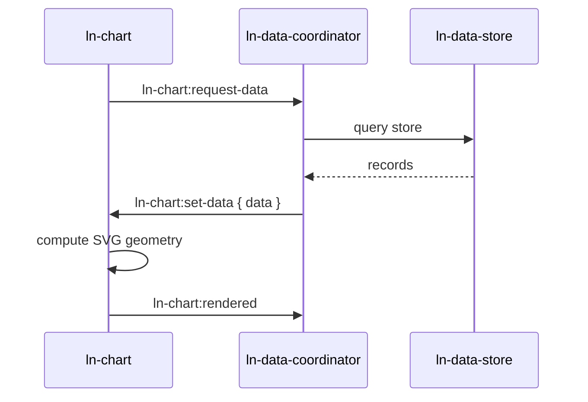

# ln-chart

> **Classification:** 🟢 Simple Component (Data Display / SVG Renderer)

---

## 1. Core Behavior & Responsibility

`ln-chart` renders one ordered numeric dataset as a responsive SVG line or area chart. It is a pure renderer: data arrives through `ln-chart:set-data`, and `ln-data-coordinator` resolves `data-ln-chart-store` against its child store/connector.

- Authored SVG and templates are preserved; JS updates geometry attributes and bound text only.
- `.chart` owns visual chrome through `theme/config/mixins/_chart.scss`.
- Instance customization rebinds `--chart-*` custom properties.
- Store/API knowledge remains exclusively in `ln-data-coordinator`.
- Scaling is category-based on x and linear numeric on y; the zero baseline is included by default to avoid misleading magnitude.

Source: [`ln-chart.js`](../../components/ln-chart/src/ln-chart.js).

---

## 2. Minimal HTML Markup & Usage Variants

### Base HTML Markup

```html
<figure id="monthly-revenue"
        class="chart"
        data-ln-chart="monthly-revenue"
        data-ln-chart-source="sales"
        data-ln-chart-x="month"
        data-ln-chart-y="revenue"
        data-ln-chart-type="area">
  <figcaption id="monthly-revenue-title">Monthly revenue</figcaption>
  <svg class="chart__plot" data-ln-chart-plot viewBox="0 0 1000 320"
       role="img" aria-labelledby="monthly-revenue-title"
       preserveAspectRatio="none">
    <polygon class="chart__area" data-ln-chart-area hidden></polygon>
    <polyline class="chart__line" data-ln-chart-line></polyline>
  </svg>
  <ol class="chart__labels" data-ln-chart-labels></ol>
  <template data-ln-template="monthly-revenue-label">
    <li class="chart__label"><span>{{ label }}</span> <strong>{{ value }}</strong></li>
  </template>
  <p class="chart__empty" data-ln-chart-empty hidden>No chart data available.</p>
</figure>
```

---

## 3. Declarative API Contract (Attributes & Events)

### Attributes Table

| Attribute | Element | Type / Values | Default | Description |
|---|---|---|---|---|
| `data-ln-chart` | `figure` | String | — | Unique identifier and host for chart instance. |
| `data-ln-chart-source` | `figure` | String | — | Target store ID to subscribe to via data coordinator. |
| `data-ln-chart-type` | `figure` | `line` \| `area` \| `polygon` | `line` | `polygon` aliases the area renderer. |
| `data-ln-chart-x` | `figure` | String | — | Ordered category label field name. |
| `data-ln-chart-y` | `figure` | String | — | Numeric value field name; invalid records are ignored. |
| `data-ln-chart-sort` | `figure` | `field:asc` \| `field:desc` | — | Optional query sort direction. |
| `data-ln-chart-zero` | `figure` | `false` | `true` | Opts out of a zero-inclusive y domain. |
| `data-ln-chart-plot` | `svg` | Flag | — | Target SVG element where polylines and polygons are rendered. |
| `data-ln-chart-area` | `polygon` | Flag | — | Polygon element for filled area representation. |
| `data-ln-chart-line` | `polyline` | Flag | — | Polyline element for line representation. |
| `data-ln-chart-labels` | `ol` / `ul` | Flag | — | Container for category labels rendered from template. |
| `data-ln-chart-empty` | `p` / `div` | Flag | — | Element shown when dataset is empty. |

### Events API

| Event | Direction | Cancelable | Description | `detail` Object |
|---|---|---|---|---|
| `ln-chart:request-data` | Emits | No | Renderer asks data coordinator for records. | `{ chart, source, sort, filters, search }` |
| `ln-chart:set-data` | Listens | No | Coordinator delivers records to chart. | `{ data, total?, filtered? }` |
| `ln-chart:set-loading` | Listens | No | Coordinator controls busy / loading state. | `{ loading }` |
| `ln-chart:rendered` | Emits | No | Rendering notification emitted after SVG geometry updates. | `{ chart, count, min, max }` |

---

## 4. CSS Styling & Behavioral Concept

Visual chrome is defined in `theme/config/mixins/_chart.scss`. Instance customization rebinds `--chart-*` custom properties:
- `--chart-stroke`: color of the line.
- `--chart-fill`: fill color / gradient of the area.
- `--chart-height`: height of the plot.

---

## 5. Accessibility (ARIA) & Common Pitfalls

- **ARIA labels:** The `<svg>` element must carry `role="img"` and `aria-labelledby` pointing to the `<figcaption>` id.
- **Fallback labels:** Always provide `<ol data-ln-chart-labels>` and `<template data-ln-template="...">` for semantic list representation.

---

## 6. Flow Diagram & Lifecycle



---

## 7. Related Components

- [`ln-data-coordinator`](./ln-data-coordinator.md) — Coordinates data loading and dispatches `ln-chart:set-data`.
- [`ln-data-store`](./ln-data-store.md) — Source data store providing records.
