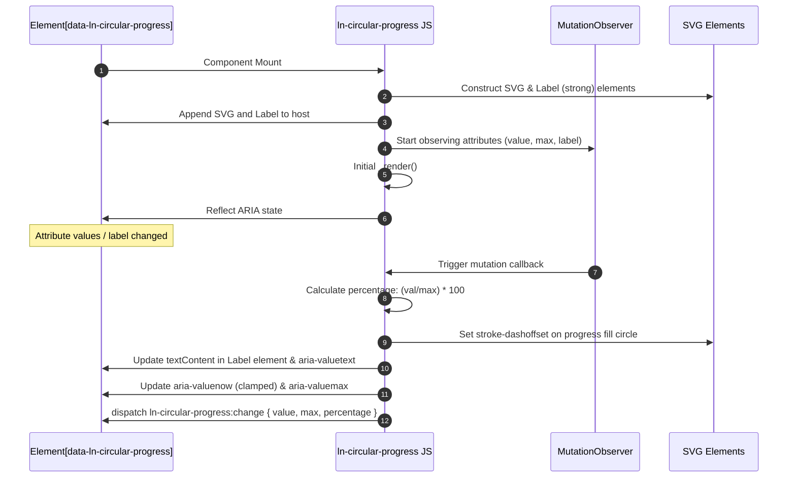

# ⭕ ln-circular-progress

> **Classification:** 🟢 Simple component (Layer 1 - Data Visualization)

---

## 1. Core Behavior & Responsibility

The `ln-circular-progress` component displays visual progress or statistical percentages inside a dynamically generated SVG circle. It is defined in [ln-circular-progress.js](../../js/ln-circular-progress/src/ln-circular-progress.js).

*   **Dynamic SVG Generation:** Automatically creates and appends an SVG element containing a background path (`track`) and an active overlay path (`fill`), manipulating the `stroke-dashoffset` dynamically.
*   **Attribute Bridge Pattern:** Leverages a `MutationObserver` to watch for updates to its configuration attributes (`data-ln-circular-progress`, `data-ln-circular-progress-max`, and `data-ln-circular-progress-label`) and instantly updates the UI.
*   **Central Label:** Dynamically generates a central `<strong>` element displaying either the percentage (e.g. `75%`) or a custom text label.
*   **Native ARIA Reflection:** Automatically manages its own ARIA roles and state attributes (`role="progressbar"`, `aria-valuenow`, `aria-valuemin`, `aria-valuemax`, `aria-valuetext`) to ensure accessibility out-of-the-box.

> [!IMPORTANT]
> **What the component does NOT do (Orthogonality Doctrine):**
> - **No Remote Fetching:** Does not fetch or manage any data. It only visualizes values passed to it.
> - **No Internal Timers:** Does not animate or increment values on its own. State updates must be driven externally.
> - **No Indeterminate State:** Does not support a spinning/indeterminate loader mode (use the SCSS `@mixin loader` instead).

---

## 2. Minimal HTML Markup & Usage Variants

### Base HTML Markup

```html
<!-- Standard percentage progress (0-100) -->
<div data-ln-circular-progress="45" id="task-progress"></div>
```

### Variant 1: Custom Max Value and Custom Label

Used when the progress is measured in units other than percentage, or when a customized textual representation is required.

#### HTML Markup
```html
<div data-ln-circular-progress="8" 
     data-ln-circular-progress-max="10" 
     data-ln-circular-progress-label="8 out of 10"
     id="custom-progress"></div>
```

---

## 3. Declarative API Contract (Attributes & Events)

### Attributes Table

| Attribute | Element | Type / Values | Default | Description |
|---|---|---|---|---|
| `data-ln-circular-progress` | Host | `Float` | `0` | The current value of the progress. Changes trigger a redraw. |
| `data-ln-circular-progress-max` | Host | `Float` | `100` | The maximum boundary value. |
| `data-ln-circular-progress-label` | Host | `String` | `null` | A custom string value to display in the center and reflect in `aria-valuetext`. Defaults to rounded percentage. |

### Events API

| Event | Direction | Cancelable | Description | `detail` Object |
|---|---|---|---|---|
| `ln-circular-progress:change` | Emits | No | Fires after the progress values change and the visual SVG is updated. | `{ target: HTMLElement, value: Number, max: Number, percentage: Number }` |

---

## 4. CSS Styling & Behavioral Concept

The component requires explicit sizing on the host element in CSS. The rendering structure features a background track, a dynamic fill track, and a centered label.

SCSS implementation in the visual layer:

```scss
[data-ln-circular-progress] {
    position: relative;
    display: inline-flex;
    align-items: center;
    justify-content: center;
    width: 64px; // Control progress circle dimensions from here
    height: 64px;
    
    svg {
        width: 100%;
        height: 100%;
    }

    // Background track circle
    .ln-circular-progress__track {
        stroke: var(--color-gray-light, #e2e8f0);
    }

    // Active fill progress circle
    .ln-circular-progress__fill {
        stroke: var(--color-primary, #3b82f6);
        transition: stroke-dashoffset 0.3s ease; // Smooth filling transition
    }

    // Centered label text
    .ln-circular-progress__label {
        position: absolute;
        font-size: 0.75rem;
        color: var(--color-text, #1e293b);
        text-align: center;
        pointer-events: none;
    }
}
```

---

## 5. Accessibility (ARIA) & Common Pitfalls

### ARIA & Keyboard

- **Role:** Automatically assigns `role="progressbar"`.
- **Value reflection:** Dynamically updates `aria-valuemin="0"`, `aria-valuemax` from configuration, `aria-valuenow` (safely clamped between 0 and max), and `aria-valuetext`.
- To provide better context for screen readers, developers should manually specify `aria-label` or `aria-labelledby`:
  ```html
  <div data-ln-circular-progress="70" aria-label="File upload progress"></div>
  ```

### Common Pitfalls & Anti-patterns

> [!CAUTION]
> 1. **Missing CSS Sizing:** Since SVG elements expand to fill their parent container, failing to specify explicit `width` and `height` on the host element will cause the progress circle to collapse or blow up.
> 2. **Direct JS Property Mutations:** Mutating properties on the JS instance directly instead of using `setAttribute` will bypass the `MutationObserver`, preventing the component from re-rendering.

---

## 6. Flow Diagram & Lifecycle



---

## 7. Related Components

- [`ln-progress`](./ln-progress.md) — Linear progress bar visualization.
