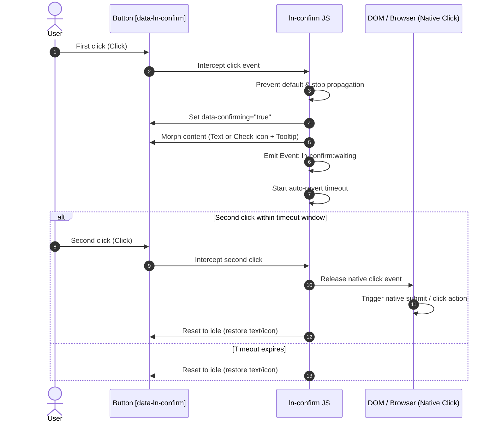

# 🛡️ ln-confirm

> **Classification:** 🟢 Simple component / Interaction Gate Primitive

---

## 1. Core Behavior & Responsibility

- Intercepts the first user click on protected buttons/links to present an in-place confirmation message.
- Morphs button contents during confirmation (updates text for text buttons; replaces icon with check and shows a tooltip for icon-only buttons).
- Automatically resets back to the idle state if the timeout (default: 3s) expires without a second click.
- Completely steps out of the way on the second click, letting the native `click` or `submit` event proceed.
- Located in [`js/ln-confirm/src/ln-confirm.js`](../../js/ln-confirm/src/ln-confirm.js).

> [!IMPORTANT]
> **What the component does NOT do (Orthogonality Doctrine):**
> - **Does NOT define custom accept events** — the developer attaches standard click/submit handlers to the element to perform actions.
> - **Does NOT prevent double-clicks during async requests** — once the native click is released, protection resets. Handlers must handle request locking (e.g. `button.disabled = true`).

---

## 2. Minimal HTML Markup & Usage Variants

### Base HTML Markup

```html
<form action="/account/delete" method="POST">
    <button type="submit" 
            class="btn btn-danger" 
            data-ln-confirm="Are you sure you want to delete your profile?">
        Delete Profile
    </button>
</form>
```

### Variant 1: Icon-Only Button with Tooltip

For compact layouts. Replaces the SVG icon path with `#ln-check` and shows a CSS tooltip.

#### HTML Markup
```html
<button type="button" 
        class="btn btn-icon" 
        aria-label="Delete Record" 
        data-ln-confirm="Confirm deletion?">
    <svg class="ln-icon" aria-hidden="true">
        <use href="#ln-trash"></use>
    </svg>
</button>
```

### Variant 2: Two-Element Mode

For complex layouts. Controls visibility of separate child nodes for idle and active states.

#### HTML Markup
```html
<button type="button" 
        class="btn btn-danger" 
        data-ln-confirm
        data-ln-confirm-timeout="4">
    <span data-ln-confirm-idle>
        <svg class="ln-icon" aria-hidden="true"><use href="#ln-trash"></use></svg>
        Delete Selected (<span data-ln-table-selected></span>)
    </span>
    <span data-ln-confirm-active hidden>
        Are you sure?
    </span>
</button>
```

---

## 3. Declarative API Contract (Attributes & Events)

### Attributes Table

| Attribute | Element | Type / Values | Default | Description |
|---|---|---|---|---|
| `data-ln-confirm` | Trigger | `String` | — | Initializes the component. Contains the confirmation text. Left empty for Two-Element Mode. |
| `data-ln-confirm-timeout` | Trigger | `Number` | `3` | Time in seconds before returning to the idle state. |
| `data-confirming` | Trigger | `Boolean` (auto) | — | Added dynamically as `"true"` while waiting for confirmation. Used for CSS styling. |
| `data-tooltip-text` | Trigger | `String` (auto) | — | Holds the bubble message text in icon-only mode. |
| `data-ln-confirm-idle` | Child | Element | — | Target visible in the idle state. |
| `data-ln-confirm-active` | Child | Element | — | Target visible in the active confirming state. |

### Programmatic JS API

| Helper | Signature | Returns | Description |
|---|---|---|---|
| `element.lnConfirm.confirming` | *Property* | `Boolean` | Returns `true` if the button is currently in confirming state. |
| `element.lnConfirm.destroy` | `()` | `void` | Restores original markup and cleans up listeners. |

### Events API

| Event | Direction | Cancelable | Description | `detail` Object |
|---|---|---|---|---|
| `ln-confirm:waiting` | Emits | No | Dispatched upon the first click when confirming begins. | `{ target: HTMLElement }` |

---

## 4. CSS Styling & Behavioral Concept

The visual design for icon-only confirmation bubbles utilizes a CSS tooltip bubble positioned relative to the trigger.

### SCSS Mixin Implementation (`scss/config/mixins/_confirm.scss`)
```scss
@use 'tooltip' as *;

@mixin confirm-tooltip {
    position: relative;
    overflow: visible !important;
    color: hsl(var(--color-error)) !important;

    &::after {
        @include tooltip-bubble;
        content: attr(data-tooltip-text);
        position: absolute;
        bottom: 100%;
        left: 50%;
        transform: translateX(-50%);
        --margin-block: var(--size-sm);
        margin-bottom: var(--margin-block);
    }
}
```

---

## 5. Accessibility (ARIA) & Common Pitfalls

### ARIA & Keyboard

- **Dynamic `aria-label`:** In icon-only mode, the `aria-label` is dynamically updated to the confirmation message and restored upon reset.
- **Dynamic Announcer (`role="alert"`):** A temporary screen-reader-only helper is injected with `role="alert"` so assistive technology immediately announces the prompt.
- **Focus Preservation:** Focus is kept on the button itself so the user can hit `Space` or `Enter` to confirm.

### Common Pitfalls & Anti-patterns

> [!CAUTION]
> 1. **Strict UX Limitation:** `ln-confirm` is strictly designed for **single-element, low-impact actions** (e.g. deleting a single table row, archiving one entry). Using `ln-confirm` for bulk actions or high-impact destructive operations is strictly forbidden. In those scenarios, a confirmation modal ([`ln-modal`](./ln-modal.md)) MUST be used.
> 2. **Double-Submit Prevention:** Ensure your handler disables the button after the second click to prevent duplicate form submissions during slow network fetches.

---

## 6. Flow Diagram & Lifecycle



---

## 7. Related Components

- [`ln-modal.md`](./ln-modal.md) — Used for bulk actions and high-risk confirmations.
- [`ln-table.md`](./ln-table.md) — Displays lists where individual rows can be protected via `ln-confirm`.
- [`ln-toast.md`](./ln-toast.md) — Used to display completion status messages.
