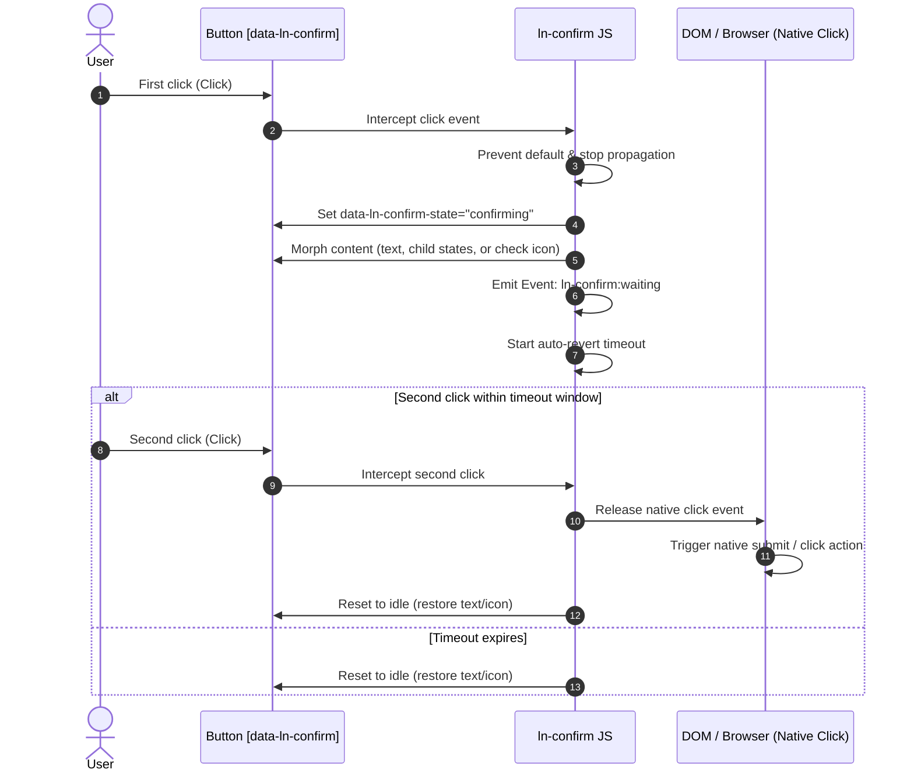

# 🛡️ ln-confirm

> **Classification:** 🟢 Simple component / Interaction Gate Primitive  
> Applied directly to `<button data-ln-confirm>` or `<a data-ln-confirm>`. On the first `click`, it calls
> `e.preventDefault()`, sets `data-ln-confirm-state="confirming"`, unhides `[data-ln-confirm-active]` (or swaps text),
> and starts a `setTimeout`. A second `click` before timeout lets the native event proceed; if the timer fires first,
> it clears the attribute and restores the original DOM content.

---

## 1. Core Behavior & Responsibility

- Intercepts the first user click on protected buttons/links to present an in-place confirmation message.
- Morphs button contents during confirmation (swaps `hidden` on child states, updates text, or swaps the icon to a check).
- Automatically resets back to the idle state if the timeout (default: 3s) expires without a second click.
- Steps out of the way of the default action on the second click, letting the native `click` or `submit` event proceed.
- Stops propagation on both clicks, so neither the arming nor the accepting click reaches an ancestor click surface (clickable card, row handler).
- Located in [`components/ln-confirm/src/ln-confirm.js`](../../components/ln-confirm/src/ln-confirm.js).

> [!NOTE]
> **Micro-Component Doctrine & Template Exception:**
> As an in-place behavioral gate / micro-component, `ln-confirm` is exempt from the `<template>` cloning doctrine to avoid over-engineering. For full HTML-first declarative purity, use **Two-Element Mode** (`data-ln-confirm-idle` / `data-ln-confirm-active`). The hardcoded `'Confirm?'` fallback in JS is strictly a developer failsafe of last resort.

> [!IMPORTANT]
> **What the component does NOT do (Orthogonality Doctrine):**
> - **Does NOT define custom accept events** — the developer attaches standard click/submit handlers to the element to perform actions.
> - **Does NOT prevent double-clicks during async requests** — once the native click is released, protection resets. Handlers must handle request locking (e.g. `button.disabled = true`).

---

## 2. Minimal HTML Markup & Usage Variants

### Variant 1: HTML-First (Two-Element Mode — Recommended)

Recommended for complex button layouts (with icons, badges, or rich HTML). Isolates idle and active states in pure markup with zero string replacement in JS.

#### HTML Markup
```html
<button type="button" 
        class="btn btn-danger" 
        data-ln-confirm 
        data-ln-confirm-timeout="4">
    <span data-ln-confirm-idle>
        <svg class="ln-icon" aria-hidden="true"><use href="#ln-icon-trash"></use></svg>
        Delete Item (<span data-ln-table-selected>3</span>)
    </span>
    <span data-ln-confirm-active hidden>
        Are you sure?
    </span>
</button>
```

### Variant 2: Shorthand Declarative Attribute Mode

Ideal for simple text buttons where the prompt is passed cleanly via the attribute string.

#### HTML Markup
```html
<form action="/account/delete" method="POST">
    <button type="submit" 
            class="btn btn-danger" 
            data-ln-confirm="Are you sure you want to delete your profile?">
        Delete Profile
    </button>
</form>
```

### Variant 3: Icon-Only Button

For compact layouts and table rows. Replaces the SVG icon path with `#ln-icon-check` and swaps `aria-label` to the prompt, backed by a transient `role="alert"` announcer. No bubble is rendered — `ln-confirm` does not do tooltips. Compose [`ln-tooltip`](./ln-tooltip.md) if the button needs one.

#### HTML Markup
```html
<button type="button" 
        aria-label="Delete Item" 
        data-ln-confirm="Confirm deletion?">
    <svg class="ln-icon" aria-hidden="true">
        <use href="#ln-icon-trash"></use>
    </svg>
</button>
```

---

## 3. Declarative API Contract (Attributes & Events)

### Attributes Table

| Attribute | Element | Type / Values | Default | Description |
|---|---|---|---|---|
| `data-ln-confirm` | Trigger | `String` | — | Initializes the component. Contains the confirmation text. Left empty for Two-Element Mode. |
| `data-ln-confirm-timeout` | Trigger | `Number` | `3` | Time in seconds before returning to the idle state. |
| `data-ln-confirm-state` | Trigger | `Boolean` (auto) | — | Added dynamically as `"true"` while waiting for confirmation. Used for CSS styling. |
| `data-ln-confirm-announcer` | injected `<span>` | Marker (auto) | — | Marks the transient `role="alert"` node appended in icon-only mode. |
| `data-ln-confirm-idle` | Child | Element | — | Target visible in the idle state. |
| `data-ln-confirm-active` | Child | Element | — | Target visible in the active confirming state. |

### Programmatic JS API

| Helper | Signature | Returns | Description |
|---|---|---|---|
| `element.lnConfirm.confirming` | *Property* | `Boolean` | Live read-only getter over data-ln-confirm-state. Assigning to it throws. |
| `element.lnConfirm.destroy` | `()` | `void` | Restores original markup and cleans up listeners. |

### Events API

| Event | Direction | Cancelable | Description | `detail` Object |
|---|---|---|---|---|
| `ln-confirm:waiting` | Emits | No | Dispatched upon the first click when confirming begins. | `{ target: HTMLElement }` |

---

## 4. CSS Styling & Behavioral Concept

`ln-confirm` ships almost no styling of its own. Two co-located rules in
`components/ln-confirm/ln-confirm.scss` are functional rather than decorative, and reach the
page through `ln-ashlar-core.css`:

```scss
[data-ln-confirm] [hidden]  { display: none; }   /* П4 hiding contract */
[data-ln-confirm-announcer] { /* visually hidden */ }
```

The only themed rule rebinds the accent token while the button is armed:

```scss
/* theme/components/_confirm.scss */
[data-ln-confirm-state="confirming"] {
    --color-primary: var(--color-error);
}
```

`theme/base/_global.scss` documents this token rebind as the way to express a colour
variant, so a button carrying `@mixin btn` turns red while armed. A bare, unstyled
`<button>` has no variant to recolour and shows no colour change; its armed signal is the
icon swap.

`ln-confirm` renders no tooltip, bubble or overlay of any kind. Use
[`ln-tooltip`](./ln-tooltip.md) when a button needs one.

---

## 5. Accessibility (ARIA) & Common Pitfalls

### ARIA & Keyboard

- **Dynamic `aria-label`:** In icon-only mode, the `aria-label` is dynamically updated to the confirmation message and restored upon reset.
- **Dynamic Announcer (`role="alert"`):** In icon-only mode a transient `<span data-ln-confirm-announcer role="alert">` is appended to the button carrying the prompt text, and removed on reset. The button is deliberately not also made a live region in this mode — a nested live region double-announces.
- **Focus Preservation:** Focus is kept on the button itself so the user can hit `Space` or `Enter` to confirm.

### Common Pitfalls & Anti-patterns

> [!CAUTION]
> 1. **Strict UX Limitation:** `ln-confirm` is strictly designed for **single-element, low-impact actions** (e.g. deleting a single table row, archiving one entry). Using `ln-confirm` for bulk actions or high-impact destructive operations is strictly forbidden. In those scenarios, a confirmation modal ([`ln-modal`](./ln-modal.md)) MUST be used.
> 2. **Double-Submit Prevention:** Ensure your handler disables the button after the second click to prevent duplicate form submissions during slow network fetches.

---

## 6. Flow Diagram & Lifecycle


```mermaid
sequenceDiagram
    autonumber
    actor User
    participant Button as Button [data-ln-confirm]
    participant JS as ln-confirm JS
    participant DOM as DOM / Browser (Native Click)

    User->>Button: First click (Click)
    Button->>JS: Intercept click event
    JS->>JS: Prevent default & stop propagation
    JS->>Button: Set data-ln-confirm-state="confirming"
    JS->>Button: Morph content (text, child states, or check icon)
    JS->>JS: Emit Event: ln-confirm:waiting
    JS->>JS: Start auto-revert timeout
    
    alt Second click within timeout window
        User->>Button: Second click (Click)
        Button->>JS: Intercept second click
        JS->>DOM: Release native click event
        DOM->>DOM: Trigger native submit / click action
        JS->>Button: Reset to idle (restore text/icon)
    else Timeout expires
        JS->>Button: Reset to idle (restore text/icon)
    end
```

---

## 7. Related Components

- [`ln-modal.md`](./ln-modal.md) — Used for bulk actions and high-risk confirmations.
- [`ln-table.md`](./ln-table.md) — Displays lists where individual rows can be protected via `ln-confirm`.
- [`ln-toast.md`](./ln-toast.md) — Used to display completion status messages.
