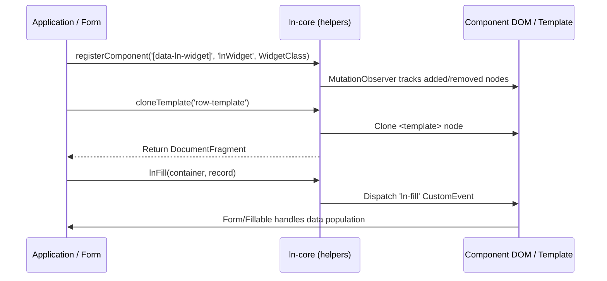

# ⚙️ ln-core

> **Classification:** ⚙️ Service (Layer 3 - Shared Infrastructure Primitives)

---

## 1. Core Behavior & Responsibility

`ln-core` serves as the base layer of the `ln-ashlar` architecture. It exports common DOM utilities, template rendering functions, event dispatchers, form serialization, component registration, dictionary builders, and reactive state management primitives.

The JavaScript source is entry-pointed at [index.js](../../js/ln-core/index.js) and implemented across modular sub-files in [js/ln-core/](../../js/ln-core/).

Key responsibilities include:
- **Component Lifecycle Registration (`registerComponent`):** Registers component classes with MutationObserver-based lifecycle management (childList, attribute observation, auto-instantiation, and automatic `destroy()` teardown on DOM removal).
- **Template System (`cloneTemplate`, `cloneTemplateScoped`, `fillTemplate`):** Clones HTML `<template>` tags safely and interpolates text nodes and attribute placeholders (`{{ prop }}`).
- **Declarative DOM Binding (`fill`, `lnFill`):** Maps Javascript objects directly onto DOM elements via `data-ln-field`, `data-ln-attr`, `data-ln-show`, and `data-ln-class`, and broadcasts `ln-fill` events across form and display containers.
- **Event Dispatch & Request Primitives (`dispatch`, `dispatchCancelable`, `requestData`):** Emits custom events with standard `bubbles: true` settings and handles cancelable lifecycle hooks and table/list pagination data requests.
- **Form & Input Processing (`serializeForm`, `populateForm`, `resolveFormMethod`, `interceptValueProperty`, `readValue`):** Serializes typed inputs (booleans, numbers, multi-selects), populates HTML forms, intercepts value properties, and reads raw `data-ln-value` machine values.
- **Network, Headers & Mapping (`shouldInterceptLink`, `buildUrl`, `getHeaders`, `parseHeaders`, `registerDataMapper`, `getDataMapper`):** Standardizes URL path join math, link interception, JSON headers, and domain record ingress/egress mappers.
- **Sub-module Aggregation:** Re-exports reactive proxies (`ln-reactive`), window caches (`window-cache`), persistence (`ln-persist`), hash state (`ln-hash`), floating UI math (`positioning`), and encryption (`ln-crypto`).

> [!IMPORTANT]
> **What the module does NOT do (Orthogonality Doctrine):**
> - **UI Control Logic:** `ln-core` provides functions and component registration hooks, not interactive widgets or DOM state observers itself.
> - **Network Requests:** Fetching data is handled by [`ln-http`](./ln-http.md) and backend connectors.
> - **Direct CSS Manipulation:** Style changes are handled strictly through class toggling (`data-ln-class`, `data-ln-show`) or explicit positioning coordinate writes.

---

## 2. Minimal HTML Markup & Usage Variants

`ln-core` functions are imported directly into custom components and coordinators:

```javascript
import { registerComponent, cloneTemplate, fill, dispatch } from '../../ln-core';

// 1. Register a custom component with automatic MutationObserver lifecycle
registerComponent('[data-ln-card]', 'lnCard', MyCardComponent, 'ln-card', {
    extraAttributes: ['data-ln-status'],
    onAttributeChange: (dom, attrName) => dom.lnCard?._syncAttribute(attrName)
});

// 2. Clone a template by name and fill fields
const clone = cloneTemplate('user-card', 'my-component');
fill(clone, { name: 'Jane Doe', role: 'Admin' });

// 3. Append to DOM and notify surrounding coordinators
document.body.appendChild(clone);
dispatch(document.body, 'user-card:created', { name: 'Jane Doe' });
```

---

## 3. Declarative API Contract (Attributes & Events)

### Attributes Table

This service module exposes no declarative HTML attributes directly on itself.

### Programmatic JS API

| Helper | Signature | Returns | Description |
|---|---|---|---|
| `registerComponent` | `(selector: String, attribute: String, ComponentFn: Class\|Function, componentTag?: String, options?: Object)` | `Function` | Registers a component constructor with MutationObserver subtree tracking, auto-instantiation, attribute change callbacks (`onAttributeChange`), and automatic `destroy()` teardown on node removal. |
| `cloneTemplate` | `(name: String, componentTag?: String)` | `DocumentFragment\|null` | Clones a `<template data-ln-template="name">` element. Caches template lookups after first retrieval. |
| `cloneTemplateScoped` | `(root: HTMLElement, name: String, componentTag?: String)` | `DocumentFragment\|null` | Searches for a scoped `<template data-ln-template="name">` within `root` before falling back to document-global lookup. |
| `fillTemplate` | `(clone: DocumentFragment\|HTMLElement, data: Object)` | `DocumentFragment\|HTMLElement` | Replaces `{{ prop }}` placeholders inside text nodes and element attribute values. |
| `fill` | `(root: HTMLElement\|DocumentFragment, data: Object)` | `HTMLElement\|DocumentFragment` | Binds data to `[data-ln-field]`, `[data-ln-attr]`, `[data-ln-show]`, and `[data-ln-class]` elements inside `root`. |
| `lnFill` | `(container: HTMLElement, record: Object\|null)` | `HTMLElement` | Dispatches `ln-fill` custom event to `[data-ln-form]` and `[data-ln-fillable]` descendants (or container itself). `null` triggers form/display clear. |
| `renderList` | `(container: HTMLElement, items: Array, templateName: String, keyFn: Function, fillFn: Function, componentTag?: String)` | `void` | Keyed DOM list renderer. Reuses existing nodes matching `data-ln-key` to minimize DOM thrashing. |
| `dispatch` | `(element: HTMLElement, eventName: String, detail?: Object)` | `void` | Dispatches a bubbling `CustomEvent` (`bubbles: true`). |
| `dispatchCancelable` | `(element: HTMLElement, eventName: String, detail?: Object)` | `CustomEvent` | Dispatches a bubbling, cancelable `CustomEvent` (`cancelable: true`). Returns the event object to check `event.defaultPrevented`. |
| `requestData` | `(component: Object, eventName: String, keyName: String)` | `void` | Re-filters, sorts, and re-renders list/table components, then dispatches data request event with current sort, filter, and search state. |
| `buildDict` | `(root: HTMLElement, selector: String)` | `Object` | Reads hidden list item dictionary strings (e.g. `<li data-ln-dict="key">Value</li>`) into a key-value object and removes them from the DOM. |
| `guardBody` | `(setupFn: Function, componentTag: String)` | `void` | Defers script execution until `DOMContentLoaded` if `document.body` is not yet available. |
| `findElements` | `(root: HTMLElement, selector: String, attribute: String, ComponentClass: Class)` | `void` | Instantiates `ComponentClass` on all matching elements under `root` that lack `el[attribute]`. |
| `isVisible` | `(el: HTMLElement)` | `Boolean` | Returns true if element has a non-zero layout width/height or bounding client rects. |
| `readValue` | `(el: HTMLElement)` | `String` | Reads `data-ln-value` attribute if present, otherwise returns trimmed `textContent`. Single path for machine value extraction. |
| `interceptValueProperty` | `(dom: HTMLElement, descriptor: PropertyDescriptor, callbacks: { get?: Function, set?: Function })` | `void` | Intercepts programmatic `value` getter/setter on inputs to sync custom formatting. |
| `serializeForm` | `(form: HTMLFormElement, opts?: { typed?: Boolean, exclude?: String })` | `Object` | Serializes form inputs into a plain JavaScript object. Option `typed: true` converts numbers to `Number` and single checkboxes to booleans. |
| `populateForm` | `(form: HTMLFormElement, data: Object)` | `Array<HTMLElement>` | Populates form elements matching field names or `data-ln-fill-as` overrides. |
| `resolveFormMethod` | `(form: HTMLFormElement)` | `String` | Determines effective HTTP method (`_method` hidden input value or `form.method`). |
| `getLocale` | `(el?: HTMLElement)` | `String` | Detects document or element BCP 47 locale tag (e.g. `"en-US"`, `"mk-MK"`). |
| `registerLocaleFallback` | `(langPrefix: String, dictionary: Object)` | `void` | Registers fallback month and day names for a language prefix (e.g. `"mk"`). |
| `getLocaleFallback` | `(lang: String)` | `Object\|null` | Retrieves registered fallback month/day dictionary for a language code. |
| `shouldInterceptLink` | `(event: MouseEvent, anchor: HTMLAnchorElement)` | `Boolean` | Checks if a link click should be intercepted by in-app SPA routers (left click, same origin, non-blank, non-download). |
| `buildUrl` | `(...segments: Array<String>)` | `String` | Joins URL path segments, stripping duplicate slashes. |
| `getHeaders` | `(customHeaders?: Object, auth?: String)` | `Object` | Compiles standard JSON headers with optional Bearer token or custom headers. |
| `parseHeaders` | `(str: String, componentName?: String)` | `Object` | Safely parses a JSON header string, returning an empty object on error. |
| `registerDataMapper` | `(name: String, mapper: { ingress: Function, egress: Function })` | `void` | Registers domain data mappers for record transformation in connectors/stores. |
| `getDataMapper` | `(name: String)` | `Object` | Retrieves a registered data mapper (or identity fallback). |

### Events API

| Event | Direction | Cancelable | Description | `detail` Object |
|---|---|---|---|---|
| `ln-fill` | Emits | No | Dispatched by `lnFill` to trigger data population or reset across fillable containers. | `Object` (record data) \| `null` (reset signal) |

---

## 4. Sub-Module Export Summary

`ln-core` re-exports infrastructure modules from sub-files:

- [`ln-reactive`](./ln-reactive.md) — `reactiveState`, `deepReactive`, `createBatcher`
- [`window-cache`](./window-cache.md) — `createWindowCache`
- [`ln-persist`](./ln-persist.md) — `persistGet`, `persistSet`, `persistRemove`, `persistClear`
- [`ln-hash`](./ln-hash.md) — `hashParse`, `hashGet`, `hashSet`, `hashLinkClick`
- [`positioning`](./positioning.md) — `computePlacement`, `measureHidden`
- [`ln-crypto`](./ln-crypto.md) — `setCryptoKey`, `getCryptoKey`, `encryptData`, `decryptData`

---

## 5. Accessibility (ARIA) & Common Pitfalls

- **Sanitization & Injection:** `fillTemplate` and `fill` use `textContent` and `setAttribute` exclusively. They never assign `innerHTML`, preventing XSS vulnerabilities from untrusted record fields.
- **Common Pitfall — Untyped Serialization:** In default (untyped) `serializeForm(form)` mode, numeric inputs return strings (`"123"` instead of `123`) and single checkboxes return `["on"]` (or field value array) rather than a boolean (`true`/`false`). Pass `{ typed: true }` when submitting JSON payloads to ensure proper type coercions.

---

## 6. Flow Diagram & Lifecycle



---

## 7. Related Components

- [`ln-helpers`](./ln-helpers.md) — Complete helper function reference for DOM and form operations.
- [`ln-reactive`](./ln-reactive.md) — Reactive state proxies and batching.
- [`ln-persist`](./ln-persist.md) — Namespaced `localStorage` persistence.
- [`guides/component-authoring`](../guides/component-authoring.md) — Guide to authoring custom components using core primitives.
