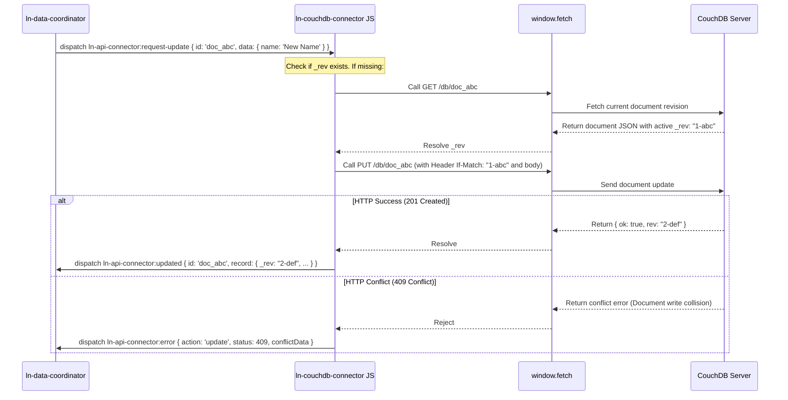

# 🔗 ln-couchdb-connector

> **Classification:** 🌐 Simple component / Remote DB Connection Driver

---

## 1. Core Behavior & Responsibility

- Serves as the specialized CouchDB sync gateway network driver for the local-first architecture.
- Translates standard CustomEvents database commands to native CouchDB REST calls.
- Performs sequence-based delta synchronization over the CouchDB changes feed (`_changes?include_docs=true`).
- Automatically resolves missing document revision parameters (`_rev`) by querying document states on PUT/DELETE mutations.
- Translates relational schema `id` fields to NoSQL standard `_id` on request send, and reverse-maps them on response.
- Located in [`js/ln-couchdb-connector/src/ln-couchdb-connector.js`](../../js/ln-couchdb-connector/src/ln-couchdb-connector.js).

> [!IMPORTANT]
> **What the component does NOT do (Orthogonality Doctrine):**
> - **Does NOT hold local cache databases** — delegated to [`ln-data-store`](./ln-data-store.md).
> - **Does NOT maintain query status or view states** — delegated to coordinators.

---

## 2. Minimal HTML Markup & Usage Variants

### Base HTML Markup

```html
<!-- Configured to point directly to a local CouchDB database -->
<div data-ln-couchdb-connector="orders"
     data-ln-couchdb-url="http://127.0.0.1:5984"
     data-ln-couchdb-db="app_orders"
     id="orders-connector">
</div>
```

---

## 3. Declarative API Contract (Attributes & Events)

### Attributes Table

| Attribute | Element | Type / Values | Default | Description |
|---|---|---|---|---|
| `data-ln-couchdb-connector` | Wrapper | `String` | — | Initializes the component and declares the driver namespace. |
| `data-ln-couchdb-url` | Wrapper | `String` | — | Base HTTP URL path to the CouchDB database server. |
| `data-ln-couchdb-db` | Wrapper | `String` | — | Targeted database name on CouchDB. |
| `data-ln-couchdb-auth` | Wrapper | `String` | — | Base64 encoded credentials token for Basic Auth. |
| `data-ln-couchdb-headers` | Wrapper | `String` | — | Comma-separated extra custom request header entries. |

### Programmatic JS API

| Helper | Signature | Returns | Description |
|---|---|---|---|
| `element.lnConnector.refreshConfig` | `()` | `void` | Reloads URL, headers, and credentials from attributes. |
| `element.lnConnector.fetchDelta` | `(since: String)` | `Promise` | Fetches delta updates from CouchDB Changes Feed. |
| `element.lnConnector.create` | `(payload: Object)` | `Promise` | Creates a document in CouchDB database. |
| `element.lnConnector.update` | `(id: ID, payload: Object)` | `Promise` | Modifies document state, fetching revision if missing. |
| `element.lnConnector.delete` | `(id: ID, rev: String)` | `Promise` | Deletes a document. |
| `element.lnConnector.destroy` | `()` | `void` | Clears event bindings. |

### Events API

*Responds to events under `ln-couchdb-connector:...`, `ln-api-connector:...`, and `ln-rest-connector:...` namespaces for drop-in compatibility.*

| Event | Direction | Cancelable | Description | `detail` Object |
|---|---|---|---|---|
| `:request-sync` / `:request-fetch` | Listens | No | Triggers delta changes feed updates query. | `{ since?: String, meta?: Object }` |
| `:request-create` | Listens | No | Triggers document create request. | `{ data: Object, tempId: String, meta?: Object }` |
| `:request-update` | Listens | No | Triggers document PUT edit. | `{ id: ID, data: Object, expected_version?: String, meta?: Object }` |
| `:request-delete` | Listens | No | Triggers document DELETE. | `{ id: ID, rev?: String, meta?: Object }` |
| `:request-bulk-delete` | Listens | No | Triggers bulk document deletes. | `{ ids: Array, meta?: Object }` |
| `ln-couchdb-connector:fetched` | Emits | No | Dispatched upon delta sync responses. | `{ data: Array, since: String, meta: Object }` |
| `ln-couchdb-connector:created` | Emits | No | Dispatched upon successful document creation. | `{ record: Object, tempId: String, message: String, meta: Object }` |
| `ln-couchdb-connector:updated` | Emits | No | Dispatched upon successful document edit. | `{ record: Object, id: ID, message: String, meta: Object }` |
| `ln-couchdb-connector:deleted` | Emits | No | Dispatched upon successful document deletion. | `{ response: Object, id: ID, message: String, meta: Object }` |
| `ln-couchdb-connector:bulk-deleted` | Emits | No | Dispatched upon successful bulk deletion. | `{ response: Object, ids: Array, message: String, meta: Object }` |
| `ln-couchdb-connector:error` | Emits | No | Dispatched upon HTTP or network errors. | `{ action: String, error: String, status: Int, conflictData?: Object, meta: Object }` |
| `ln-couchdb-connector:config-changed` | Emits | No | Dispatched whenever `refreshConfig()` reloads URL, headers, and credentials (including on init). | `{ url: String, db: String, auth: String, headers: Object }` |
| `ln-couchdb-connector:destroyed` | Emits | No | Dispatched when the component is destroyed. | `{ target: HTMLElement }` |

---

## 4. CSS Styling & Behavioral Concept

- **Headless Component:** `ln-couchdb-connector` is a logical wrapper with no UI footprint. It registers no styles or visual stylesheet.
- **Envelope Response unwrap:** Unwraps response envelopes checking if backend wraps payloads into `{message, content}` structures.
- **Bulk Deletion Process:**
  CouchDB has no native route to delete an array of records by ID alone. To delete items:
  1. Requests revisions (`_rev`) of targets via `POST /{db}/_all_docs` using `{"keys": [...]}`.
  2. Maps resolved documents as `_deleted: true` with corresponding current revisions.
  3. Uploads collection via `POST /{db}/_bulk_docs`.

---

## 5. Accessibility (ARIA) & Common Pitfalls

### ARIA & Keyboard
- Headless driver. Accessibility structures are not applicable.

### Common Pitfalls & Anti-patterns

> [!CAUTION]
> 1. **Basic Auth credentials leak:** Specifying credentials in `data-ln-couchdb-auth` exposes secrets to XSS. Always use HttpOnly cookies or a Backend Proxy Gateway.
> 2. **CORS Restrictions:** CouchDB endpoints must enable CORS rules in `local.ini` matching the application's origin to avoid browser blocks.

---

## 6. Flow Diagram & Lifecycle



---

## 7. Related Components

- [`ln-data-coordinator.md`](./ln-data-coordinator.md) — Connects this driver to local cache stores.
- [`ln-http.md`](./ln-http.md) — HTTP engine wrapping fetch calls.
