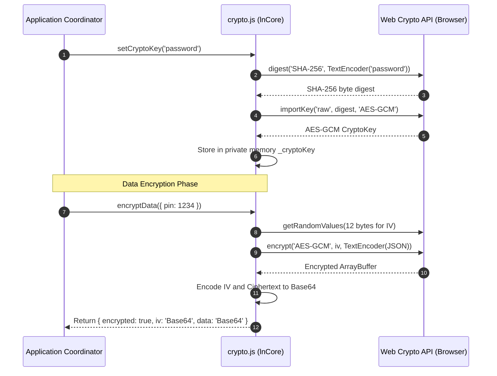

# 🔒 ln-crypto

> **Classification:** ⚛️ Service (Layer 3 - Client-side Encryption Wrapper)

---

## 1. Core Behavior & Responsibility

The `ln-crypto` utility is a reusable client-side cryptographic service situated in the core utility layer. It provides a simplified wrapper around the browser's native **Web Crypto API** for secure data encryption and decryption. It is defined in [crypto.js](../../js/ln-core/crypto.js).

*   **AES-GCM Encryption:** Uses Galois/Counter Mode (AES-GCM) симетрично шифрирање to provide high performance and integrity protection (authenticated encryption).
*   **SHA-256 Key Derivation:** Hashes a user password or string secret to derive a secure 256-bit cryptographic key.
*   **Randomized IVs:** Generates a new 12-byte initialization vector (IV) via `crypto.getRandomValues()` for every encryption operation, preventing pattern analysis attacks.
*   **Memory Isolation:** Isolates the active cryptographic key inside a private module variable (`_cryptoKey`), preventing simple access via global browser console scope (`window`).

> [!IMPORTANT]
> **What the component does NOT do (Orthogonality Doctrine):**
> - **No Automatic Persistence:** Does not store keys or ciphertexts between page reloads on its own (use [`ln-persist`](./ln-persist.md) to save them in `localStorage`).
> - **No Interactive Prompts:** Does not handle UI credential forms or prompts for user secrets (use coordinators and [`ln-form`](./ln-form.md)).

---

## 2. Minimal HTML Markup & Usage Variants

Because `ln-crypto` is a pure JS service, it has no HTML markup bindings. It is imported and called directly from other JavaScript modules or coordinators:

```javascript
import { setCryptoKey, encryptData, decryptData, getCryptoKey } from '../../ln-core/crypto.js';

async function performSecureOperation() {
    // 1. Initialize the key with a secret
    await setCryptoKey('user-entered-password');
    
    // 2. Encrypt an object
    const sensitiveRecord = { ssn: '123-456-789', passcode: 4882 };
    const result = await encryptData(sensitiveRecord);
    console.log(result);
    // Returns: { encrypted: true, iv: "Base64String...", data: "Base64String..." }

    // 3. Decrypt the object
    const original = await decryptData(result);
    console.log(original);
    // Returns: { ssn: '123-456-789', passcode: 4882 }
}
```

---

## 3. Declarative API Contract (Attributes & Events)

### Programmatic JS API

| Helper | Signature | Returns | Description |
|---|---|---|---|
| `setCryptoKey` | `(secretString: String)` | `Promise<void>` | Derives a 256-bit AES-GCM key using SHA-256. Passing an empty/falsy value clears the current key in memory. |
| `getCryptoKey` | `()` | `CryptoKey` \| `null` | Returns the currently active `CryptoKey` instance or `null`. |
| `encryptData` | `(plainData: any, key?: CryptoKey)` | `Promise<Object>` \| `Promise<any>` | Encrypts serialized JSON/string data. Returns `{ encrypted: true, iv: Base64, data: Base64 }`. Returns original data unaltered if key is missing or encryption fails. |
| `decryptData` | `(encryptedObject: Object, key?: CryptoKey)` | `Promise<any>` | Decrypts an encrypted object back to its original JSON structure or string. Returns `{ ...encryptedObject, decryptionError: true }` if key is wrong or decryption fails. |

---

## 4. CSS Styling & Behavioral Concept

As a pure background JS logic service, `ln-crypto` has no styling definitions or visual presentation layers.

---

## 5. Accessibility (ARIA) & Common Pitfalls

### ARIA & Keyboard

- As a logic utility, this service does not influence ARIA properties directly.

### Common Pitfalls & Anti-patterns

> [!CAUTION]
> 1. **Ignoring Decryption Errors:** Failing to check the `decryptionError: true` flag in the returned object of `decryptData` will result in your application trying to display raw ciphertext objects/strings to the user.
> 2. **Hardcoded Secrets:** Storing the initial secret password directly inside static client-side JavaScript bundle files makes the encryption obsolete. Ensure password secrets are derived from runtime user input fields or managed securely.

---

## 6. Flow Diagram & Lifecycle



---

## 7. Related Components

- [`ln-persist`](./ln-persist.md) — Uses `ln-crypto` to secure localStorage values under secure mode.
- [`ln-data-store`](./ln-data-store.md) — Integrates with `ln-crypto` for local database cache encryption.
