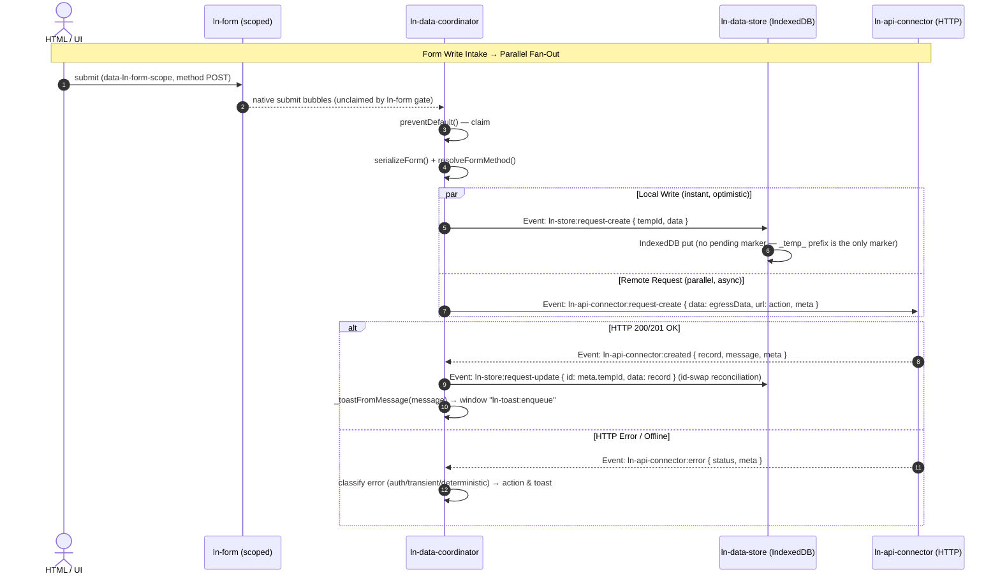

# 🌐 ln-data-coordinator

> **Classification:** ⚙️ Coordinator (Coordinator / Orchestrator)

---

## 1. Core Behavior & Responsibility

- Serves as the central mediator of the Local-First data layer (offline-ready database synchronization).
- Orchestrates and binds child database/transport components within its DOM sub-graph (e.g. [`ln-data-store`](./ln-data-store.md), [`ln-api-connector`](./ln-api-connector.md) / [`ln-couchdb-connector`](./ln-couchdb-connector.md), [`ln-api-queue`](./ln-api-queue.md)).
- Intercepts native form submit actions globally on forms with a matching `data-ln-form-scope` to route writes.
- Dispatches write operations in a **parallel fan-out** layout: triggers local database mutations and remote connector/queue uploads simultaneously.
- Located in [`js/ln-data-coordinator/src/ln-data-coordinator.js`](../../js/ln-data-coordinator/src/ln-data-coordinator.js).

> [!IMPORTANT]
> **What the component does NOT do (Orthogonality Doctrine):**
> - **Does NOT store records in memory or IndexedDB** — delegated to [`ln-data-store`](./ln-data-store.md).
> - **Does NOT initiate fetch/XHR network requests** — delegated to remote connectors.
> - **Does NOT maintain the offline transaction log** — delegated to [`ln-api-queue`](./ln-api-queue.md).

---

## 2. Minimal HTML Markup & Usage Variants

### Base HTML Markup

```html
<ul data-ln-data-coordinator="users" id="users-coordinator" hidden>
    <!-- Local database storage (IndexedDB) -->
    <li data-ln-data-store="users" id="users-store"></li>
    
    <!-- Remote connection endpoint (REST) -->
    <li data-ln-api-connector="/api/users" id="users-connector"></li>
    
    <!-- Offline transaction queue -->
    <li data-ln-api-queue id="users-queue"></li>
</ul>
```

### Variant 1: Connection to View Components

View elements (e.g., [`ln-table`](./ln-table.md), `ln-list`) can reside anywhere in the DOM. They communicate with the coordinator via bubbled document queries.

#### HTML Markup
```html
<!-- Logical data definition -->
<ul data-ln-data-coordinator="users" hidden>
    <li data-ln-data-store="users"></li>
    <li data-ln-api-connector="/api/users"></li>
</ul>

<!-- UI View component consuming data -->
<div id="users-table" data-ln-table="users" data-ln-table-store="users">
    <table>
        <!-- Populated automatically -->
    </table>
</div>
```

---

## 3. Declarative API Contract (Attributes & Events)

### Attributes Table

| Attribute | Element | Type / Values | Default | Description |
|---|---|---|---|---|
| `data-ln-data-coordinator` | Wrapper | `String` | — | Activates the coordinator. Declares the data model namespace. |
| `data-ln-data-mapper` | Wrapper | `String` | — | Optional custom data mapper function key name. |
| `data-ln-data-coordinator-stale` | Wrapper | `Number` | `300` | Stale cache window in seconds. Falls back to store rules. |
| `data-ln-data-coordinator-no-autosync` | Wrapper | Flag | — | Disables automatic sync on visibility or online recovery events. |

### Programmatic JS API

| Helper | Signature | Returns | Description |
|---|---|---|---|
| `element.lnCoordinator.refreshMapper` | `()` | `void` | Dynamically updates the configuration of the registered mapper. |
| `element.lnCoordinator.destroy` | `()` | `void` | Restores bindings and unbinds child listeners. |

### Events API

| Event | Direction | Cancelable | Description | `detail` Object |
|---|---|---|---|---|
| `ln-data-coordinator:request-create` | Listens | No | Intake event to create a record via fan-out. | `{ data: Object }` |
| `ln-data-coordinator:request-update` | Listens | No | Intake event to update a record via fan-out. | `{ id: ID, data: Object, expected_version?: String }` |
| `ln-data-coordinator:request-delete` | Listens | No | Intake event to delete a record. | `{ id: ID }` |
| `ln-data-coordinator:request-bulk-delete` | Listens | No | Intake event to delete multiple records. | `{ ids: Array }` |
| `ln-store:initialized` | Listens | No | Triggers sync if cache is empty or stale. | `{ target: HTMLElement }` |
| `ln-store:request-remote-sync` | Listens | No | Requests remote delta synchronization. | `{ since: String }` |
| `ln-api-queue:send` | Listens | No | Processes outbound offline queue writes. | `{ entryId: ID, op: String, payload: Object }` |
| `ln-table:request-data` | Listens | No | Query from a table to fetch items. | `{ target: HTMLElement }` |
| `ln-api-queue:request-enqueue` | Emits | No | Enqueues a transaction if offline. | `{ chainKey: String, op: String, payload: Object }` |
| `ln-api-queue:ack` / `nack` | Emits | No | Confirms or rejects a queue message. | `{ entryId: ID, reason?: String }` |
| `ln-toast:enqueue` | Emits | No | Dispatched to `window` for success/error alerts. | `{ message: String, type: String }` |

**View-Binder Contract**

| Event | Direction | Cancelable | Description | `detail` Object |
|---|---|---|---|---|
| `ln-list:request-data` | Listens | No | Query from a list to fetch items (same handling as `ln-table:request-data`). | `{ target: HTMLElement, sort, filters, search }` |
| `ln-options:request-data` | Listens | No | Query from an `<select>`/options binder to fetch all records. | `{ target: HTMLElement }` |
| `ln-stat:request-count` | Listens | No | Query from a stat/counter binder to fetch a record count. | `{ target: HTMLElement, filters?: Object }` |
| `ln-{kind}:set-data` | Emits | No | Pattern row — `{kind}` is `table` or `list`, matching the requesting view's own namespace. Delivers the resolved query result. | `{ data: Array, total: Number, filtered: Number }` |
| `ln-{kind}:set-loading` | Emits | No | Pattern row — `{kind}` is `table` or `list`. Dispatched instead of `set-data` while the store hasn't finished loading yet. | `{ loading: true }` |
| `ln-options:set-data` | Emits | No | Delivers all records to a bound options binder. | `{ data: Array }` |
| `ln-stat:set-count` | Emits | No | Delivers the resolved count to a bound stat binder. | `{ count: Number }` |
| `ln-store:ready` / `:loaded` / `:created` / `:updated` / `:deleted` | Listens | No | Store change notifications — on any of these, re-queries and re-serves all bound view elements using their last cached query. | *(handler-internal; no detail consumed)* |
| `ln-store:synced` | Listens | No | Same re-serve as above, but only when `detail.changed` is true. | `{ changed: Boolean }` |

**Write-Pipeline / Infrastructure Wiring**

| Event | Direction | Cancelable | Description | `detail` Object |
|---|---|---|---|---|
| `ln-store:request-create` / `:request-update` / `:request-delete` / `:request-bulk-delete` | Emits | No | Dispatched to the store child as the local-write half of the parallel fan-out. | `{ tempId?, id?, ids?, data? }` (shape per op) |
| `ln-api-connector:request-create` / `:request-update` / `:request-delete` / `:request-bulk-delete` | Emits | No | Dispatched to the connector child — direct path (no queue) or the queued-transport path via `ln-api-queue:send`. | `{ data?, id?, ids?, url?, meta: Object }` |
| `ln-api-connector:request-sync` | Emits | No | Dispatched to the connector on `ln-store:request-remote-sync`, to trigger the delta fetch. | `{ since: String, meta: Object }` |
| `ln-api-queue:request-remap` | Emits | No | Re-keys a queued chain from a temp ID to the server-issued ID once a create resolves. | `{ oldKey: String, newId: ID }` |
| `ln-api-queue:failed` | Listens | No | Terminal retry-exhaustion notification from the queue — surfaces a `network` toast via the dict. | `{ entryId: ID, chainKey: String, attempts: Number }` |
| `ln-api-connector:fetched` / `:created` / `:updated` / `:deleted` / `:bulk-deleted` / `:error` | Listens | No | Connector response handling (also namespaced under `ln-couchdb-connector:...` — generalized across concrete connector implementations). Reconciles the store, fires toasts, and drives queue ack/nack. | *(shape per response — see [`ln-api-connector.md`](./ln-api-connector.md) Events API)* |

---

## 4. CSS Styling & Behavioral Concept

- **Headless Component:** The coordinator is a logical orchestrator with the `hidden` attribute in DOM and has no visual styling or styles sheet associated.
- **Form Submit Integration:**
  Listens to the native `submit` event on `document` (bubble phase):
  1. Checks if `e.defaultPrevented` is true (e.g. blocked by `ln-validate` invalid checks).
  2. Resolves `data-ln-form-scope` matching its namespace, or matches descendants.
  3. Identifies effective method (e.g., hidden `_method` or form method POST/PUT/PATCH).
  4. Serializes form data via `serializeForm(form)` and routes payload through the parallel write pipeline.
- **Error Taxonomy & Conflict Policy:**
  - `401` / `419` Auth -> Pauses the queue, triggers auth required toast.
  - `409` Conflict (Update) -> Server-wins rule: replaces local cache entry with `remote` document data from response.
  - Deterministic `4xx` -> Drop mutation (rejected): create error deletes the optimistic temp record.
  - Transient network errors -> Outbox queue retries.

---

## 5. Accessibility (ARIA) & Common Pitfalls

### ARIA & Keyboard
- The coordinator does not render any interactive surface. Data display accessibility is managed by consuming view modules (e.g. `ln-table`).

### Common Pitfalls & Anti-patterns

> [!CAUTION]
> 1. **Co-locating children outside sub-graph:** The coordinator searches its immediate DOM tree children for stores, queues, and connectors. Do not place these nodes outside the coordinator wrapper.
> 2. **Evaluation of script mappers:** Script-based inline mappers `<script data-ln-mapper>` are deprecated due to XSS vulnerability. Always register custom mappers securely via `window.lnCore.registerDataMapper(...)`.

---

## 6. Flow Diagram & Lifecycle



---

## 7. Related Components

- [`ln-data-store.md`](./ln-data-store.md) — The local cache storage.
- [`ln-api-queue.md`](./ln-api-queue.md) — Manages the offline mutation queue.
- [`ln-api-connector.md`](./ln-api-connector.md) — Executes standard RESTful endpoints requests.
- [`ln-couchdb-connector.md`](./ln-couchdb-connector.md) — Alternative CouchDB-specific connection driver.
- [`ln-table.md`](./ln-table.md) — Consumes data queries provided by this coordinator.
