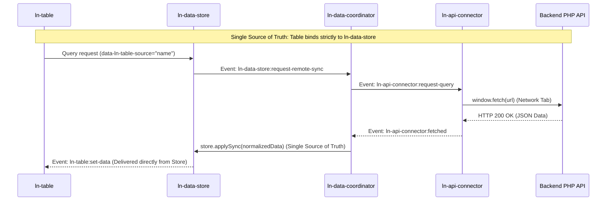
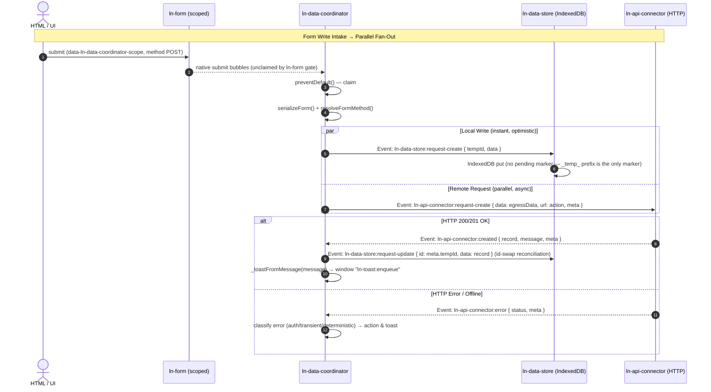

# 🌐 ln-data-coordinator

> **Classification:** ⚙️ Coordinator (Coordinator / Orchestrator)

---

## 1. Core Behavior & Responsibility

- Serves as the central mediator of the Local-First data layer (offline-ready database synchronization).
- Orchestrates and binds child database/transport components within its DOM sub-graph (e.g. [`ln-data-store`](./ln-data-store.md), [`ln-api-connector`](./ln-api-connector.md) / [`ln-couchdb-connector`](./ln-couchdb-connector.md), [`ln-api-queue`](./ln-api-queue.md)).
- Intercepts native form submit actions globally on forms with a matching `data-ln-data-coordinator-scope` to route writes.
- Dispatches write operations in a **parallel fan-out** layout: triggers local database mutations and remote connector/queue uploads simultaneously.
- Located in [`components/ln-data-coordinator/src/ln-data-coordinator.js`](../../components/ln-data-coordinator/src/ln-data-coordinator.js).

> [!IMPORTANT]
> **What the component does NOT do (Orthogonality Doctrine):**
> - **Does NOT store records in memory or IndexedDB** — delegated to [`ln-data-store`](./ln-data-store.md).
> - **Does NOT initiate fetch/XHR network requests** — delegated to remote connectors.
> - **Does NOT maintain the offline transaction log** — delegated to [`ln-api-queue`](./ln-api-queue.md).

---

## 2. Minimal HTML Markup & Usage Variants

### Base HTML Markup

```html
<ul data-ln-data-coordinator id="users-coordinator" hidden>
    <!-- Local database storage (IndexedDB) -->
    <li data-ln-data-store id="users"></li>
    
    <!-- Remote connection endpoint (REST) -->
    <li data-ln-api-connector data-ln-api-connector-path="/api/users" id="users-connector"></li>
    
    <!-- Offline transaction queue -->
    <li data-ln-api-queue id="users-queue"></li>
</ul>
```

### Variant 1: Connection to View Components

View elements (e.g., [`ln-table`](./ln-table.md), `ln-list`, [`ln-chart`](./ln-chart.md)) can reside anywhere in the DOM. They communicate with the coordinator via bubbled document queries.

#### HTML Markup
```html
<!-- Logical data definition -->
<ul data-ln-data-coordinator hidden>
    <li data-ln-data-store id="users"></li>
    <li data-ln-api-connector data-ln-api-connector-path="/api/users"></li>
</ul>

<!-- UI View component consuming data -->
<div id="users-table" data-ln-table="users" data-ln-table-source="users">
    <table>
        <!-- Populated automatically -->
    </table>
</div>
```

---

## 3. Declarative API Contract (Attributes & Events)

### Attributes Table

| Attribute | Element | Type / Values | Default | Description |
|---|---|---|---|---|
| `data-ln-data-coordinator` | Wrapper | `String` | falls back to `id` | Activates the coordinator. Its value is the coordinator's **name** — the address every view and query control binds to. |
| `data-ln-data-coordinator-mapper` | Wrapper | `String` | — | Optional custom data mapper function key name. |
| `data-ln-data-coordinator-scope` | `<form>` | `String` | — | Opts an external form into this coordinator's write intake loop. |
| `data-ln-data-coordinator-stale` | Wrapper | `Number` | `300` | Stale cache window in seconds. Falls back to store rules. |
| `data-ln-data-coordinator-no-autosync` | Wrapper | Flag | — | Disables automatic sync on visibility or online recovery events. |
| `data-ln-data-coordinator-search` | Wrapper | `String` | — | Current search term. Read live; author-seedable. |
| `data-ln-data-coordinator-filters` | Wrapper | `String` (URL query) | — | Active filters as a URL query string, parsed with `URLSearchParams`. A multi-value filter is a **repeated key**: `status=open&status=pending&type=invoice`. |
| `data-ln-data-coordinator-sort-field` | Wrapper | `String` | — | Field the result set is sorted by. Meaningful only with `-sort-direction`. |
| `data-ln-data-coordinator-sort-direction` | Wrapper | `asc` \| `desc` | — | Sort direction. Both sort attributes are removed together when sorting is cleared. |
| `data-ln-table-source` | `[data-ln-table]` | `String` (Coordinator name) | — | Binds a table to this coordinator; receives `ln-table:set-data`. |
| `data-ln-list-source` | `[data-ln-list]` | `String` (Coordinator name) | — | Binds a list to this coordinator; receives `ln-list:set-data`. |
| `data-ln-chart-source` | `[data-ln-chart]` | `String` (Coordinator name) | — | Binds a chart to this coordinator; receives `ln-chart:set-data`. |
| `data-ln-options` | `<select>` | `String` (Coordinator name) | — | Populated with records via `ln-options:set-data`. |
| `data-ln-stat` | Inline Element | `String` (Coordinator name) | — | Receives record count via `ln-stat:set-count`. |

> **The query is the coordinator's state, not the cache's.** The coordinator is the only
> participant guaranteed to be present in its layer; the cache, the transport and the queue
> are optional. The four query attributes therefore live on the coordinator's own host and
> are read live at the moment of use. The serialisation is the one a browser produces by
> itself: without JavaScript a form does a `GET` and lays the values out in a URL query
> string, so the attribute carries exactly that and JS only forwards it. Sort is two axes
> rather than the connector's `sort_field` / `sort_dir`, because those names are transport
> configuration (overridable per connector via `paramKeys`) and do not belong here.
>
> **`*-source` names the coordinator, not the store.** A view binds to the coordinator's
> name and never has to know whether a cache exists behind it — swapping to a
> transport-only topology changes no view attribute.

### Programmatic JS API

| Helper | Signature | Returns | Description |
|---|---|---|---|
| `element.lnDataCoordinator.refreshMapper` | `()` | `void` | Dynamically updates the configuration of the registered mapper. |
| `element.lnDataCoordinator.destroy` | `()` | `void` | Restores bindings and unbinds child listeners. |

### Events API

| Event | Direction | Cancelable | Description | `detail` Object |
|---|---|---|---|---|
| `ln-data-coordinator:request-create` | Listens | No | Intake event to create a record via fan-out. | `{ data: Object }` |
| `ln-data-coordinator:request-update` | Listens | No | Intake event to update a record via fan-out. | `{ id: ID, data: Object, expected_version?: String }` |
| `ln-data-coordinator:request-delete` | Listens | No | Intake event to delete a record. | `{ id: ID }` |
| `ln-data-coordinator:request-bulk-delete` | Listens | No | Intake event to delete multiple records. | `{ ids: Array }` |
| `ln-data-store:initialized` | Listens | No | Triggers sync if cache is empty or stale. | `{ target: HTMLElement }` |
| `ln-data-store:request-remote-sync` | Listens | No | Requests remote delta synchronization. | `{ since: String }` |
| `ln-api-queue:send` | Listens | No | Processes outbound offline queue writes. | `{ entryId: ID, op: String, payload: Object }` |
| `ln-table:request-data` | Listens | No | Query from a table to fetch items. | `{ target: HTMLElement }` |
| `ln-search:change` | Listens | No | The user changed the search term. The handler writes `data-ln-data-coordinator-search` and nothing else; the re-query is a declared reaction to that attribute. | `{ term: String, tokens: Array, targetId: String, fields: Array }` |
| `ln-filter:change` | Listens | No | The user changed one filter. Carries **one key** per control; merged into `data-ln-data-coordinator-filters`. An empty `values` array removes that key. | `{ key: String, values: Array, targetId: String }` |
| `ln-sort:change` | Listens | No | The user changed the sort. Writes `-sort-field` + `-sort-direction`. `direction: 'none'`, or a `null` `field` (column-index sort), is treated as "no sort" and removes both. | `{ field: String\|null, column: Number\|null, direction: 'asc'\|'desc'\|'none', targetId: String }` |
| `ln-api-queue:request-enqueue` | Emits | No | Enqueues a transaction if offline. | `{ chainKey: String, op: String, payload: Object }` |
| `ln-api-queue:ack` / `nack` | Emits | No | Confirms or rejects a queue message. | `{ entryId: ID, reason?: String }` |
| `ln-toast:enqueue` | Emits | No | Dispatched to `window` for success/error alerts. | `{ message: String, type: String }` |

**View-Binder Contract**

| Event | Direction | Cancelable | Description | `detail` Object |
|---|---|---|---|---|
| `ln-list:request-data` | Listens | No | Query from a list to fetch items (same handling as `ln-table:request-data`). | `{ target: HTMLElement, sort, filters, search }` |
| `ln-chart:request-data` | Listens | No | Query from a chart to fetch an ordered dataset. | `{ target: HTMLElement, sort, filters, search }` |
| `ln-options:request-data` | Listens | No | Query from an `<select>`/options binder to fetch all records. | `{ target: HTMLElement }` |
| `ln-stat:request-count` | Listens | No | Query from a stat/counter binder to fetch a record count. | `{ target: HTMLElement, filters?: Object }` |
| `ln-{kind}:set-data` | Emits | No | Pattern row — `{kind}` is `table`, `list`, or `chart`, matching the requesting view's own namespace. Delivers the resolved query result. When a cache **and** a transport are both present, this is dispatched **twice** for one query: the cache answers immediately with `provisional: true`, then the transport's authoritative answer supersedes it with `provisional: false`. See *The two-phase answer* below. | `{ data: Array, total: Number, filtered: Number, offset?: Number, queryGen?: Number, provisional?: Boolean }` |
| `ln-{kind}:set-loading` | Emits | No | Pattern row — `{kind}` is `table`, `list`, or `chart`. Dispatched instead of `set-data` while the store hasn't finished loading yet. | `{ loading: Boolean }` |
| `ln-{kind}:page-failed` | Emits | No | Pattern row — `{kind}` is `table` or `list`. Reports that a windowed page query failed, so the view can release that offset for a later retry. | `{ offset: Number }` |
| `ln-{kind}:request-revalidate` | Emits | No | Pattern row — `{kind}` is `table` or `list`. Sent to a windowed view on a store change in place of `set-data`: the view refreshes through its own window cache rather than being served store rows. | *(no payload)* |
| `ln-options:set-data` | Emits | No | Delivers all records to a bound options binder. | `{ data: Array }` |
| `ln-stat:set-count` | Emits | No | Delivers the resolved count to a bound stat binder. | `{ count: Number }` |
| `ln-data-store:ready` / `:loaded` / `:created` / `:updated` / `:deleted` | Listens | No | Store change notifications — on any of these, re-queries and re-serves all non-windowed bound view elements using their last cached query. Windowed views (carrying `data-ln-table-window` / `data-ln-list-window`) instead receive `ln-{kind}:request-revalidate` and refresh through their own window cache, since a partial store cannot answer an offset-based slice. | *(handler-internal; no detail consumed)* |
| `ln-data-store:synced` | Listens | No | Same re-serve as above, but only when `detail.changed` is true. | `{ changed: Boolean }` |

**Write-Pipeline / Infrastructure Wiring**

| Event | Direction | Cancelable | Description | `detail` Object |
|---|---|---|---|---|
| `ln-data-store:request-create` / `:request-update` / `:request-delete` / `:request-bulk-delete` | Emits | No | Dispatched to the store child as the local-write half of the parallel fan-out. | `{ tempId?, id?, ids?, data? }` (shape per op) |
| `ln-api-connector:request-create` / `:request-update` / `:request-delete` / `:request-bulk-delete` | Emits | No | Dispatched to the connector child — direct path (no queue) or the queued-transport path via `ln-api-queue:send`. | `{ data?, id?, ids?, url?, meta: Object }` |
| `ln-api-connector:request-sync` | Emits | No | Dispatched to the connector on `ln-data-store:request-remote-sync`, to trigger the delta fetch. | `{ since: String, meta: Object }` |
| `ln-api-queue:request-remap` | Emits | No | Re-keys a queued chain from a temp ID to the server-issued ID once a create resolves. | `{ oldKey: String, newId: ID }` |
| `ln-api-queue:failed` | Listens | No | Terminal retry-exhaustion notification from the queue — surfaces a `network` toast via the dict. | `{ entryId: ID, chainKey: String, attempts: Number }` |
| `ln-api-connector:fetched` / `:created` / `:updated` / `:deleted` / `:bulk-deleted` / `:error` | Listens | No | Connector response handling (also namespaced under `ln-couchdb-connector:...` — generalized across concrete connector implementations). Reconciles the store, fires toasts, and drives queue ack/nack. | *(shape per response — see [`ln-api-connector.md`](./ln-api-connector.md) Events API)* |

**The two-phase answer**

When both a cache and a transport are present, a query is answered **twice**. The cache
answers immediately, flagged `provisional: true`; the view renders those rows and keeps its
loading indicator on. The transport then answers authoritatively, the result is ingested into
the cache and delivered with `provisional: false`, and the view clears the indicator.

This is a protocol, not an optimisation: it is what makes a search feel instant on cached
data while staying correct against the server. It is **not** a merge of two result sets — it
is one answer arriving twice, the second superseding the first.

`queryGen` is the generation counter that makes this safe. Each dual-dispatch query takes the
next generation for that view element; an answer carrying a stale generation is discarded
rather than overwriting a newer one. A store managing its own residency window
(`data-ln-data-store-window`) opts itself out, because it already runs this exchange through
`ln-data-store:request-page` and a second parallel request would race it.

A topology with only one of the two answers once: cache-only serves locally, transport-only
goes straight to the connector. **Absence of a participant is a topology, not an error.**

---

## 4. CSS Styling & Behavioral Concept

- **Headless Component:** The coordinator is a logical orchestrator with the `hidden` attribute in DOM and has no visual styling or styles sheet associated.
- **Form Submit Integration:**
  Listens to the native `submit` event on `document` (bubble phase):
  1. Checks if `e.defaultPrevented` is true (e.g. blocked by `ln-validate` invalid checks).
  2. Resolves `data-ln-data-coordinator-scope` matching its namespace, or matches descendants.
  3. Identifies effective method (e.g., hidden `_method` or form method POST/PUT/PATCH).
  4. Serializes form data via `serializeForm(form)` and routes payload through the parallel write pipeline.
- **Error Taxonomy & Conflict Policy:**
  - `401` / `419` Auth -> Pauses the queue, triggers auth required toast.
  - `409` Conflict (Update) -> Server-wins rule: replaces local cache entry with `remote` document data from response.
  - Deterministic `4xx` -> Drop mutation (rejected): create error deletes the optimistic temp record.
  - Transient network errors -> Outbox queue retries.

---

## 5. Accessibility (ARIA) & Common Pitfalls

### ARIA & Keyboard
- The coordinator does not render any interactive surface. Data display accessibility is managed by consuming view modules (e.g. `ln-table`).

### Common Pitfalls & Anti-patterns

> [!CAUTION]
> 1. **Co-locating children outside sub-graph:** The coordinator searches its immediate DOM tree children for stores, queues, and connectors. Do not place these nodes outside the coordinator wrapper.
> 2. **Evaluation of script mappers:** Script-based inline mappers `<script data-ln-mapper>` are deprecated due to XSS vulnerability. Always register custom mappers securely via `window.lnCore.registerDataMapper(...)`.

---

## 6. Дијаграм на Текот и Животен Циклус

### A. View Query & Remote Sync Cycle (Read Flow)


```mermaid
sequenceDiagram
    participant Table as ln-table
    participant Store as ln-data-store
    participant Coord as ln-data-coordinator
    participant Conn as ln-api-connector
    participant API as Backend PHP API

    Note over Table, API: Single Source of Truth: Table binds strictly to ln-data-store
    Table->>Store: Query request (data-ln-table-source="name")
    Store->>Coord: Event: ln-data-store:request-remote-sync
    Coord->>Conn: Event: ln-api-connector:request-query
    Conn->>API: window.fetch(url) (Network Tab)
    API-->>Conn: HTTP 200 OK (JSON Data)
    Conn-->>Coord: Event: ln-api-connector:fetched
    Coord->>Store: store.applySync(normalizedData) (Single Source of Truth)
    Store-->>Table: Event: ln-table:set-data (Delivered directly from Store)
```

### B. Form Write Intake & Parallel Fan-Out Cycle (Write Flow)


```mermaid
sequenceDiagram
    autonumber
    actor Dev as HTML / UI
    participant Form as ln-form (scoped)
    participant Coord as ln-data-coordinator
    participant Store as ln-data-store (IndexedDB)
    participant Conn as ln-api-connector (HTTP)

    Note over Dev, Conn: Form Write Intake → Parallel Fan-Out
    Dev->>Form: submit (data-ln-data-coordinator-scope, method POST)
    Form-->>Coord: native submit bubbles (unclaimed by ln-form gate)
    Coord->>Coord: preventDefault() — claim
    Coord->>Coord: serializeForm() + resolveFormMethod()
    par Local Write (instant, optimistic)
        Coord->>Store: Event: ln-data-store:request-create { tempId, data }
        Store->>Store: IndexedDB put (no pending marker — _temp_ prefix is the only marker)
    and Remote Request (parallel, async)
        Coord->>Conn: Event: ln-api-connector:request-create { data: egressData, url: action, meta }
    end
    alt HTTP 200/201 OK
        Conn-->>Coord: Event: ln-api-connector:created { record, message, meta }
        Coord->>Store: Event: ln-data-store:request-update { id: meta.tempId, data: record } (id-swap reconciliation)
        Coord->>Coord: _toastFromMessage(message) → window "ln-toast:enqueue"
    else HTTP Error / Offline
        Conn-->>Coord: Event: ln-api-connector:error { status, meta }
        Coord->>Coord: classify error (auth/transient/deterministic) → action & toast
    end
```

---

## 7. Related Components

- [`ln-data-store.md`](./ln-data-store.md) — The local cache storage.
- [`ln-api-queue.md`](./ln-api-queue.md) — Manages the offline mutation queue.
- [`ln-api-connector.md`](./ln-api-connector.md) — Executes standard RESTful endpoints requests.
- [`ln-couchdb-connector.md`](./ln-couchdb-connector.md) — Alternative CouchDB-specific connection driver.
- [`ln-table.md`](./ln-table.md) — Consumes data queries provided by this coordinator.
