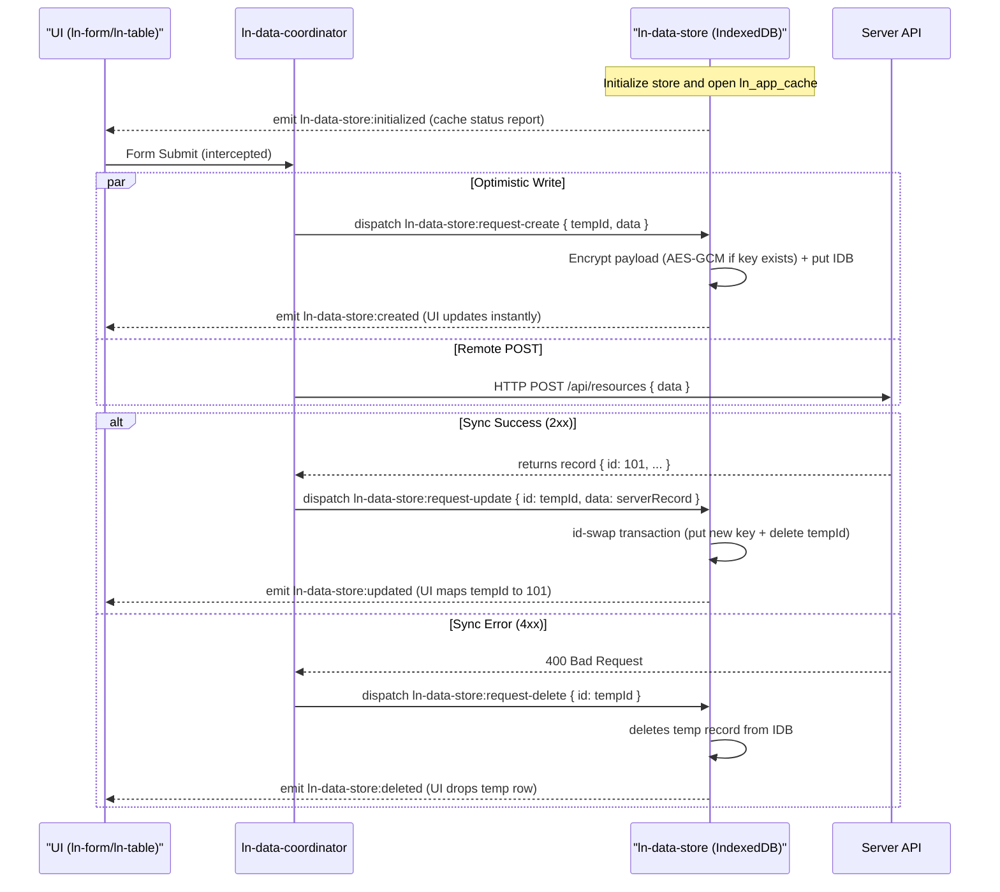

# 🗄️ ln-data-store

> **Classification:** 🟢 Simple component / Local Database Cache

---

## 1. Core Behavior & Responsibility

- **Local IndexedDB Cache:** Acts as a pure client-side database cache, maintaining records locally and running fast in-memory query operations.
- **Optimistic Mutations:** Updates the local IndexedDB database immediately on mutation request events and triggers instant UI updates, bypassing network latency.
- **At-Rest Encryption:** Secures cached data payload using AES-GCM encryption if a storage key is set, keeping only the primary `id` in plain text.
- **Dynamic Schema Discovery:** Auto-registers database tables and indexes based on elements declared in the HTML markup.
- Source path: [ln-data-store.js](../../js/ln-data-store/src/ln-data-store.js)

> [!IMPORTANT]
> **What the component does NOT do (Orthogonality Doctrine):**
> - **No Network Communication:** The store is completely blind to REST routes, sockets, and endpoints. Backend syncing is orchestrating by [ln-data-coordinator](./ln-data-coordinator.md).
> - **No ID Generation:** The store does not generate UUIDs or primary keys. The caller is responsible for supplying a `tempId` upon record creation.
> - **No Visual Interface:** It has no DOM rendering or styling.

---

## 2. Minimal HTML Markup & Usage Variants

### Base HTML Markup

```html
<div data-ln-data-store="documents"
     data-ln-data-store-indexes="status,department,updated_at"
     data-ln-data-store-search-fields="title,owner"
     data-ln-data-store-stale="300">
</div>
```

### Variant 1: Cache Never Stale

Use for configuration settings or static data tables.

#### HTML Markup
```html
<div data-ln-data-store="settings" data-ln-data-store-stale="never"></div>
```

### Variant 2: Full 3-Tier Synchronization Configuration

Use when synchronizing with a REST backend API.

#### HTML Markup
```html
<ul data-ln-data-coordinator="tasks" hidden>
    <!-- Tier 1: Local Cache -->
    <li data-ln-data-store="tasks" 
        data-ln-data-store-indexes="due_date,priority"
        data-ln-data-store-search-fields="title,description">
    </li>
    <!-- Tier 2: Backend Connector -->
    <li data-ln-api-connector 
        data-ln-api-base-url="/api" 
        data-ln-api-path="/tasks">
    </li>
</ul>
```

---

## 3. Declarative API Contract (Attributes & Events)

### Attributes Table

| Attribute | Element | Type / Values | Default | Description |
|---|---|---|---|---|
| `data-ln-data-store` | Root | `String` | *Required* | Declares the store name. |
| `data-ln-data-store-stale` | Root | `Integer` \| `"never"` \| `-1` | `300` | Seconds before data is considered stale. |
| `data-ln-data-store-indexes` | Root | `String` | `""` | Comma-separated IndexedDB index fields. |
| `data-ln-data-store-search-fields` | Root | `String` | `""` | Comma-separated list of text fields for search. |

### Programmatic JS API

Exposed on the root element via `el.lnDataStore`:

| Helper | Signature | Returns | Description |
|---|---|---|---|
| `getAll` | `(options: Object)` | `Promise<Object>` | Query engine returning `{ data, total, filtered }`. Supports `sort`, `filters`, `search`, `offset`, `limit`. |
| `getById` | `(id: ID)` | `Promise<Object\|null>` | Returns a single record (decorated with presenters) or `null`. |
| `count` | `(filters?: Object)` | `Promise<Number>` | Returns total or filtered record count. |
| `aggregate` | `(field: String, fn: String)` | `Promise<Number>` | Aggregation. `fn` can be `'count'`, `'sum'`, or `'avg'`. |
| `setPresenters` | `(presenters: Object)` | `void` | Registers computed virtual field decorators. |
| `applySync` | `(upserted: Array, deleted: Array, syncedAt: Number)` | `Promise<void>` | Merges backend sync delta updates into the store cache. |
| `forceSync` | `()` | `void` | Triggers a background sync event request. |
| `fullReload` | `()` | `Promise<void>` | Resets the in-memory tracking fields (`isLoaded`, `lastSyncedAt`, `totalCount`) and triggers a full sync; does not clear the persisted meta entry. |
| `destroy` | `()` | `void` | Cleans up the store listeners and DOM references. |

#### Global static methods on `window.lnDataStore`:

| Helper | Signature | Returns | Description |
|---|---|---|---|
| `window.lnDataStore.clearAll` | `()` | `Promise<void>` | Clears all registers stores and metadata in the database. |
| `window.lnDataStore.setStorageKey` | `(key: String)` | `Promise<void>` | Sets the global AES-GCM encryption key. |

### Events API

| Event | Direction | Cancelable | Description | `detail` Object |
|---|---|---|---|---|
| `ln-data-store:request-create` | Listens | No | Optimistically writes a new record. | `{ tempId: String, data: Object }` |
| `ln-data-store:request-update` | Listens | No | Optimistically updates a record or rekeys ID. | `{ id: ID, data: Object }` |
| `ln-data-store:request-delete` | Listens | No | Optimistically deletes a record. | `{ id: ID }` |
| `ln-data-store:request-bulk-delete` | Listens | No | Optimistically deletes multiple records. | `{ ids: Array }` |
| `ln-data-store:request-remote-sync` | Emits | No | Triggers network sync request. | `{ since: Number\|null }` |
| `ln-data-store:initialized` | Emits | No | Emitted when store IndexedDB is configured. | `{ store: String, hasCache: Boolean, lastSyncedAt: Number\|null, count: Number }` |
| `ln-data-store:ready` | Emits | No | Emitted when data is ready for viewing. | `{ store: String, count: Number, source: 'cache'\|'server' }` |
| `ln-data-store:loaded` | Emits | No | Emitted on initial load sync completion. | `{ store: String, count: Number }` |
| `ln-data-store:created` | Emits | No | Emitted after optimistic creation is done. | `{ store: String, record: Object, tempId: String }` |
| `ln-data-store:updated` | Emits | No | Emitted after optimistic update/rekey is done. | `{ store: String, record: Object, previous: Object }` |
| `ln-data-store:deleted` | Emits | No | Emitted after optimistic deletion is done. | `{ store: String, id: ID }` \| `{ store: String, ids: Array }` |
| `ln-data-store:synced` | Emits | No | Emitted after subsequent delta sync completes. | `{ store: String, added: Number, deleted: Number, changed: Boolean }` |
| `ln-data-store:destroyed` | Emits | No | Emitted when the store instance is destroyed. | `{ store: String }` |
| `ln-data-store:quota-exceeded` | Emits | No | Emitted on `document` if database storage runs out of quota. | `{ error: Error }` |

---

## 4. State & Persistence

- **Storage:** Standard browser `IndexedDB` (database name: `ln_app_cache`) and a metadata store (`_meta`).
- **Key format:** Stores are created dynamically matching the `data-ln-data-store` name. Keys in `_meta` match the store name.
- **Written when:** Written instantly during optimistic write requests (`request-create`, `request-update`, `request-delete`, `request-bulk-delete`) and during backend sync payloads (`applySync`).
- **Invalidation / versioning:** The store schema version is tracked. On a `SCHEMA_VERSION` mismatch, the cache store is cleared and its metadata reset — the IndexedDB database version itself is not bumped by this. The database version is only incremented separately, in `_openDatabase`, when a required object store or index is missing.

---

## 5. CSS Styling & Behavioral Concept

`ln-data-store` is a headless component and carries no visual styling or layout classes. The root DOM element acts strictly as an Event Bus node in the DOM tree, and must be hidden from presentation using `.hidden` / `display: none`.

---

## 6. Accessibility (ARIA) & Common Pitfalls

### ARIA & Keyboard

- Since it has no visual surface, it must always be hidden from accessibility trees using `aria-hidden="true"` or `hidden` attributes to avoid interfering with keyboard focus sequences.

### Common Pitfalls & Anti-patterns

> [!CAUTION]
> 1. **Missing Search Fields:** Omitting the `data-ln-data-store-search-fields` attribute will cause the local query search engine to fail to scan columns and return empty queries.
> 2. **Omission of tempId:** Failing to pass a `tempId` in `ln-data-store:request-create` payload fails because the store has no built-in auto-UUID fallback.
> 3. **Automatic Rollback Expectation:** The store does not snapshot or rollback automatically. If backend API requests fail, the coordinator is responsible for issuing a compensatory `request-delete` event to remove the optimistic record.

---

## 7. Flow Diagram & Lifecycle



---

## 8. Related Components

- [ln-data-coordinator](./ln-data-coordinator.md) — Coordinates backend synchronizations and writes.
- [ln-table](./ln-table.md) — Renders store database queries inside a data grid.
- [ln-list](./ln-list.md) — Renders store queries as repeating list items.
- [ln-form](./ln-form.md) — Dispatches data mutations.
