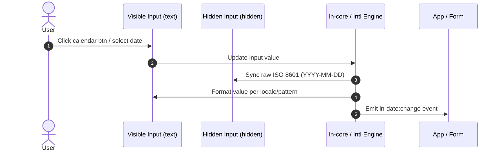

# 📅 ln-date

> **Classification:** 🟢 Simple Component / Form Input Formatter

---

## 1. Core Behavior & Responsibility

- **Core Role:** Wraps a native date input to provide locale-aware formatting, manual input validation/parsing on blur, BCP 47 localization, and native date picker trigger integrations.
- **Intelligent DOM Transformation:** Upon initialization, wraps the original input in a `<span data-ln-date-field>` container, replaces the visible input type with `text` for formatted values, creates a hidden input (`type="hidden"`) preserving the original `name` attribute for form compatibility, and adds a hidden native date picker (`input[type="date"]`) alongside a calendar button.
- **Locale-Aware Formatting (Intl & Custom Tokens):** Formats dates according to the target locale (resolved from `lang` attribute or `ln-core`) using either standard keyword styles (`short`, `medium`, `long`, with optional `datetime`) or custom patterns using tokens (e.g., `dd.MM.yyyy`, `yyyy-MM-dd`, `MMMM yyyy`).
- **Two-Way Value Binding:** Intercepts the native `value` property on the visible and hidden inputs to ensure consistent state and programmatic updates.
- **Manual Input Parsing (Blur):** Gracefully handles manually entered values on blur, supporting dot (European `dd.MM.yyyy`), slash (US `MM/dd/yyyy`), and dash (ISO/standard) separators, with smart 2-digit year pivoting (00–49 → 2000–2049, 50–99 → 1950–1999).
- **Declarative Dictionary Integration:** Integrates with `ln-core`'s `buildDict` pattern to register local language fallbacks when native browser translation engines are absent.
- Located in [`js/ln-date/src/ln-date.js`](../../js/ln-date/src/ln-date.js).

> [!IMPORTANT]
> **What the component does NOT do (Orthogonality Doctrine):**
> - **Does NOT build a custom calendar popup** — Delegated to the browser's native date picker UI (`showPicker()` or `.click()`).
> - **Does NOT perform validation constraints** — Range checks or business logic are handled by [`ln-validate`](./ln-validate.md) or [`ln-form`](./ln-form.md).
> - **Does NOT store or persist data** — Delegated to [`ln-persist`](./ln-persist.md) or [`ln-form`](./ln-form.md).

---

## 2. Minimal HTML Markup & Usage Variants

### Base HTML Markup

```html
<div class="form-element">
    <label for="birthday">Birthday:</label>
    <input type="date" id="birthday" name="birthday" data-ln-date>
</div>
```

---

### Variant 1: Predefined and Custom Patterns

```html
<!-- Keyword formats -->
<input type="date" id="due-date" name="due_date" data-ln-date="short">
<input type="date" id="created-at" name="created_at" data-ln-date="medium">
<input type="date" id="event-date" name="event_date" data-ln-date="long">

<!-- Format with time -->
<input type="date" id="meeting-time" name="meeting" data-ln-date="medium datetime">

<!-- Custom pattern -->
<input type="date" id="custom-date" name="custom_date" data-ln-date="dd.MM.yyyy">
```

---

### Variant 2: Custom Accessibility Label and Form Integration

Demonstrates overriding the screen reader label on the trigger button and setting a custom field key translation wrapper.

```html
<input type="date" id="event-start" name="event_start" data-ln-date-label="Select start date" data-ln-fill-as="submission_target" data-ln-date>
```

---

### Variant 3: Declarative HTML Dictionary Fallback

Registers custom translation strings for Macedonian locale to act as fallback translation properties.

```html
<div class="form-element" lang="mk">
    <ul hidden data-ln-date-dict="mk">
        <li data-ln-date-dict-key="months-long">јануари, февруари, март, април, мај, јуни, јули, август, септември, октомври, ноември, декември</li>
        <li data-ln-date-dict-key="months-short">јан, фев, мар, апр, мај, јун, јул, авг, септ, окт, ноем, дек</li>
    </ul>
    <input type="date" id="demo-dict" name="dict_date" value="2026-04-19" data-ln-date="MMMM yyyy">
</div>
```

---

## 3. Declarative API Contract (Attributes & Events)

### Attributes Table

| Attribute | Element | Type / Values | Default | Description |
|---|---|---|---|---|
| `data-ln-date` | `<input>` | `"short"` \| `"medium"` \| `"long"` \| `"short datetime"` \| `"medium datetime"` \| `"long datetime"` \| Custom Pattern | `"medium"` | Enables date formatting and defines display format pattern. |
| `data-ln-date-label` | `<input>` | `String` | `"Open date picker"` | Optional custom `aria-label` for the dynamically generated calendar trigger button. |
| `data-ln-fill-as` | `<input>` | `String` | — | Maps the input selection in the hidden input for form serialization compatibility. |
| `data-ln-date-dict` | `<ul>` | `String` | — | Language BCP 47 code (e.g., `"mk"`) for registering a fallback custom dictionary container. |
| `data-ln-date-dict-key` | `<li>` | `"months-long"` \| `"months-short"` | — | Specifies the month dictionary type for custom translation items inside a `data-ln-date-dict` wrapper. |

### Programmatic JS API

Instance interfaces accessed via `element.lnDate`:

| Helper | Signature | Returns | Description |
|---|---|---|---|
| `element.lnDate.value` | `String` | Getter/Setter | Accesses or sets the clean ISO 8601 string value (`YYYY-MM-DD`). |
| `element.lnDate.date` | `Date` | Getter/Setter | Accesses or sets the active date as a JavaScript `Date` object. |
| `element.lnDate.formatted` | `String` | Getter | Gets the formatted text display value currently shown in the input. |
| `element.lnDate.reset` | `()` | `void` | Resets value, hidden fields, and restores initial/empty state. |
| `element.lnDate.destroy` | `()` | `void` | Tears down wrapper, inputs, buttons, restores native element states, and fires `ln-date:destroyed`. |

### Events API

| Event | Direction | Cancelable | Description | `detail` Object |
|---|---|---|---|---|
| `ln-date:change` | Emits | No | Dispatched on value change (via calendar selection, text blur, or programmatically). | `{ value: String, formatted: String, date: Date }` |
| `ln-date:destroyed` | Emits | No | Dispatched when the date picker instance is destroyed. | `{ target: HTMLElement }` |

---

## 4. CSS Styling & Behavioral Concept

### Visual Styling

The component relies on styling wrappers matching form input group fields:

```scss
[data-ln-date-field] {
    display: inline-flex;
    align-items: center;
    position: relative;

    input[type="text"] {
        padding-right: 2.25rem;
    }

    button {
        position: absolute;
        right: 0.5rem;
        background: transparent;
        border: none;
        cursor: pointer;
    }
}
```

### Behavioral Mechanics

- **Programmatic Interception:** Native input `value` changes are intercepted via `interceptValueProperty` from `ln-core` to auto-synchronize values bidirectionally between the hidden field, native date element, and visible text field.
- **Dynamic Fallbacks:** Local translation fallbacks automatically register locally through `registerLocaleFallback` to supply native standard labels/month strings on system fallback events.

---

## 5. Accessibility (ARIA) & Common Pitfalls

### ARIA & Keyboard

- The calendar activation button is injected with `type="button"` to prevent form submission, has an `aria-label` override (default `"Open date picker"`), and its inner icon is hidden via `aria-hidden="true"`.
- The visible text field retains the original `id` attribute, ensuring that any adjacent `<label for="...">` remains fully connected.
- The hidden native date field has `tabindex="-1"`, and the form field is `type="hidden"` to avoid keyboard trap and redundant screen reader announcements.

### Common Pitfalls & Anti-patterns

> [!CAUTION]
> 1. **Applying to non-input elements:** `data-ln-date` belongs strictly on `<input>` elements. Placing it on a `<div>` or `<span>` causes console warning checks.

> [!WARNING]
> 2. **Accessing element.name directly after init:** Since the original `name` is moved to the hidden input during initialization, form serialization should target the hidden input or read the value via `element.lnDate.value`.

---

## 6. Flow Diagram & Lifecycle



---

## 7. Related Components

- [`ln-time`](./ln-time.md) — Time timezone-aware relative formatter.
- [`ln-form`](./ln-form.md) — Unified form serialization and actions manager.
- [`ln-validate`](./ln-validate.md) — Client-side form validation orchestrator.
