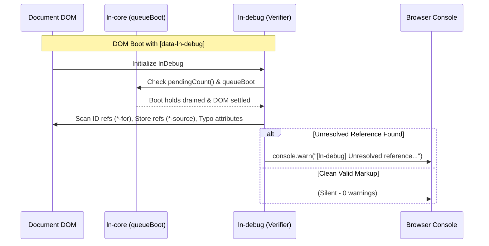

# 🛠️ ln-debug

> **Classification:** 🟢 Simple Component / Service (Layer 1 - Developer Tooling & Contract Verifier)

---

## 1. Core Behavior & Responsibility

`ln-debug` provides runtime developer diagnostics, cross-element contract verification, and visual HTML linting for `ln-ashlar`. It fulfills four primary functions:

1. **Global Warning Suppressor / Filter:** Intercepts console warnings prefixed with `[ln-` or `[lnCore`. By default, these warnings are suppressed to keep production browser logs clean. When `data-ln-debug` is placed on `<html>` or `<body>`, warnings are logged to the console.
2. **Generic Cross-Reference Contract Verifier:**
   - **ID References (`*-for`):** Scans all `data-ln-*-for` attributes (e.g. `data-ln-toggle-for`, `data-ln-modal-for`, `data-ln-tabs-for`, `data-ln-search-for`, `data-ln-popover-for`) and verifies that the referenced element `id` exists in the document.
   - **Store References (`*-source`, `*-store`):** Scans consumer store attributes (e.g. `data-ln-table-source`, `data-ln-list-source`, `data-ln-chart-source`, `data-ln-editor-source`) and verifies that a matching `[data-ln-data-store="NAME"]` exists.
   - **Store Uniqueness:** Flags duplicate `[data-ln-data-store]` instances with identical names.
   - **Attribute Typo Detection:** Compares unknown `data-ln-*` attributes against the schema-generated attribute manifest via Levenshtein distance and suggests closest matches.
3. **Lifecycle Timing Coordination:** Waits for asynchronous boot holds (`pendingCount() === 0` via `queueBoot`) and debounces rapid DOM mutations so newly mounted elements and templates settle before running assertions.
4. **Visual HTML Linter (Dev CSS):** In conjunction with `ln-ashlar-dev.css`, visually highlights local HTML structural errors and un-semantic markup directly in the browser UI.

JavaScript source: [`ln-debug.js`](../../components/ln-debug/src/ln-debug.js) and [`debug-verifier.js`](../../components/ln-debug/src/debug-verifier.js).

> [!IMPORTANT]
> **Zero Production Overhead Guarantee:**
> - **Production Mode:** When `data-ln-debug` is omitted from `<html>` and `<body>`, the verifier remains dormant and console warnings are silenced.
> - **Standalone Dev Bundle:** The verifier is compiled into `dist/ln-ashlar-dev.js` and `demo/dist/ln-ashlar-dev.js`, maintaining 0 bytes in pure production bundles.

---

## 2. Minimal HTML Markup & Usage Variants

### Base Development Setup

Place `data-ln-debug` on `<html>` or `<body>`:

```html
<!DOCTYPE html>
<html lang="en" data-ln-debug>
<head>
  <link rel="stylesheet" href="dist/ln-ashlar-dev.css" />
  <script src="dist/ln-ashlar.iife.js" defer></script>
</head>
<body>
  <!-- Valid connection -->
  <button data-ln-toggle-for="user-menu">Toggle Menu</button>
  <div id="user-menu">Menu Content</div>

  <!-- Broken connection: will trigger [ln-debug] Unresolved ID reference warning -->
  <button data-ln-toggle-for="missing-sidebar">Broken Toggle</button>
</body>
</html>
```

### Programmatic Diagnostics API

```javascript
// Perform a synchronous scan and inspect the diagnostic report
const report = window.lnDebug.verify(document.body, { silent: false });
console.log(report.total, report.idIssues, report.storeIssues, report.spellingIssues);

// Schedule a debounced verification respecting boot queue holds
window.lnDebug.schedule(document.body, 50, (report) => {
  console.log('Verification finished:', report);
});
```

---

## 3. Declarative API Contract (Attributes & Events)

### Attributes Table

| Attribute | Target Element | Type | Description |
|---|---|---|---|
| `data-ln-debug` | `html` / `body` | `Flag` | Activates dev warnings, runs contract verification, and enables visual CSS dev styles. |
| `data-ln-debug` | Any element | `Flag` | Attaches component debug instance to `element.lnDebug`. |

### Generic Verification Rules

| Rule Category | Attribute Pattern | Checked Invariant | Diagnostic Output (`console.warn`) |
|---|---|---|---|
| **ID References** | `data-ln-*-for="id"` | Target `#id` must exist in document. | `[ln-debug] Unresolved ID reference: <button data-ln-toggle-for="menu"> targets "#menu", but no element with id="menu" exists in the document.` |
| **Store References** | `data-ln-*-source="name"` | `[data-ln-data-store="name"]` must exist. | `[ln-debug] Unresolved store reference: <table data-ln-table-source="users"> targets store "users", but no [data-ln-data-store="users"] exists in the document.` |
| **Store Uniqueness** | `[data-ln-data-store]` | Store names must be unique across the document. | `[ln-debug] Duplicate store name: Multiple elements declare data-ln-data-store="users". Store names must be unique across the document.` |
| **Attribute Spelling** | `data-ln-*` | Must exist in schema manifest. | `[ln-debug] Unknown attribute "data-ln-table-sorce" on <table>. Did you mean "data-ln-table-source"?` |

### Events API

This component emits and listens to no custom `ln-*` events.

---

## 4. CSS Styling & Behavioral Concept

The visual diagnostic styling lives strictly within `ln-ashlar-dev.css` (compiled from [ln-ashlar-dev.scss](../../theme/ln-ashlar-dev.scss)):
- **Scope Isolation:** All CSS lint rules are nested under `:is(html, body)[data-ln-debug]`.
- **Structural Errors:** Outlines invalid nesting (e.g. form controls outside form wrappers) with high-visibility dashed borders and warning badges.
- **Separation of Concerns:** Pure visual/local validation is performed by CSS, while cross-element resolution (IDs, store providers) is handled by `debug-verifier.js`.

---

## 5. Accessibility (ARIA) & Common Pitfalls

- **Broken Target Detection:** Identifies missing target IDs on triggers (`data-ln-toggle-for`, `data-ln-modal-for`, `data-ln-tabs-for`) which would otherwise break keyboard focus and screen reader navigation.
- **Common Pitfalls:**
  - **Shipping `ln-ashlar-dev.css` / `ln-ashlar-dev.js` to Production:** Include only `ln-ashlar.css` and `ln-ashlar.js` in production builds.
  - **Expecting Instant Scans During SSR/Boot:** The verifier deliberately defers assertions until `queueBoot` holds are released to prevent false positives while partial DOM trees load.

---

## 6. Sequence & Lifecycle Flow



---

## 7. Related Components & Coordinators

- **Source Modules:**
  - [`ln-debug.js` (Component Shell)](../../components/ln-debug/src/ln-debug.js)
  - [`debug-verifier.js` (Verification Engine)](../../components/ln-debug/src/debug-verifier.js)
  - [`generated-attributes.js` (Attribute Manifest)](../../components/ln-debug/src/generated-attributes.js)
- **Coordinators & Core:**
  - [`ln-core/helpers.js` (queueBoot, pendingCount)](../../components/ln-core/helpers.js)
  - [`ln-ui-coordinator.js`](../../components/ln-ui-coordinator/src/ln-ui-coordinator.js)
- **Modular Component Dev Styles:**
  - [ln-table-dev.scss](../../components/ln-table/ln-table-dev.scss)
  - [ln-toggle-dev.scss](../../components/ln-toggle/ln-toggle-dev.scss)
  - [ln-modal-dev.scss](../../components/ln-modal/ln-modal-dev.scss)
