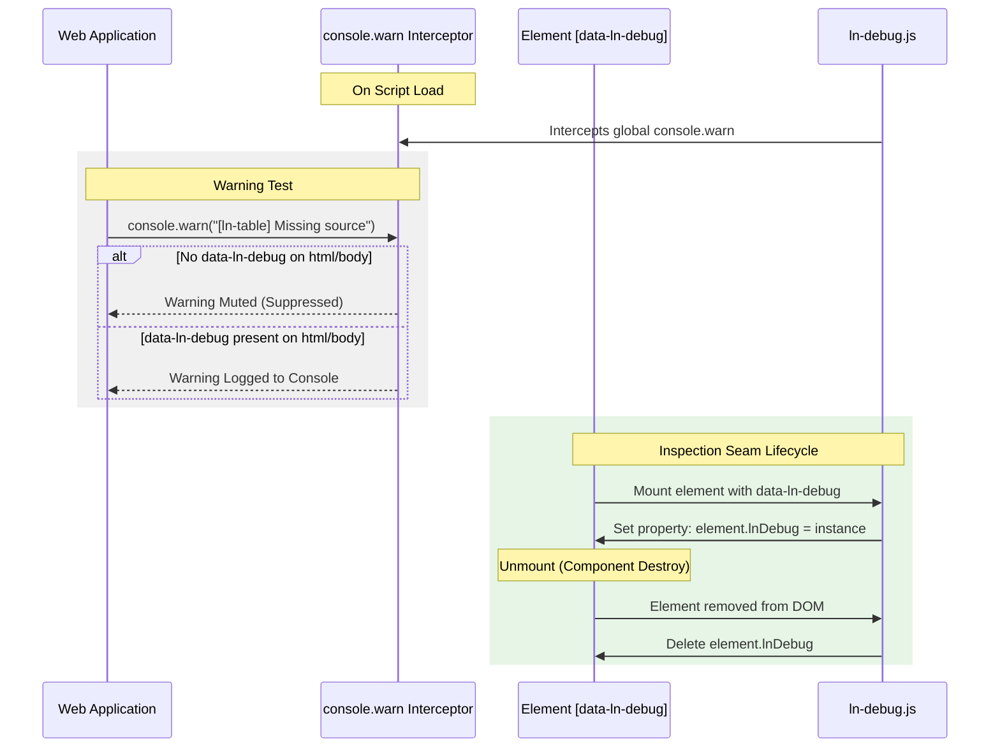

# 🛠️ ln-debug

> **Classification:** 🟢 Simple Component / Service (Layer 1 - Developer Tooling)

---

## 1. Core Behavior & Responsibility

`ln-debug` provides lightweight runtime developer diagnostics and visual HTML linting for the `ln-ashlar` design system. It fulfills three primary functions:

1. **Global Warning Suppressor / Filter:** Intercepts console warnings prefixed with `[ln-` or `[lnCore`. By default, these warnings are muted to keep production browser logs clean. When `data-ln-debug` is placed on `<html>` or `<body>`, warnings are unmuted and printed to the console.
2. **Developer Inspection Seam:** When applied to individual DOM elements, registers the component instance on `element.lnDebug` for inspection in browser developer tools.
3. **Visual HTML Linter (Dev CSS):** In conjunction with `ln-ashlar-dev.css`, visually flags HTML structural errors, invalid attribute usages, missing required `id`s, and un-semantic markup directly in the browser UI.

The JavaScript source is located at [ln-debug.js](../../components/ln-debug/src/ln-debug.js).

> [!IMPORTANT]
> **What the component does NOT do (Orthogonality Doctrine):**
> - **No Production DOM Mutations:** Does not alter element structure or behavior in production builds.
> - **No Network Activity:** Does not issue HTTP/AJAX requests or telemetry.
> - **No Production CSS Impact:** Diagnostic SCSS files (`*-dev.scss`) are strictly compiled into `ln-ashlar-dev.css` and are excluded from `ln-ashlar.css`.
> - **No App Crash Generation:** Never throws unhandled runtime exceptions that disrupt app execution.

---

## 2. Minimal HTML Markup & Usage Variants

### Base HTML Markup

Place `data-ln-debug` on `<html>` or `<body>` and load `ln-ashlar-dev.css`:

```html
<!DOCTYPE html>
<html lang="en" data-ln-debug>
<head>
  <!-- Include dev stylesheet containing diagnostic visual lint rules -->
  <link rel="stylesheet" href="dist/ln-ashlar-dev.css" />
  <script src="dist/ln-ashlar.iife.js" defer></script>
</head>
<body>
  <!-- HTML markup issues (e.g. input without id) will be visually highlighted -->
</body>
</html>
```

---

### Component Seam Inspection

Place `data-ln-debug` on a target element to attach the debug seam instance:

```html
<table data-ln-table="users" data-ln-debug id="users-debug-table">
  <!-- Table content -->
</table>
```

Inspect via browser DevTools console:
```javascript
// Access the table component instance via its debug seam
const tableInstance = document.getElementById('users-debug-table').lnTable;
console.log(tableInstance);
```

---

## 3. Declarative API Contract (Attributes & Events)

### Attributes Table

| Attribute | Element | Type / Values | Default | Description |
|---|---|---|---|---|
| `data-ln-debug` | `html` / `body` | `Flag` | — | Unmutes `[ln-` console warnings globally and activates the visual CSS linter. |
| `data-ln-debug` | Any element | `Flag` | — | Attaches component debug instance to `dom.lnDebug`. |

### Events API

This component emits and listens to no custom ln-* events.

---

## 4. CSS Diagnostics & Behavioral Concept

Visual lint rules are isolated from production builds to avoid performance degradation or visual pollution.

### Diagnostic SCSS Architecture
1. **Modular Rule Files:** Components maintain individual diagnostic rules in `*-dev.scss` files (e.g. [ln-date-dev.scss](../../components/ln-date/ln-date-dev.scss), [ln-number-dev.scss](../../components/ln-number/ln-number-dev.scss)).
2. **Dev Bundle Aggregator:** All modular diagnostic files are imported into [ln-ashlar-dev.scss](../../theme/ln-ashlar-dev.scss) and compiled to `ln-ashlar-dev.css`.
3. **Runtime Scoping:** All CSS diagnostic rules are scoped under `[data-ln-debug]`, ensuring rules remain inactive unless `data-ln-debug` is present on the page root.

### Visual Error Styles
- **Structural Errors:** Rendered with dashed red borders and top alert banners (e.g. `[data-ln-validate]` outside a `.form-element` wrapper).
- **Inline Warnings:** Displayed as red warning labels with `⚠` icons immediately following the target element (e.g. `<time data-ln-date>` misuse or empty `data-ln-search`).

---

## 5. Accessibility (ARIA) & Common Pitfalls

- **ARIA Verification:** Helps catch missing `id` attributes on trigger targets (`data-ln-toggle`, `data-ln-tabs`) required for keyboard and screen reader accessibility.
- **Common Pitfalls:**
  - **Deploying `ln-ashlar-dev.css` to Production:** Contains heavy `:not()` selectors intended only for local developer testing. Do not bundle in production deployments.
  - **Expecting Visual Errors without `data-ln-debug`:** Diagnostic CSS rules remain dormant unless `data-ln-debug` is present on `<html>` or `<body>`.

---

## 6. Sequence & Lifecycle Diagram



---

## 7. Related Components

- **Source Code:** [`ln-debug.js` (Source)](../../components/ln-debug/src/ln-debug.js) | [`ln-debug.js` (Dist)](../../components/ln-debug/ln-debug.js) | [Aggregator SCSS](../../theme/ln-ashlar-dev.scss)
- **Modular Component Dev Styles:**
  - [ln-accordion-dev.scss](../../components/ln-accordion/ln-accordion-dev.scss)
  - [ln-ajax-dev.scss](../../components/ln-ajax/ln-ajax-dev.scss)
  - [ln-autoresize-dev.scss](../../components/ln-autoresize/ln-autoresize-dev.scss)
  - [ln-autosave-dev.scss](../../components/ln-autosave/ln-autosave-dev.scss)
  - [ln-chart-dev.scss](../../components/ln-chart/ln-chart-dev.scss)
  - [ln-circular-progress-dev.scss](../../components/ln-circular-progress/ln-circular-progress-dev.scss)
  - [ln-confirm-dev.scss](../../components/ln-confirm/ln-confirm-dev.scss)
  - [ln-data-coordinator-dev.scss](../../components/ln-data-coordinator/ln-data-coordinator-dev.scss)
  - [ln-data-store-dev.scss](../../components/ln-data-store/ln-data-store-dev.scss)
  - [ln-date-dev.scss](../../components/ln-date/ln-date-dev.scss)
  - [ln-dropdown-dev.scss](../../components/ln-dropdown/ln-dropdown-dev.scss)
  - [ln-editor-dev.scss](../../components/ln-editor/ln-editor-dev.scss)
  - [ln-filter-dev.scss](../../components/ln-filter/ln-filter-dev.scss)
  - [ln-form-dev.scss](../../components/ln-form/ln-form-dev.scss)
  - [ln-include-dev.scss](../../components/ln-include/ln-include-dev.scss)
  - [ln-key-dev.scss](../../components/ln-key/ln-key-dev.scss)
  - [ln-link-dev.scss](../../components/ln-link/ln-link-dev.scss)
  - [ln-list-dev.scss](../../components/ln-list/ln-list-dev.scss)
  - [ln-modal-dev.scss](../../components/ln-modal/ln-modal-dev.scss)
  - [ln-number-dev.scss](../../components/ln-number/ln-number-dev.scss)
  - [ln-options-dev.scss](../../components/ln-options/ln-options-dev.scss)
  - [ln-popover-dev.scss](../../components/ln-popover/ln-popover-dev.scss)
  - [ln-progress-dev.scss](../../components/ln-progress/ln-progress-dev.scss)
  - [ln-router-dev.scss](../../components/ln-router/ln-router-dev.scss)
  - [ln-search-dev.scss](../../components/ln-search/ln-search-dev.scss)
  - [ln-slug-dev.scss](../../components/ln-slug/ln-slug-dev.scss)
  - [ln-sort-dev.scss](../../components/ln-sort/ln-sort-dev.scss)
  - [ln-sortable-dev.scss](../../components/ln-sortable/ln-sortable-dev.scss)
  - [ln-stat-dev.scss](../../components/ln-stat/ln-stat-dev.scss)
  - [ln-table-dev.scss](../../components/ln-table/ln-table-dev.scss)
  - [ln-tabs-dev.scss](../../components/ln-tabs/ln-tabs-dev.scss)
  - [ln-time-dev.scss](../../components/ln-time/ln-time-dev.scss)
  - [ln-toast-dev.scss](../../components/ln-toast/ln-toast-dev.scss)
  - [ln-toggle-dev.scss](../../components/ln-toggle/ln-toggle-dev.scss)
  - [ln-tooltip-dev.scss](../../components/ln-tooltip/ln-tooltip-dev.scss)
  - [ln-translations-dev.scss](../../components/ln-translations/ln-translations-dev.scss)
  - [ln-ui-coordinator-dev.scss](../../components/ln-ui-coordinator/ln-ui-coordinator-dev.scss)
  - [ln-upload-dev.scss](../../components/ln-upload/ln-upload-dev.scss)
  - [ln-validate-dev.scss](../../components/ln-validate/ln-validate-dev.scss)
