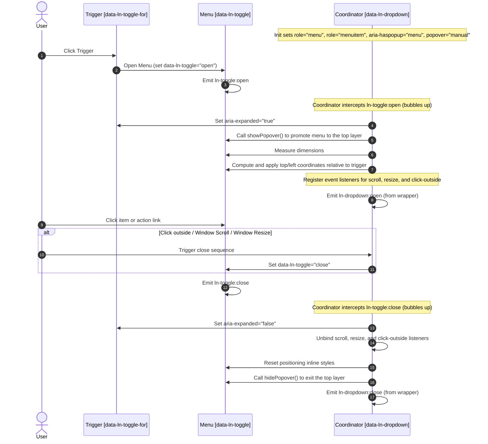

# 🔽 ln-dropdown

> **Classification:** ⚙️ Coordinator

---

## 1. Core Behavior & Responsibility

The `ln-dropdown` component is a DOM coordinator that manages dropdown menus. It attaches to a wrapper DOM element declared with the `data-ln-dropdown` attribute. Its responsibility is to monitor the visibility state of its internal toggle menu ([`ln-toggle`](./ln-toggle.md)) and dynamically orchestrate its top-layer promotion, placement relative to the trigger button, accessibility semantics, and cleanup behavior (dismissing on click-outside, page scroll, or window resize).

The JavaScript source is located at [ln-dropdown.js](../../js/ln-dropdown/src/ln-dropdown.js).

Key responsibilities include:
- **Top-Layer Promotion:** Promoting the active menu into the browser's top layer via the native Popover API (`popover="manual"`, `showPopover()`) when opened to prevent clipping by parents with `overflow: hidden` or `z-index` stacking context rules.
- **Dynamic Positioning:** Computing exact absolute coordinates to align the menu beneath the trigger button using the system helpers `computePlacement` and `measureHidden`.
- **Event Listeners Coordination:** Registering event listeners for click-outside dismissal, resize dismissal, and scroll-repositioning, and removing them on close.
- **ARIA Enrichment:** Automatically setting screen-reader semantic roles and attributes on initialization and state changes.

> [!IMPORTANT]
> **What the component does NOT do (Orthogonality Doctrine):**
> - **State Management:** It does not manage memory states or expose `.open()` / `.close()` API methods (state is updated strictly by setting `data-ln-toggle="open"` or `"close"`).
> - **Visual Layout:** It does not apply display styles or toggle `.open` classes directly in JS (handled by CSS/SCSS selectors).
> - **Form / Complex Dialog Focus Trap:** It does not trap focus or support complex nested forms (use [`ln-popover`](./ln-popover.md) or [`ln-modal`](./ln-modal.md) instead).

---

## 2. Minimal HTML Markup & Usage Variants

To preserve the **Separation of Concerns**, visual layout and presentation are handled strictly by the `.dropdown-menu` CSS classes and SCSS mixins, while the JavaScript coordinator interacts only via the functional `data-ln-*` attributes.

### Base HTML Markup

Below is a standard copy-paste template for an actions dropdown:

```html
<!-- Coordinator Wrapper -->
<div data-ln-dropdown>
    <!-- Trigger Button -->
    <button type="button" data-ln-toggle-for="options-menu" class="btn">
        Options
        <svg class="ln-icon" aria-hidden="true"><use href="#ln-arrow-down"></use></svg>
    </button>
    
    <!-- Dropdown Menu (State Primitive) -->
    <ul id="options-menu" data-ln-toggle class="dropdown-menu">
        <li><a href="/profile">Profile</a></li>
        <li><a href="/settings">Settings</a></li>
        <li><hr></li>
        <li>
            <form action="/logout" method="POST">
                <button type="submit" class="text-danger">Sign Out</button>
            </form>
        </li>
    </ul>
</div>
```

### Variant 1: Selection Picker (Language / Theme Selector)

When using a dropdown to pick a single value, use the native `aria-current="true"` attribute on the active button or link to mark the selected state:

```html
<div data-ln-dropdown>
    <button type="button" data-ln-toggle-for="lang-menu" class="btn-select">
        English
        <svg class="ln-icon" aria-hidden="true"><use href="#ln-chevron-down"></use></svg>
    </button>
    <ul id="lang-menu" data-ln-toggle class="dropdown-menu">
        <li><button type="button">Македонски</button></li>
        <li><button type="button" aria-current="true">English</button></li>
        <li><button type="button">Deutsch</button></li>
    </ul>
</div>
```

### Variant 2: Avatar User Menu

The dropdown menu can accommodate avatars, dividers (`<hr>`), and complex actions like forms (e.g. POST logout) seamlessly:

```html
<div data-ln-dropdown>
    <!-- Avatar Trigger -->
    <button type="button" data-ln-toggle-for="account-menu" class="btn-avatar">
        
    </button>
    <ul id="account-menu" data-ln-toggle class="dropdown-menu">
        <li><a href="/profile">My Profile</a></li>
        <li><a href="/billing">Billing</a></li>
        <li><hr></li>
        <li>
            <form action="/logout" method="POST">
                <button type="submit" class="text-danger">Log Out</button>
            </form>
        </li>
    </ul>
</div>
```

---

## 3. Declarative API Contract (Attributes & Events)

### Attributes Table

| Attribute | Element | Type / Values | Default | Description |
|---|---|---|---|---|
| `data-ln-dropdown` | Wrapper (`<div>`) | Presence | Required | Initializes the dropdown coordinator on the wrapper element. |
| `data-ln-toggle-for` | Trigger (`<button>`) | Target Menu `id` | Required | Binds the trigger button to the target dropdown menu. |
| `data-ln-toggle` | Menu (`<ul>`) | `"open"` \| `"close"` | `"close"` | The primary state indicator. Set to `"open"` to show the menu. |
| `data-ln-dropdown-menu`| Menu (`<ul>`) | Attribute | Added by JS | Automatically applied by JS to bind base dropdown layout styles. |
| `role="menu"` | Menu (`<ul>`) | Value | Added by JS | Automatically applied to define the semantic structure of the menu. |
| `role="menuitem"` | Menu Items (`<li>`) | Value | Added by JS | Automatically applied to direct child items of the dropdown list. |
| `aria-haspopup` | Trigger | `"menu"` | Added by JS | Set automatically to inform screen readers of the pop-up behavior. |
| `aria-expanded` | Trigger | `"true"` \| `"false"` | `"false"` | Dynamically synced with the open/close state of the dropdown. |

### Programmatic JS API

`ln-dropdown` does not expose direct open/close methods. State changes must be performed declaratively by modifying attributes on the menu element.

The initialized instance is exposed on the wrapper element via the property `dom.lnDropdown`.

| Property / Method | Type | Description |
|---|---|---|
| `dom.lnDropdown` | `Object` | The coordinator component instance attached to the DOM element. |
| `dom.lnDropdown.destroy()` | `Function` | Cleans up the event listeners, hides any open popover, and deletes the instance. |

#### Controlling Dropdown States programmatically:
```javascript
const dropdown = document.querySelector('[data-ln-dropdown]');
const menu = dropdown.querySelector('[data-ln-toggle]');

// Open the menu (coordinator will automatically promote it to the top layer and position it)
menu.setAttribute('data-ln-toggle', 'open');

// Close the menu
menu.setAttribute('data-ln-toggle', 'close');
```

### Events API

All coordinator events are dispatched from the **main wrapper element (`[data-ln-dropdown]`)** and bubble up.

| Event | Direction | Cancelable | Description | `detail` Object |
|---|---|---|---|---|
| `ln-dropdown:open` | Emits | No | Fires after the menu is promoted to the top layer, positioned, and visually opened. | `{ target: HTMLElement }` |
| `ln-dropdown:close` | Emits | No | Fires after the menu is closed, exits the top layer, and listeners cleaned. | `{ target: HTMLElement }` |
| `ln-dropdown:destroyed` | Emits | No | Fires when the coordinator's `destroy()` method is executed. | `{ target: HTMLElement }` |

#### Subscribed Events

The coordinator listens to the following bubbling events emitted by the inner `ln-toggle` menu:
- `ln-toggle:open` — Triggers top-layer promotion (`showPopover()`), placement calculations, ARIA updates, and window event listeners binding.
- `ln-toggle:close` — Triggers listeners cleanup, positioning styles removal, and `hidePopover()`.

---

## 4. CSS Styling & Behavioral Concept

The visual layer is separated from JavaScript logic. Custom styles are provided via reusable mixins in `scss/config/mixins/_dropdown.scss` and selector bindings in `scss/components/_dropdown.scss`.

### SCSS Mixins Reference
```scss
// In scss/config/mixins/_dropdown.scss
@mixin dropdown {
	@include relative;
}

@mixin menu-items {
	li {
		margin: 0;
		padding: 0;
	}

	form {
		margin: 0;
		padding: 0;
		display: contents;
	}

	a,
	button,
	input[type="submit"],
	input[type="reset"],
	input[type="button"] {
		@include w-full;
		@include flex;
		@include items-center;
		justify-content: flex-start;
		gap: var(--gap);
		@include text-left;
		@include text-sm;
		@include cursor-pointer;
		@include transition-fast;
		background: none;
		border: none;
		border-radius: 0;
		color: var(--color-fg);
		text-decoration: none;

		&:hover:not(:disabled),
		&:active:not(:disabled) {
			--color-bg: var(--bg-sunken);
			background: var(--color-bg);
			color: var(--color-fg);
		}

		&:focus {
			box-shadow: none;
		}

		&[aria-current="true"] {
			background: var(--color-accent-tint);
			color: var(--color-accent);
		}
	}

	a {
		--padding-y: var(--size-xs);
		--padding-x: var(--size-sm);
		padding: var(--padding-y) var(--padding-x);
	}

	:is(button, input[type="submit"], input[type="reset"], input[type="button"]) {
		--btn-padding-y: var(--size-xs);
		--btn-padding-x: var(--size-sm);
	}

	li + li {
		border-block-start: var(--border-block-start, none);
	}

	hr {
		border: none;
		border-block-start: var(--border-block-start, var(--border-width) solid var(--color-border));
		--margin-block: var(--size-xs);
		margin-block: var(--margin-block);
	}
}

@mixin dropdown-menu {
	@include floating-panel;
	@include fixed;
	inset: auto;
	margin: 0;
	--padding-y: var(--size-xs);
	padding-block: var(--padding-y);
	min-width: 10rem;

	@include menu-items;
}
```

### SCSS Component Selector Bindings
```scss
// In scss/components/_dropdown.scss
@use '../config/mixins' as *;

[data-ln-dropdown] {
	@include dropdown;
}

[data-ln-dropdown-menu] {
	@include dropdown-menu;
}

@keyframes ln-dropdown-in {
	from {
		opacity: 0;
		transform: translateY(-4px) scale(0.98);
	}
	to {
		opacity: 1;
		transform: translateY(0) scale(1);
	}
}
```

### Behavioral Concept

1. **Top-Layer Promotion (`showPopover()`):** To avoid parent clipping problems (such as `overflow: hidden` on a table cell or card container), the coordinator promotes the menu into the browser's top layer on open via the native Popover API (`popover="manual"`). No DOM move happens — the element stays exactly where it was authored.
2. **Fixed Positioning (`computePlacement`):** When open, the menu gets `position: fixed` via the `dropdown-menu` mixin's `@include fixed;`. The coordinator queries the trigger button dimensions using `getBoundingClientRect()` and measures the hidden menu via `measureHidden`. It then computes position offset utilizing `computePlacement` from `ln-core`, defaulting to `bottom-end` placement.
3. **Gap Resolution:** The offset gap is parsed dynamically from the document's `--size-xs` CSS variable (converted to px), falling back to `4px` if not found.
4. **Transition Animations:** Visibility is handled via `display: none` by default. When the `.open` class is appended by `ln-toggle`, the styles turn into `display: block` and run a subtle keyframe animation `ln-dropdown-in` (translate Y, scale, and opacity).

---

## 5. Accessibility (ARIA) & Common Pitfalls

### ARIA & Keyboard

- **Trigger Button:**
  - Receives `aria-haspopup="menu"` on initialization.
  - Toggles `aria-expanded="true"` when the menu is open, and `aria-expanded="false"` when closed.
- **Menu Wrapper (`<ul>`):**
  - Receives `role="menu"` automatically.
- **Menu Items (`<li>`):**
  - All direct child list items receive `role="menuitem"`.
- **Selection State (Single-select):**
  - The currently active choice is marked with `aria-current="true"`.
- **Keyboard Navigation:**
  - `Tab` moves focus sequentially through the interactive links or buttons inside the menu.
  - `Esc` or clicking outside closes the menu and returns focus back to the trigger button.

### Common Pitfalls & Anti-patterns

> [!CAUTION]
> 1. **Missing Coordinator Wrapper:** Forgetting `data-ln-dropdown` on the wrapper container. The menu will still open using `ln-toggle`, but features like top-layer promotion, automatic alignment, scroll positioning, and click-outside dismissal will fail.
> 2. **Hardcoded HTML Styles:** Manually applying inline positioning (`position: fixed`, `top`, `left`) in markup. The coordinator controls these dynamically during viewport placement.
> 3. **Improper Component Mapping:** Using `ln-dropdown` for dialogs with heavy forms, interactive inputs, or focus traps. Use [`ln-popover`](./ln-popover.md) or [`ln-modal`](./ln-modal.md) for complex overlay interactions.
> 4. **Invoking Imperative JS APIs:** Attempting to run `.open()` or `.close()` methods on the coordinator instance. All state transitions must be done declaratively by changing `data-ln-toggle` attribute to `"open"` or `"close"`.

---

## 6. Flow Diagram & Lifecycle

Below is the workflow showing the separation of concerns and events flow between the User, Trigger, the binary State Primitive (`ln-toggle`), and the Coordinator (`ln-dropdown`):



---

## 7. Related Components

- [`ln-toggle`](./ln-toggle.md) — The binary state primitive that manages menu expansion.
- [`ln-popover`](./ln-popover.md) — A visually richer overlay container for complex content.
- [`ln-modal`](./ln-modal.md) — Blocking overlay dialogs with modal focus traps.
- [Source JavaScript](../../js/ln-dropdown/src/ln-dropdown.js) — Core implementation of the dropdown coordinator.
- [Source Component SCSS](../../scss/components/_dropdown.scss) — Core stylesheet for dropdown components.
- [Source Mixin SCSS](../../scss/config/mixins/_dropdown.scss) — Reusable SCSS mixin for dropdown layout styling.
